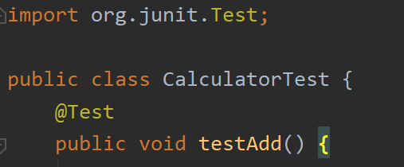
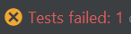

# 测试

单元测试分为两种：

- 黑箱测试
- 白箱测试

一般来说，黑箱测试不用自己写代码，白箱测试需要自己写代码测试。

**黑箱测试**

**白箱测试**

`Junit`测试属于白箱测试的一种

**注意事项**

- 包命名：`xxx.xxx.test`

- 类命名：`xxxTest` ，例如 `CalculatorTest` 就是 Calculator 的测试类
- 方法命名：`testXXX`，（void，空参），例如 `testAdd` 就是测试 Add 方法
- 给方法添加 `@Test`
- 导入`Junit`依赖

如何写测试方法呢？我们测试是关心程序输出和我们的预想是否一致，此时我们需要用到断言：

`Assert.assertEquals(expected, result)`

其中，`expected`是我们预期的值，`result`是程序的输出值

**输出**

成功

失败

**补充**

`@Before` 

在测试方法之前自动被执行

`@After`

在测试方法之后自动被执行