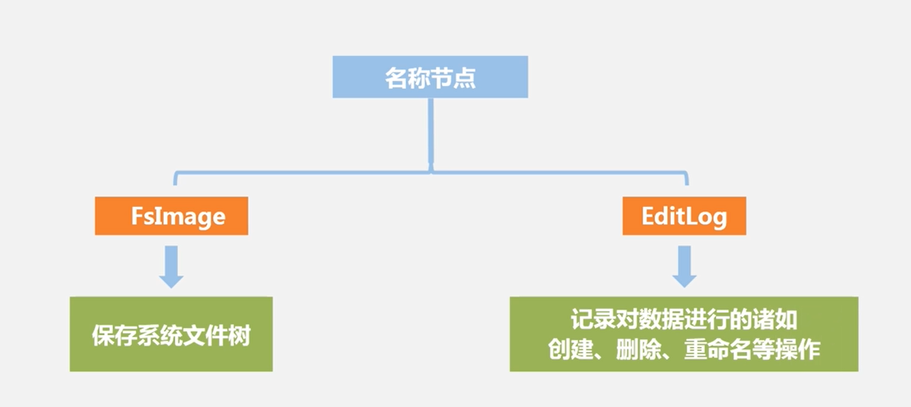
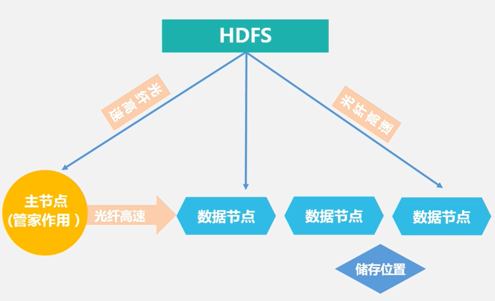
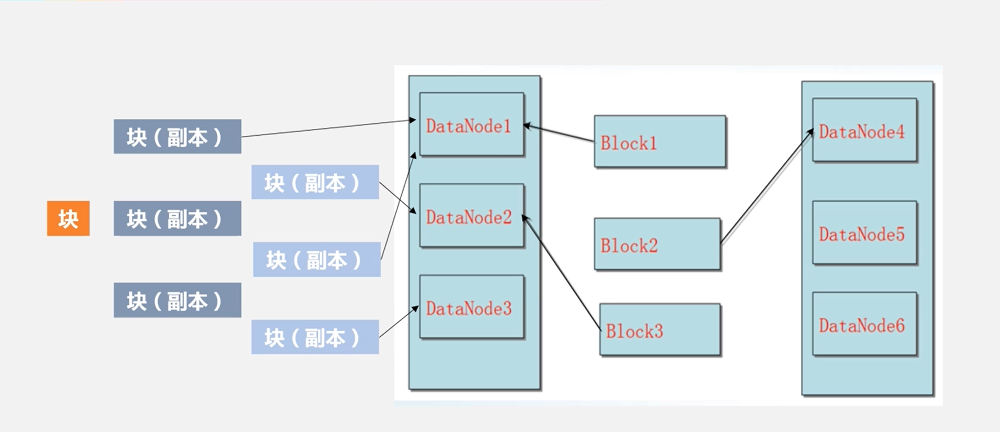

# HDFS

## 目录

* [1. 什么是 HDFS?](#1-----hdfs-)
* [2. HDFS 特点](#2-hdfs---)
* [3. HDFS 相关概念](#3-hdfs-----)
  + [2.1 Block](#21-block)
  + [2.2 NameNode](#22-namenode)
    - [2.2.1 FsImage](#221-fsimage)
    - [2.2.2 Editlog](#222-editlog)
  + [2.3 DataNode](#23-datanode)
  + [2.4 Secondary NameNode](#24-secondary-namenode)
* [3. HDFS 体系结构](#3-hdfs-----)
* [4. HDFS 存储原理](#4-hdfs-----)
  + [4.1 数据冗余存储](#41-------)
  + [4.2 数据存放](#42-----)
  + [4.3 数据读取](#43-----)
  + [4.4 数据错误与恢复](#44--------)
    - [4.4.1 NameNode 出错](#441-namenode---)
    - [4.4.2 DataNode 出错](#442-datanode---)
    - [4.4.3 数据出错](#443-----)
* [5. HDFS 数据读写过程](#5-hdfs-------)

## 1. 什么是 HDFS?

`HDFS` 是针对 `GFS` 的开源实现，提供了廉价服务器集群中进行大规模分布式文件存储的能力

`HDFS` 具有良好的容错能力，且兼容廉价的硬件设备，因此可以以较低成本利用现有机器实现大流量和大数据量的读写

## 2. HDFS 特点

**优势**

- 兼容廉价硬件
- 实现流数据（流数据是一组顺序、大量、快速、连续到达的数据序列,一般情况下,数据流可被视为一个随时间延续而无限增长的动态数据集合。应用于网络监控、传感器网络、航空航天、气象测控和金融服务等领域。）
- 支持海量数据集
- 简单文件模型
- 跨平台性

**劣势**

- 不支持低延迟数据访问
- 无法实现存储小文件
- 只允许追加不允许修改

## 3. HDFS 相关概念

### 2.1 Block

**作用**

分摊磁盘读写开销，即在大数据间分摊磁盘寻址开销

**优势**

- 支持大规模文件存储
- 简化系统涉及
- 适合数据备份

### 2.2 NameNode

  
 

  
 

#### 2.2.1 FsImage

`FsImage` 用于维护文件系统树以及文件树中所有文件的文件和文件夹元数据

- 块大小以及组成文件的块
- 文件的复制等级
- 修改和访问时间
- 访问权限

#### 2.2.2 EditLog

记录了所有针对文件的创建，删除，重命名等操作

### 2.3 DataNode

工作节点，负责数据的存储和读取

数据保存在本地的 `linux` 文件系统中

### 2.4 Secondary NameNode

**功能**

- `NameNode` 冷备份
- 对 `Editlog` 处理

## 3. HDFS 体系结构

  
 

## 4. HDFS 存储原理

### 4.1 数据冗余存储

`HDFS` 采用多副本方式对数据进行冗余存储，通常一个 `block`  的多个副本会被分布到不同的 `DataNode` 上

**优势**

- 加快速度传输速度

  当多个客户端同时访问数据的时候，可以让其分别从不同的数据副本读取数据

- 很容易检查数据错误

- 保证数据可靠性

### 4.2 数据存放

`HDFS` 默认的冗余复制因子是 3，每一个文件块会被保存到 3 个地方，其中，有两份副本放在同一个机架的不同机器上，第三个副本放在不同的机架上

若还有更多副本，则继续从集群中选择 `datanode` 进行存放

  
 

### 4.3 数据读取

`HDFS` 提供 `API` 可确定 `datanode` 所属机架的 `ID`，客户端也可以调用 `API` 获取自己所属机架的 `ID`

当发现某个数据块副本对应的 `ID` 与客服端机架的 `ID` 相同时，优先选择该副本读取数据，如果没有，则随机选择

### 4.4 数据错误与恢复

#### 4.4.1 NameNode 出错

`Secondary namenode` 进行热备 

#### 4.4.2 DataNode 出错

每个 `datanode` 会定期向 `namenode` 发送"心跳"信息，汇报自己的状态

当 `datanode` 发生故障，或者网络断网时，`namenode` 无法收到"心跳"信息，则 `datanode` 会被标记为"宕机"，此时 `namenode` 会启动数据冗余复制，将副本数量恢复到冗余因子。

`HDFS` 与其他分布式文件系统最大的区别是可以调整冗余数据的位置

#### 4.4.3 数据出错

网络传输和磁盘错误都会造成数据出错。客户端在读取数据时会采用校验码校验，以确定读到正确的数据

如果校验出错，客户端就会请求到另外一个 `datanode` 读取该文件块，并向 `namenode` 报告这个文件块有错误，

`namenode` 会定期检查并且重新复制

## 5. HDFS 数据读写过程

