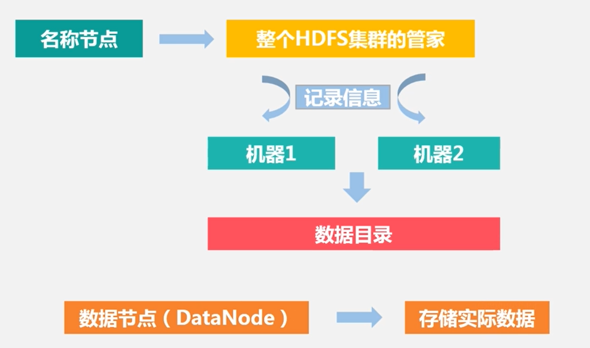

# HDFS

## 目录

## 1. 什么是 HDFS?

`HDFS` 是针对 `GFS` 的开源实现，提供了廉价服务器集群中进行大规模分布式文件存储的能力

`HDFS` 具有良好的容错能力，且兼容廉价的硬件设备，因此可以以较低成本利用现有机器实现大流量和大数据量的读写

## 2. HDFS 特点

**优势**

- 兼容廉价硬件
- 实现流数据（流数据是一组顺序、大量、快速、连续到达的数据序列,一般情况下,数据流可被视为一个随时间延续而无限增长的动态数据集合。应用于网络监控、传感器网络、航空航天、气象测控和金融服务等领域。）
- 支持海量数据集
- 简单文件模型
- 跨平台性

**劣势**

- 不支持低延迟数据访问
- 无法实现存储小文件
- 只允许追加不允许修改

## 3. HDFS 相关概念

### 2.1 块

**作用**

分摊磁盘读写开销，即在大数据间分摊磁盘寻址开销

**优势**

- 支持大规模文件存储
- 简化系统涉及
- 适合数据备份

### 2.2 名称节点

  
 

### 2.3 数据节点

### 2.4 第二名称节点

## 3. HDFS 体系结构

## 4. HDFS 数据读写过程

