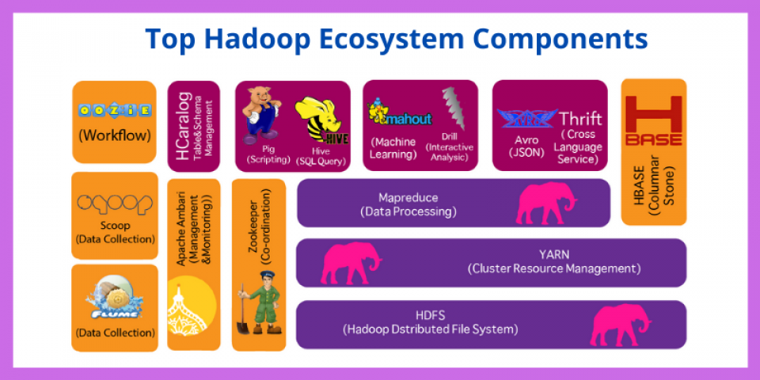
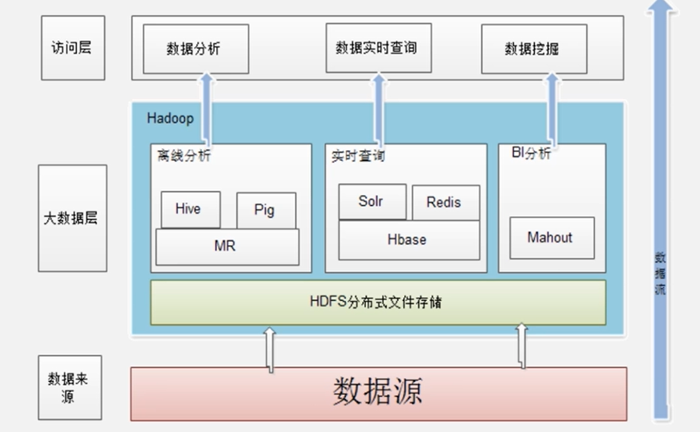

# Hadoop

## 目录

* [1. 什么是 Hadoop?](#1-----hadoop-)
* [2. Hadoop 核心技术](#2-hadoop-----)
* [3. Hadoop 特点](#3-hadoop---)
* [4. Hadoop 应用现状](#4-hadoop-----)
* [5. Hadoop 生态系统](#5-hadoop-----)
  + [5.1 HDFS](#51-hdfs)
  + [5.2 HBase](#52-hbase)
  + [5.3 MapReduce](#53-mapreduce)
  + [5.4 Hive](#54-hive)
  + [5.5 Mahout](#55-mahout)
  + [5.6 Zookeeper](#56-zookeeper)
  + [5.7 Flume](#57-flume)
  + [5.8 Sqoop](#58-sqoop)

## 1. 什么是 Hadoop?

**Apache Hadoop** is a collection of open-source software utilities that facilitate using a network of many computers to solve problems involving massive amounts of data and computation.

`Hadoop` 是 `Apache` 下的开源分布式计算平台，为用户提供了系统底层细节透明的分布式基础架构

  
 

## 2. Hadoop 核心技术

- HDFS（分布式存储）
- MapReduce（分布式处理）

## 3. Hadoop 特点

- 可靠性
- 高效性
- 高扩展性
- 成本低

## 4. Hadoop 应用现状

  
 

- 日志处理
- 推荐系统
- 数据仓库

## 5. Hadoop 生态系统

### 5.1 HDFS

`HDFS` 具有处理超大数据，流式处理，可以运行在廉价商用服务器上等优点

对于超大数据集的应用程序而言，选择 `HDFS` 作为底层数据存储是较好的选择

### 5.2 HBase

`HBase` 是一个分布式列式数据库，一般采用 `HDFS` 作为其底层数据存储，具有强大的非结构化数据存储能力

### 5.3 MapReduce

`MR` 是一种编程模型，用于大规模数据集的并行计算，将复杂的，运行于大规模集群的并行计算过程高度抽象倒了两个函数：`map` 和 `reduce` 上，并且允许用户在不了解分布式系统底层细节的情况下开发并行应用程序，并将其运行于廉价计算机集群上，完成海量的数据处理

### 5.4 Hive

`Hive` 是一个基于 `Hadoop` 的数据仓库工具，可以用于对 `Hadoop` 文件中的数据集进行数据整理，特殊查询和分析存储。它提供了 `Hive QL`，快速实现简单的 `MapReduce` 统计

### 5.5 Mahout

`Mahout` 提供一些可扩展的机器学习领域经典算法的实现，旨在帮助开发人员更加方便快捷地创建智能应用程序

### 5.6 Zookeeper

`Zookeeper` 提供分布式锁之类的基本服务，用于构建分布式应用

### 5.7 Flume

`Flume` 是分布式海量日志采集，聚合和传输的系统

### 5.8 Sqoop

`Sqoop` 是 `SQL-to-Hadoop` 的缩写，用于 `Hadoop` 与关系型数据库之间的交换数据

