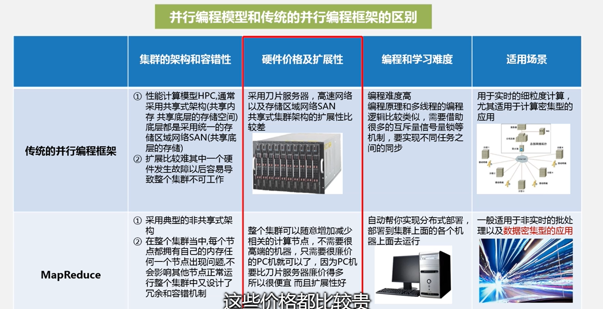
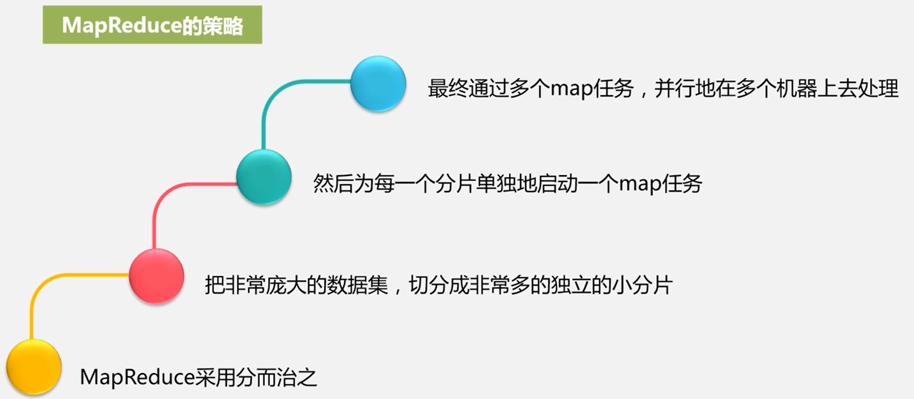
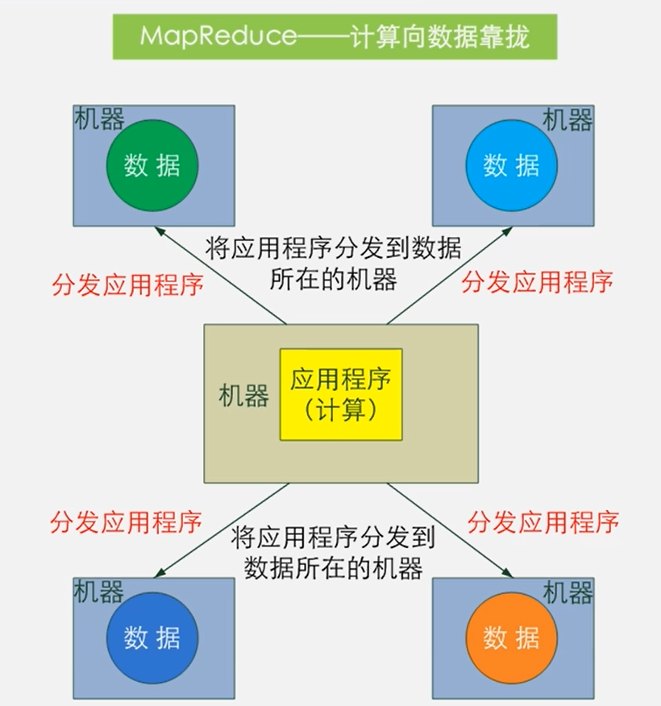
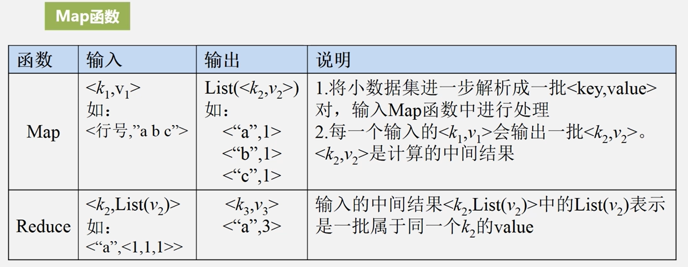
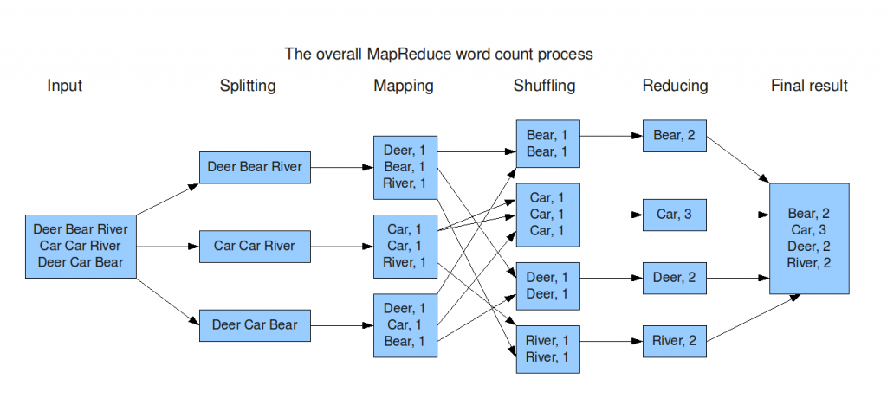

# MapReduce

​	`MR` 是一种并行编程模型，用于大规模数据集的并行运算，它将复杂的，运行于大规模集群上的并行计算过程高度抽象成两个函数：`map` 和 `reduce`，`MR` 极大方便了开发者的分布式编程工作

  
 

## 目录

## 1. MapReduce 编程思想

### 1.1 MapReduce 有什么优势？

  
 

### 1.2 MapReduce 的策略

​	在 `MR` 中，一个存储在分布式文件系统中的大规模数据集会被切分成许多独立的小数据块，这些小数据块可以被多个 `map` 任务并行处理

`MR` 会每个 `map` 任务输入一个数据子集，`map` 生成的结果会继续作为 `reduce` 任务的输入，最终由 `reduce` 任务输出最后的结果，写入分布式文件系统

**分而治之**

  
 

**计算向数据靠拢**
大大减少网络数据传输开销

  
 

### 1.4 map

  
 

### 1.5 reduce

## 2. MapReduce Workflow

  
 

## 3. Shuffle 过程解析

## 4. WordCount Demo

### 4.1 Process

- `map` 逻辑
- `reduce` 逻辑
- `main` 函数
- 编译打包

