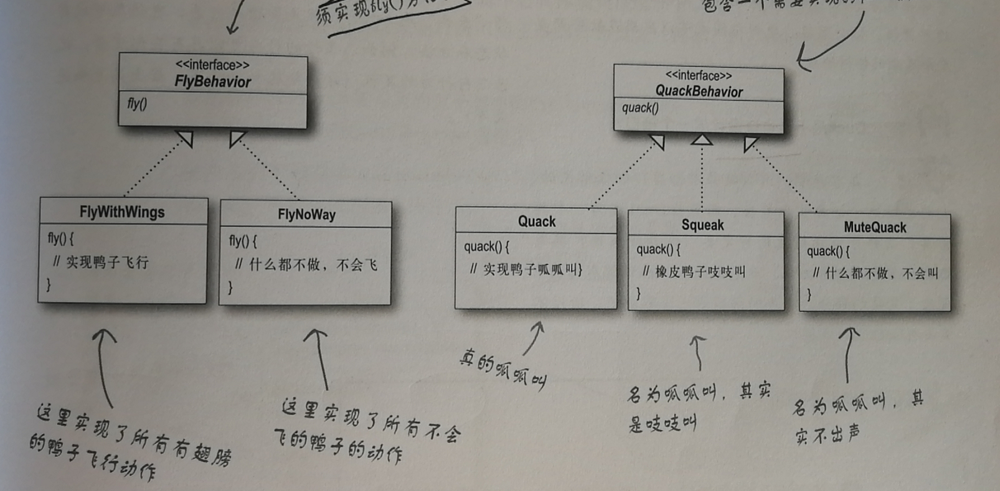
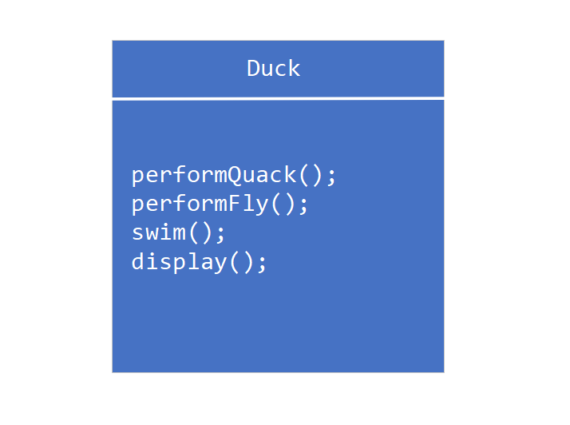

# 设计模式入门

## 1. 设计原则

- 找出应用中可能需要变化的部分，把他们独立出来，不要和那些不需要变化的代码混在一起
- 针对接口编程，而不是针对实现编程
- 多用组合，少用继承


## 2. 实例：会飞的鸭

### 2.1 问题背景

Joe 做了一个模拟鸭子的游戏：游戏中出现各种鸭子，一边游泳，一边叫

因此，Joe 在系统内部设计了一个鸭子父类，让各种鸭子来继承此父类


<div align="center">  </div><br>


这时，老板题出程序需要一种会飞的鸭子

但是，如果将 `fly()` 方法注册到鸭子父类，会造成：

1. 并非所有的 `Duck` 子类都会飞
2. 若是诱饵鸭，不会飞也不会叫
3. 若是橡皮鸭，不会飞但会叫


继承带来的坏处：改变（在现实生活中改变需求是经常发生的）会牵一发而动全身，造成其他鸭子不想要的改变 

这时，就需要新的解决方案


### 2.2 全新设计


**设计原则：找出应用中的可能需要变化之处，把他们独立出来，不要和那些不需要变化的代码混在一起**


所以我们需要将 `fly` 和 `quack` 抽取封装起来


**FlyBehavior.java**

```java
public interface Fly {
    void fly();
}
```


**QuackBehavior,java**

```java
public interface Quack {
    void quack();
}
```


在我们的新设计中，鸭子的子类将使用接口所表示的行为，即特定的具体行为编写在了 `Fly.java` 以及 `Quack,java` 的实现类中


**鸭子子类不再需要知道行为的实现细节**


<div align="center">  </div><br>


`fly` 行为的实现类（具体实现 `fly` 动作），这样的好处：

1. 将飞行的动作独立开来了，毕竟不是只有鸭子才能飞行，其他鸟类也可以飞行
2. 编写 `fly` 实现类，可以方便地赋予鸭子子类行为，而不用每次都 `override` 行为方法（十分麻烦）


**FlyWithWings.java**

```java
public class FlyWithWings implements FlyBehavior {
    @Override
    public void fly() {
        System.out.println("I can fly!");
    }
}
```


**FlyNoWay.java**

```java
public class FlyNoWay implements FlyBehavior {
    @Override
    public void fly() {
        System.out.println("I can't fly!");
    }
}
```


同理，`quack` 行为的实现类


**Quack.java**

```java
public class Quack implements QuackBehavior {
    @Override
    public void quack() {
        System.out.println("I can quack!");
    }
}
```


**Squeak.java**

```java
public class Squeak implements QuackBehavior {
    @Override
    public void quack() {
        System.out.println("I can squeak!");
    }
}
```


**MuteQuack,java**

```java
public class MuteQuack implements QuackBehavior {
    @Override
    public void quack() {
        System.out.println("I can't quack!");
    }
}
```


经过新的设计，看看我们的 `Duck` **父类（抽象类）**

<div align="center">  </div><br>


>**:bulb:TIPS**
>
>有抽象方法的类，一定是抽象类；抽象类不一定有抽象方法


**Duck,java**

```java
public abstract class Duck {
    FlyBehavior flyBehavior;
    QuackBehavior quackBehavior;

    public Duck() {
    }

    public void setFlyBehavior(FlyBehavior flyBehavior) {
        this.flyBehavior = flyBehavior;
    }

    public void setQuackBehavior(QuackBehavior quackBehavior) {
        this.quackBehavior = quackBehavior;
    }

    public void performFly() {
        flyBehavior.fly();
    }

    public void performQuack() {
        quackBehavior.quack();
    }

    public void swim() {
        System.out.println("Every duck can swim!");
    }

    public abstract void display();
}


```


**鸭子子类：**


**MullarDuck.java**

```java
public class MallardDuck extends Duck {
    public MallardDuck() {
        flyBehavior = new FlyWithWings();
        quackBehavior = new Quack();
    }

    @Override
    public void display() {
        System.out.println("I'm a real mallarduck!");
    }
}
```


**测试类：**


**Main.java**

```java
public static void main(String[] args) {
        Duck mallardDuck = new MallardDuck();
        mallardDuck.display();
        mallardDuck.performFly();
        mallardDuck.performQuack();
    }
```


:heavy_check_mark:Succeeded!


