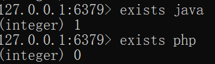
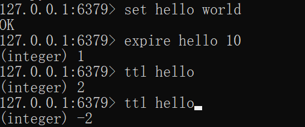
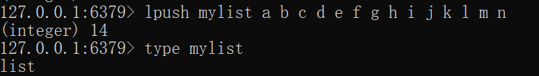
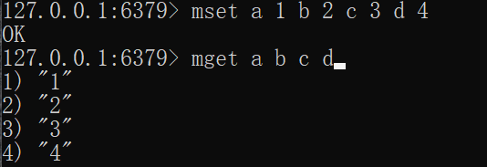
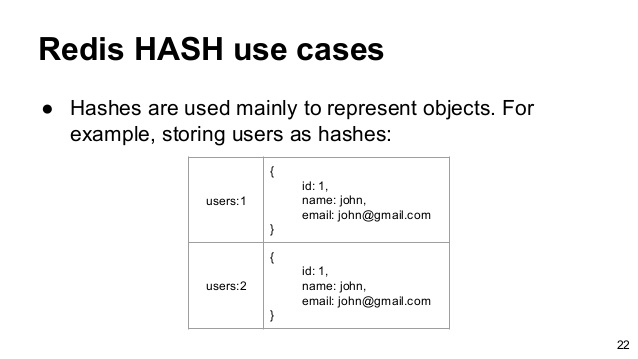
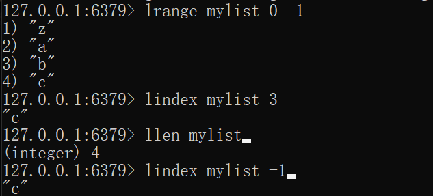
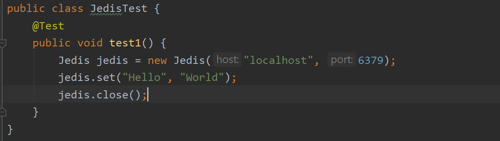
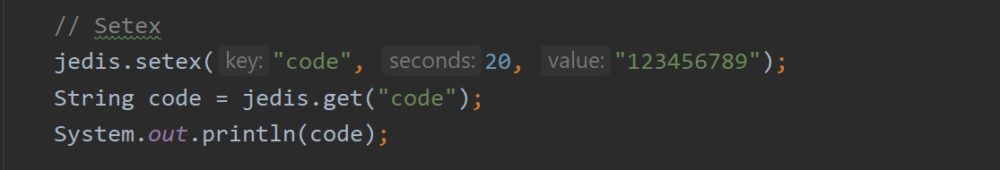
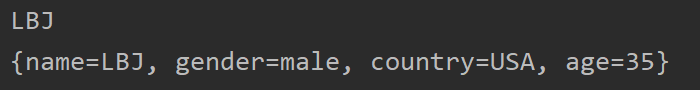

# Redis 

<div align="center">  </div><br>


## Category

* [Category](#category)
* [1. What is Redis](#1-what-is-redis)
* [2. Why we use Redis](#2-why-we-use-redis)
  + [2.1 Redis 使用场景](#21-redis-----)
* [3. Redis Quickstart](#3-redis-quickstart)
  + [3.1 Installation](#31-installation)
  + [3.2 Preparation](#32-preparation)
  + [3.3 String](#33-string)
    - [3.3.1 常用命令](#331-----)
    - [3.3.2 典型场景](#332-----)
  + [3.4 Hash](#34-hash)
  + [3.5 List](#35-list)
  + [3.6 Set](#36-set)
  + [3.7 Zset](#37-zset)


## 1. What is Redis

`Redis` 是一种基于 `key-value` 的 `NoSQL` 数据库

> Q：
>
> 关系型数据库与非关系型数据库之间有什么关系？
>
> A：
>
> 区别：
>
> 1. 关系型数据库：数据之间有关系；非关系型数据库：数据与数据之间没有关系
> 2. 关系型数据库：数据存储在硬盘的文件上；非关系型数据库：数据存储在内存中
>
> 关联：
>
> 两者相辅相成


## 2. Why we use Redis

1. 速度快

   `Redis` 所有数据都是放在内存中的（避免了大量与操作系统 IO 打交道）

2. 基于 `key-value` 的数据结构服务器

3. 丰富的功能：

   1. 键过期：实现缓存
   2. 发布订阅：消息系统

4. 持久化

   将数据保存在内存中是不安全的，当发生断电或者宕机，数据极有可能丢失

   `Redis` 提供了 `RDB` 和 `AOF` 两种持久化方式，将内存的数据保存在硬盘中

5. 高可用和分布式


### 2.1 Redis 使用场景

1. 缓存

   对于一些经常用却不怎么发生改变的数据，使用缓存机制可以极大加快对数据的访问速度且降低后端数据源的压力

   对于客户端发来的数据，先找缓存：

   有：直接读取

   没有：向数据库查询，读取并存到缓存中

2. 排行榜系统

3. 计数器应用

4. 社交网络

5. 消息队列

<div align="center">  </div><br>


## 3. Redis Quickstart

### 3.1 Installation

:warning:注意

官网不提供 `Windows` 版本

<div align="center">  </div><br>

当前使用版本：`Redis 2.8.9`


### 3.2 Preparation

**查看所有键**

<div align="center">  </div><br>

**键总数**

<div align="center">  </div><br>

:warning:注意

`dbsize` 的时间复杂度是 `O(1)` ，而 `keys *` 的时间复杂度是 `O(n)`，当 `Redis` 保存了大量的键时，线上环境禁止使用


**键是否存在**

<div align="center">  </div><br>


**删除键**


<div align="center">  </div><br>

删除成功：1

删除失败：2


**键过期**

<div align="center">  </div><br>

`ttl` 查看键剩余过期时间

大于0：剩余过期时间

-1：未设置过期时间

-2：键不存在 / 键已过期


**键的数据结构类型**

<div align="center">  </div><br>

在 `Redis` 中有 5 种外部的数据类型，分别为：

1. String
2. List
3. Hash
4. Set
5. Zset

其中每种都有自己的底层内部编码实现（不止一种）

这样做的好处：

1. 提供接口供开发者调用，一旦开发出更优秀的源码，无需改动外部的数据结构和命令
2. 多种内部编码实现在不同的应用场景下发挥更优势的实现


<div align="center">  </div><br>

### 3.3 String
<div align="center">  </div><br>


#### 3.3.1 常用命令

`get` 和 `set`

<div align="center">  </div><br>

批量设置值（`get` 和 `set` 增强版）

<div align="center">  </div><br>

:bulb:Tips

学会批量操作，有助于提高业务效率，但是注意每次批量操作的命令数不是无节制的，如果数量过多可能造成 `Redis` 阻塞或者网络拥塞


#### 3.3.2 典型场景

**缓存**

<div align="center">  </div><br>

缓存通常能起到加快读取速度以及降低后端服务器压力的作用


**计数**

许多应用会利用 `Redis` 作为计数的基础工具


### 3.4 Hash

<div align="center">  </div><br>

**常用命令**

常见的 `set` 和 `get`

<div align="center">  </div><br>

查看 `key` 下的所有 `field`

<div align="center">  </div><br>

使用 `hdel` 删除某个或多个 `field`

用 `hkeys` 查看所有的 `field`（不要给名字误导了）

:warning:注意

是 `hdel` 而不是 `del`

`del` 会删除整个 `key` （所有的 `field`）

<div align="center">  </div><br>

### 3.5 List

<div align="center">  </div><br>

**特点**

1. 有序（`index` 从 0 开始）

2. 可存重复元素

   

**常用方法**

**添加**

分为左插入和右插，很好理解

<div align="center">  </div><br>

**查找**

:warning:注意

与许多编程语言不同，这里的 `start` 和 `end` 是左闭右闭区间


<div align="center">  </div><br>


### 3.6 Set


### 3.7 Zset


## 4. Jedis

Java 有很多优秀的 `Redis` 客户端，在此介绍 `Jedis`

:bulb:Tips

获取第三方包通常有两种方式：

1. 官网下载对应的 `jar` 包
2. 使用集成构建工具（如 `Maven`）将 `Jedis` 目标版本的配置加入到项目中（推荐）


### 4.1 Quickstart

#### 4.1.1 String 操作

常见的 `set` 和 `get` 方法

<div align="center">  </div><br>

`setex` 为 `key` 设置过期时间（`s` 为单位）

<div align="center">  </div><br>

生活中有许多熟悉的身影，比如说注册账号或者找回密码时验证码 `60s` 内有效，背后就是这个原理

#### 4.1.2 Hash 操作

:warning:注意

```java
jedis.hgetAll(key);
```

是根据 `key` 获取所有 `field-value` 的值，存储到 `Map` 中，类型是 `String`


<div align="center">  </div><br>

<div align="center">  </div><br>


#### 4.1.6 Jedis 连接池

