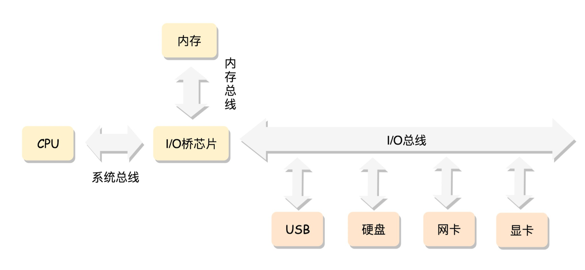

# 操作系统

Table of Contents
-----------------

* [Brainstorming](#brainstorming)
* [1. 计算机工作模式](#1-计算机工作模式)
* [2. 中断机制](#2-中断机制)
   * [2.1 什么是中断机制？](#21-什么是中断机制)
   * [2.2 中断机制有什么用？](#22-中断机制有什么用)
   * [2.3 工作流程](#23-工作流程)
* [3. Process Life Cycle](#3-process-life-cycle)
* [References](#references)

## Brainstorming

  
 

## 1. 计算机工作模式

  
 

- CPU: 计算机的大脑
- 内存: 暂时存放 `CPU` 运算的数据，与 `CPU` 协同工作

## 2. 中断机制

### 2.1 什么是中断机制？

发生中断就证明需要操作系统的介入，开展管理工作

### 2.2 中断机制有什么用？

简而言之，**使操作系统获得计算机的控制权**

### 2.3 工作流程

1. 当中断发生，`CPU` 立即进入核心态
2. 当前运行的进程暂停，由操作系统内核对中断进行处理（不同中断信号有着不同的处理）

## 3. Process Life Cycle

  
 

- `new` -> `ready`：操作系统完成进程创建工作
- `ready` -> `running`：进程准备就绪，等待 `CPU` 调度
- `running` -> `ready`：`CPU` 时间片到 / 有优先级很高的进程抢占调度
- `running` -> `blocked`：等待系统调度 / 等待某事件（**主动**）
- `blocked` -> `ready`：资源分配已到位 / 等待的时间已发生（**被动**）
- `running` -> `terminated`：进程运行结束 / 运行过程中遇到不可修复错误

## References

- [Process Life Cycle](https://zitoc.com/process-life-cycle/#:~:text=The%20process%20life%20cycle%20can,process%20control%20block%20(PCB).)