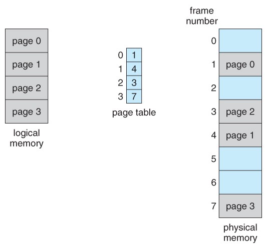

# 操作系统

Table of Contents
-----------------

* [进程管理]()
* 内存管理
* IO


## Brainstorming

<div align="center">  </div><br>

## 1. Blueprint

### 1.1 操作系统内核图

<div align="center">  </div><br>

### 1.2 四大特征

- 并发：计算机系统同时存在着多个运行的程序
- 共享：系统资源可供内存中多个并发的进程共同使用
- 虚拟：将物理实体映射成多个逻辑实体
- 异步：并发下，进程的执行不是一步到底，而是走走停停


## 3. 内存管理

### 3.1 概述

#### 3.1.1 容量单位

- 2^10 bytes = 1K
- 2^20 bytes = 1M
- 2^30 bytes = 1G

<div align="center">  </div><br>


### 3.2 空间分配与回收

#### 3.2.1 基本分页存储

<div align="center">  </div><br>

**Example**

若页面大小 L 为 1K 字节，页号 2 对应的内存块号 b = 8，请将逻辑地址 A = 2500 转换为物理地址 E（E = 8644）


**TLB（快表）**

快表（TLB，联想寄存器），是一种访问速度比内存快很多的高速缓冲存储器，用来存放当前访问的若干页表项，以加速地址变换的过程


**基于快表的地址变换过程**

1. 计算 `page No.` 和 `offset`
2. **检查 page No. 合法性**
3. 查快表，若命中，直接跳到第 5 步
4. 查 `page table`，找到页面存放的内存块号
5. 根据内存块号和 `offset` 得到物理地址
6. 访问目标内存单元

<div align="center">  </div><br>

#### 3.2.2 基本分段存储


#### 3.2.3 段页式存储


### 3.3 空间扩充

#### 3.3.1 局部性原理

- 时间局部性
- 空间局部性

```java
int i = 0;
int a[100];

while (i < 100) {
  a[i] = i;
  i++;
}
```


<div align="center">  </div><br>


#### 3.3.2 xxx


#### 3.3.3 页面置换算法

**OPT: 以后永远不使用 / 最长时间内不被使用**

**Example**

假设系统为某进程分配了 3 个内存块，并考虑到有以下页面号引用串（会依次访问这些页面）：

7 0 1 2 0 3 0 4 2 3 0 3 2 1 2 0 1 7 0 

| 访问页面 | 7    | 0    | 1    | 2    | 0    | 3    | 0    | 4    | 2    | 3    | 0    | 3    | 2    | 1    | 2    | 0    | 1    | 7    | 0    |
| -------- | ---- | ---- | ---- | ---- | ---- | ---- | ---- | ---- | ---- | ---- | ---- | ---- | ---- | ---- | ---- | ---- | ---- | ---- | ---- |
| 内存块 1 | 7    | 7    | 7    | 2    |      | 2    |      | 2    |      |      | 2    |      |      | 2    |      |      |      | 7    |      |
| 内存块 2 |      | 0    | 0    | 0    |      | 0    |      | 4    |      |      | 0    |      |      | 0    |      |      |      | 0    |      |
| 内存块 3 |      |      | 1    | 1    |      | 3    |      | 3    |      |      | 3    |      |      | 1    |      |      |      | 1    |      |
| 是否缺页 | ☑️    | ☑️    | ☑️    | ☑️    |      | ☑️    |      | ☑️    |      |      | ☑️    |      |      | ☑️    |      |      |      | ☑️    |      |

**FIFO: **

**Example**


**LRU: **

**Example**


**CLOCK:**

**Example**


## References

- [趣谈Linux操作系统](https://time.geekbang.org/column/intro/164)
- [Process Life Cycle](https://zitoc.com/process-life-cycle/#:~:text=The%20process%20life%20cycle%20can,process%20control%20block%20(PCB).)
- [CS-Notes](https://github.com/CyC2018/CS-Notes/blob/master/notes/%E8%AE%A1%E7%AE%97%E6%9C%BA%E6%93%8D%E4%BD%9C%E7%B3%BB%E7%BB%9F%20-%20%E7%9B%AE%E5%BD%95.md)
- [The producer-consumer problem in Operating System](https://afteracademy.com/blog/the-producer-consumer-problem-in-operating-system#:~:text=The%20Producer%2DConsumer%20problem%20is,products%20produced%20by%20the%20Producer.)
- [The Reader-Writer Problem in Operating System](https://afteracademy.com/blog/the-reader-writer-problem-in-operating-system)
- [Operating System Tutorial for Beginners](https://www.studytonight.com/operating-system/#)
- [Operating System Tests](https://www.studytonight.com/tests/?subject=operating-system)
- [Dining Philosophers Problem (DPP)](https://www.tutorialspoint.com/dining-philosophers-problem-dpp#:~:text=The%20dining%20philosophers%20problem%20states,and%20left%20chopstick%20to%20eat.)
- [How computer memory works - Kanawat Senanan](https://www.youtube.com/watch?v=p3q5zWCw8J4&t=79s)
