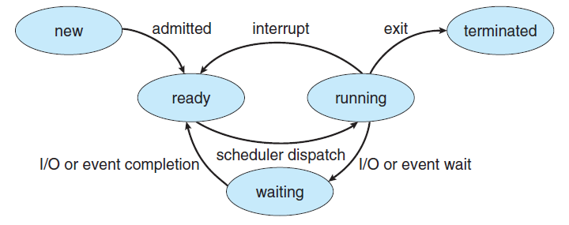
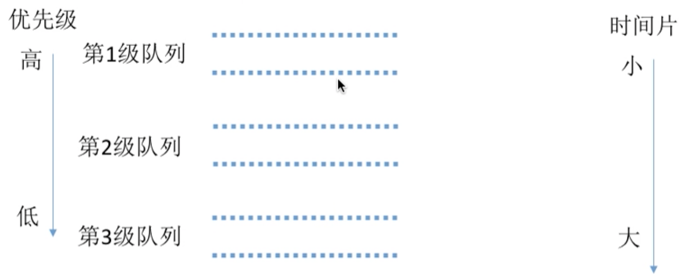

# 操作系统

Table of Contents
-----------------

* [Brainstorming](#brainstorming)
* [1. Blueprint](#1-blueprint)
   * [1.1 操作系统内核图](#11-操作系统内核图)
   * [1.2 四大特征](#12-四大特征)
* [2. 进程](#2-进程)
   * [2.1 Process Life Cycle](#21-process-life-cycle)
   * [2.2 PCB (Process Control Block)](#22-pcb-process-control-block)
   * [2.3 进程创建](#23-进程创建)
   * [2.4 进程调度](#24-进程调度)
      * [2.4.1 交互式系统：时间片轮转调度算法](#241-交互式系统时间片轮转调度算法)
      * [2.4.2 交互式系统：优先级调度算法](#242-交互式系统优先级调度算法)
      * [2.4.3 交互式系统：多级反馈队列调度算法](#243-交互式系统多级反馈队列调度算法)
   * [2.5 Process Synchronization](#25-process-synchronization)
   * [2.6 信号量机制](#26-信号量机制)
      * [2.6.1 记录型信号量](#261-记录型信号量)
      * [2.6.2 信号量机制实现进程互斥](#262-信号量机制实现进程互斥)
      * [2.6.3 信号量机制实现进程同步](#263-信号量机制实现进程同步)
   * [2.7 Producer–Consumer Problem](#27-producerconsumer-problem)
   * [2.8 Readers-Writers Problem](#28-readers-writers-problem)
   * [2.9 Dining Philosophers Problem（待补充）](#29-dining-philosophers-problem待补充)
   * [2.10 Deadlocks](#210-deadlocks)
      * [2.10.1 死锁产生的必要条件](#2101-死锁产生的必要条件)
* [References](#references)


## Brainstorming

<div align="center">  </div><br>

## 1. Blueprint

### 1.1 操作系统内核图

<div align="center">  </div><br>

### 1.2 四大特征

- 并发：计算机系统同时存在着多个运行的程序
- 共享：系统资源可供内存中多个并发的进程共同使用
- 虚拟：将物理实体映射成多个逻辑实体
- 异步：并发下，进程的执行不是一步到底，而是走走停停

## 2. 进程

### 2.1 Process Life Cycle

<div align="center">  </div><br>

- `new` -> `ready`：操作系统完成进程创建工作
- `ready` -> `running`：进程准备就绪，等待 `CPU` 调度
- `running` -> `ready`：`CPU` 时间片到 / 有优先级很高的进程抢占调度
- `running` -> `blocked`：等待系统调度 / 等待某事件（**主动**）
- `blocked` -> `ready`：资源分配已到位 / 等待的时间已发生（**被动**）
- `running` -> `terminated`：进程运行结束 / 运行过程中遇到不可修复错误


### 2.2 PCB (Process Control Block)

<div align="center">  </div><br>

### 2.3 进程创建

<div align="center">  </div><br>

### 2.4 进程调度

#### 2.4.1 交互式系统：时间片轮转调度算法

<div align="center">  </div><br>

当时间片为 2 时：

<div align="center">  </div><br>


当时间片为 5 时：

<div align="center">  </div><br>

**注意：**

- 在时间片内，若进程执行完毕，会主动放弃 `CPU`（进行下一次调度）
- 时间片过大：退化成 `first come first serve`；时间片过小：进程切换太频繁


#### 2.4.2 交互式系统：优先级调度算法


<div align="center">  </div><br>

**非抢占式**

每次调度已到达队列且优先级最高的进程，当进程主动放弃 `CPU` 时发生调度

<div align="center">  </div><br>

**抢占式**

与非抢占式相比，抢占式在**就绪队列发生改变时**也会判断是否需要抢占

<div align="center">  </div><br>


#### 2.4.3 交互式系统：多级反馈队列调度算法

<div align="center">  </div><br>

设置**多级就绪队列**，优先级从高到低，时间片从小到大

<div align="center">  </div><br>

### 2.5 Process Synchronization

> Process Synchronization means sharing system resources by processes in a such a way that, Concurrent access to shared data is handled thereby minimizing the chance of inconsistent data

```cpp
do {
  // 对请求的资源上锁
  entry section;
  critical section;
  // 释放该资源的锁
  exit section;
  remainder section;
} while (true);
```


### 2.6 信号量机制

#### 2.6.1 记录型信号量


<div align="center">  </div><br>

**struct.cpp**

```cpp
typedef struct {
  int value;  // 剩余资源数
  struct process *L;  // 等待队列
} semaphore;
```

**wait(S)**

```cpp
void wait (semaphore S) {
  // 请求一个单位的资源
  S.value--;
  // 当前没有资源可用
  if (S.value < 0) {
    // running -> blocked
    // 主动加入等待队列, 实现"让权等待"
    block (S.L);  
  }
}
```

**signal(S)**

```cpp
void signal (semaphore S) {
  // 释放一个单位的资源
  S.value++;
  // 仍有进程在等待队列等待
  if (S.value <= 0) {
    // blocked -> ready
    // 使用 wakeup 原语唤醒等待队列中的一个进程
    wakeup(S.L);
  }
}
```

**注意：**

- `wait(S)` 和 `signal(S)` 设计为原语，一气呵成，不可分割（重要！！！）
- `wait(S)` 和 `signal(S)` 也称 `PV` 操作，需成对出现


#### 2.6.2 信号量机制实现进程互斥

**核心思想：**

1. 初始化互斥信号量为 1
2. `P` 操作（原语）
3. 临界区操作
4. `V` 操作（原语）

```cpp
// 初始化互斥信号量为 1（因为临界资源区最多只能一个进程访问）
semaphore mutex = 1;

P1() {
  ...;
  // 加锁
  P(mutex);
  // 临界区代码段 
  Do something;
  // 释放锁
  V(mutex);
  ...;
}

P2() {
  ...;
  // 加锁
  P(mutex);
  // 临界区代码段 
  Do something;
  // 释放锁
  V(mutex);
  ...;
}
```


#### 2.6.3 信号量机制实现进程同步

**核心思想：**

1. 初始化同步信号量为 0
2. "前操作"
3. `V` 操作（原语）
4. `P` 操作（原语）
5. “后操作”


```cpp
// 初始化同步信号量为 0
semaphore S = 0;

P1() {
  // Code block 1
  Do something;
  V(S);
  // Code block 2
  Do Something;
}

P2() {
  P(S);
  // Code block 3
  Do Something;
}
```

保证了 `Code block 3` 一定在 `Code block 1` 之后执行


### 2.7 Producer–Consumer Problem

<div align="center">  </div><br>

**Constraints**

- 只有缓冲区没满时，`producer` 才能把产品放入缓冲区，否则必须等待
- 只有缓冲区不空时，`consumer` 才能从中取出产品，否则必须等待
- 缓冲区是临界资源，各进程必须互斥地访问（因为并发条件下，若两个进程同时将各自的产品放入缓冲区同一个位置，会出现 “数据覆盖” 的现象）


**Explained**

- Semaphore Q: 用来保证缓冲区进程互斥，初始值为 1（Q 代表 queue）
- Semaphore E: 初始值为 n（E 代表 empty，缓冲区空闲的位置）
- Semaphore F: 初始值为 0（F 代表 filled，缓冲区已占用的位置）


**Producer**

```java
void producer() {
  while (T) {
    // 生产数据
    produce();
    // 是否有空闲的位置可以投放
    wait(E);
    // 当前缓冲区是否被占用
    wait(Q);
    // 投放数据
    append();
    // 释放缓冲区
    signal(Q);
    // 更新缓冲区已占用的数量
    signal(F);
  }
}
```


**Consumer**

```java
void consumer() {
  while (T) {
    // 缓冲区是否有数据可以被消费
    wait(F);
    // 缓冲区是否被占用
    wait(Q);
    // 从缓冲区拿数据
    take();
    // 释放缓冲区的资源
    signal(Q);
    // 缓冲区空闲位置增加
    signal(E);
    // 消费数据
    consume();
  }
}
```


### 2.8 Readers-Writers Problem

<div align="center">  </div><br>

**Contraints**

两种场景（针对同一时刻）：

1. 一个 `writer`
2. 多个 `reader`


**Explained**

- Semaphore W: 写操作是互斥的，初始值为 1（W 代表 write）
- readCount: 当前 `reader` 的数量（普通变量），初始值为 0
- Semaphore mutex: 用来互斥地增减 `readCount` 的值，初始值为 1


**Writer**

```java
void write() {
  // 是否有其他进程在写数据
  wait(W);
  // 写入数据
  writing();
  // 释放资源
  signal(W);
}
```


**Reader**

```java
void read() {
  
  // 互斥地增加 readCount 数量
  wait(mutex);
  readCount++;
  //当第一个 reader 进来时, 给 writer 上锁
  if (readCount == 1) {
    wait(W);
  }
  signal(mutex);
  
  // 进行读操作
  reading();
  
  // 互斥地减少 readCount 数量
  wait(mutex);
  readCount--;
  // 当没有 reader 进程时, 释放 writer 锁
  if (readCount == 0) {
    signal(W);
  }
  signal(mutex);
  
}
```


### 2.9 Dining Philosophers Problem（待补充）

<div align="center">  </div><br>


**Background**

At any instant, a philosopher is either eating or thinking. When a philosopher wants to eat, he uses two chopsticks - one from their left and one from their right. When a philosopher wants to think, he keeps down both chopsticks at their original place


### 2.10 Deadlocks

<div align="center">  </div><br>

#### 2.10.1 死锁产生的必要条件

产生死锁**必须同时满足以下四个条件**（联想哲学家进餐问题）


<div align="center">  </div><br>

1. 互斥：若资源是共享的，则可避免死锁
2. Hold and wait：若放弃手里的 / 不去等待其他资源，则可避免死锁
3. 非抢占式：若其他进程可以抢夺，则可避免死锁
4. 循环等待


## References

- [趣谈Linux操作系统](https://time.geekbang.org/column/intro/164)
- [Process Life Cycle](https://zitoc.com/process-life-cycle/#:~:text=The%20process%20life%20cycle%20can,process%20control%20block%20(PCB).)
- [CS-Notes](https://github.com/CyC2018/CS-Notes/blob/master/notes/%E8%AE%A1%E7%AE%97%E6%9C%BA%E6%93%8D%E4%BD%9C%E7%B3%BB%E7%BB%9F%20-%20%E7%9B%AE%E5%BD%95.md)
- [The producer-consumer problem in Operating System](https://afteracademy.com/blog/the-producer-consumer-problem-in-operating-system#:~:text=The%20Producer%2DConsumer%20problem%20is,products%20produced%20by%20the%20Producer.)
- [The Reader-Writer Problem in Operating System](https://afteracademy.com/blog/the-reader-writer-problem-in-operating-system)
- [Operating System Tutorial for Beginners](https://www.studytonight.com/operating-system/#)
- [Operating System Tests](https://www.studytonight.com/tests/?subject=operating-system)
- [Dining Philosophers Problem (DPP)](https://www.tutorialspoint.com/dining-philosophers-problem-dpp#:~:text=The%20dining%20philosophers%20problem%20states,and%20left%20chopstick%20to%20eat.)
