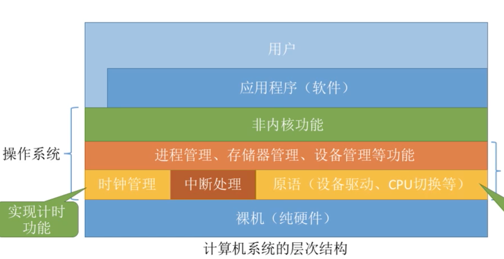
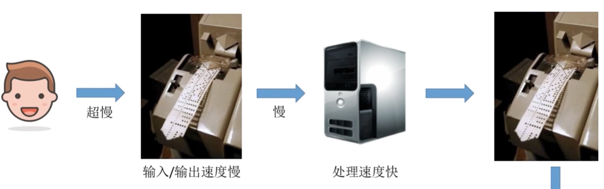
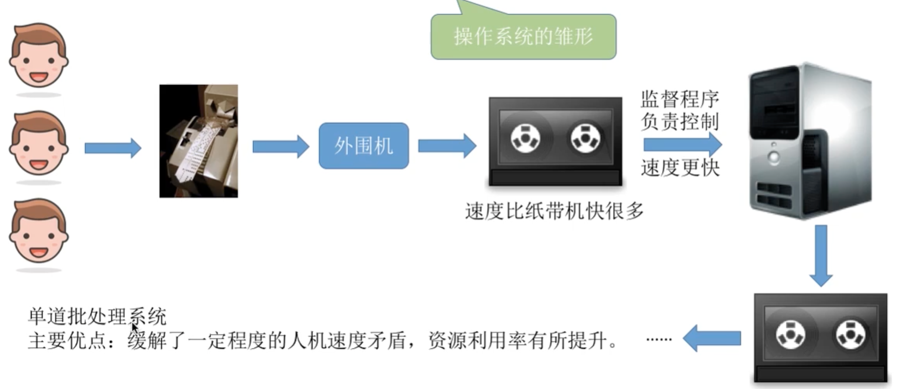
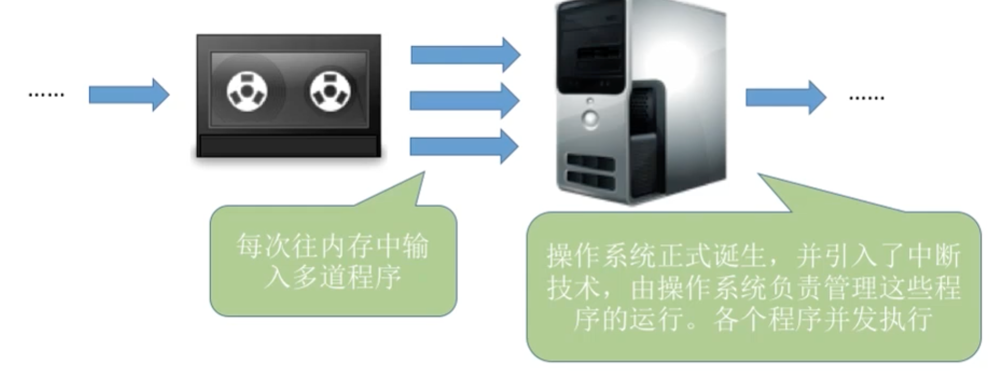
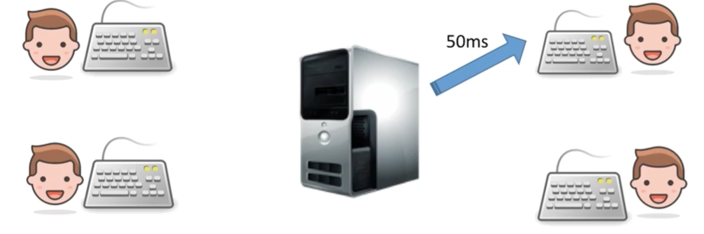
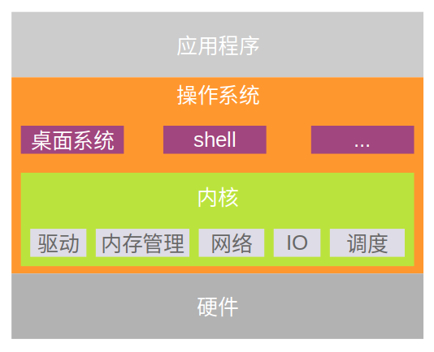
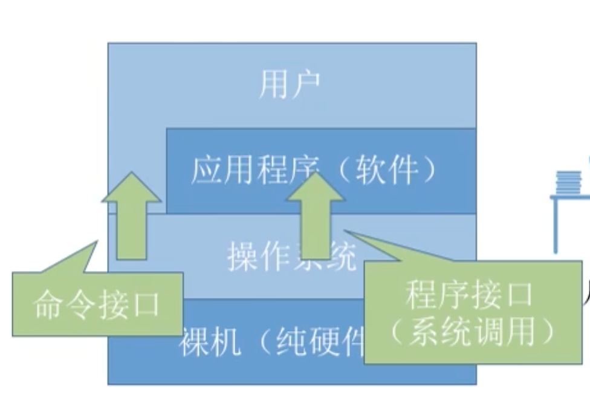

# 概况

## 目录

* [1. 什么是 OS ？](#1----os--)
  + [1.1 系统资源的管理者](#11---------)
  + [1.2 用户和计算机硬件之间的接口](#12--------------)
  + [1.3 作为最接近硬件的层次](#13-----------)
* [2. OS 有什么特点？](#2-os-------)
  + [2.1  并发](#21----)
  + [2.2 共享](#22---)
  + [2.3 虚拟](#23---)
  + [2.4 异步](#24---)
* [3. OS 的发展与分类](#3-os-------)
  + [3.1 手工操作](#31-----)
  + [3.2 单道批处理](#32------)
  + [3.3 多道批处理](#33------)
  + [3.4 分时操作系统](#34-------)
  + [3.5 实时操作系统](#35-------)
* [4. OS 的运行机制](#4-os------)
  + [4.1 两种指令](#41-----)
  + [4.2 两种处理器状态](#42--------)
  + [4.3 两种程序](#43-----)
* [5. OS 内核](#5-os---)
  + [5.1 中断处理](#51-----)
* [6. 系统调用](#6-----)
  + [6.1 什么是系统调用？](#61---------)
  + [6.2 为什么要有系统调用？](#62-----------)

## 1. 什么是 OS ？

- 系统资源的管理者
- 作为用户与计算机硬件之间的接口
- 最接近硬件的层次

  
 

### 1.1 系统资源的管理者

- 文件管理
- 内存管理（存储器管理）
- 处理机管理
- 设备管理

举个例子，在网上冲浪中，我们需要玩微信：

1. 找到微信（文件管理）
2. 双击打开微信（内存管理）
3. 微信运行（处理机管理）
4. 与朋友微信视频（设备管理）

### 1.2 用户和计算机硬件之间的接口

- 命令接口（用户直接使用）
  - 联机命令接口
  - 脱机命令接口
- 程序接口（用户通过程序间接使用）
- GUI

### 1.3 作为最接近硬件的层次

- 对硬件的拓展

例子：

硬件：锤子，锯子，木头，钉子

操作系统：优秀的工匠，可以通过这种简单的原料组织成房子，帆船等，而使用者无需关心其底层架构

## 2. OS 有什么特点？

- 并发
- 共享
- 虚拟
- 异步

### 2.1  并发

- 并发：指两个或者多个时间在同一时间间隔内发生。这些事情在宏观上是同时发生的，在微观上是交替发生的
- 并行：指两个或者多个事件在同一时刻同时发生

### 2.2 共享

- 互斥共享：一个时间段只允许一个进程访问该资源
- 同时共享：一个时间段内由多个进程“同时”对资源进行访问

举个例子：

- 互斥共享：使用 QQ 和微信进行视频通话，同一时间段内，只允许一个进程（微信或者 QQ）访问摄像头
- 同时共享：使用 QQ 发送文件 A，使用微信发送文件 B。宏观上，两个程序都在读取并发送文件（访问硬盘资源）；微观上，两个进程交替着访问硬盘资源（我们感觉不到）

### 2.3 虚拟

- 虚拟：物理上的实体转变为若干个逻辑上的对应物
- 空分复用技术
- 时分复用技术

### 2.4 异步

- 异步：在多道程序环境下，允许多个程序并发执行，但由于资源有限，进程的执行不是一贯到底，而是走走停停，以不可预知的速度向前推进

## 3. OS 的发展与分类

重点理解各个阶段的优点和缺点。各个阶段的主要优点都解决了上一阶段的主要缺点

### 3.1 手工操作

  
 

流程：

1. 通过打孔机写程序
2. 通过纸袋机输入到计算机中
3. 计算机处理结果
4. 将结果通过纸袋机输出

缺点：

1. 用户独占全机
2. 人机速度不匹配，资源利用率低

### 3.2 单道批处理

 

  
 

流程：

1. 引入脱机输入 / 输出技术（磁带完成），并监督程序负责控制作业的输入输出

缺点：

1. 内存中仅能一道程序运行，CPU 有大量的时间在空闲等待 I / O 完成

###  3.3 多道批处理

  
 

流程：

1. 每次往内存中输入多道程序
2. 多道程序并发执行，共享计算机资源

缺点：

1. 用户响应时间长
2. 没有人机交互功能（用户提交自己的作业之后就只能干等着计算机处理完成，而不能控制其执行）

### 3.4 分时操作系统

  
 

流程：

1. 计算机以时间片为单位轮流为各个用户 / 作业服务（各个用户可通过终端进行交互）

缺点：

1. 不能优先处理紧急任务（操作系统对各个用户 / 作业都是完全公平的），循环地为每个用户 / 作业服务一个时间片，不区分任务紧急性。

   

### 3.5 实时操作系统

流程：

1. 优先响应紧急任务，不需要时间片排队

优点：

1. 及时性
2. 可靠性

## 4. OS 的运行机制

### 4.1 两种指令

**什么是指令？**

在我们平时写程序的时候，用的各种编程语言，例如：`Java`，`Python` 等等，都是高级语言，符合人类的日常习惯。

可是，机器如何读懂这些语言的呢？我们知道，在机器的世界中，只有 0 和 1（二进制）

我们编写的这些高级语言通过“翻译”，变成一条条机器语言指令，让 `CPU` 能识别，并执行的最基本命令

指令分两种：

- 特权指令
- 非特权指令

### 4.2 两种处理器状态

- 用户态（目态）：`CPU` 只能执行非特权指令
- 核心态（管态）：`CPU` 能执行特权以及非特权指令

### 4.3 两种程序

- 内核程序：系统的管理者，运行在和心态（可以执行特权指令，也可以执行非特权指令）
- 应用程序：运行在用户态（只能执行非特权指令）

## 5. OS 内核

  
 

### 5.1 中断处理

**发生中断就意味着需要操作系统的介入，开展管理工作**

在早期的时候，程序只能串行运行，造成 `CPU` 资源浪费浪费严重

为了解决这个问题，操作系统诞生了（作为计算机的管理者），引入中断机制，实现了多道程序的并发执行

 

**中断有什么用？**

-  使得 `CPU` 从用户态切换为核心态，使得 `OS` 获得计算机控制权

## 6. 系统调用

  
 

### 6.1 什么是系统调用？

系统调用也称作用户接口，对象是用户，目的是为了方便用户

`OS` 作为用户和计算机硬件之间的接口，需要向上提供一些简单易用的服务，其中包括：

- 命令接口
  - 联机命令接口：用户说一句，系统做一句
  - 脱机命令接口：用户说一堆，系统做一堆
- 程序接口 

### 6.2 为什么要有系统调用？

**因为要保证系统的稳定性和安全性**

举个例子，在打印店中，小明按下了打印按钮，文档开始打印。恰好这时候，隔壁老王也过来打印文件，以迅雷不及掩耳之势，也按下了打印按钮

那么请问，打印出来的文件是不按用户顺序，交替的吗？

不是，先打印小明的文件，打完之后才是老王的文件

当应用程序（打印机等等）请求设备管理时，如果没有操作系统的统一掌管，那么后果不堪设想，变得一团糟。

所以，任何用户程序中，凡是与资源相关的操作，都必须以系统调用的方式来向操作系统提出请求，防止用户进行非法操作

