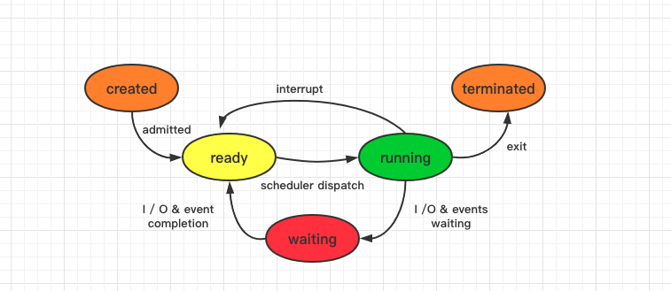

# 进程 / 线程

Table of Contents
-----------------

* [1. 什么是进程?](#1-什么是进程)
* [2. 为什么有进程?](#2-为什么有进程)
* [3. 进程的组成](#3-进程的组成)
* [4. 进程的状态](#4-进程的状态)
* [5. 进程通信](#5-进程通信)
   * [5.1 共享存储](#51-共享存储)
   * [5.2 消息传递](#52-消息传递)
   * [5.3 管道通信](#53-管道通信)
* [6. 什么是线程？](#6-什么是线程)
* [7. 进程调度](#7-进程调度)
* [8. 调度算法的评价指标](#8-调度算法的评价指标)

## 1. 什么是进程?

进程是程序的一次执行过程

## 2. 为什么有进程?

在以前的单道程序中：

计算机一段时间内只处理一个程序，计算机可以清楚地找到内存中数据段和程序段存放的位置

  
 

引入多道程序之后，在内存中各个程序的数据段变成了这个样子：

  
 

操作系统为了方便地找到各程序的存放位置，引入了 `PCB` 

`PCB` （Process Control Block）用来描述进程的各种信息

## 3. 进程的组成

- 程序段：程序代码
- 数据段：程序运行时使用，产生的运算数据
- PCB：包含操作系统对其进行管理的信息

## 4. 进程的状态

- 运行态 Running：有 `CPU`，有其他系统资源
- 就绪态 Ready：无 `CPU`，有其他系统资源
- 阻塞态 Waiting / Blocked：无 `CPU`，无其他系统资源

  
 

注意：

- 从 `running` 到 `waiting` 是进程自身做出的**主动行为**，进程用 “系统调用” 的方式申请某种系统资源 / 请求等待某个事件的发生
- 从 `running` 到 `ready` 是因为时间片到 / 处理机被抢占，需要等待 `CPU`

## 5. 进程通信

进程通信是指进程之间的信息交换

 进程通信分为：

- 共享存储
- 消息传递
- 管道通信

### 5.1 共享存储

### 5.2 消息传递

### 5.3 管道通信

## 6. 什么是线程？

线程是一个基本的 `CPU` 执行单元，也是程序执行流的最小单位

引入线程后提高了系统的并发度

## 7. 进程调度

进程调度（低级调度）：按照某种算法从就绪队列选择一个进程为其分配处理机

## 8. 调度算法的评价指标

