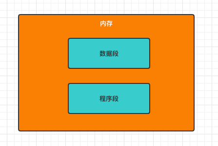
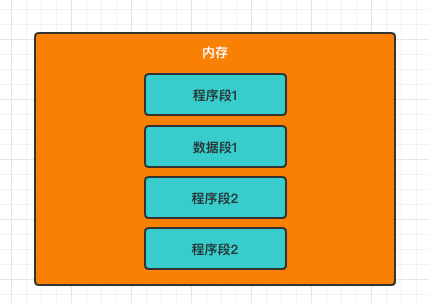

# 进程

Table of Contents
=================

* [1. 什么是进程?](#1-什么是进程)
* [2. 为什么有进程?](#2-为什么有进程)
* [3. 每个进程由哪些部分组成?](#3-每个进程由哪些部分组成)
* [4. 系统中各个进程之间是如何被组织起来的?](#4-系统中各个进程之间是如何被组织起来的)
* [5. 进程有哪些特征?](#5-进程有哪些特征)
* [6. 进程有哪些状态?](#6-进程有哪些状态)

## 1. 什么是进程?

进程是程序段一次执行过程

## 2. 为什么有进程?

我们知道，程序是由数据和一条条指令组成的

在以前的单道程序中，计算机一段时间内只处理一个程序，计算机可以清楚地找到内存中数据段和程序段存放的位置

  
 

在引入多道程序之后，在内存中各个程序的数据段变成了这个样子：

  
 

那么操作系统如何才能找到每个程序的存放位置呢？

## 3. 每个进程由哪些部分组成?

## 4. 系统中各个进程之间是如何被组织起来的?

- 链接方式
- 索引方式

## 5. 进程有哪些特征?

- 动态性
- 并发性
- 独立性
- 异步性
- 结构性

## 6. 进程有哪些状态?

- 运行态
- 就绪态
- 阻塞态

## 7. 什么是进程控制?

