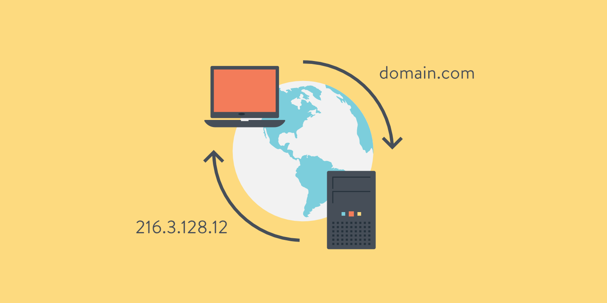
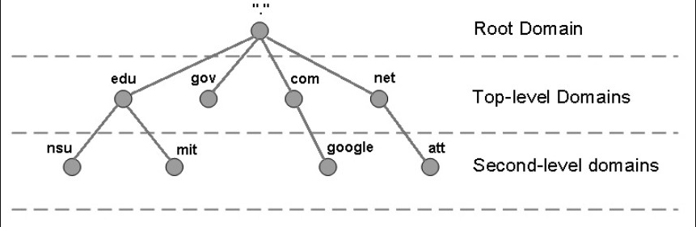
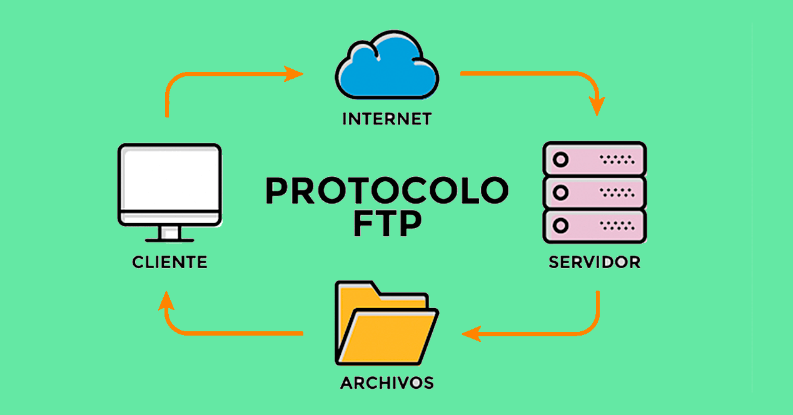
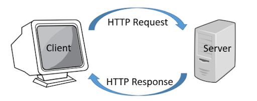

# 应用层

Table of Contents
-----------------

* [1. DNS](#1-dns)
* [2. FTP](#2-ftp)
* [3. HTTP](#3-http)
* [4. HTTPS](#4-https)
* [参考链接](#参考链接)

## 1. DNS 

维基百科

> 域名系统（英语：Domain Name System，缩写：DNS）是互联网的一项服务。它作为将域名和IP地址相互映射的一个分布式数据库，能够使人更方便地访问互联网。DNS使用TCP和UDP端口53。当前，对于每一级域名长度的限制是63个字符，域名总长度则不能超过253个字符。

  
 

 **域名服务器**

- 根域名服务器
- 顶级域名服务器
- 权限域名服务器

  
 

 

## 2. FTP 

维基百科

> 文件传输协议（英语：File Transfer Protocol，缩写：FTP）是一个用于在计算机网络上在客户端和服务器之间进行文件传输的应用层协议。文件传送（file transfer）和文件访问（file access）之间的区别在于：前者由FTP提供，后者由如NFS等应用系统提供[1]。参考文献 RFC 959 定义了此规范。
>
> FTP是一个8位的客户端-服务器协议，能操作任何类型的文件而不需要进一步处理，就像MIME或Unicode一样。但是，FTP有着极高的延时，这意味着，从开始请求到第一次接收需求数据之间的时间，会非常长；并且不时的必须执行一些冗长的登录进程。

  
 

## 3. HTTP 

维基百科

> 超文本传输协议（英语：HyperText Transfer Protocol，缩写：HTTP）是一种用于分布式、协作式和超媒体信息系统的应用层协议。HTTP是万维网的数据通信的基础。
>
> 设计HTTP最初的目的是为了提供一种发布和接收HTML页面的方法。通过HTTP或者HTTPS协议请求的资源由统一资源标识符（Uniform Resource Identifiers，URI）来标识。

 `HTTP` 由两个程序实现：

- 客户端程序
- 服务器程序

客户端程序和服务器程序运行在不同的端系统中，通过交换 `HTTP` 报文进行会话。`HTTP` 定义了这些报文的结构以及客户和服务器进行报文交换的格式

  
 

`HTTP` 使用 `TCP` 作为它的支撑运输协议（下一层是为上一层服务的）。`HTTP` 客户首先发起一个与服务器的 `TCP` 连接。一旦连接建立，该浏览器和服务器进程就可以通过套接字访问 `TCP`

一旦客户向它的套接字接口发送了一个请求报文，该报文就脱离了客户端并进入 `TCP` 的控制， `HTTP` 协议不必担心数据丢失

## 4. HTTPS 

维基百科

> 超文本传输安全协议（英语：HyperText Transfer Protocol Secure，缩写：HTTPS；常称为HTTP over TLS、HTTP over SSL或HTTP Secure）是一种通过计算机网络进行安全通信的传输协议。HTTPS经由HTTP进行通信，但利用SSL/TLS来加密数据包。HTTPS开发的主要目的，是提供对网站服务器的身份认证，保护交换资料的隐私与完整性。这个协议由网景公司（Netscape）在1994年首次提出，随后扩展到互联网上。
>
> 历史上，HTTPS连接经常用于万维网上的交易支付和企业信息系统中敏感信息的传输。在2000年代末至2010年代初，HTTPS开始广泛使用，以确保各类型的网页真实，保护账户和保持用户通信，身份和网络浏览的私密性。

  
 

## 参考链接

- [How a DNS Server (Domain Name System) works](https://www.youtube.com/watch?v=mpQZVYPuDGU)
- [FTP (File Transfer Protocol), SFTP, TFTP Explained](https://www.youtube.com/watch?v=tOj8MSEIbfA&t=1s)
- [SSL, TLS, HTTP, HTTPS Explained](https://www.youtube.com/watch?v=hExRDVZHhig)
- [HTTP 协议入门](http://www.ruanyifeng.com/blog/2016/08/http.html)
- [HTTPS 升级指南](http://www.ruanyifeng.com/blog/2016/08/migrate-from-http-to-https.html)
- [HTTPS的七个误解（译文）](http://www.ruanyifeng.com/blog/2011/02/seven_myths_about_https.html)

