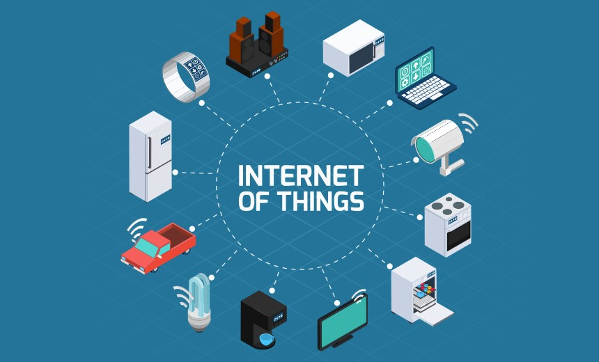
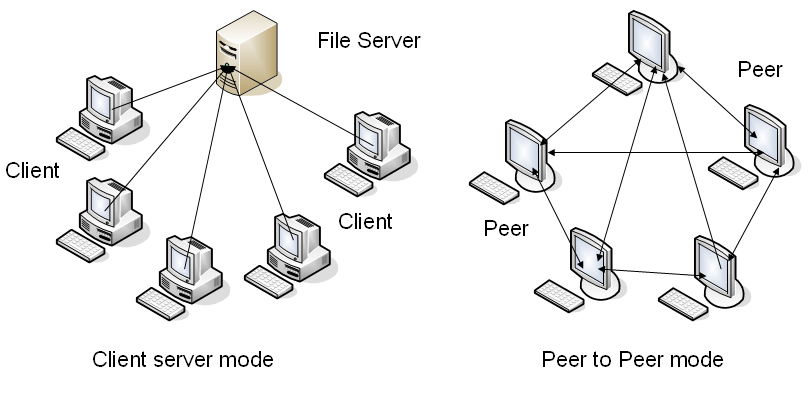
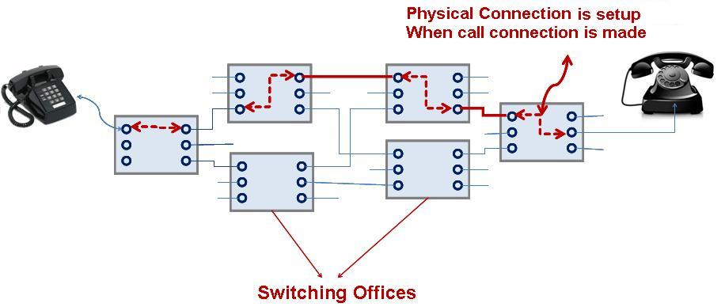
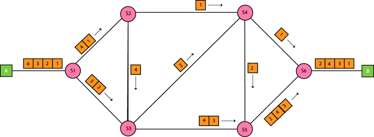

# TCP / IP 协议体系的认知

Table of Contents
-----------------

* [1. 什么是因特网？](#1-什么是因特网)
* [2. 网络边缘](#2-网络边缘)
   * [2.1 主机之间的通信方式](#21-主机之间的通信方式)
* [3. 网络核心](#3-网络核心)
   * [3.1 电路交换 Circuit Switching](#31-电路交换-circuit-switching)
   * [3.2 分组交换 Packet Switching](#32-分组交换-packet-switching)
* [4. 计算机网络性能](#4-计算机网络性能)
   * [4.1 速率](#41-速率)
   * [4.2 带宽](#42-带宽)
   * [4.3 吞吐量](#43-吞吐量)
   * [4.4 时延](#44-时延)
   * [4.5 时延带宽积](#45-时延带宽积)
   * [4.6 往返时间](#46-往返时间)
   * [4.7 利用率](#47-利用率)
* [5. 协议层次](#5-协议层次)

## 1. 什么是因特网？

- 特定的计算机网络
- 一个世界范围内的计算机网络，互联了遍及全世界数十亿计算设备的网络

  
 

## 2. 网络边缘

通常把与因特网相连的计算机和其他设备称为端系统，因为他们位于因特网的边缘

### 2.1 主机之间的通信方式

- C / S
- P2P

  
 

## 3. 网络核心

由因特网端系统的分组交换机和链路构成的网状网络称作网络核心

有以下数据交换方式：

- 电路交换 `Circuit Switching`
- 报文交换 `Message Switching`
- 分组交换 `Packet Switching`

### 3.1 电路交换 Circuit Switching

维基说

> 电路交换（英语：Circuit Switching）是相对于报文交换（或称分组交换）的一个概念。电路交换要求必须首先在通信双方之间建立连接通道。在连接建立成功之后，双方的通信活动才能开始。通信双方需要传递的信息都是通过已经建立好的连接来进行传递的，而且这个连接也将一直被维持到双方的通信结束。在某次通信活动的整个过程中，这个连接将始终占用着连接建立开始时，通信系统分配给它的资源（通道、带宽、时隙、码字等等），这也体现了电路交换区别于报文交换的本质特征。

  
 

 

### 3.2 分组交换 Packet Switching

维基说

> 在计算机网络和通讯中，分组交换（英语：Packet switching）是一种相对于电路交换的通信范例，分组（又称消息、或消息碎片）在节点间单独路由，不需要在传输前先建立通信路径。
>
> 分组交换是数据通信中一种新的且重要的概念，现在是世界上互联网通讯、数据和语音通信中最重要的基础。在此之前，数据通信是基于电路交换的想法，就像在传统的电话电路一样，在通话前先建立专有线路，通信双方要在电路的两端。

**分组：**

当一台端系统要向另一台端系统发送数据时，发送端系统将数据分段，并为每段加上首部字节。这些分组通过网络发送到目的端系统，在那被装配成初始数据。

  
 

**优点：**

- 高效
- 灵活

**缺点：**

- 时延
- 开销

## 4. 计算机网络性能

### 4.1 速率

连接在计算机网络哈桑的主机在数字信道上传送数据位数的速率

### 4.2 带宽

数据通信领域中，数字信道所能传送的最高数据率

###  4.3 吞吐量

在单位时间内通过某个网络的数据量

### 4.4 时延

**发送时延**

**传播时延**

**处理时延**

**排队时延**

### 4.5 时延带宽积

### 4.6 往返时间

### 4.7 利用率

## 5. 协议层次

