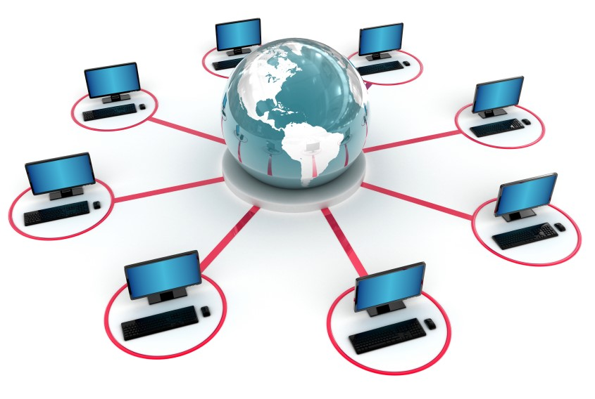

# TCP / IP 协议体系的认知

Table of Contents
-----------------

* [1. 概念扫盲](#1-概念扫盲)

## 1. 概念扫盲

  
 

- 网络：许多计算机连接在一起
- 互联网（`internet`）：许多网络连接在一起
- 因特网（`Internet`）:全球最大的一个互联网（基于 `TCP / IP` 协议栈）

 

## 2. 