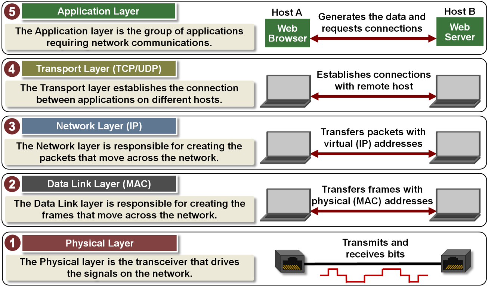
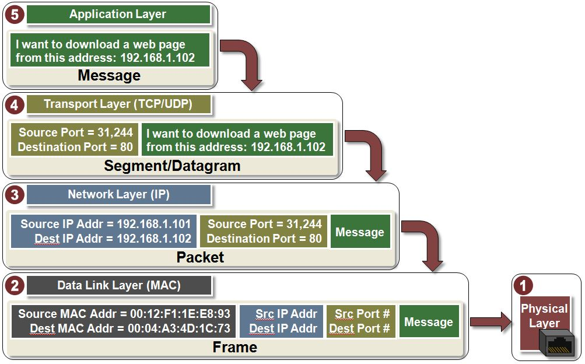

# TCP / IP 协议体系的认知

Table of Contents
-----------------

* [1. 什么是因特网？](#1-什么是因特网)
* [2. 网络边缘](#2-网络边缘)
   * [2.1 主机之间的通信方式](#21-主机之间的通信方式)
* [3. 网络核心](#3-网络核心)
   * [3.1 电路交换 Circuit Switching](#31-电路交换-circuit-switching)
   * [3.2 分组交换 Packet Switching](#32-分组交换-packet-switching)
* [4. 计算机网络性能](#4-计算机网络性能)
   * [4.1 速率](#41-速率)
   * [4.2 带宽](#42-带宽)
   * [4.3 吞吐量](#43-吞吐量)
   * [4.4 时延](#44-时延)
* [5. 体系结构](#5-体系结构)

## 1. 什么是因特网？

- 特定的计算机网络
- 一个世界范围内的计算机网络，互联了遍及全世界数十亿计算设备的网络

  
 

## 2. 网络边缘

通常把与因特网相连的计算机和其他设备称为端系统，因为他们位于因特网的边缘

### 2.1 主机之间的通信方式

- C / S
- P2P

  
 

## 3. 网络核心

由因特网端系统的分组交换机和链路构成的网状网络称作网络核心

有以下数据交换方式：

- 电路交换 `Circuit Switching`
- 报文交换 `Message Switching`
- 分组交换 `Packet Switching`

### 3.1 电路交换 Circuit Switching

维基说

> 电路交换（英语：Circuit Switching）是相对于报文交换（或称分组交换）的一个概念。电路交换要求必须首先在通信双方之间建立连接通道。在连接建立成功之后，双方的通信活动才能开始。通信双方需要传递的信息都是通过已经建立好的连接来进行传递的，而且这个连接也将一直被维持到双方的通信结束。在某次通信活动的整个过程中，这个连接将始终占用着连接建立开始时，通信系统分配给它的资源（通道、带宽、时隙、码字等等），这也体现了电路交换区别于报文交换的本质特征。

  
 

 

### 3.2 分组交换 Packet Switching

维基说

> 在计算机网络和通讯中，分组交换（英语：Packet switching）是一种相对于电路交换的通信范例，分组（又称消息、或消息碎片）在节点间单独路由，不需要在传输前先建立通信路径。
>
> 分组交换是数据通信中一种新的且重要的概念，现在是世界上互联网通讯、数据和语音通信中最重要的基础。在此之前，数据通信是基于电路交换的想法，就像在传统的电话电路一样，在通话前先建立专有线路，通信双方要在电路的两端。

**分组：**

当一台端系统要向另一台端系统发送数据时，发送端系统将数据分段，并为每段加上首部字节。这些分组通过网络发送到目的端系统，在那被装配成初始数据。

  
 

**优点：**

- 高效
- 灵活

**缺点：**

- 时延
- 开销

## 4. 计算机网络性能

### 4.1 速率

连接在计算机网络的主机在数字信道上传送数据位数的速率

### 4.2 带宽

数据通信领域中，数字信道所能传送的最高数据率

###  4.3 吞吐量

在单位时间内通过某个网络的数据量

### 4.4 时延

**发送时延（重点）**

维基说

> 假定分组以先到先服务的方式传输——这在分组交换网络中是常见的方式，仅当所有已经到达的分组被传输后，才能传输我们的分组。用L比特表示分组的长度，用R bps表示从路由器A到路由器B的链路传输速率。发送时延是L/R。这是将所有分组比特推向链路所需要的时间。实际的发送时延通常在毫秒到微秒级。

  
 

**传播时延（重点）**

维基说

> 一旦一个比特被推向链路，该比特需要向路由器B传播，从该链路的起点到路由器B的传播所需要的时间是传播时延。该比特以该链路的传播速率传播，该传播速率取决于该链路的物理媒介。传播时延等于两台路由器之间的距离除以传播速率，即传播时延是d/s，其中d是两台路由器之间的距离，s是该链路的传播速率。传播时延在毫秒级。

  
 

**处理时延**

维基说

> 检查分组首部和决定将该分组导向何处所需要的时间是节点处理时延的一部分。处理时延也包括其他因素，如检查比特级差错所需要的时间，该差错出现在这些分组比特从上游节点向路由器A传输的过程中。高速路由器的处理时延通常是微秒或更低的数量级。在这种节点处理之后，路由器将该分组引向通往路由器B链路之前的队列。

**排队时延**

维基说

> 在队列中，当分组在链路上等待传输时，它经受排队时延。一个特定分组的排队时延将取决于先期到达的、正在排队等待向链路传输的分组的数量。如果该队列是空的，并且当前没有其他分组在传输，则该分组的排队时延为0。另一方面，如果流量很大，并且许多其他分组也在等待传输，该排队时延将很大。到达组的分组数量是到达该队列的流量强度和性质的函数。实际的排队时延通常在毫秒到微秒级。

## 5. 体系结构

  
 

  

  
 

