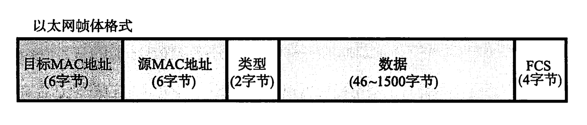

# 数据链路

Table of Contents
-----------------

* [1. 数据链路层的职责是什么?](#1-数据链路层的职责是什么)
* [2. MAC 地址是什么? 有什么用?](#2-mac-地址是什么-有什么用)
* [3. 什么是以太网?](#3-什么是以太网)
* [4. 以太网帧 (体) 的格式是什么?](#4-以太网帧-体-的格式是什么)
* [5. MTU 是什么?](#5-mtu-是什么)
* [参考资料](#参考资料)

## 1. 数据链路层的职责是什么?

数据链路层的协议定义了通过通信媒介（例如双绞线电缆, 同轴电缆, 光纤等介质）互连的设备之间传输的规范

## 2. MAC 地址是什么? 有什么用?

`MAC` 地址用于表示数据链路中互连的节点，是用来确认网络设备位置的地址

`MAC` 地址用于在网络中唯一标示一个网卡，一台设备若有一个 / 多个网卡，则每个网卡都需要并会有一个唯一的 `MAC` 地址

  
 

## 3. 什么是以太网? 

以太网（Ethernet）是一种计算机局域网技术

  
 

## 4. 以太网帧 (体) 的格式是什么?

  
 

- 目标 `MAC` 地址：目标工作站的物理地址
- 源 `MAC` 地址：构造以太网帧的发送端工作站的物理地址
- 类型：上一层的协议类型
- 数据
- `FCS`：检查帧是否有损坏

## 5. MTU 是什么?

最大传输单元（Maximum Transmission Unit）是指数据链路层上面所能通过的最大数据包大小（以字节为单位）

## 参考资料

- [What is Ethernet?](https://www.youtube.com/watch?v=HLziLmaYsO0)
- [7 things you need to know about the Ethernet (IEEE 802.3)](https://www.youtube.com/watch?v=FkH_J-IZbpU)
- [以太网-维基百科](https://zh.wikipedia.org/wiki/%E4%BB%A5%E5%A4%AA%E7%BD%91)
- [什么是MTU？为什么MTU值普遍都是1500？](https://developer.aliyun.com/article/222535)
