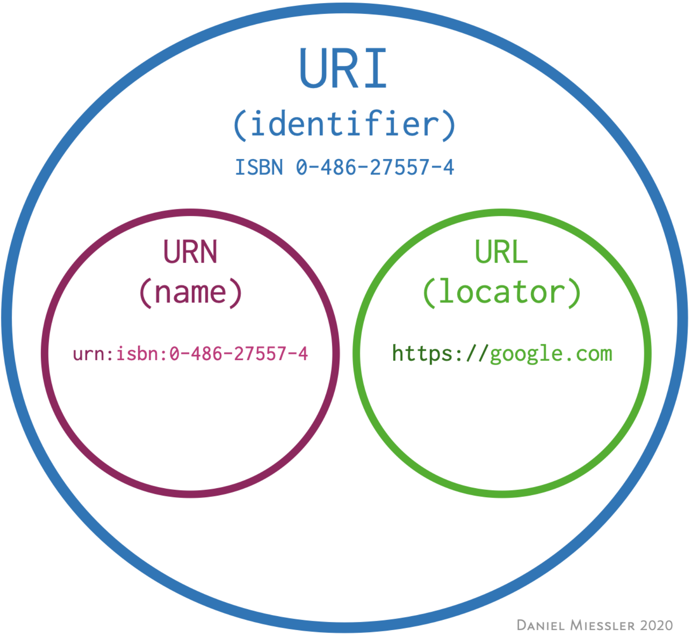

# HTTP 协议

Table of Contents
-----------------

* [1. 什么是 HTTP?](#1-什么是-http)
* [2. 什么是 URI 和 URL?](#2-什么是-uri-和-url)
* [3. URI 格式](#3-uri-格式)
* [4. 什么是 HTTP 报文?](#4-什么是-http-报文)
   * [4.1 Request Message](#41-request-message)
   * [4.2 Response Message](#42-response-message)
* [5. 如何理解 Stateless?](#5-如何理解-stateless)
* [6. HTTP 有哪些常见方法?](#6-http-有哪些常见方法)
   * [6.1 GET](#61-get)
   * [6.2 POST](#62-post)
   * [6.3 PUT](#63-put)
   * [6.4 DELETE](#64-delete)
* [7. 什么是状态码? HTTP 有哪些状态码?](#7-什么是状态码-http-有哪些状态码)
* [8. HTTP 首部（了解，供查阅）](#8-http-首部了解供查阅)
   * [8.1 通用首部字段](#81-通用首部字段)
   * [8.2 请求首部字段](#82-请求首部字段)
   * [8.3 响应首部字段](#83-响应首部字段)
   * [8.4 实体首部字段](#84-实体首部字段)
* [9. 经常挂在嘴边的代理究竟是什么?](#9-经常挂在嘴边的代理究竟是什么)
   * [9.1 什么是代理?](#91-什么是代理)
   * [9.2 为什么要使用代理?](#92-为什么要使用代理)
   * [9.3 如何代理?](#93-如何代理)
   * [9.4 什么是正向代理? 反向代理又是什么?](#94-什么是正向代理-反向代理又是什么)
* [参考资料](#参考资料)


## 1. 什么是 HTTP?


<div align="center">  </div><br>

当我们从浏览器网址栏输入一串网址时，呈现到我们面前的 Web 页面是如何实现的？


简单地来讲：

1. Web 浏览器（客户端）根据输入的 `URL` 找到特定的 Web 资源服务器（服务器端）
2. 服务器端收到请求后会返回特定的 Web 页面
3. 浏览器呈现页面


而 `HTTP` 协议指的是完成从客户端到服务器端一系列运作流程的规范


## 2. 什么是 URI 和 URL?

`HTTP` 请求的内容统称为资源，它可以是一份文档，一张图片，一段视频。那如何标识每一份资源呢？

用 `URI` （Uniform Resource Identifier，统一资源标识符）来标识


标识了资源，如何找到它？

`URI` 最常见的形式是 `URL`（Uniform Resource Locator，统一资源定位符），即 Web 地址，来找到资源在互联网所处的位置


<div align="center">  </div><br>


## 3. URI 格式

```http
http://www.example.com:80/path/to/myfile.html?key1=value1&key2=value2#SomewhereInTheDocument
```

- `http://`：方案或协议（对于大部分 Web 资源，通常使用 `http` / `https`）
- `www.example.com`：主机（它指示了需要向网络上哪一台主机发送请求）
- `:80`：端口（表示用于访问 Web 服务器上资源技术 “门”）
- `/path/to/myfile.html`：路径（Web 服务器上资源路径）
- `?key1=value1&key2=value2`：查询（Web 服务器额外参数）
- `#SomewhereInTheDocument`：片段（资源本身的某一部分的一个锚点 / 书签）


## 4. 什么是 HTTP 报文?

> HTTP messages are how data is exchanged between a server and a client. There are two types of messages: *requests* sent by the client to trigger an action on the server, and *responses*, the answer from the server

`HTTP Message` ，直接从字面理解，客户端及服务器端在 `HTTP` 协议下交换的消息称为 `HTTP` 报文


`HTTP Message` 又分为请求报文和响应报文


### 4.1 Request Message

<div align="center">  </div><br>


### 4.2 Response Message

<div align="center">  </div><br>

其中，`Message Header` 存储着客户端和服务器处理时至关重要的信息

而 `Message Body` 存储着用户 / 资源信息


## 5. 如何理解 Stateless?

`HTTP` 是一种无状态协议，即协议对于发送过的请求 / 响应都不做持久化处理


## 6. HTTP 有哪些常见方法?

### 6.1 GET

获取资源

### 6.2 POST

传输实体主体

### 6.3 PUT

上传文件

由于自身不带验证机制，因此存在安全性问题，一般不使用

### 6.4 DELETE

删除文件

与 `PUT` 功能相反，并且同样不带验证机制


## 7. 什么是状态码? HTTP 有哪些状态码?

状态码的作用是当客户端向服务器发送了请求，描述响应结果

有了它，我们可以知道服务器是否正确处理了请求


| 状态码 | 类别                             | 含义                       |
| ------ | -------------------------------- | -------------------------- |
| 1XX    | Informational（信息性状态码）    | 接收的请求正在处理         |
| 2XX    | Success（成功状态码）            | 请求正常处理完毕           |
| 3XX    | Redirection（重定向状态码）      | 需要进行附加操作以完成请求 |
| 4XX    | Client Error（客户端错误状态码） | 服务器无法处理请求         |
| 5XX    | Server Error（服务器错误状态码） | 服务器处理请求出错         |


## 8. HTTP 首部（了解，供查阅）

<div align="center">  </div><br>

### 8.1 通用首部字段

通用首部字段是指请求报文 / 响应报文双方都会使用的首部

<table>
<thead>
<tr>
<th align="center">首部字段名</th>
<th align="center">说明</th>
</tr>
</thead>
<tbody>
<tr>
<td align="center">Cache-Control</td>
<td align="center">控制缓存的行为</td>
</tr>
<tr>
<td align="center">Connection</td>
<td align="center">控制不再转发给代理的首部字段、管理持久连接</td>
</tr>
<tr>
<td align="center">Date</td>
<td align="center">创建报文的日期时间</td>
</tr>
<tr>
<td align="center">Pragma</td>
<td align="center">报文指令</td>
</tr>
<tr>
<td align="center">Trailer</td>
<td align="center">报文末端的首部一览</td>
</tr>
<tr>
<td align="center">Transfer-Encoding</td>
<td align="center">指定报文主体的传输编码方式</td>
</tr>
<tr>
<td align="center">Upgrade</td>
<td align="center">升级为其他协议</td>
</tr>
<tr>
<td align="center">Via</td>
<td align="center">代理服务器的相关信息</td>
</tr>
<tr>
<td align="center">Warning</td>
<td align="center">错误通知</td>
</tr>
</tbody>
</table>


### 8.2 请求首部字段
<table>
<thead>
<tr>
<th align="center">首部字段名</th>
<th align="center">说明</th>
</tr>
</thead>
<tbody>
<tr>
<td align="center">Accept</td>
<td align="center">用户代理可处理的媒体类型</td>
</tr>
<tr>
<td align="center">Accept-Charset</td>
<td align="center">优先的字符集</td>
</tr>
<tr>
<td align="center">Accept-Encoding</td>
<td align="center">优先的内容编码</td>
</tr>
<tr>
<td align="center">Accept-Language</td>
<td align="center">优先的语言（自然语言）</td>
</tr>
<tr>
<td align="center">Authorization</td>
<td align="center">Web 认证信息</td>
</tr>
<tr>
<td align="center">Expect</td>
<td align="center">期待服务器的特定行为</td>
</tr>
<tr>
<td align="center">From</td>
<td align="center">用户的电子邮箱地址</td>
</tr>
<tr>
<td align="center">Host</td>
<td align="center">请求资源所在服务器</td>
</tr>
<tr>
<td align="center">If-Match</td>
<td align="center">比较实体标记（ETag）</td>
</tr>
<tr>
<td align="center">If-Modified-Since</td>
<td align="center">比较资源的更新时间</td>
</tr>
<tr>
<td align="center">If-None-Match</td>
<td align="center">比较实体标记（与 If-Match 相反）</td>
</tr>
<tr>
<td align="center">If-Range</td>
<td align="center">资源未更新时发送实体 Byte 的范围请求</td>
</tr>
<tr>
<td align="center">If-Unmodified-Since</td>
<td align="center">比较资源的更新时间（与 If-Modified-Since 相反）</td>
</tr>
<tr>
<td align="center">Max-Forwards</td>
<td align="center">最大传输逐跳数</td>
</tr>
<tr>
<td align="center">Proxy-Authorization</td>
<td align="center">代理服务器要求客户端的认证信息</td>
</tr>
<tr>
<td align="center">Range</td>
<td align="center">实体的字节范围请求</td>
</tr>
<tr>
<td align="center">Referer</td>
<td align="center">对请求中 URI 的原始获取方</td>
</tr>
<tr>
<td align="center">TE</td>
<td align="center">传输编码的优先级</td>
</tr>
<tr>
<td align="center">User-Agent</td>
<td align="center">HTTP 客户端程序的信息</td>
</tr>
</tbody>
</table>


### 8.3 响应首部字段

<table>
<thead>
<tr>
<th align="center">首部字段名</th>
<th align="center">说明</th>
</tr>
</thead>
<tbody>
<tr>
<td align="center">Accept-Ranges</td>
<td align="center">是否接受字节范围请求</td>
</tr>
<tr>
<td align="center">Age</td>
<td align="center">推算资源创建经过时间</td>
</tr>
<tr>
<td align="center">ETag</td>
<td align="center">资源的匹配信息</td>
</tr>
<tr>
<td align="center">Location</td>
<td align="center">令客户端重定向至指定 URI</td>
</tr>
<tr>
<td align="center">Proxy-Authenticate</td>
<td align="center">代理服务器对客户端的认证信息</td>
</tr>
<tr>
<td align="center">Retry-After</td>
<td align="center">对再次发起请求的时机要求</td>
</tr>
<tr>
<td align="center">Server</td>
<td align="center">HTTP 服务器的安装信息</td>
</tr>
<tr>
<td align="center">Vary</td>
<td align="center">代理服务器缓存的管理信息</td>
</tr>
<tr>
<td align="center">WWW-Authenticate</td>
<td align="center">服务器对客户端的认证信息</td>
</tr>
</tbody>
</table>


### 8.4 实体首部字段

<table>
<thead>
<tr>
<th align="center">首部字段名</th>
<th align="center">说明</th>
</tr>
</thead>
<tbody>
<tr>
<td align="center">Allow</td>
<td align="center">资源可支持的 HTTP 方法</td>
</tr>
<tr>
<td align="center">Content-Encoding</td>
<td align="center">实体主体适用的编码方式</td>
</tr>
<tr>
<td align="center">Content-Language</td>
<td align="center">实体主体的自然语言</td>
</tr>
<tr>
<td align="center">Content-Length</td>
<td align="center">实体主体的大小</td>
</tr>
<tr>
<td align="center">Content-Location</td>
<td align="center">替代对应资源的 URI</td>
</tr>
<tr>
<td align="center">Content-MD5</td>
<td align="center">实体主体的报文摘要</td>
</tr>
<tr>
<td align="center">Content-Range</td>
<td align="center">实体主体的位置范围</td>
</tr>
<tr>
<td align="center">Content-Type</td>
<td align="center">实体主体的媒体类型</td>
</tr>
<tr>
<td align="center">Expires</td>
<td align="center">实体主体过期的日期时间</td>
</tr>
<tr>
<td align="center">Last-Modified</td>
<td align="center">资源的最后修改日期时间</td>
</tr>
</tbody>
</table>


## 9. 经常挂在嘴边的代理究竟是什么? 

### 9.1 什么是代理?

代理服务器作用是接受客户端发送的请求后转发给其他服务器

但不改变请求 `URI`，会直接发送给前方持有资源的目标服务器


### 9.2 为什么要使用代理?


### 9.3 如何代理?

基本分为两种方法：

- 是否使用缓存
- 是否会修改报文


### 9.4 什么是正向代理? 反向代理又是什么?


## 参考资料

- [HTTP Made Easy: Understanding the Web Client-Server Communication](https://hackernoon.com/http-made-easy-understanding-the-web-client-server-communication-yz783vg3)
- [What’s the Difference Between a URI and a URL?](https://danielmiessler.com/study/difference-between-uri-url/)
- [What is the difference between a URI, a URL and a URN?](https://stackoverflow.com/questions/176264/what-is-the-difference-between-a-uri-a-url-and-a-urn)
- [标识互联网上的内容](https://developer.mozilla.org/zh-CN/docs/Web/HTTP/Basics_of_HTTP/Identifying_resources_on_the_Web)
- [Why is it said that “HTTP is a stateless protocol”?](https://stackoverflow.com/questions/13200152/why-is-it-said-that-http-is-a-stateless-protocol)
- [HTTP Messages-MDN](https://developer.mozilla.org/en-US/docs/Web/HTTP/Messages#:~:text=HTTP%20messages%20are%20how%20data,and%20span%20over%20multiple%20lines)
- [HTTP Request Message](https://documentation.help/DogeTool-HTTP-Requests-vt/http_request.htm)
- [What is a Proxy Server?](https://www.youtube.com/watch?v=5cPIukqXe5w)
- [What is a Proxy?](https://www.youtube.com/watch?v=jGQTS1CxZTE)
