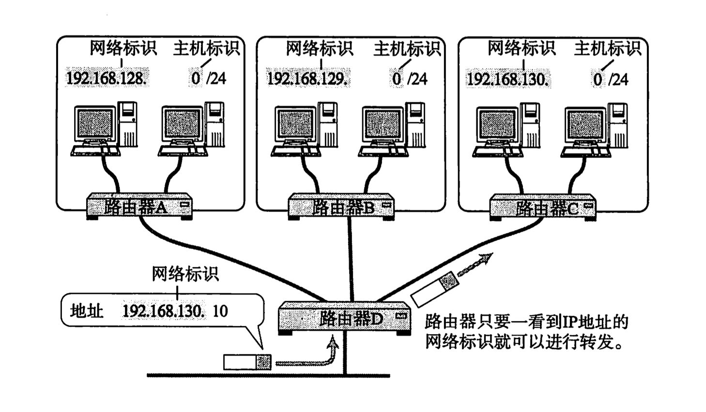
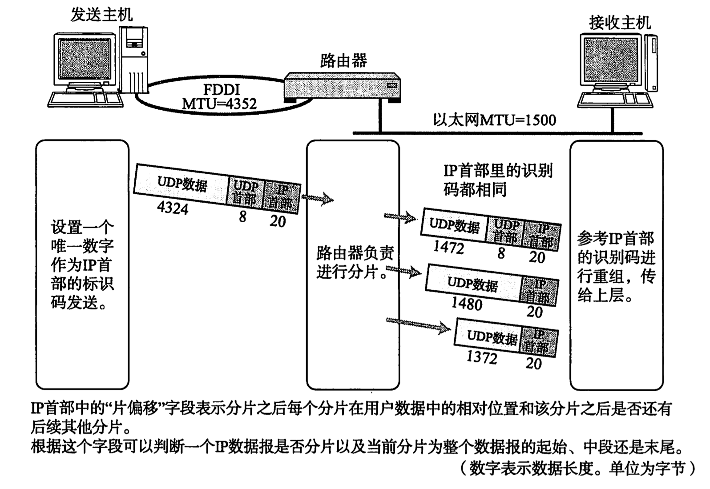

# IP 协议

Table of Contents
-----------------

* [1. 什么是 IP 协议?](#1-什么是-ip-协议)
* [2. 什么是 IP 地址?](#2-什么是-ip-地址)
* [3. 如何定义 IP 地址?](#3-如何定义-ip-地址)
* [4. IP 作用之寻址](#4-ip-作用之寻址)
* [5. IP 作用之分包 / 组包](#5-ip-作用之分包--组包)
* [6. 路径 MTU 发现是什么?](#6-路径-mtu-发现是什么)
* [7. IPv4 首部是怎样的?](#7-ipv4-首部是怎样的)

## 1. 什么是 IP 协议?

`IP` 协议是网络层的协议，主要负责将数据包发送给最终目标计算机，即 “端对端” 的传输

  
 

网络层的下一层是数据链路层，数据链路层只负责一种数据链路的节点之间进行包传递，而一旦跨越多种数据链路，就需要借助网络层了

举个例子，小明要去小王家（小明在广州，小王在上海），要经过地铁，飞机，磁悬浮列车三种交通工具。

网络层协议就相当于行程表，记录了线路换乘的详细信息

而数据链路层只负责当前区间的行程，例如：地铁 或 飞机 或 磁悬浮列车

  
 

## 2. 什么是 IP 地址?

  
 

`IP` 地址用于在连接到网络中的所有主机中识别出进行通信的目标地址（在数据链路层中，我们用 `MAC` 地址进行标识）

那为什么有了 `MAC` 地址来唯一标识网络设备的地址，还需要 `IP` 地址?

这部分稍后进行讨论

## 3. 如何定义 IP 地址?

  
 

`IP` 地址（`IPv4`）由 32 位正整数来表示。

**IP 地址 = 网络标识（网络地址） + 主机标识（主机地址）**

那什么是网络标识以及主机标识？

网络标识在数据链路中的每个段配置不同的值，而主机标识则不允许在同一个网段内重复出现

举个例子，网络标识就好比你的厂牌，主机标识就代表你在厂牌的称号 / 编号

  
 

那么，究竟前面几位是网络标识，而后面哪几位是主机标识？

我们以 **子网掩码** 区分

引入子网掩码的概念后，一个 `IP` 地址就有了两种识别码：

1. `IP` 地址本身
2. 表示网络部的子网掩码（子网掩码用二进制方式表示，也是 32 位的数字，对应的 `IP` 地址网络标识部分的位全部为 1，对应 `IP` 地址主机标识的部分全部为 0）

对于子网掩码，有两种表示方式，直接看例子

  
 

## 4. IP 作用之寻址

打个比喻，将数据链路比作高速公路，数据比作高速公路上的车，那么路由转发表 / 路由控制表就是高速路分叉口（表中已记录该往哪个口走）

  
 

路由控制表记录着网络地址与下一步应该发送至路由器的地址。在发送 `IP` 包时，首先确定 `IP` 包首部中的目标地址，再从表中找到与该地址具有相同网络地址的记录，根据该记录将 `IP` 包转发给相应的下一个路由器（若存在多个，则选择吻合位数最多的网络地址）

## 5. IP 作用之分包 / 组包

**为什么要分包？**

不同数据链路的 `MTU` 都不相同，然而从 `IP` 层（网络层）传过去的数据必须不受其影响。任何一台主机都有必要对 `IP` 分片

值得注意的是，路由器只负责分片，组包由目标主机进行

  
 

## 6. 路径 MTU 发现是什么?

## 7. IPv4 首部是怎样的?

通过 `IP` 进行通信时，需要在数据的前面加入 `IP` 首部信息。`IP` 首部包含着用于 `IP` 协议进行发包控制时所有的必要信息

  
 

- 版本： 标识 `IP` 首部的版本号

- 总长度：`IP` 首部 + 数据部分的总字节数

- 标识：用于分片重组（同一个分片标识值相同，但即使 `ID` 相同，如果目标地址 / 源地址 / 协议不同的话会被认为是不同的分片）

- 标志：分片相关

- 片偏移：用于分片重组

- 生存时间：用于指明可以中转多少个路由器的意思

- 协议：表示 `IP` 首部的下一个首部隶属于哪个协议

- 首部校验和：用于确保 `IP` 数据报不被损坏

- 源地址：发送端 `IP` 地址

- 目标地址：接收端 `IP` 地址

- 数据部分：存入数据（`IP` 上层协议的首部也作为数据进行处理）

