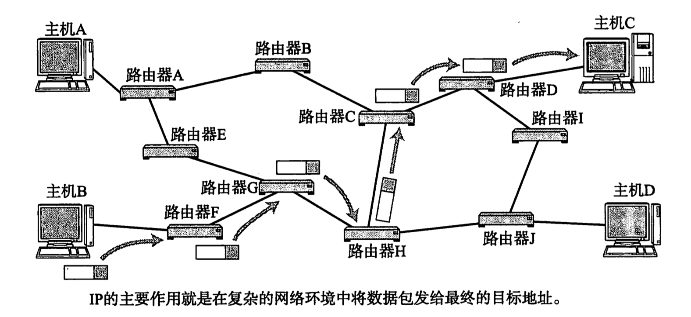
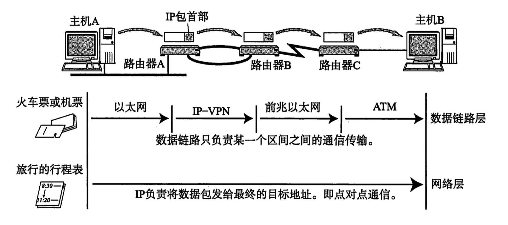

# IP 协议

Table of Contents
-----------------

* [1. 什么是 IP 协议?](#1-什么是-ip-协议)
* [3. 什么是 IP 地址?](#3-什么是-ip-地址)
* [4. IP 作用之一: 寻址](#4-ip-作用之一-寻址)
* [5. IP 作用之二: 路由](#5-ip-作用之二-路由)
* [6. IP 作用之三: 分包 / 组包](#6-ip-作用之三-分包--组包)

## 1. 什么是 IP 协议?

`IP` 协议是网络层的协议，主要负责将数据包发送给最终目标计算机，即 “端对端” 的传输

  
 

网络层的下一层是数据链路层，数据链路层只负责一种数据链路的节点之间进行包传递，而一旦跨越多种数据链路，就需要借助网络层了

举个例子，小明要去小王家（小明在广州，小王在上海），要经过地铁，飞机，磁悬浮列车三种交通工具。

网络层协议就相当于行程表，记录了线路换乘的详细信息

而数据链路层只负责当前区间的行程，例如：地铁 或 飞机 或 磁悬浮列车

  
 

## 3. 什么是 IP 地址?

## 4. IP 作用之一: 寻址

## 5. IP 作用之二: 路由

## 6. IP 作用之三: 分包 / 组包

