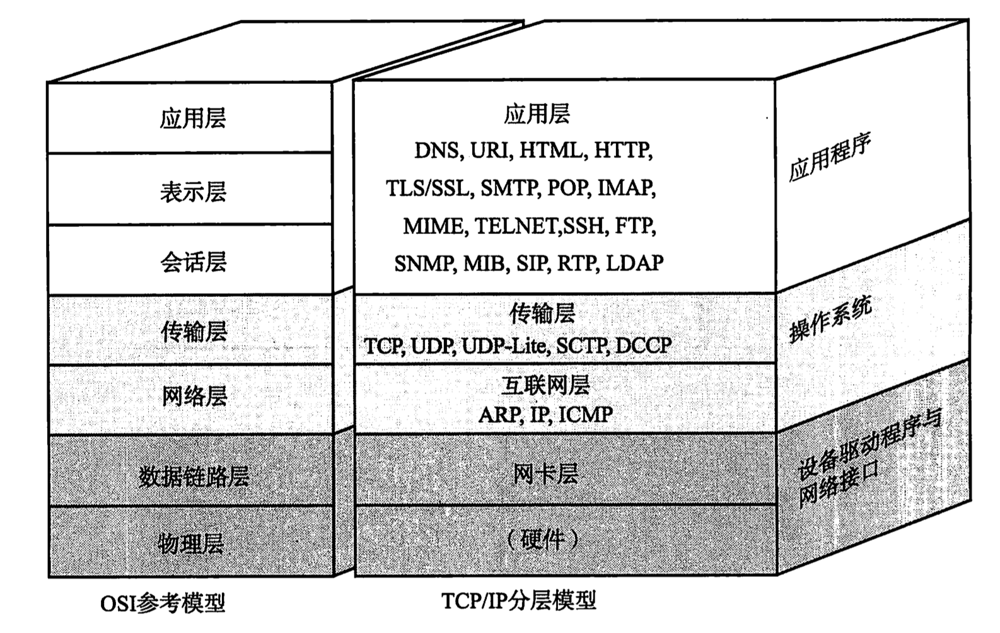
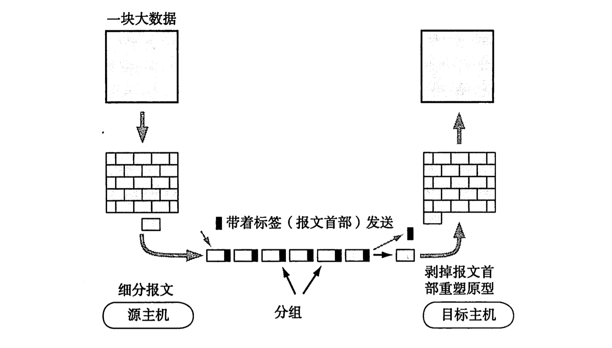
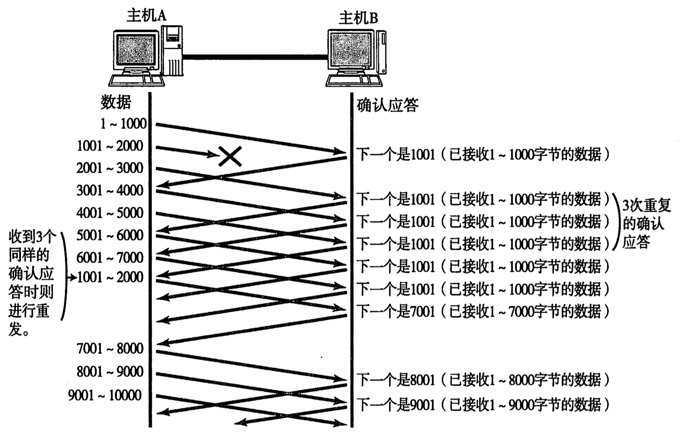
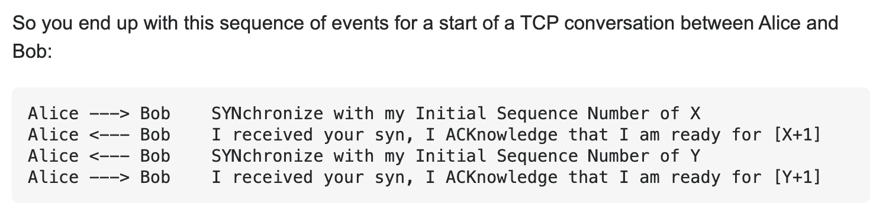
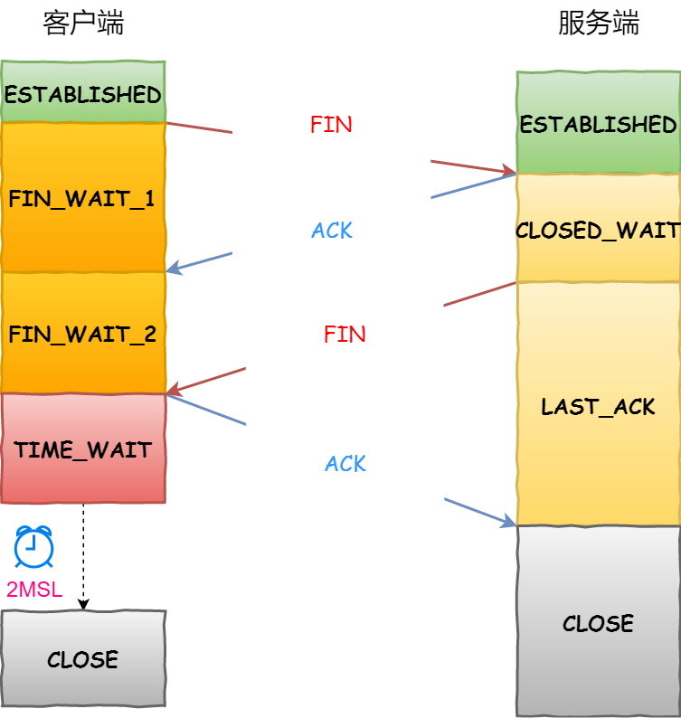
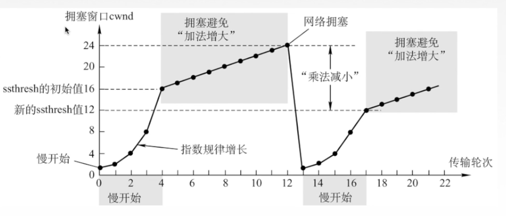
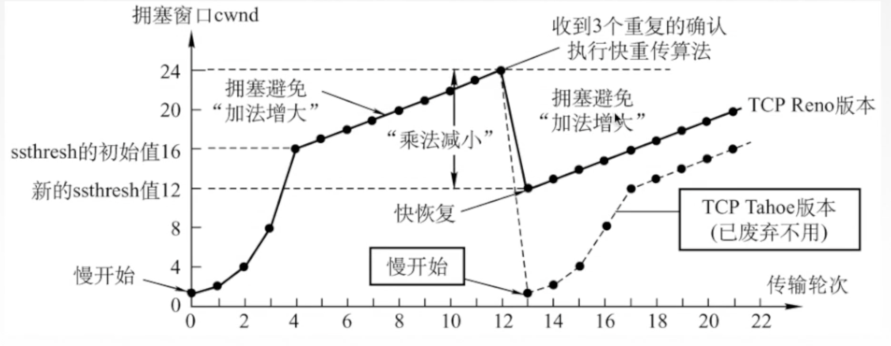
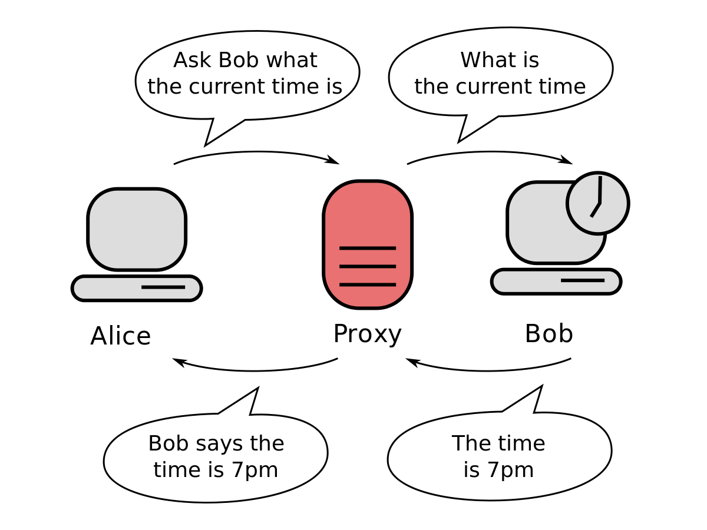
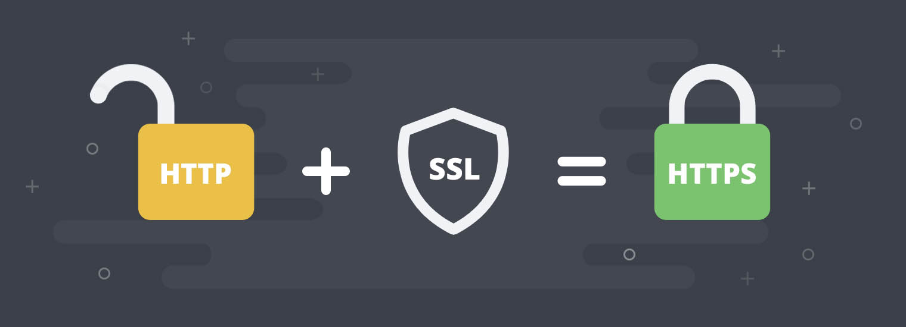

# 计算机网络

Table of Contents
-----------------

* [Brainstorming](#brainstorming)
* [1. Blueprint](#1-blueprint)
* [物理层](#物理层)
* [数据链路层](#数据链路层)
* [网络层](#网络层)
* [传输层](#传输层)
* [应用层](#应用层)
* [References](#references)


## Brainstorming

<div align="center">  </div><br>

## 1. Blueprint

### 1.1 TCP / IP 分层模型

<div align="center">  </div><br>


- **物理层**：将上层的比特流（01 二进制流）转换为电压的高低，灯光的闪灭等物理信号，将数据传输出去
- **数据链路层**：通过通信媒介（双绞线电缆，同轴电缆，光纤等）互联的设备之间传输的规范
- **网络层**：基于 `IP` 地址转发分包数据（`IP` 协议在此层）
- **传输层**：让应用程序之间实现通信（`TCP` 协议在此层）
- **应用层**：为应用进程提供服务


### 1.2 TCP / IP 是如何工作的?

<div align="center">  </div><br>


下面以邮件收发的例子来简单解释 `TCP / IP` 通信的过程


**第一步：应用程序处理**

新建邮件，将收件人邮箱填好，输入邮件内容：“早上好！”，鼠标点击 ”发送“ 按钮

应用在发送邮件那一刻建立 `TCP` 连接，从而利用这个 `TCP` 连接发送数据。它的过程首先是将应用的数据发送给下一层的 `TCP`，再做实际的转发处理


**第二步：TCP 模块处理**

`TCP` 根据应用的指示，负责建立连接，发送数据，断开连接


为了实现可靠传输的功能，需要在应用层传来的数据附加一个 `TCP` 首部，其中包括：

1. 源端口号和目标端口号（识别发送主机和接收主机上的应用）
2. 序号（判断发送的包哪部分是数据）
3. 校验和（判断数据是否被损坏）


最后将附加了 `TCP` 首部的包再发给 `IP`


**第三步：IP 模块处理**

`IP` 将 `TCP` 传过来的 `TCP` 首部和 `TCP` 数据结合起来当作自己的数据，并附上 `IP` 首部

其中，`IP` 首部包含着接收端 `IP` 地址以及发送端 `IP` 地址


`IP` 包生成后，参考路由控制表决定接受此 `IP` 包的路由 / 主机，将被发送给连接这些路由 / 主机的驱动程序，以实现真正发送数据


**第四步：网络接口处理**

给传过来的 `IP` 包加上以太网首部并进行发送处理，通过物理层传输给接收端

其中，以太网首部包括接收端 `MAC` 地址和发送端 `MAC` 地址


**第五步：网络接口处理（逆向）**

主机收到以太网包之后，首先从以太网的包首部找到 `MAC` 地址判断是否为发给自己的包。如果不是自己的包则丢弃数据

若恰好是发给自己的包，就查找以太网首部中的类型域从而确定以太网协议所传过来的数据类型，将数据传给相应类型的子程序处理（这里是 `IP` 协议）


**第六步：IP 模块处理（逆向）**

`IP` 模块收到 `IP` 包之后，判断包首部的 `IP` 地址是否与自己的 `IP` 地址匹配，并查找上一层协议

若上一层的协议是 `TCP`，则将 `IP` 包首部**之后**的部分传给 `TCP` 处理（若是上一层的协议是 `UDP`，则传给 `UDP` 处理 ） 


**第七步：TCP 模块处理（逆向）**

1. 计算校验和，判断数据是否损坏

2. 按照序号接受数据

3. 检查端口号，确定具体的应用程序


当数据被完整地接受后，会传给由端口号识别的应用程序


**第八步：应用程序处理（逆向）**

邮件保存到本机的硬盘上

“早上好！“


<div align="center">  </div><br>


<div align="center">  </div><br>


## 物理层

## 数据链路层

## 网络层

## 传输层

## 应用层


数据链路层的协议定义了通过通信媒介（例如双绞线电缆, 同轴电缆, 光纤等介质）互连的设备之间传输的规范

### 2.1 MAC 地址

1. 表示数据链路中互连的节点，是用来确认网络设备位置的地址

2. 在网络中唯一标示一个网卡（一台设备若有一个/多个网卡，则每个网卡都需要并会有一个唯一的 `MAC` 地址）


<div align="center">  </div><br>


### 2.2 以太网

以太网（Ethernet）是一种计算机局域网技术


<div align="center">  </div><br>

#### 2.2.1 以太网帧 (体) 的格式是什么?


<div align="center">  </div><br>

- 目标 `MAC` 地址：目标工作站的物理地址
- 源 `MAC` 地址：构造以太网帧的发送端工作站的物理地址
- 类型：上一层的协议类型
- 数据
- `FCS`：检查帧是否有损坏


### 2.3 MTU


最大传输单元（Maximum Transmission Unit）是指数据链路层上面所能通过的最大数据包大小（以字节为单位）

## 3. IP 协议

### 3.1 什么是 IP 协议?

`IP` 协议是网络层的协议，主要负责将数据包发送给最终目标计算机，即 “端对端” 的传输


网络层的下一层是数据链路层，数据链路层只负责一种数据链路的节点之间进行包传递，而一旦跨越多种数据链路，就需要借助网络层了


举个例子，小明要去小王家（小明在广州，小王在上海），要经过地铁，飞机，磁悬浮列车三种交通工具。

网络层协议就相当于行程表，记录了线路换乘的详细信息

而数据链路层只负责当前区间的行程，例如：地铁 或 飞机 或 磁悬浮列车


## 2. 什么是 IP 地址?


`IP` 地址用于在连接到网络中的所有主机中识别出进行通信的目标地址（在数据链路层中，我们用 `MAC` 地址进行标识）


那为什么有了 `MAC` 地址来唯一标识网络设备的地址，还需要 `IP` 地址?

这部分稍后进行讨论


## 3. 如何定义 IP 地址?


`IP` 地址（`IPv4`）由 32 位正整数来表示。


**IP 地址 = 网络标识（网络地址） + 主机标识（主机地址）**


那什么是网络标识以及主机标识？

网络标识在数据链路中的每个段配置不同的值，而主机标识则不允许在同一个网段内重复出现


举个例子，网络标识就好比你的厂牌，主机标识就代表你在厂牌的称号 / 编号


那么，究竟前面几位是网络标识，而后面哪几位是主机标识？

我们以 **子网掩码** 区分


引入子网掩码的概念后，一个 `IP` 地址就有了两种识别码：

1. `IP` 地址本身
2. 表示网络部的子网掩码（子网掩码用二进制方式表示，也是 32 位的数字，对应的 `IP` 地址网络标识部分的位全部为 1，对应 `IP` 地址主机标识的部分全部为 0）


对于子网掩码，有两种表示方式，直接看例子


## 4. IP 作用之寻址

打个比喻，将数据链路比作高速公路，数据比作高速公路上的车，那么路由转发表 / 路由控制表就是高速路分叉口（表中已记录该往哪个口走）


路由控制表记录着网络地址与下一步应该发送至路由器的地址。在发送 `IP` 包时，首先确定 `IP` 包首部中的目标地址，再从表中找到与该地址具有相同网络地址的记录，根据该记录将 `IP` 包转发给相应的下一个路由器（若存在多个，则选择吻合位数最多的网络地址）


## 5. IP 作用之分包 / 组包

**为什么要分包？**

不同数据链路的 `MTU` 都不相同，然而从 `IP` 层（网络层）传过去的数据必须不受其影响。任何一台主机都有必要对 `IP` 分片

值得注意的是，路由器只负责分片，组包由目标主机进行


## 6. 路径 MTU 发现是什么?


## 7. IPv4 首部是怎样的?

通过 `IP` 进行通信时，需要在数据的前面加入 `IP` 首部信息。`IP` 首部包含着用于 `IP` 协议进行发包控制时所有的必要信息


- 版本： 标识 `IP` 首部的版本号
- 总长度：`IP` 首部 + 数据部分的总字节数
- 标识：用于分片重组（同一个分片标识值相同，但即使 `ID` 相同，如果目标地址 / 源地址 / 协议不同的话会被认为是不同的分片）
- 标志：分片相关
- 片偏移：用于分片重组
- 生存时间：用于指明可以中转多少个路由器的意思
- 协议：表示 `IP` 首部的下一个首部隶属于哪个协议
- 首部校验和：用于确保 `IP` 数据报不被损坏
- 源地址：发送端 `IP` 地址
- 目标地址：接收端 `IP` 地址
- 数据部分：存入数据（`IP` 上层协议的首部也作为数据进行处理）


## 1. 什么是 DNS?

维基百科

> 域名系统（英语：Domain Name System，缩写：DNS）是互联网的一项服务。它作为将域名和IP地址相互映射的一个分布式数据库，能够使人更方便地访问互联网。DNS使用TCP和UDP端口53


举个例子，身份证号是每个人唯一的标识，但为了更好地日常沟通与交流，我们也有自己的名字

`DNS` 是一项服务，让我们可以直接通过主机名（名字）访问某个特定的网址（身份证号）


<div align="center">  </div><br>

## 2. DNS 是如何进行查询的?

<div align="center">  </div><br>

该图中，不仅可以访问同一域名中的域名服务器，还可以访问其他域的域名服务器


## 3. 什么是 ARP?

发送主机和目标主机有着各自的 `IP` 地址，但底层数据链路层中，实际通信需要知道每个 `IP` 地址对应的 `MAC` 地址，`ARP` 协议就是为解决此问题而生的

`ARP` 只适用于 `IPv4`


## 4. ARP 工作流程是怎样的?

<div align="center">  </div><br>


主机 A（发送主机）为了获得主机 B （目标主机）的 `MAC` 地址，要通过广播发送一个 `ARP` 请求包（该请求包会被这同一个链路上所有的主机和路由器进行解析）

如果 `ARP` 请求包中的目标 `IP` 地址与自己的 `IP` 地址一致，**那么这个节点就将自己的 MAC 地址塞入 ARP 相应包返回给主机 A**


根据 `ARP` 可以动态进行地址解析


## 5. 为什么 MAC 地址与 IP 地址缺一不可?

待补充


## 6. ARP 缓存原理是怎样的?

广播是一件较浪费网络流量的行为，因此，我们将获取到的 `MAC` 地址缓存一段时间，即把第一次通过 `ARP` 获取到的 `MAC` 地址作为 `IP` 对 `MAC` 的映射关系记忆到一个 `ARP` 缓存表中


## 7. 什么是 ICMP?

`ICMP` 的主要功能包括确认 `IP` 包是否成功送达目标地址，通知在发送过程当中 `IP` 包被废弃的具体原因，改善网络设置等


消息大致可以分两类：

1. 通知出错原因的错误消息
2. 用于诊断的查询消息


## 1. 什么是 UDP?

`UDP` 全称：User Datagram Protocol

`UDP` 不提供复杂的控制机制，利用 `IP` 提供面向无连接的通信服务。且它是将应用程序发来的数据在收到的那一刻，立即按照原样发送到网络上的一种机制（确保发送信息大小，但不确保信息一定到达）


## 2. 既然 UDP 面向无连接, 那有何应用场景?

1. 包总量较小的通信（`DNS`）
2. 即时通信（视频 / 音频）
3. 广播通信（广播, 多播）


## 3. 什么是 TCP?

`TCP` 全称：Transmission Control Protocol

`TCP` 功能十分强悍，充分实现了数据传输时各种控制功能

丢包怎么办？（数据传输过程丢失），`TCP` 有重发机制

分包次序错乱怎么办？`TCP` 可以进行顺序控制

除此之外，`TCP` 面向有连接，只有在确认通信对端存在时才会发送数据，从而可以控制通信流量的浪费


## 4. TCP 可靠传输机制（序号, 确认号, 重传）

- **序号**：指的是一个报文段第一个字节的序号
- **确认应答（ACK）**：当发送端的数据到达接收主机时，接收端主机会返回一个已收到消息的通知
- **重传**：`TCP` 的发送方在规定时间没有收到确认就要重传已发送的报文段（`TCP` 采用自适应算法，动态改变重传时间）

<div align="center">  </div><br>

- **快速重传**：

  每当比期望序号大的失序报文段到达时，发送一个**冗余 ACK**，指明下一个期待字节的序号

  举个例子：

  发送方已发送 1, 2, 3, 4, 5 报文段

  接收方收到 1，返回给 1 的确认（`ack` 为 2 的第一个字节）

  接收方收到 3，仍返回给 1 的确认（`ack` 为 2 的第一个字节）

  接收方收到 4，仍返回给 1 的确认（`ack` 为 2 的第一个字节）

  接收方收到 5，仍返回给 1 的确认（`ack` 为 2 的第一个字节）

  发送方收到 3 个对于报文段 1 的冗余 `ACK` 则表明：认为 2 报文段丢失，重传 2 号报文段（快速重传机制）


<div align="center">  </div><br>


## 5. TCP 首部

<div align="center">  </div><br>


- 序列号 （Sequence Number）：发送数据的位置，每发送一次数据，就累加一次该数据字节数的大小

  序列号不会从 0 或 1 开始，而是在建立连接时由计算机生成的随机数作为其初始值，通过 `SYN` 包传给接收端主机。

  **然后再将每转发过去的字节数累加到初始值上表示数据的位置**。此外，**在建立连接和断开连接时发送的 SYN 包和 FIN 包虽然不携带数据，但是也会作为一个字节增加对应的序列号**

- 确认应答号 （Acknowledgement Number）：**指下一次应该收到的数据的序列号**。实际上，它是指已收到确认应答号 - 1 为止的数据。发送端收到这个确认应答后可以认为在这个序号以前的数据都已经被正常接收

- 控制位：

  - ACK（Acknowledgement Flag）：该位为 1 时，确认应答的字段变为有效。**TCP 规定除了最初建立连接时的 SYN 包之外该位必须设置为 1**
  - SYN（Synchronize Flag）：用于建立连接。**SYN 为 1 时表示希望建立连接，并在其序列号的字段进行序列号初始值的设定**
  - FIN（Fin Flag）：该位为 1 时，**表示今后不会再有数据发送，希望断开连接**。当通信结束希望断开连接时，通信双方的主机之间就可以相互交换 `FIN` 位置为 1 的 `TCP` 段。每个主机又对对方的 `FIN` 包进行确认应答以后就可以断开连接（不过，主机收到 `FIN` 设置为 1 的 `TCP` 段以后不必马上回复一个 `FIN` 包，而是可以等到缓冲区中的所有数据都已成功发送而被自动删除之后再发）

  <div align="center">  </div><br>

- 窗口大小：用于通知从相同 `TCP` 首部的确认应答号所指位置开始能够接受的数据大小。**TCP 不允许发送超过此处所示大小的数据**


## 6. TCP 连接管理之三次握手（Three-way handshake）? 

`TCP` 是面向连接的协议，所以使用 `TCP` 前必须先建立连接，而建立连接时通过三次握手来进行的

- 最初，客户端和服务器都处于 `CLOSED` 状态，先是服务端主动监听某个端口，处于 `LISTEN` 状态

- **第一个报文：SYN 报文**

  客户端初始化随机序号 `x` ，将 `SYN` 置为 1，表示 “ 我想建立请求 ”

- **第二个报文： SYN + ACK 报文**

  服务器端收到报文后，初随机初始化自己的序号 `y`，将 `SYN` 置为 1，表示 “我也想和你建立请求”，将 `ACK` 置为 1，`ack` 为 `x` + 1 

- **第三个报文： ACK 报文**

  客户端收到服务器端报文后，将 `ACK` 置为 1，`ack` 为 `y` + 1，序号为 `x` + 1


值得注意：

1. 三次握手前两次不可以携带数据，最后一次可以 
2. 一旦完成三次握手，双方都处于 `ESTABLISHED`，表示可以进行通信

<div align="center">  </div><br> 


<div align="center">  </div><br> 


## 7. TCP 建立为什么是三次握手? 

暂略


## 8. 什么是四次挥手?

天下没有不散的宴席

当连接结束后，主机中的 “资源” （缓存和变量）将被释放

<div align="center">  </div><br> 

- 客户端打算关闭连接，发送 `FIN` 报文（`FIN` 的值为 1），进入 `FIN_WAIT_1` 状态
- 服务端接收到该报文后，向客户端发送 `ACK` 应答报文（`ACK` 为 1），接着服务端进入 `CLOSED_WAIT` 状态
- 客户端收到 `ACK` 报文后，进入 `FIN_WAIT_2` 状态
- 等待服务端处理完数据后，也向客户端发送 `FIN` 报文，之后进入 `LAST_ACK` 状态
- 客户端收到服务端的 `FIN` 报文后，回一个 `ACK` 报文，进入 `TIME_WAIT` 状态
- 服务器收到了 `ACK` 报文后，进入 `CLOSED` 状态，至此服务端已经完成连接的关闭
- 客户端经过 `2MSL` 一段时间后，自动进入 `CLOSED` 状态，至此客户端也完成连接的关闭


**每个方向都需要一个 FIN 和一个 ACK，因此通常被称为四次挥手**


## 9. 为什么是四次（挥手）?

<div align="center">  </div><br> 


- 关闭连接时，客户端向服务端发送 `FIN` 时，仅仅表示客户端不再发送数据了但还能接受数据
- 服务器收到客户端 `FIN` 报文时，先回一个 `ACK` 应答报文，而服务端可能还有数据需要处理和发送，等服务端不再发送数据时，才发送 `FIN` 报文给客户端来表示同意现在关闭连接


## 10. 什么是 TCP 流量控制?

`TCP` 以 1 个段为单位，每发一个段进行一次确认应答的处理，那这样传输有什么缺点？

包的往返时间越长通信性能越低（每次都要等）


为了解决这个问题，`TCP` 引入了窗口的概念：确认应答不再是以每个分段，而是以更大的单位进行确认


## 11. TCP 如何进行流量控制?

`TCP` 利用滑动窗口进行流量控制，窗口大小就是指无须等待确认应答而可以继续发送数据的最大值

<div align="center">  </div><br> 

<div align="center">  </div><br> 


## 12. 什么是 TCP 拥塞控制?

当网络中许多资源同时呈现供应不足时，`TCP` 提供了 4 种拥塞控制的算法：

- 慢开始和拥塞避免
- 快重传和快恢复

 


## 13. TCP 拥塞控制之慢开始 & 拥塞避免

<div align="center">  </div><br> 


## 14. TCP 拥塞控制之快重传 & 快恢复

<div align="center">  </div><br> 


## 15. 拥塞控制和流量控制有什么区别?

拥塞控制：全局性

流量控制：端对端


## 1. 什么是 UDP?

`UDP` 全称：User Datagram Protocol

`UDP` 不提供复杂的控制机制，利用 `IP` 提供面向无连接的通信服务。且它是将应用程序发来的数据在收到的那一刻，立即按照原样发送到网络上的一种机制（确保发送信息大小，但不确保信息一定到达）


## 2. 既然 UDP 面向无连接, 那有何应用场景?

1. 包总量较小的通信（`DNS`）
2. 即时通信（视频 / 音频）
3. 广播通信（广播, 多播）


## 3. 什么是 TCP?

`TCP` 全称：Transmission Control Protocol

`TCP` 功能十分强悍，充分实现了数据传输时各种控制功能

丢包怎么办？（数据传输过程丢失），`TCP` 有重发机制

分包次序错乱怎么办？`TCP` 可以进行顺序控制

除此之外，`TCP` 面向有连接，只有在确认通信对端存在时才会发送数据，从而可以控制通信流量的浪费


## 4. TCP 可靠传输机制（序号, 确认号, 重传）

- **序号**：指的是一个报文段第一个字节的序号
- **确认应答（ACK）**：当发送端的数据到达接收主机时，接收端主机会返回一个已收到消息的通知
- **重传**：`TCP` 的发送方在规定时间没有收到确认就要重传已发送的报文段（`TCP` 采用自适应算法，动态改变重传时间）

<div align="center">  </div><br>

- **快速重传**：

  每当比期望序号大的失序报文段到达时，发送一个**冗余 ACK**，指明下一个期待字节的序号

  举个例子：

  发送方已发送 1, 2, 3, 4, 5 报文段

  接收方收到 1，返回给 1 的确认（`ack` 为 2 的第一个字节）

  接收方收到 3，仍返回给 1 的确认（`ack` 为 2 的第一个字节）

  接收方收到 4，仍返回给 1 的确认（`ack` 为 2 的第一个字节）

  接收方收到 5，仍返回给 1 的确认（`ack` 为 2 的第一个字节）

  发送方收到 3 个对于报文段 1 的冗余 `ACK` 则表明：认为 2 报文段丢失，重传 2 号报文段（快速重传机制）


<div align="center">  </div><br>


## 5. TCP 首部

<div align="center">  </div><br>


- 序列号 （Sequence Number）：发送数据的位置，每发送一次数据，就累加一次该数据字节数的大小

  序列号不会从 0 或 1 开始，而是在建立连接时由计算机生成的随机数作为其初始值，通过 `SYN` 包传给接收端主机。

  **然后再将每转发过去的字节数累加到初始值上表示数据的位置**。此外，**在建立连接和断开连接时发送的 SYN 包和 FIN 包虽然不携带数据，但是也会作为一个字节增加对应的序列号**

- 确认应答号 （Acknowledgement Number）：**指下一次应该收到的数据的序列号**。实际上，它是指已收到确认应答号 - 1 为止的数据。发送端收到这个确认应答后可以认为在这个序号以前的数据都已经被正常接收

- 控制位：

  - ACK（Acknowledgement Flag）：该位为 1 时，确认应答的字段变为有效。**TCP 规定除了最初建立连接时的 SYN 包之外该位必须设置为 1**
  - SYN（Synchronize Flag）：用于建立连接。**SYN 为 1 时表示希望建立连接，并在其序列号的字段进行序列号初始值的设定**
  - FIN（Fin Flag）：该位为 1 时，**表示今后不会再有数据发送，希望断开连接**。当通信结束希望断开连接时，通信双方的主机之间就可以相互交换 `FIN` 位置为 1 的 `TCP` 段。每个主机又对对方的 `FIN` 包进行确认应答以后就可以断开连接（不过，主机收到 `FIN` 设置为 1 的 `TCP` 段以后不必马上回复一个 `FIN` 包，而是可以等到缓冲区中的所有数据都已成功发送而被自动删除之后再发）

  <div align="center">  </div><br>

- 窗口大小：用于通知从相同 `TCP` 首部的确认应答号所指位置开始能够接受的数据大小。**TCP 不允许发送超过此处所示大小的数据**


## 6. TCP 连接管理之三次握手（Three-way handshake）? 

`TCP` 是面向连接的协议，所以使用 `TCP` 前必须先建立连接，而建立连接时通过三次握手来进行的

- 最初，客户端和服务器都处于 `CLOSED` 状态，先是服务端主动监听某个端口，处于 `LISTEN` 状态

- **第一个报文：SYN 报文**

  客户端初始化随机序号 `x` ，将 `SYN` 置为 1，表示 “ 我想建立请求 ”

- **第二个报文： SYN + ACK 报文**

  服务器端收到报文后，初随机初始化自己的序号 `y`，将 `SYN` 置为 1，表示 “我也想和你建立请求”，将 `ACK` 置为 1，`ack` 为 `x` + 1 

- **第三个报文： ACK 报文**

  客户端收到服务器端报文后，将 `ACK` 置为 1，`ack` 为 `y` + 1，序号为 `x` + 1


值得注意：

1. 三次握手前两次不可以携带数据，最后一次可以 
2. 一旦完成三次握手，双方都处于 `ESTABLISHED`，表示可以进行通信

<div align="center">  </div><br> 


<div align="center">  </div><br> 


## 7. TCP 建立为什么是三次握手? 

暂略


## 8. 什么是四次挥手?

天下没有不散的宴席

当连接结束后，主机中的 “资源” （缓存和变量）将被释放

<div align="center">  </div><br> 

- 客户端打算关闭连接，发送 `FIN` 报文（`FIN` 的值为 1），进入 `FIN_WAIT_1` 状态
- 服务端接收到该报文后，向客户端发送 `ACK` 应答报文（`ACK` 为 1），接着服务端进入 `CLOSED_WAIT` 状态
- 客户端收到 `ACK` 报文后，进入 `FIN_WAIT_2` 状态
- 等待服务端处理完数据后，也向客户端发送 `FIN` 报文，之后进入 `LAST_ACK` 状态
- 客户端收到服务端的 `FIN` 报文后，回一个 `ACK` 报文，进入 `TIME_WAIT` 状态
- 服务器收到了 `ACK` 报文后，进入 `CLOSED` 状态，至此服务端已经完成连接的关闭
- 客户端经过 `2MSL` 一段时间后，自动进入 `CLOSED` 状态，至此客户端也完成连接的关闭


**每个方向都需要一个 FIN 和一个 ACK，因此通常被称为四次挥手**


## 9. 为什么是四次（挥手）?

<div align="center">  </div><br> 


- 关闭连接时，客户端向服务端发送 `FIN` 时，仅仅表示客户端不再发送数据了但还能接受数据
- 服务器收到客户端 `FIN` 报文时，先回一个 `ACK` 应答报文，而服务端可能还有数据需要处理和发送，等服务端不再发送数据时，才发送 `FIN` 报文给客户端来表示同意现在关闭连接


## 10. 什么是 TCP 流量控制?

`TCP` 以 1 个段为单位，每发一个段进行一次确认应答的处理，那这样传输有什么缺点？

包的往返时间越长通信性能越低（每次都要等）


为了解决这个问题，`TCP` 引入了窗口的概念：确认应答不再是以每个分段，而是以更大的单位进行确认


## 11. TCP 如何进行流量控制?

`TCP` 利用滑动窗口进行流量控制，窗口大小就是指无须等待确认应答而可以继续发送数据的最大值

<div align="center">  </div><br> 

<div align="center">  </div><br> 


## 12. 什么是 TCP 拥塞控制?

当网络中许多资源同时呈现供应不足时，`TCP` 提供了 4 种拥塞控制的算法：

- 慢开始和拥塞避免
- 快重传和快恢复

 


## 13. TCP 拥塞控制之慢开始 & 拥塞避免

<div align="center">  </div><br> 


## 14. TCP 拥塞控制之快重传 & 快恢复

<div align="center">  </div><br> 


## 15. 拥塞控制和流量控制有什么区别?

拥塞控制：全局性

流量控制：端对端

## 应用层

## 1. 什么是 HTTP?


<div align="center">  </div><br>

当我们从浏览器网址栏输入一串网址时，呈现到我们面前的 Web 页面是如何实现的？


简单地来讲：

1. Web 浏览器（客户端）根据输入的 `URL` 找到特定的 Web 资源服务器（服务器端）
2. 服务器端收到请求后会返回特定的 Web 页面
3. 浏览器呈现页面


而 `HTTP` 协议指的是完成从客户端到服务器端一系列运作流程的规范


## 2. 什么是 URI 和 URL?

`HTTP` 请求的内容统称为资源，它可以是一份文档，一张图片，一段视频。那如何标识每一份资源呢？

用 `URI` （Uniform Resource Identifier，统一资源标识符）来标识


标识了资源，如何找到它？

`URI` 最常见的形式是 `URL`（Uniform Resource Locator，统一资源定位符），即 Web 地址，来找到资源在互联网所处的位置


<div align="center">  </div><br>


## 3. URI 格式

```http
http://www.example.com:80/path/to/myfile.html?key1=value1&key2=value2#SomewhereInTheDocument
```

- `http://`：方案或协议（对于大部分 Web 资源，通常使用 `http` / `https`）
- `www.example.com`：主机（它指示了需要向网络上哪一台主机发送请求）
- `:80`：端口（表示用于访问 Web 服务器上资源技术 “门”）
- `/path/to/myfile.html`：路径（Web 服务器上资源路径）
- `?key1=value1&key2=value2`：查询（Web 服务器额外参数）
- `#SomewhereInTheDocument`：片段（资源本身的某一部分的一个锚点 / 书签）


## 4. 什么是 HTTP 报文?

> HTTP messages are how data is exchanged between a server and a client. There are two types of messages: *requests* sent by the client to trigger an action on the server, and *responses*, the answer from the server

`HTTP Message` ，直接从字面理解，客户端及服务器端在 `HTTP` 协议下交换的消息称为 `HTTP` 报文


`HTTP Message` 又分为请求报文和响应报文


### 4.1 Request Message

<div align="center">  </div><br>


### 4.2 Response Message

<div align="center">  </div><br>

其中，`Message Header` 存储着客户端和服务器处理时至关重要的信息

而 `Message Body` 存储着用户 / 资源信息


## 5. 如何理解 Stateless?

`HTTP` 是一种无状态协议，即协议对于发送过的请求 / 响应都不做持久化处理


## 6. HTTP 有哪些常见方法?

### 6.1 GET

获取资源

### 6.2 POST

传输实体主体

### 6.3 PUT

上传文件

由于自身不带验证机制，因此存在安全性问题，一般不使用

### 6.4 DELETE

删除文件

与 `PUT` 功能相反，并且同样不带验证机制


## 7. 什么是状态码? HTTP 有哪些状态码?

状态码的作用是当客户端向服务器发送了请求，描述响应结果

有了它，我们可以知道服务器是否正确处理了请求


| 状态码 | 类别                             | 含义                       |
| ------ | -------------------------------- | -------------------------- |
| 1XX    | Informational（信息性状态码）    | 接收的请求正在处理         |
| 2XX    | Success（成功状态码）            | 请求正常处理完毕           |
| 3XX    | Redirection（重定向状态码）      | 需要进行附加操作以完成请求 |
| 4XX    | Client Error（客户端错误状态码） | 服务器无法处理请求         |
| 5XX    | Server Error（服务器错误状态码） | 服务器处理请求出错         |


## 8. HTTP 首部（了解，供查阅）

<div align="center">  </div><br>

### 8.1 通用首部字段

通用首部字段是指请求报文 / 响应报文双方都会使用的首部

<table>
<thead>
<tr>
<th align="center">首部字段名</th>
<th align="center">说明</th>
</tr>
</thead>
<tbody>
<tr>
<td align="center">Cache-Control</td>
<td align="center">控制缓存的行为</td>
</tr>
<tr>
<td align="center">Connection</td>
<td align="center">控制不再转发给代理的首部字段、管理持久连接</td>
</tr>
<tr>
<td align="center">Date</td>
<td align="center">创建报文的日期时间</td>
</tr>
<tr>
<td align="center">Pragma</td>
<td align="center">报文指令</td>
</tr>
<tr>
<td align="center">Trailer</td>
<td align="center">报文末端的首部一览</td>
</tr>
<tr>
<td align="center">Transfer-Encoding</td>
<td align="center">指定报文主体的传输编码方式</td>
</tr>
<tr>
<td align="center">Upgrade</td>
<td align="center">升级为其他协议</td>
</tr>
<tr>
<td align="center">Via</td>
<td align="center">代理服务器的相关信息</td>
</tr>
<tr>
<td align="center">Warning</td>
<td align="center">错误通知</td>
</tr>
</tbody>
</table>


### 8.2 请求首部字段

<table>
<thead>
<tr>
<th align="center">首部字段名</th>
<th align="center">说明</th>
</tr>
</thead>
<tbody>
<tr>
<td align="center">Accept</td>
<td align="center">用户代理可处理的媒体类型</td>
</tr>
<tr>
<td align="center">Accept-Charset</td>
<td align="center">优先的字符集</td>
</tr>
<tr>
<td align="center">Accept-Encoding</td>
<td align="center">优先的内容编码</td>
</tr>
<tr>
<td align="center">Accept-Language</td>
<td align="center">优先的语言（自然语言）</td>
</tr>
<tr>
<td align="center">Authorization</td>
<td align="center">Web 认证信息</td>
</tr>
<tr>
<td align="center">Expect</td>
<td align="center">期待服务器的特定行为</td>
</tr>
<tr>
<td align="center">From</td>
<td align="center">用户的电子邮箱地址</td>
</tr>
<tr>
<td align="center">Host</td>
<td align="center">请求资源所在服务器</td>
</tr>
<tr>
<td align="center">If-Match</td>
<td align="center">比较实体标记（ETag）</td>
</tr>
<tr>
<td align="center">If-Modified-Since</td>
<td align="center">比较资源的更新时间</td>
</tr>
<tr>
<td align="center">If-None-Match</td>
<td align="center">比较实体标记（与 If-Match 相反）</td>
</tr>
<tr>
<td align="center">If-Range</td>
<td align="center">资源未更新时发送实体 Byte 的范围请求</td>
</tr>
<tr>
<td align="center">If-Unmodified-Since</td>
<td align="center">比较资源的更新时间（与 If-Modified-Since 相反）</td>
</tr>
<tr>
<td align="center">Max-Forwards</td>
<td align="center">最大传输逐跳数</td>
</tr>
<tr>
<td align="center">Proxy-Authorization</td>
<td align="center">代理服务器要求客户端的认证信息</td>
</tr>
<tr>
<td align="center">Range</td>
<td align="center">实体的字节范围请求</td>
</tr>
<tr>
<td align="center">Referer</td>
<td align="center">对请求中 URI 的原始获取方</td>
</tr>
<tr>
<td align="center">TE</td>
<td align="center">传输编码的优先级</td>
</tr>
<tr>
<td align="center">User-Agent</td>
<td align="center">HTTP 客户端程序的信息</td>
</tr>
</tbody>
</table>


### 8.3 响应首部字段

<table>
<thead>
<tr>
<th align="center">首部字段名</th>
<th align="center">说明</th>
</tr>
</thead>
<tbody>
<tr>
<td align="center">Accept-Ranges</td>
<td align="center">是否接受字节范围请求</td>
</tr>
<tr>
<td align="center">Age</td>
<td align="center">推算资源创建经过时间</td>
</tr>
<tr>
<td align="center">ETag</td>
<td align="center">资源的匹配信息</td>
</tr>
<tr>
<td align="center">Location</td>
<td align="center">令客户端重定向至指定 URI</td>
</tr>
<tr>
<td align="center">Proxy-Authenticate</td>
<td align="center">代理服务器对客户端的认证信息</td>
</tr>
<tr>
<td align="center">Retry-After</td>
<td align="center">对再次发起请求的时机要求</td>
</tr>
<tr>
<td align="center">Server</td>
<td align="center">HTTP 服务器的安装信息</td>
</tr>
<tr>
<td align="center">Vary</td>
<td align="center">代理服务器缓存的管理信息</td>
</tr>
<tr>
<td align="center">WWW-Authenticate</td>
<td align="center">服务器对客户端的认证信息</td>
</tr>
</tbody>
</table>


### 8.4 实体首部字段

<table>
<thead>
<tr>
<th align="center">首部字段名</th>
<th align="center">说明</th>
</tr>
</thead>
<tbody>
<tr>
<td align="center">Allow</td>
<td align="center">资源可支持的 HTTP 方法</td>
</tr>
<tr>
<td align="center">Content-Encoding</td>
<td align="center">实体主体适用的编码方式</td>
</tr>
<tr>
<td align="center">Content-Language</td>
<td align="center">实体主体的自然语言</td>
</tr>
<tr>
<td align="center">Content-Length</td>
<td align="center">实体主体的大小</td>
</tr>
<tr>
<td align="center">Content-Location</td>
<td align="center">替代对应资源的 URI</td>
</tr>
<tr>
<td align="center">Content-MD5</td>
<td align="center">实体主体的报文摘要</td>
</tr>
<tr>
<td align="center">Content-Range</td>
<td align="center">实体主体的位置范围</td>
</tr>
<tr>
<td align="center">Content-Type</td>
<td align="center">实体主体的媒体类型</td>
</tr>
<tr>
<td align="center">Expires</td>
<td align="center">实体主体过期的日期时间</td>
</tr>
<tr>
<td align="center">Last-Modified</td>
<td align="center">资源的最后修改日期时间</td>
</tr>
</tbody>
</table>


## 9. 经常挂在嘴边的代理究竟是什么? 

### 9.1 什么是代理? 

代理是什么？生活中的例子，当你做某件事的时候不亲自出马，而叫你的助理（或别人）代表你去完成，这就是代理


同样的，

代理服务器作用是接受客户端发送的请求后转发给其他服务器

但不改变请求 `URI`，会直接发送给前方持有资源的目标服务器


<div align="center">  </div><br>


### 9.2 为什么要使用代理?


### 9.3 如何代理?

基本分为两种方法：

- 是否使用缓存
- 是否会修改报文


### 9.4 什么是正向代理? 反向代理又是什么?


## 10. HTTP 的缺点

任何事物都有两面性，`HTTP` 的不足主要体现在以下几个方面：


**通信使用明文，可能会被窃听**

`HTTP` 的报文使用明文方式发送，那为什么通信时不加密呢？

按 `TCP/IP` 协议族的工作机制，通信内容在所有的通信线路上都有可能遭到窥视

互联网中，无论世界哪个角落的服务器和客户端在进行通信时，在此通信线路的某些网络设备 / 光缆 / 计算机都不可能为私有财产，所以不排除在某个环节遭到窥视


**不验证通信方的身份，可能遭遇伪装**

`HTTP` 协议通信时，由于不存在确认通信方的处理步骤，任何人都可以发起请求

<div align="center">  </div><br>


**无法验证报文的完整性，可能遭篡改**

没有办法确认发出的请求 / 响应和接收到的请求 / 响应是前后相同的

<div align="center">  </div><br>

## 11. 什么是 SSL / TLS?

在引入 `HTTPS` 之前，先介绍一下 `SSL / TLS`

`SSL / TLS` 的出现是为了解决 `HTTP` 三大风险而设计的，希望达到：

- 所有信息都是加密传播，第三方无法窃听
- 具有校验机制，一旦被篡改，通信双方会立刻发现
- 配备身份证书，防止身份被冒充


## 12. SSL / TLS 是如何运作的?

`SSL / TLS` 协议的基本思路是采用公钥加密法（公钥加密法具体内容暂不赘述，可以查阅文末参考资料）

基本过程是这样的：

1. 客户端向服务器端索要并验证公钥
2. 双方协商生成 “对话密钥”
3. 双方采用 “对话密钥” 进行加密通信

其中 1 2 步称作 “握手阶段”


<div align="center">  </div><br>


## 13. HTTPS 的出现

**HTTP + 加密 + 认证 + 完整性保护 = HTTPS**


<div align="center">  </div><br>


## References

- 计算机网络：自顶向下方法
- 上野宣. 图解 HTTP[M]. 人民邮电出版社, 2014.
- [趣谈网络协议](https://time.geekbang.org/column/intro/85)

