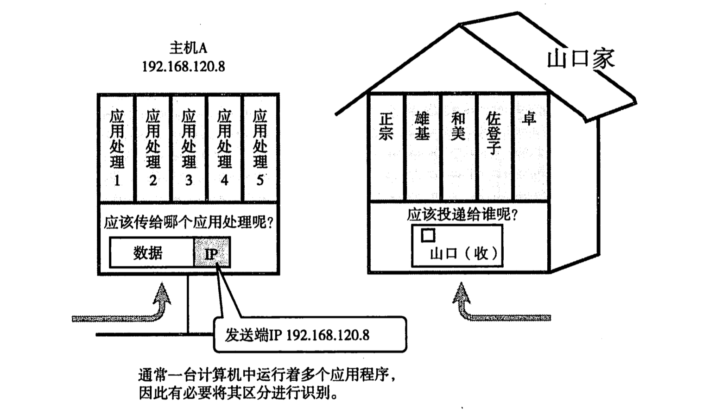
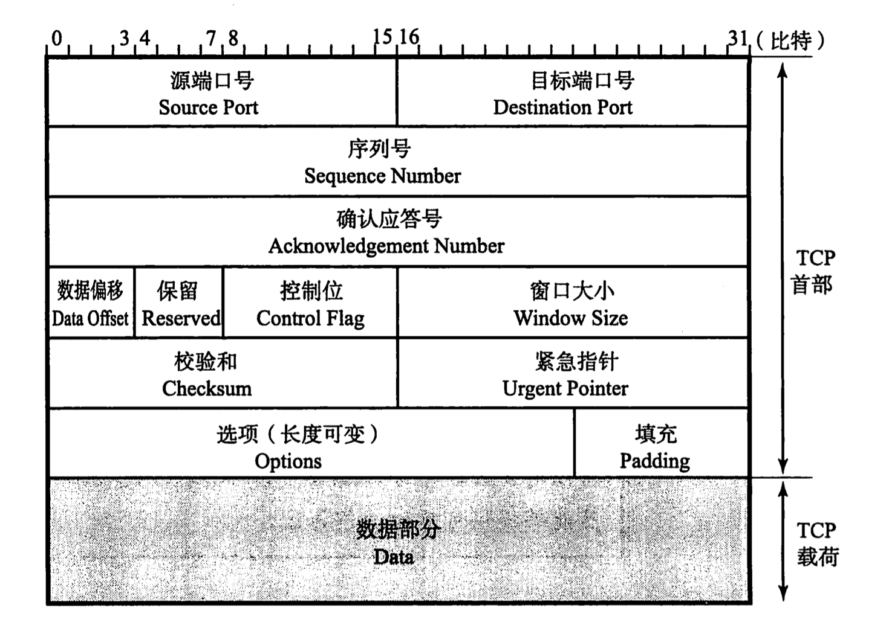

# TCP / UDP

Table of Contents
-----------------

* [前言](#前言)
* [1. 什么是 UDP?](#1-什么是-udp)
* [2. 既然 UDP 面向无连接, 那有何应用场景?](#2-既然-udp-面向无连接-那有何应用场景)
* [3. 什么是 TCP?](#3-什么是-tcp)
* [4. TCP 有何特点（来保证可靠传输）?](#4-tcp-有何特点来保证可靠传输)
* [5. TCP 首部](#5-tcp-首部)
* [6. TCP 连接管理之三次握手（Three way handshake）?](#6-tcp-连接管理之三次握手three-way-handshake)
* [7. TCP 连接管理之四次挥手?](#7-tcp-连接管理之四次挥手)
* [8. TCP 可靠传输](#8-tcp-可靠传输)
* [9. TCP 如何进行流量控制?](#9-tcp-如何进行流量控制)
* [10. TCP 如何进行拥塞控制?](#10-tcp-如何进行拥塞控制)
* [参考资料](#参考资料)

## 前言

**传输层的作用是让应用程序之间实现通信 / 为运行在不同主机上的进程之间提供了逻辑通信**

其中，有两个著名的协议：`TCP` 和 `UDP`

结合图，举个例子

以包裹为例，邮递员（`IP`）根据收件人地址（目标 `IP` 地址）向目的地（计算机）投递包裹（`IP` 数据报）。包裹达到目的地以后由对方（传输层协议）根据包裹信息判断最终的接受人（接收端应用程序）

  
 

## 1. 什么是 UDP?

`UDP` 全称：User Datagram Protocol

`UDP` 不提供复杂的控制机制，利用 `IP` 提供面向无连接的通信服务。且它是将应用程序发来的数据在收到的那一刻，立即按照原样发送到网络上的一种机制（确保发送信息大小，但不确保信息一定到达）

## 2. 既然 UDP 面向无连接, 那有何应用场景?

1. 包总量较小的通信（`DNS`）
2. 即时通信（视频 / 音频）
3. 广播通信（广播, 多播）

## 3. 什么是 TCP?

`TCP` 全称：Transmission Control Protocol

`TCP` 功能十分强悍，充分实现了数据传输时各种控制功能

丢包怎么办？（数据传输过程丢失），`TCP` 有重发机制

分包次序错乱怎么办？`TCP` 可以进行顺序控制

除此之外，`TCP` 面向有连接，只有在确认通信对端存在时才会发送数据，从而可以控制通信流量的浪费

## 4. TCP 有何特点（来保证可靠传输）?

`TCP` 有以下特点：

1. 面向连接（在通信之前先建立连接）
2. 点对点通信
3. 可靠有序，不丢包不重复
4. 全双工通信：
   1. 发送缓存：准备发送的数据 和 已发送但未收到确认的数据
   2. 接收缓存：按序到达但尚未被接收的应用程序读取的数据 和 不按序到达的数据
5. 面向字节流：将数据看成一连串无结构的字节流

## 5. TCP 首部

  
 

- 序列号 （Sequence Number）：发送数据的位置，每发送一次数据，就累加一次该数据字节数的大小

  序列号不会从 0 或 1 开始，而是在建立连接时由计算机生成的随机数作为其初始值，通过 `SYN` 包传给接收端主机。

  **然后再将每转发过去的字节数累加到初始值上表示数据的位置**。此外，**在建立连接和断开连接时发送的 SYN 包和 FIN 包虽然不携带数据，但是也会作为一个字节增加对应的序列号**

- 确认应答号 （Acknowledgement Number）：**指下一次应该收到的数据的序列号**。实际上，它是指已收到确认应答号 - 1 为止的数据。发送端收到这个确认应答后可以认为在这个序号以前的数据都已经被正常接收

- 控制位：

  - ACK（Acknowledgement Flag）：该位为 1 时，确认应答的字段变为有效。**TCP 规定除了最初建立连接时的 SYN 包之外该位必须设置为 1**
  - SYN（Synchronize Flag）：用于建立连接。**SYN 为 1 时表示希望建立连接，并在其序列号的字段进行序列号初始值的设定**
  - FIN（Fin Flag）：该位为 1 时，**表示今后不会再有数据发送，希望断开连接**。当通信结束希望断开连接时，通信双方的主机之间就可以相互交换 `FIN` 位置为 1 的 `TCP` 段。每个主机又对对方的 `FIN` 包进行确认应答以后就可以断开连接（不过，主机收到 `FIN` 设置为 1 的 `TCP` 段以后不必马上回复一个 `FIN` 包，而是可以等到缓冲区中的所有数据都已成功发送而被自动删除之后再发）
  
  
  
 
  
- 窗口大小：用于通知从相同 `TCP` 首部的确认应答号所指位置开始能够接受的数据大小。**TCP 不允许发送超过此处所示大小的数据**

## 6. TCP 连接管理之三次握手（Three-way handshake）? 

`TCP` 是面向连接的协议，所以使用 `TCP` 前必须先建立连接，而建立连接时通过三次握手来进行的

- 最初，客户端和服务器都处于 `CLOSED` 状态，先是服务端主动监听某个端口，处于 `LISTEN` 状态

- **第一个报文：**

  客户端初始化随机序号 `x` ，将 `SYN` 置为 1，表示 “ 我想建立请求 ”

- **第二个报文： SYN + ACK 报文**

  服务器端收到报文后，初随机初始化自己的序号 `y`，将 `SYN` 置为 1，表示 “我也想和你建立请求”，将 `ACK` 置为 1，`ack` 为 `x` + 1 

- **第三个报文： ACK 报文 **

  客户端收到服务器端报文后，将 `ACK` 置为 1，`ack` 为 `y` + 1，序号为 `x` + 1

值得注意：

1. 三次握手前两次不可以携带数据，最后一次可以 
2. 一旦完成三次握手，双方都处于 `ESTABLISHED`，表示可以进行通信

  
  

## 8. 为什么是三次握手? 而不是两次, 四次?

## 参考资料

- [Why do we need a 3-way handshake? Why not just 2-way?](https://networkengineering.stackexchange.com/questions/24068/why-do-we-need-a-3-way-handshake-why-not-just-2-way)
- [通俗大白话来理解TCP协议的三次握手和四次分手](https://github.com/jawil/blog/issues/14)
- [35 张图解：被问千百遍的 TCP 三次握手和四次挥手面试题](https://www.cnblogs.com/xiaolincoding/p/12638546.html)