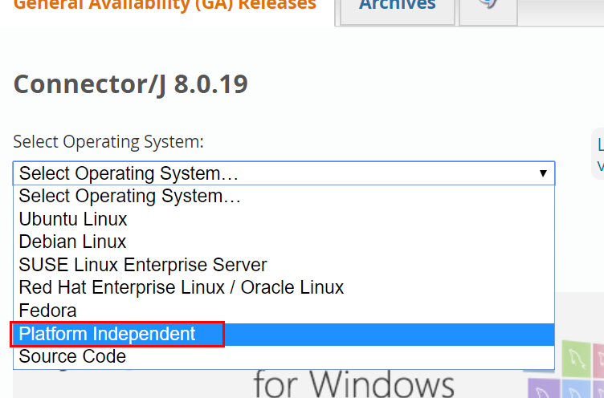
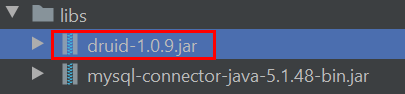
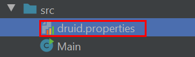
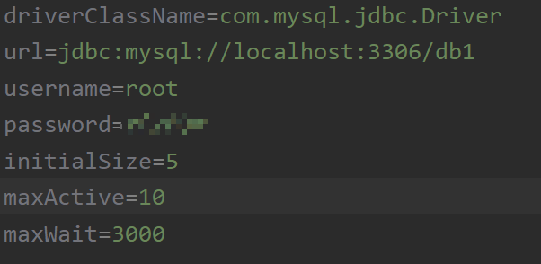

# 数据库连接池

## 什么是数据库连接池

## 为什么要用数据库连接池

## 常用数据库连接池：Druid

1. 下载依赖

   `MySQL` 相关驱动
   
  
 

   `Druid` 相关驱动
    
  
 

   最后记得 `Add as library`

2. 定义配置文件

  
 

​		放到`src`目录下

​		配置文件

  
 

3. 加载配置文件

4. 获取数据库连接池对象

5. 获取连接

  
 

说明：

1. `Properties` 对象

  
 

2. 文件 I / O 流

## Spring JDBC

### 什么是 Spring JDBC

### 为什么要用 Spring JDBC

### quickstart

