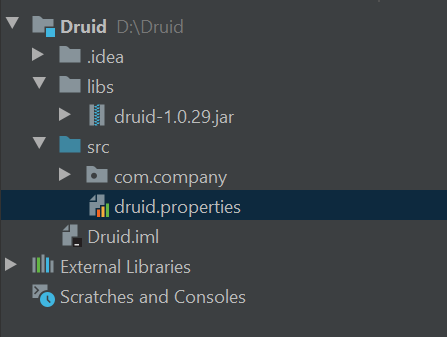
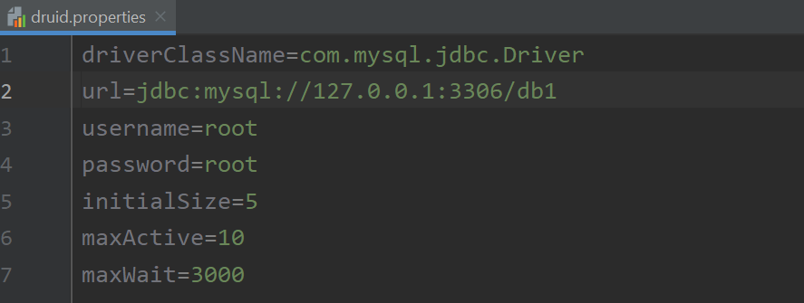
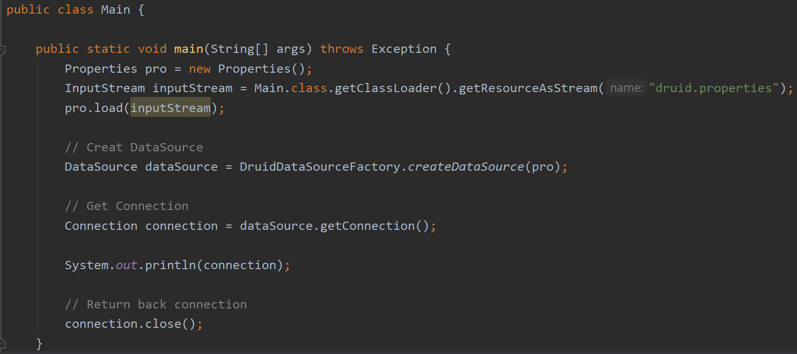

# Druid 数据库连接池

## Category

* [1. Cognition](#1-cognition)
  + [1.1 什么是数据库连接池 ?](#11------------)
  + [1.2 解决了什么问题 ?](#12----------)
* [2. Quickstart](#2-quickstart)

## 1. Cognition

### 1.1 什么是数据库连接池 ?

  
 

数据库连接池是类似与一个池子，里面装了一定数量的 `Connection` 连接对象（用于向操作系统底层打交道，获取连接）

在 Java 中，`DataSource` 就是图中的池子，是一个 `interface` ，由各个厂商进行实现。

  
 

这里我们详细了解 `alibaba` 出品的一个 `Druid` 连接池技术

https://github.com/alibaba/druid

### 1.2 解决了什么问题 ?

1. 提高数据库访问速度
2. 增强 `Connection` 对象的复用性

## 2. Quickstart

1. 导入 `jar` 包：`Druid`，`mysql` 

   如何找？找别人要吗？不！

   https://mvnrepository.com/

   上面可以搜索我们想要的依赖

   
  
 

找到合适的 `version` 下载即可

   
  
 

​		`MySQL` 驱动（官网）

 
  
 

2. 修改配置文件

  
 

  
 

3. 加载配置文件

   

4. 获取 `Druid` 连接池工厂

5. 获取连接

6. Succeeded!

  
 

**完整 Demo**

  
 

