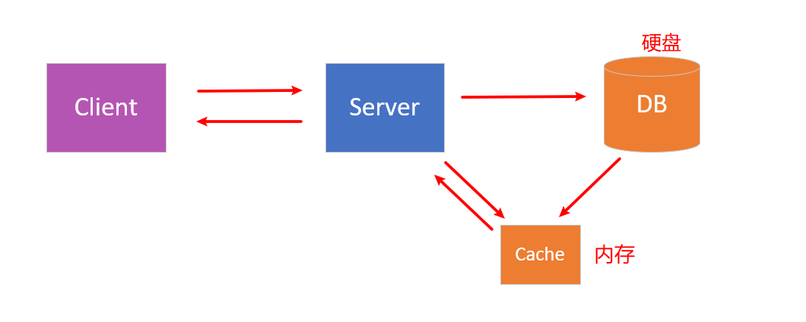
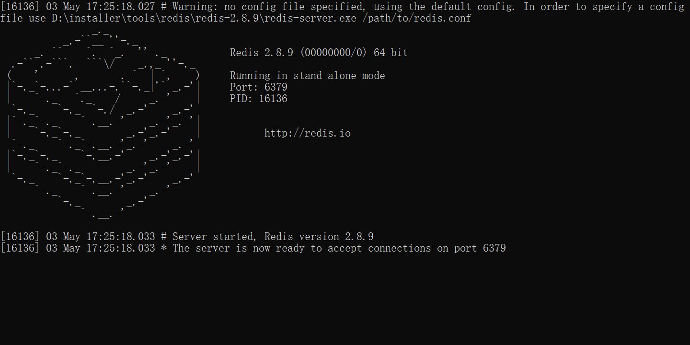

# Redis 

  
 

## Category

  * [What is Redis](#what-is-redis)
  * [Why we use Redis](#why-we-use-redis)
  * [Redis Quickstart](#redis-quickstart)

## 1. What is Redis

`Redis` 是一种基于 `key-value` 的 `NoSQL` 数据库

> Q：
>
> 关系型数据库与非关系型数据库之间有什么关系？
>
> A：
>
> 区别：
>
> 1. 关系型数据库：数据之间有关系；非关系型数据库：数据与数据之间没有关系
> 2. 关系型数据库：数据存储在硬盘的文件上；非关系型数据库：数据存储在内存中
>
> 关联：
>
> 两者相辅相成

## 2. Why we use Redis

1. 速度快

   `Redis` 所有数据都是放在内存中的（避免了大量与操作系统 IO 打交道）

2. 基于 `key-value` 的数据结构服务器

3. 丰富的功能：

   1. 键过期：实现缓存
   2. 发布订阅：消息系统

4. 持久化

   将数据保存在内存中是不安全的，当发生断电或者宕机，数据极有可能丢失

   `Redis` 提供了 `RDB` 和 `AOF` 两种持久化方式，将内存的数据保存在硬盘中

5. 高可用和分布式

### Redis 使用场景

1. 缓存

   对于一些经常用却不怎么发生改变的数据，使用缓存机制可以极大加快对数据的访问速度且降低后端数据源的压力

   对于客户端发来的数据，先找缓存：

   有：直接读取

   没有：向数据库查询，读取并存到缓存中

2. 排行榜系统

3. 计数器应用

4. 社交网络

5. 消息队列

  
 

## 3. Redis Quickstart

### 3.1 安装

:warning:注意

官网不提供 `Windows` 版本

  
 

当前使用版本：`Redis 2.8.9`

### 3.2 Preparation

