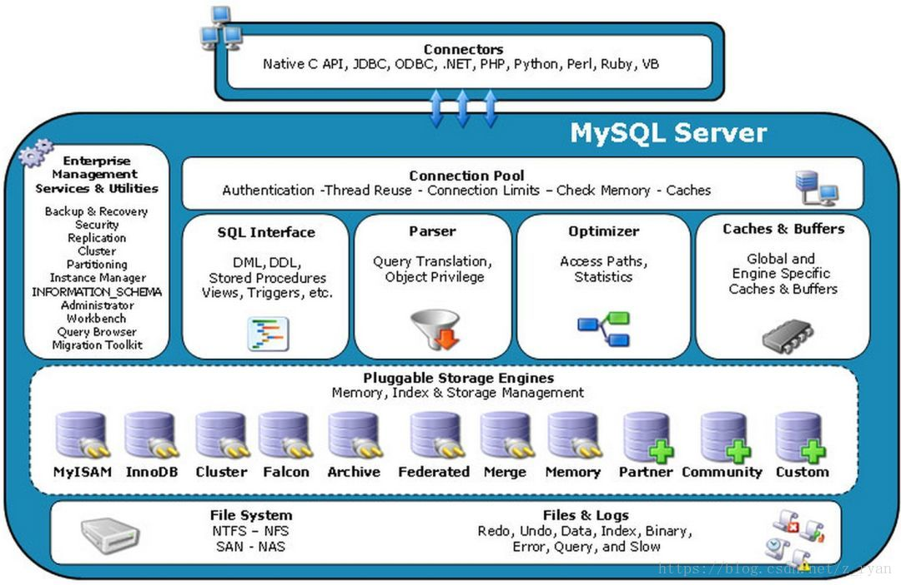
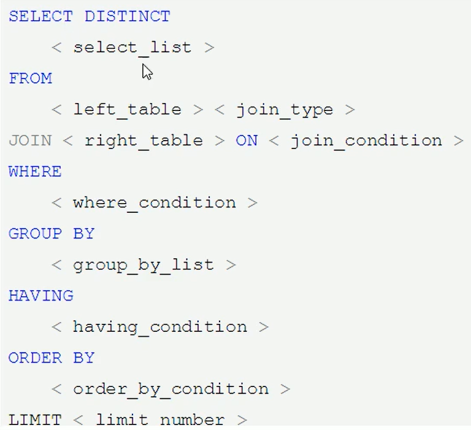
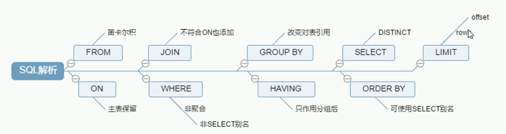
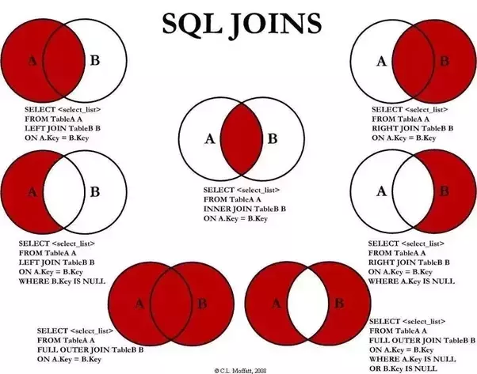
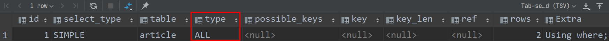

# Mysql 进阶

## 目录

* [1. Mysql 架构介绍](#1-mysql-----)
  + [1.1 SQL 执行顺序](#11-sql-----)
    - [1.1.1 手写](#111---)
    - [1.1.2 机读](#112---)
  + [1.2 JOIN 连接](#12-join---)
* [2. 索引优化分析](#2-------)
  + [2.1 建立索引](#21-----)
    - [2.1.1 什么是索引？](#211-------)
    - [2.1.2 为什么要建立索引？](#212----------)
  + [2.2 索引分类](#22-----)
  + [2.3 索引结构](#23-----)
  + [2.4 Quickstart](#24-quickstart)
    - [2.4.1 单表](#241---)
    - [2.4.2 两表](#242---)
    - [2.4.3 三表](#243---)


## 1. Mysql 架构介绍

**插件式的存储引擎架构将查询处理和其他系统任务以及数据的存储提取相分离**

- 连接层
- 服务层
- 引擎层
- 数据存储层

<div align="center">  </div><br>

```sql
show engines;
```

<div align="center">  </div><br>

<div align="center">  </div><br>


### 1.1 SQL 执行顺序

#### 1.1.1 手写

<div align="center">  </div><br>


#### 1.1.2 机读

`mysql` 最关心的是表以及字段 

<div align="center">  </div><br>

### 1.2 JOIN 连接

放一张神图（强烈建议手写一遍）

<div align="center">  </div><br>


## 2. 索引优化分析

### 2.1 建立索引

#### 2.1.1 什么是索引？

**索引是帮助 MySQL 获取数据的数据结构**

#### 2.1.2 为什么要建立索引？

- 查找
- 排序

好比你去图书馆，若书籍没有书签条（索引），那请问你如何找书？全表扫描？

### 2.2 索引分类

- 单值索引：一个索引只包含单个列，一个表可以有多个单列索引
- 唯一索引：索引列的值必须唯一，但允许有空值
- 复合索引：一个索引包含多个列

### 2.3 索引结构

B Tree

### 2.4 Quickstart

#### 2.4.1 单表

`article` 表

```sql
create table if not exists article
(
    id          int(10) primary key auto_increment,
    author_id   int(10)        not null,
    category_id int(10)        not null,
    views       int(10)        not null,
    comments    int(10)        not null,
    title       varbinary(255) not null,
    content     text           not null
);
```

<div align="center">  </div><br>

**需求分析**

查询 `category_id` 为 1 且 `comments` 大于 1 的情况下，`views` 最多的 `id`

```sql
select id, author_id
from article
where category_id = 1
  and comments > 1
order by views desc
limit 1
```

通过 `explain` 分析，该语句执行了全表扫描

<div align="center">  </div><br>

**优化 SQL**

索引两大特性：

- 查找（`WHERE`）
- 排序（`ORDER BY`）

所以，我们需要建立对于 `category_id`，`comments`，`views` 的索引


#### 2.4.2 两表

#### 2.4.3 三表


