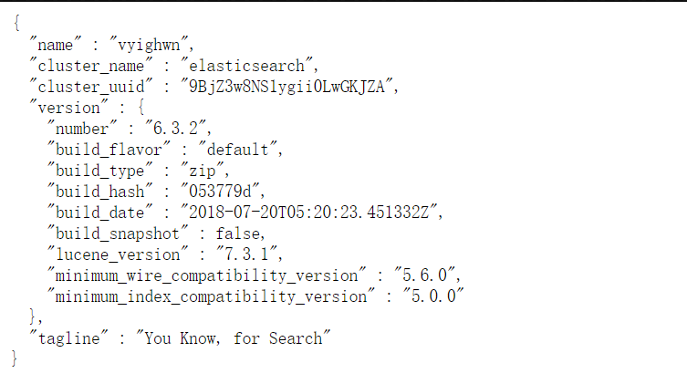
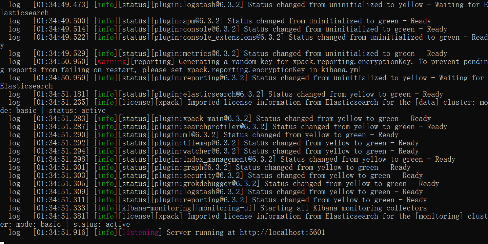
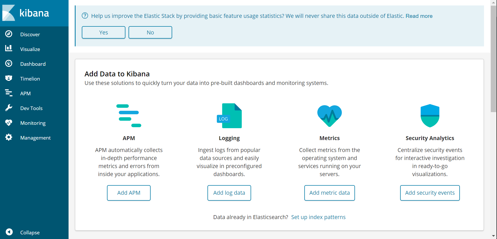
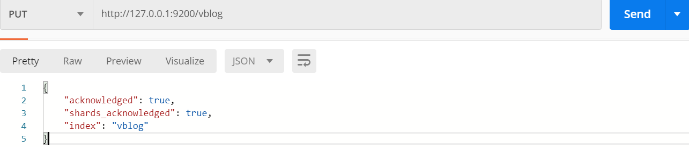

# Elasticsearch 

## 目录

* [1. 什么是 elasticsearch?](#1-----elasticsearch-)
* [2. 适用场景](#2-----)
* [3. Elasticsearch 与 MySQL 对比](#3-elasticsearch---mysql---)
* [4. Quickstart](#4-quickstart)
  + [4.1 Installation](#41-installation)
  + [4.2  使用 postman 与 es 交互](#42-----postman---es---)
  + [4.3 使用 Kibana 与 es 交互](#43----kibana---es---)


## 1. 什么是 elasticsearch?

一个开源的高扩展的分布式全文检索引擎


## 2. 适用场景

- 分布式
- 全文检索
- 实时快速
- RESTful API

## 3. Elasticsearch 与 MySQL 对比

<div align="center">  </div><br>

## 4. Quickstart

**参考指南**

[Getting started with Elasticsearch](https://www.elastic.co/guide/en/elasticsearch/reference/current/getting-started.html)

### 4.1 Installation

官网下载（演示版本为 6.3.2）

**安装 Elasticsearch**

<div align="center">  </div><br>

进入 `bin`，以管理员命令启动 `elasticsearch.bat`

<div align="center">  </div><br>

```bash
localhost:9200
```
<div align="center">  </div><br>

:heavy_check_mark: 安装成功

**安装  Kibana**

<div align="center">  </div><br>

```bash
localhost:5601
```
<div align="center">  </div><br>

:heavy_check_mark: 安装成功！

### 4.2  使用 postman 与 es 交互

创建一个名为 `vblog` 的索引（相当于关系型数据库中的数据库）

<div align="center">  </div><br>

**:warning:填坑指南**

在 `postman` 发送 `put` 请求中，因为原来的 `body` 有内容，导致一直无法创建 `index`


### 4.3 使用 Kibana 与 es 交互

使用 `dev tools`

<div align="center">  </div><br>

```bash
PUT /user/_doc/1
{
  "name":"masiwei"
}
```

返回结果如下

```json
{
  "_index": "user",
  "_type": "_doc",
  "_id": "1",
  "_version": 1,
  "result": "created",
  "_shards": {
    "total": 2,
    "successful": 1,
    "failed": 0
  },
  "_seq_no": 0,
  "_primary_term": 1
}
```

这次请求在 `es` 中的 `user` 索引创建了一个 `id` 为 1 的 `document`，里面存储了 `name` 的 `field`

获取 `user` 中 `id` 为 1 的数据

```bash
GET /user/_doc/1
```

返回结果如下

```json
{
  "_index": "user",
  "_type": "_doc",
  "_id": "1",
  "_version": 1,
  "found": true,
  "_source": {
    "name": "masiwei"
  }
}
```

简单查询

```bash
POST /user/_search
{
  "query": {
    "bool": {
      "should": [
        {
          "match": {
            "name": "masiwei"
          }
        }
      ]
    }
  }
}
```

返回结果如下

```json
{
  "took": 17,
  "timed_out": false,
  "_shards": {
    "total": 5,
    "successful": 5,
    "skipped": 0,
    "failed": 0
  },
  "hits": {
    "total": 1,
    "max_score": 0.2876821,
    "hits": [
      {
        "_index": "user",
        "_type": "_doc",
        "_id": "1",
        "_score": 0.2876821,
        "_source": {
          "name": "masiwei"
        }
      }
    ]
  }
}
```


