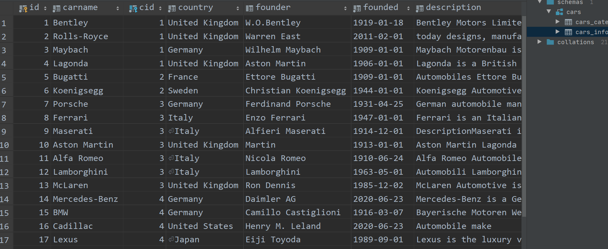

# MyBatis-plus Quickstart

<div align="center">  </div><br>

## Category

* [0. Reference](#0-reference)
* [1. Quickstart](#1-quickstart)
  + [1.1 dependencies](#11-dependencies)
  + [1.2 table](#12-table)
  + [1.3 entity](#13-entity)
  + [1.4 mapper](#14-mapper)
  + [1.5 configuration](#15-configuration)
  + [1.6 test](#16-test)

  


## 0. Reference

[MyBatis-Plus documentation](https://mp.baomidou.com/en/)


## 1. Quickstart

### 1.1 dependencies

```xml
<dependency>
    <groupId>com.baomidou</groupId>
    <artifactId>mybatis-plus-boot-starter</artifactId>
    <version>3.2.0</version>
</dependency>
```

### 1.2 table

<div align="center">  </div><br>

### 1.3 entity

`@TableName` 要在加在实体类中，因为实体类才是与我们表（属性）一一对应的

**Car.java**

```java
@Data
@TableName(value = "cars_info")
public class Car {
    private Integer id;
    private String carname;
    private Integer cid;
    private String country;
    private String founder;
    private Date founded;
    private String description;
    private String website;
}
```


### 1.4 mapper

**CarMapper.java**

这里 `@Repository` 可省略，这里显示声明

```java
@Repository
public interface CarMapper extends BaseMapper<Car> {
}
```


### 1.5 configuration

**MyBatisPlusApplication.java**

```java
@SpringBootApplication
@MapperScan("com.ceezyyy.mybatisplus.mapper")
public class MybatisPlusApplication {

    public static void main(String[] args) {
        SpringApplication.run(MybatisPlusApplication.class, args);
    }

}
```


**application.yml**

```yml
server:
  port: 9090

spring:
  datasource:
    driver-class-name: com.mysql.cj.jdbc.Driver
    url: jdbc:mysql://localhost:3306/cars?serverTimezone=GMT
    username: root
    password: root
```


### 1.6 test

**CarMapperTest.java**

```java
@SpringBootTest
class CarMapperTest {

    @Autowired
    private CarMapper carMapper;

    @Test
    void getAll() {
        List<Car> cars = carMapper.selectList(null);
        for (Car car : cars) {
            System.out.println(car);
        }
    }

}
```


:hammer: Build

:heavy_check_mark: Succeeded!

<div align="center">  </div><br>


