# MyBatis
<div align="center">  </div><br>

## Category
* [1. What is MyBatis](#1-what-is-mybatis)
* [2. Why we use MyBatis](#2-why-we-use-mybatis)
* [3. Quickstart](#3-quickstart)
  + [3.1 使用 XML 配置](#31----xml---)
  + [3.2 使用注解配置](#32-------)
  + [3.3 踩坑记录](#33-----)
    - [3.3.1 Timezone](#331-timezone)
* [4. MyBatis 的 CRUD](#4-mybatis---crud)
  + [4.1 插入操作](#41-----)
  + [4.2 更新操作](#42-----)
  + [4.3  删除操作](#43------)
  + [4.4 查询操作](#44-----)
  + [4.5 参数 & 结果集深入](#45-----------)
  + [4.6 别名](#46---)
* [5. MyBatis 连接池及事务控制](#5-mybatis---------)
* [6. 基于 XML 配置的动态 sql 查询](#6----xml-------sql---)
* [7. MyBatis 多表操作](#7-mybatis-----)


## 1. What is MyBatis

`MyBatis` 是一个用 Java 编写的持久层框架，


## 2. Why we use MyBatis

开发中讲究极简编程，让开发者更专注于开发本身，`MyBatis` 帮我们封装了许多底层实现，让我们更专注于开发


## 3. Quickstart

### 3.1 使用 XML 配置

1. 创建 `Maven` 工程，添加依赖

<div align="center">  </div><br>

- `mysql`：使用 `JDBC` 操作 `mysql` 数据库

-  `mybatis`：我们当前使用的框架
- `junit`：单元测试
- `log4j`：提供方便的日志记录

2. 创建数据库，表
3. 创建实体类，`dao` 接口

<div align="center">  </div><br>

4. `MyBatis` 主配置文件

   在 `SqlMapConfig.xml` 下编写 `MyBatis` 主配置文件（名字不做强求）

<div align="center">  </div><br>


5. 对应 `dao` 接口的配置文件

<div align="center"> 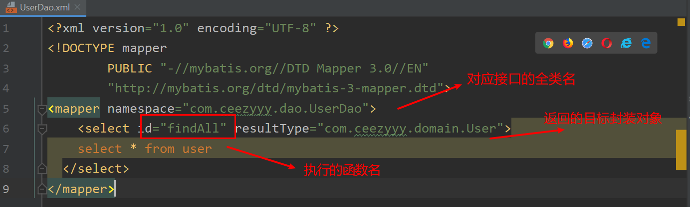 </div><br>

> :warning:**注意**
>
>`MyBatis` 的映射数据文件需要和 `dao` 接口的包结构一致

<div align="center">  </div><br>

6. 主函数

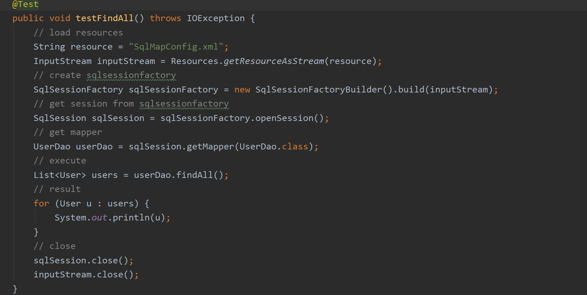


### 3.2 使用注解配置

既然不采用 `XML` 方式配置了，那我们也不需要映射配置文件（`MyBatis` 主配置文件还是需要的）

将 `mapper` 改为 `class` 属性，填写对应的 `dao` 接口

> :warning:**注意**
>
> 包名和文件名的写法不同，前者是 '.' 后者是 '/'

<div align="center"> 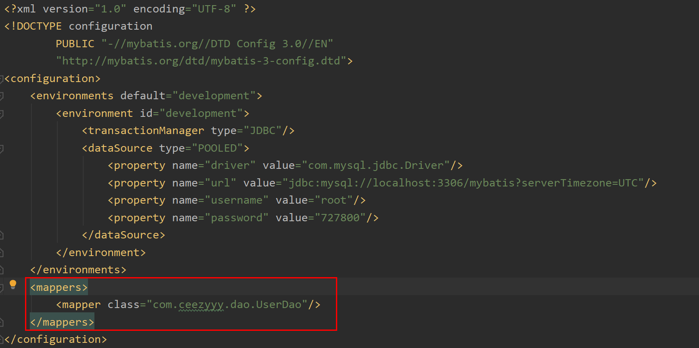 </div><br>


并在 `dao` 的接口增加注解

<div align="center"> 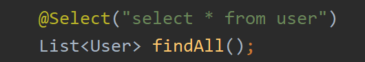 </div><br>


可见使用注解配置比 `XML` 要更方便


### 3.3 踩坑记录

#### 3.3.1 Timezone

<div align="center"> 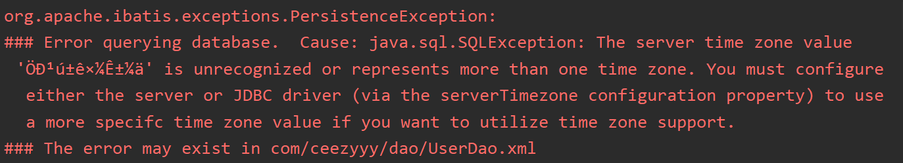 </div><br>

**原因**

<div align="center"> 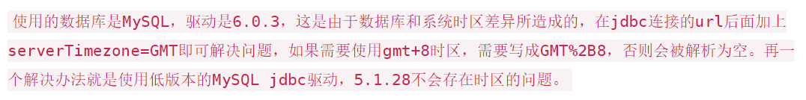 </div><br>

**解决方案**

```java
jdbc:mysql://localhost:3306/mybatis?serverTimezone=GMT
```


## 4. MyBatis 的 CRUD

### 4.1 插入操作

在 `dao` 接口类定义方法

<div align="center">  </div><br>

在映射配置文件中编写 `sql` 语句（让 `mybatis` 框架帮你创建代理对象实现）

<div align="center"> 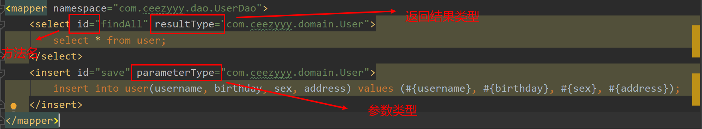 </div><br>

> :bulb:**Tips:**
>
> `#{}` 填属性名称


编写测试类 `UserDaoTest`

<div align="center"> 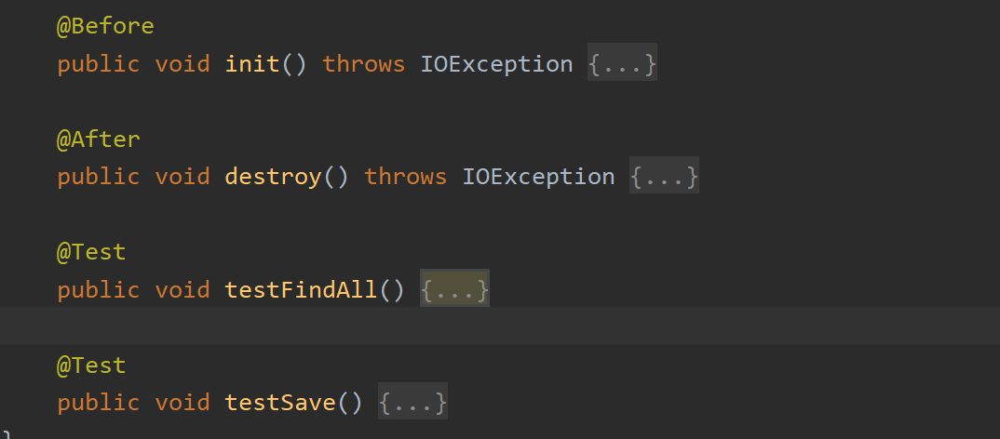 </div><br>

我们将初始化以及关闭资源方法抽取出来，让测试方法更专注于 `CRUD` 本身

`init` 方法
<div align="center"> 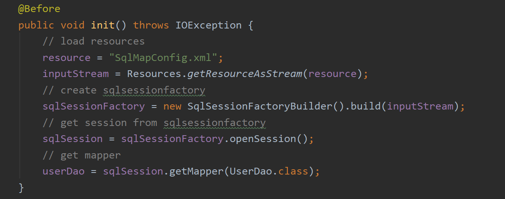 </div><br>

`destroy` 方法
<div align="center"> 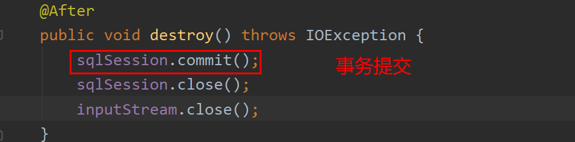 </div><br>

> **:bulb:事务**


**什么是事务？**

如果一个包含多个步骤的业务操作被事务管理，则他们要不同时成功，要不同时失败

**事务操作**

- 开启事务
- 回滚
- 提交

**事务四大特征（需记忆）**

1. 原子性
2. 持久性
3. 隔离性
4. 一致性

举个例子，小明和小红各有 1000 元，现在小明要向小红转帐 500 元，则有以下业务操作：

1. 判断小明账户是否大于 500 元（不够钱当然没法转帐）

2. 小明账户减去 500 元

3. 小红账户加上 500 元

   

若以上业务操作没有被事务管理：当第二步之后出现问题了，小明账户的钱少了，但是小红账户却没有收到钱，造成了 500 元不翼而飞，显然这在现实生活中是不可容忍的


反之，若业务操作被事务管理，当其中的步骤出现问题，事务会回滚，即恢复到最初状态；若没有出现问题，最终会提交，永久存储（写入硬盘）


:heavy_check_mark:添加成功

<div align="center">  </div><br>

### 4.2 更新操作

1. 在 `dao` 接口定义方法


   <div align="center">  </div><br>

2. 在映射配置文件中编写 `sql` 语句，让 `mybatis` 框架为我们创建代理对象

```xml
    <update id="updateUser" parameterType="com.ceezyyy.domain.User">
        update user set username = #{username}, birthday = #{birthday}, sex = #{sex}, address = #{address} where id = #{id};
    </update>
```

3. 在测试类中执行方法，查看结果

   
    <div align="center">  </div><br>

4. :heavy_check_mark:更新成功


<div align="center">  </div><br>

### 4.3  删除操作

1. 在 `dao` 接口中定义方法


<div align="center">  </div><br>
2. 在映射配置文件中编写 `sql` 语句，让 `mybatis` 框架为我们创建代理对象

```xml
   <delete id="deleteUserById" parameterType="integer">
        delete from user where id = #{id};
    </delete>
```

3. 在测试类中执行方法，查看结果

<div align="center">  </div><br>

4. :heavy_check_mark:删除成功

   

> **:warning:注意**
>
> 当参数只有一个的时候，`#{}` 里面的名称不作强求
>
> `parameterType` 中，


### 4.4 查询操作

1. `dao` 接口定义方法


<div align="center"> 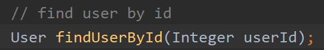 </div><br>
2. 在映射配置文件编写 `sql` 语句，让 `mybatis` 为我们创建实现类

```xml
    <select id="findUserById" parameterType="integer" resultType="com.ceezyyy.domain.User">
        select * from user where id = #{id};
    </select>
```

3. 在测试类中执行语句，查看结果


<div align="center">  </div><br>

4. :heavy_check_mark:查询成功

<div align="center"> 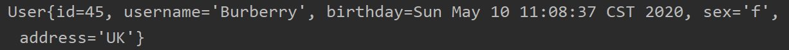 </div><br>


**模糊查询**

1. `dao` 接口中定义方法
<div align="center">  </div><br>


2. 在映射配置文件编写 `sql` 语句，让 `mybatis` 为我们创建实现类

   ```xml
       <select id="findUserByName" parameterType="string" resultType="com.ceezyyy.domain.User">
           select * from user where username like #{username};
       </select>
   ```

   `resultType` 代表需要封装的结果对象


3. 在测试类中执行语句，查看结果
<div align="center">  </div><br>

> **:warning:注意**
>
> 模糊查询的需在传入参数时指定`%`，`*` 等符号

4. :heavy_check_mark:查询成功

<div align="center"> 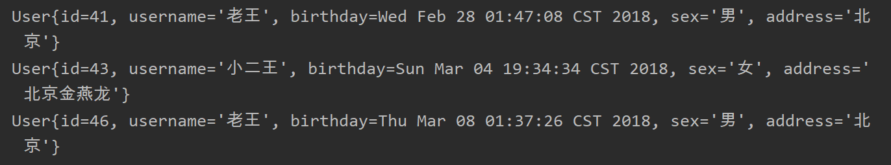 </div><br>

**聚合函数**

1. `dao` 接口中定义方法

   <div align="center">  </div><br>

2. 在映射配置文件编写 `sql` 语句，让 `mybatis` 为我们创建实现类

   ```xml
       <select id="findTotal" resultType="integer">
           select count(*) from user;
       </select>
   ```

3. 在测试类中执行语句，查看结果

   <div align="center"> 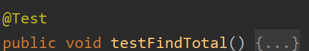 </div><br>

4. :heavy_check_mark:查询成功

   <div align="center">  </div><br>


### 4.5 参数 & 结果集深入

- `id`：方法名

- `parameterType`：参数类型

  当参数为 JavaBean 时，`#{}` 里面的内容为实体类属性值

- `resultType`：结果类型

- `resultMap`：查询结果的列名与实体类属性的对应关系（用于列名与属性名不一致的情况）

  >  **:warning:注意**
  >
  > `resultType` 和 `resultMap` 只能二选一！

### 4.6 别名

<div align="center">  </div><br>


通过 `typeAliases` 设置别名，达到简化开发的效果

当参数是基本类型或者是包装类型时，我们可以直接写 `int`，`integer` 等等，都是基于这个原理

<div align="center"> 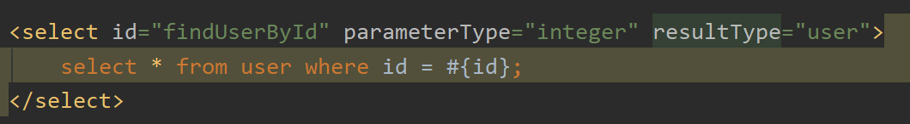 </div><br>


## 5. MyBatis 连接池及事务控制


## 6. 基于 XML 配置的动态 sql 查询

### 6.1 where 和 if 的使用

用 `<where>` 以及 `<if test>` 标签可以实现动态查询

<div align="center"> 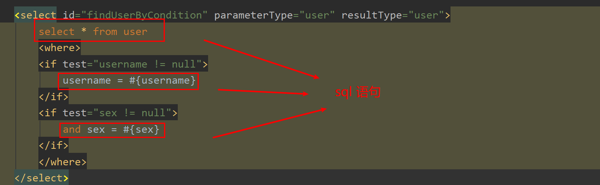 </div><br>

其实很简单，`#{}` 代表参数占位符，我们的参数类型是 `user`

`#{username}` 就相当于 `User.getUsername()` ，只不过省略了 `get` 关键字以及 `User` 变量（因为在 `parameterType` 已经声明了）


### 6.2 for each 的使用

首先我们先定义一个 `Query` 对象，也称为复合查询对象。对于复杂查询的结果，可能不止一个类

<div align="center">  </div><br>

其中 `ids` 集合定义为要查询的 `id` 集合

接着我们在 `dao` 接口定义根据用户 `id` 查找用户方法


<div align="center"> 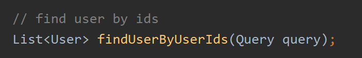 </div><br>

编写映射配置文件，交给 `mybatis` 来帮我们完成

<div align="center">  </div><br>

我们原先的数据库语句应该为：

```sql
select * from user where id in (id1, id2, ..., idn)
```

这里也一样，用 `<where>` 标签取代了 `where` 关键字

- `<for each>` 取代了 后面的部分

- `open` 代表开头， `close` 代表结尾

- `separator` 代表分隔符（显然这里是逗号分隔）

- `collections` 代表要遍历的集合，也就是我们 `query` 下的 `ids` 属性（相当于 `query.getIds()`）

- `item` 代表单个变量，用`#{item}` 来获取每次遍历的值

这点和 `python` 下的 `for loop` 很像

```python
for a in A:
	print(a)
```


## 7. MyBatis 多表操作

多表操作，字如其名，涉及到多张表。多表操作中有以下几种关系

- **一对一**

  一个人只能有一个身份证号

  一个身份证号只能属于同一个人

- **一对多**

  一个用户可以有多张订单 / 账号

- **多对一**

  多个订单 / 账号属于同一个用户

  （在 `mybatis` 中 "多对一" 属于一对一，因为每张订单 / 账号属于一个用户）

- **多对多**

  一个学生可以选多门课程

  一门课程也可以由多门学生来上


### 7.1 Demo

**背景：**

用户与账号。生活中一个用户可以有多个微信账号 / 多张银行卡

**输出：**

1. 当查询用户时，可以得到所有该用户下包含的账户信息
2. 当查询账户时，可以得到账户所属用户信息

**准备工作：**

1. 数据库相关：用户表，账户表

<div align="center">  </div><br>

2. 配置文件相关：主配置文件，映射配置文件

3. 类相关：实体类，`dao` 接口

4. 测试相关：测试类

   

:heavy_check_mark:测试成功

<div align="center"> 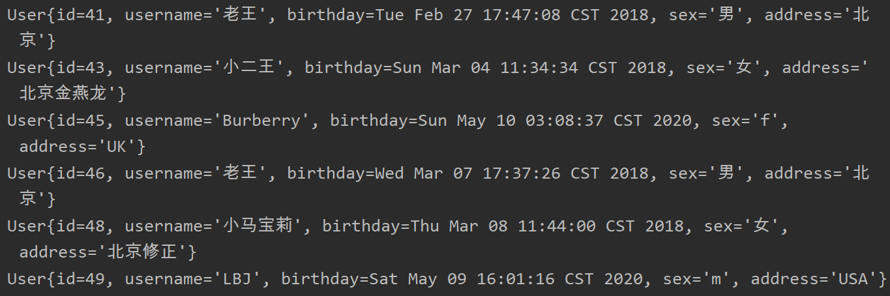 </div><br>

<div align="center">  </div><br>


**需求分析：**

1. 要完成需求，首先得先会写 `sql` 语句（真的很重要！）

<div align="center">  </div><br>

2. 要想体现出多对一的关系（也就是 `mybatis` 中的一对一）必须在从表中创建主表对象

<div align="center"> 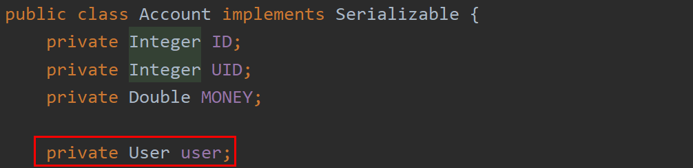 </div><br>