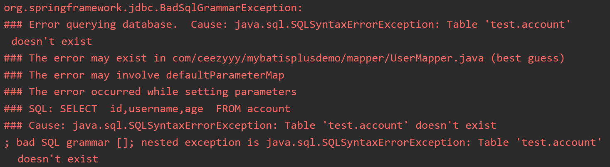
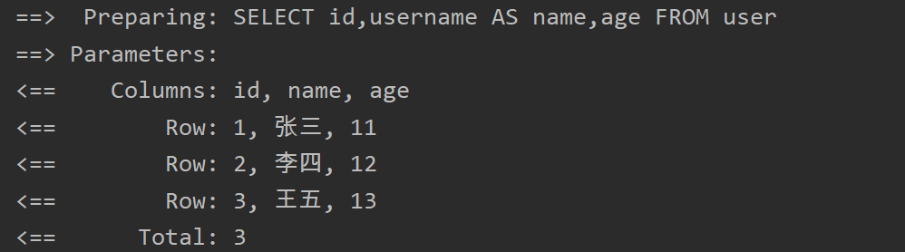
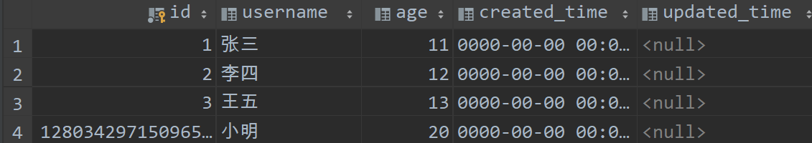
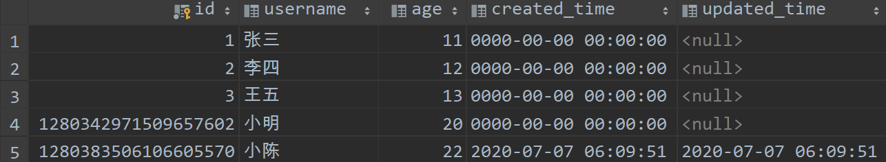
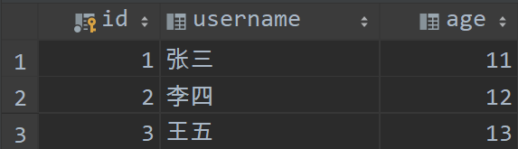
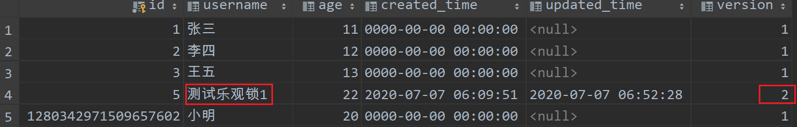
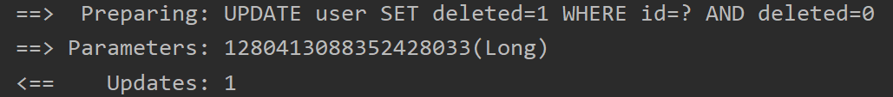
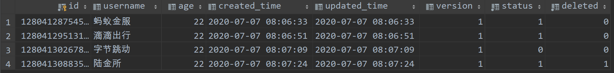

# MyBatis Plus

<div align="center">  </div><br>

## 参考教程

[【最新版】4小时学会MyBatis Plus通俗易懂，从入门到部署上线 - 楠哥教你学Java](https://www.bilibili.com/video/BV1yA411t782?p=1)


## 目录

* [1. Quickstart](#1-quickstart)
  + [1.1 添加依赖](#11-----)
  + [1.2 配置文件](#12-----)
  + [1.3 数据库](#13----)
  + [1.4 实体类](#14----)
  + [1.5 Mapper](#15-mapper)
  + [1.6 Test](#16-test)
* [2. Mybatis plus 注解](#2-mybatis-plus---)
  + [2.1 @TableName](#21--tablename)
  + [2.2 @TableField](#22--tablefield)
    - [2.2.1 自动填充](#221-----)
  + [2.3 @TableId](#23--tableid)
  + [2.4 @Version](#24--version)
  + [2.5 @EnumValue](#25--enumvalue)
    - [2.5.1 什么是 enum?](#251-----enum-)
    - [2.5.2 为什么要用 enum?](#252-------enum-)
  + [2.6 @TableLogic](#26--tablelogic)
* [3. Mybatis plus CRUD](#3-mybatis-plus-crud)


## 1. Quickstart

### 1.1 添加依赖

**pom.xml**

```xml
<dependencies>
    <dependency>
        <groupId>org.springframework.boot</groupId>
        <artifactId>spring-boot-starter-thymeleaf</artifactId>
    </dependency>
    <dependency>
        <groupId>org.springframework.boot</groupId>
        <artifactId>spring-boot-starter-web</artifactId>
    </dependency>

    <!--mybatis-plus-->
    <dependency>
        <groupId>com.baomidou</groupId>
        <artifactId>mybatis-plus-boot-starter</artifactId>
        <version>3.3.2</version>
    </dependency>

    <dependency>
        <groupId>mysql</groupId>
        <artifactId>mysql-connector-java</artifactId>
        <scope>runtime</scope>
    </dependency>
    <dependency>
        <groupId>org.projectlombok</groupId>
        <artifactId>lombok</artifactId>
        <optional>true</optional>
    </dependency>
    <dependency>
        <groupId>org.springframework.boot</groupId>
        <artifactId>spring-boot-starter-test</artifactId>
        <scope>test</scope>
        <exclusions>
            <exclusion>
                <groupId>org.junit.vintage</groupId>
                <artifactId>junit-vintage-engine</artifactId>
            </exclusion>
        </exclusions>
    </dependency>
</dependencies>
```

### 1.2 配置文件

其中 `log-impl` 指的是控制台输出 `sql` 查询具体信息

```yml
spring:
  datasource:
    driver-class-name: com.mysql.cj.jdbc.Driver
    url: jdbc:mysql://localhost:3306/test?serverTimezone=UTC&characterEncoding=utf-8

mybatis-plus:
  configuration:
    log-impl: org.apache.ibatis.logging.stdout.StdOutImpl
```

### 1.3 数据库

**创建数据表**

```sql
create table user(
    id int primary key auto_increment,
    username varchar(20),
    age int
)
```


**插入数据**

```sql
insert into user(id, username, age)
values (null, "张三", 11);

insert into user(id, username, age)
values (null, "李四", 12);

insert into user(id, username, age)
values (null, "王五", 13);
```

<div align="center">  </div><br>

**填坑指南**

遇到中文无法插入问题，修改数据表的字符集

```sql
alter table user convert to character set utf8 ; 
```

### 1.4 实体类

**User.java**

```java
@Data
public class User {
    private Integer id;  // pk
    private String username;
    private Integer age;
}
```

### 1.5 Mapper

**UserMapper.java**

```java
@Mapper
public interface UserMapper extends BaseMapper<User> {
}
```

其中，泛型填的是实体类类型

<div align="center">  </div><br>

### 1.6 Test

```java
@SpringBootTest
class UserMapperTest {
    private UserMapper userMapper;

    @Autowired
    public void setUserMapper(UserMapper userMapper) {
        this.userMapper = userMapper;
    }

    // find all
    @Test
    public void findAll() {
        List<User> users = userMapper.selectList(null);
        for (int i = 0; i < users.size(); i++) {
            System.out.println(users);
        }
    }
}
```
:heavy_check_mark: Succeeded!

<div align="center">  </div><br>

<div align="center">  </div><br>

## 2. Mybatis plus 注解

### 2.1 @TableName

**数据库表名映射**

`Mybatis-plus` 是根据实体类名去数据库找对应的表，假若我们将实体类改为 `account`

**Account.java**

```java
@Data
public class Account {
    private Integer id;  // pk
    private String username;
    private Integer age;
}
```


**AccountMapper.java**

```java
@Mapper
@Repository
public interface UserMapper extends BaseMapper<Account> {
}
```

毫无疑问会报错，看看报错信息

<div align="center">  </div><br>

找不到 `account` 表名，因为数据库根本没有 `account` 表

<div align="center">  </div><br>

当我们在实体类 `account` 加上 `@TableName` 注解时

```java
@Data
@TableName("user")
public class Account {
    private Integer id;  // pk
    private String username;
    private Integer age;
}
```

查询成功
<div align="center">  </div><br>

### 2.2 @TableField

**非主键字段映射**

先看看 `user` 表字段

<div align="center">  </div><br>

`Mybatis-plus` 根据实体类的属性去表中所对应的字段

```java
@Data
@TableName("user")
public class Account {
    private Integer id;  // pk
    private String name;
    private Integer age;
}
```

当实体类的属性与表中字段（除 `pk` 外）不对应时，就需要加上 `@TableField` 注解

<div align="center">  </div><br>

找不到 `name` 字段


<div align="center">  </div><br>

加上 `@TableField` 注解

```java
@Data
@TableName("user")
public class Account {
    private Integer id;  // pk
    @TableField(value = "username")
    private String name;
    private Integer age;
}
```

<div align="center">  </div><br>

查询成功

<div align="center">  </div><br>

#### 2.2.1 自动填充

参考连接：https://mp.baomidou.com/guide/auto-fill-metainfo.html

新增数据库列

 `created_time`：新增时间

 `updated_time`：更新时间

<div align="center">  </div><br>

修改对应的实体类

**User.java**

```java
@Data
@TableName("user")
public class User {
    @TableId(type = IdType.ASSIGN_ID)
    // pk
    private Long id;
    private String username;
    private Integer age;
    // autofill when insert
    @TableField(fill = FieldFill.INSERT)
    private Date createdTime;
    // autofill when insert and update
    @TableField(fill = FieldFill.INSERT_UPDATE)
    private Date updatedTime;
}
```


自定义实现类 `MyMetaObjectHandler`

声明 `@Component` 是让 `Spring IoC` 管理 `bean` 对象

```java
@Component
public class MyMetaObjectHandler implements MetaObjectHandler {
    @Override
    public void insertFill(MetaObject metaObject) {
        this.setFieldValByName("createdTime", new Date(), metaObject);
        this.setFieldValByName("updatedTime", new Date(), metaObject);
    }

    @Override
    public void updateFill(MetaObject metaObject) {
        this.setFieldValByName("updatedTime", new Date(), metaObject);
    }
}
```

开始测试

原始数据：

<div align="center">  </div><br>

**UserMapperTest.java**

```java
@Test
public void saveUser() {
    // user
    User user = new User();
    user.setUsername("小陈");
    user.setAge(22);
    // insert
    userMapper.insert(user);
}
```

:heavy_check_mark: 自动填充成功


<div align="center">  </div><br>


### 2.3 @TableId

**主键映射**

```java
@Data
@TableName("user")
public class Account {
    @TableId(value = "id")
    private Integer number;  // pk
    @TableField(value = "username")
    private String name;
    private Integer age;
}
```
查询成功

`value` 指定的映射字段

<div align="center">  </div><br>

**Id 生成策略**

<div align="center">  </div><br>

| 值          | 描述                              |
| ----------- | --------------------------------- |
| AUTO        | 数据库自增                        |
| NONE        | mp 设置主键（雪花算法）           |
| INPUT       | 开发者手动赋值                    |
| ASSIGN_ID   | mp 分配 ID，Long，Integer，String |
| ASSIGN_UUID | mp 分配 UUID，String              |

在现实生活中，`id` 一般为较大的值，所以实体类类型为 `Long`，数据库字段为 `bigint`

<div align="center">  </div><br>

**User.java**

```java
@Data
@TableName("user")
public class User {
    @TableId(type = IdType.ASSIGN_ID)
    // pk
    private Long id;
    private String username;
    private Integer age;
}
```

设置主键增长策略为 `ASSIGN_ID`

<div align="center">  </div><br>

添加数据

**UserMapperTest.java**

```java
// create
@Test
public void saveUser() {
    // user
    User user = new User();
    user.setUsername("小明");
    user.setAge(20);
    // insert
    userMapper.insert(user);
}
```

添加成功

<div align="center">  </div><br>


### 2.4 @Version

参考教程：

- [乐观锁插件 - MyBatisPlus](https://mp.baomidou.com/guide/optimistic-locker-plugin.html)
- [面试必备之乐观锁与悲观锁](https://juejin.im/post/5b4977ae5188251b146b2fc8)

**乐观锁用于解决并发数据问题**

在 `mp` 中

<div align="center">  </div><br>

在数据表中新增 `version`，默认为 1


<div align="center">  </div><br>

修改对应实体类

**User.java**

```java
@Data
@TableName("user")
public class User {
    @TableId(type = IdType.ASSIGN_ID)
    // pk
    private Long id;
    private String username;
    private Integer age;
    // autofill when insert
    @TableField(fill = FieldFill.INSERT)
    private Date createdTime;
    // autofill when insert and update
    @TableField(fill = FieldFill.INSERT_UPDATE)
    private Date updatedTime;
    @Version
    private Integer version;
}
```

配置乐观锁

**OptimisticLocker.java**

```java
@Configuration
public class OptimisticLocker {
    @Bean
    public OptimisticLockerInterceptor optimisticLockerInterceptor() {
        return new OptimisticLockerInterceptor();
    }
}
```

测试

原始数据


<div align="center">  </div><br>

模拟并发场景对数据进行修改

**UserMapperTest.java**

```java
// update
@Test
public void updateUser() {
    // modify
    User user1 = userMapper.selectById(5);
    user1.setUsername("测试乐观锁1");
    User user2 = userMapper.selectById(5);
    user2.setUsername("测试乐观锁2");
    // update
    userMapper.updateById(user1);
    userMapper.updateById(user2);
}
```

乐观锁通过逻辑判断

<div align="center">  </div><br>

:heavy_check_mark: 添加乐观锁成功

<div align="center">  </div><br>


### 2.5 @EnumValue

**将数据库字段映射成实体类的枚举类型成员变量**

参考链接：[通用枚举 - MybatisPlus](https://mp.baomidou.com/guide/enum.html)


#### 2.5.1 什么是 enum?

留坑


#### 2.5.2 为什么要用 enum?

留坑


数据表增加 `status` 字段

<div align="center">  </div><br>

对应实体类 

**User.java**

```java
@Data
@TableName("user")
public class User {
    @TableId(type = IdType.ASSIGN_ID)
    // pk
    private Long id;
    private String username;
    private Integer age;
    // autofill when insert
    @TableField(fill = FieldFill.INSERT)
    private Date createdTime;
    // autofill when insert and update
    @TableField(fill = FieldFill.INSERT_UPDATE)
    private Date updatedTime;
    @Version
    private Integer version;
    private StatusEnum status;
}
```

自定义枚举类，增加 `@EnumValue` 注解

**StatusEnum.java**

```java
public enum StatusEnum {
    WORK(1, "work"),
    REST(0, "rest");

    @EnumValue
    private Integer code;
    private String msg;

    StatusEnum(Integer code, String msg) {
        this.code = code;
        this.msg = msg;
    }
}
```

在配置文件 `application.yml` 中开启枚举扫描

**application.yml**

```yaml
spring:
  datasource:
    driver-class-name: com.mysql.cj.jdbc.Driver
    url: jdbc:mysql://localhost:3306/test?serverTimezone=UTC&characterEncoding=utf-8

mybatis-plus:
  configuration:
    log-impl: org.apache.ibatis.logging.stdout.StdOutImpl
  type-enums-package: com.ceezyyy.mybatisplusdemo.enums
```

:heavy_check_mark: 查询成功

<div align="center">  </div><br>


### 2.6 @TableLogic

**映射逻辑删除**

参考链接：[逻辑删除 - MybatisPlus](https://mp.baomidou.com/guide/logic-delete.html)

数据表增加字段

<div align="center">  </div><br>

修改对应实体类

**User.java**

```java
@Data
@TableName("user")
public class User {
    @TableId(type = IdType.ASSIGN_ID)
    // pk
    private Long id;
    private String username;
    private Integer age;
    // autofill when insert
    @TableField(fill = FieldFill.INSERT)
    private Date createdTime;
    // autofill when insert and update
    @TableField(fill = FieldFill.INSERT_UPDATE)
    private Date updatedTime;
    @Version
    private Integer version;
    private StatusEnum status;
    @TableLogic
    // 0: not delete
    // 1: delete
    private Integer deleted;
}
```

修改 `application.yml` 配置文件

**application.yml**

```yml
spring:
  datasource:
    driver-class-name: com.mysql.cj.jdbc.Driver
    url: jdbc:mysql://localhost:3306/test?serverTimezone=UTC&characterEncoding=utf-8

mybatis-plus:
  configuration:
    log-impl: org.apache.ibatis.logging.stdout.StdOutImpl
  type-enums-package: com.ceezyyy.mybatisplusdemo.enums
  global-config:
    db-config:
      logic-delete-value: 1  # 1 means logic deleted
      logic-not-delete-value: 0  # 0 means not delete
```

测试

**UserMapperTest.java**

```java
// delete
@Test
public void testDeleteUserById() {
    userMapper.deleteById(1280413088352428033L);
}
```

执行流程

<div align="center">  </div><br>

:heavy_check_mark: 逻辑删除成功
<div align="center">  </div><br>


## 3. Mybatis plus CRUD 

