# Spring

## 目录
* [1. 什么是 Spring?](#1-----spring-)
  + [1.1 Spring 核心](#11-spring---)
  + [1.2 Spring 优势](#12-spring---)
  + [1.3 Spring 体系结构](#13-spring-----)
* [2. 程序的耦合和解耦](#2---------)
  + [2.1 什么是耦合](#21------)
  + [2.2 什么是解耦](#22------)
  + [2.3 问题回顾](#23-----)
  + [2.4 工厂模式解耦](#24-------)
  + [2.5 工厂模式解耦 Pro](#25--------pro)
* [3. IOC](#3-ioc)
  + [3.1 什么是 IOC？](#31-----ioc-)
  + [3.2 Spring 中的 IOC](#32-spring----ioc)
  + [3.3 Spring 基于 XML 的 IOC 环境搭建](#33-spring----xml---ioc-----)
  + [3.4 BeanFactory 接口与 ApplicationContext 的区别](#34-beanfactory-----applicationcontext----)
  + [3.5 Spring 对 Bean 的管理细节](#35-spring---bean------)
    - [3.5.1 创建 bean 的三种方式](#351----bean------)
    - [3.5.2 bean 对象的作用范围](#352-bean--------)
    - [3.5.3 bean 对象的生命周期](#353-bean--------)
* [4. 依赖注入](#4-----)
  + [4.1 什么是依赖注入？](#41---------)
  + [4.2 小明与救世主](#42-------)
  + [4.3 Demo](#43-demo)
* [5. 注解](#5---)
  + [5.1 什么是注解？](#51-------)
  + [5.2 注解有什么用？](#52--------)
  + [5.3 JDK 内置注解](#53-jdk-----)
* [6. 基于注解的 IOC 配置](#6-------ioc---)
  + [6.1 注解的分类](#61------)
  + [6.2 创建对象](#62-----)
  + [6.3 注入数据](#63-----)
  + [6.4 改变作用范围](#64-------)
  + [6.5 生命周期相关](#65-------)


## 1. 什么是 Spring?

Spring 框架是一个开源的 [J2EE](https://baike.baidu.com/item/J2EE/110838) 应用程序框架，针对bean的生命周期进行管理的轻量级容器


<div align="center">  </div><br>


### 1.1 Spring 核心

1. `IOC` 控制反转
2. `AOP` 面向切片

### 1.2 Spring 优势

1. 方便解耦，简化开发

   通过 Spring 提供的 `IoC` 容器，我们可以将对象之间的依赖关系交由 Spring 进行控制，避免硬编码所造成的过度程序耦合。有了 Spring，用户不必再为单实例模式类、属性文件解析等这些很底层的需求编写代码，可以更专注于上层的应用。

2. `AOP` 编程支持

   通过Spring提供的[AOP](https://baike.baidu.com/item/AOP)功能，方便进行面向切面的编程，许多不容易用传统OOP实现的功能可以通过AOP轻松应付。

3. 声明式事务支持

   在 Spring 中，我们可以从单调烦闷的事务管理代码中解脱出来，通过声明式方式灵活地进行事务的管理，提高开发效率和质量。

4. 方便程序测试

   Spring 对 `Junit4` 支持，可以通过注解方便的测试 Spring 程序。

5. 方便集成各种优秀框架

   Spring 不排斥各种优秀的开源框架，相反，Spring 可以降低各种框架的使用难度，Spring 提供了对各种优秀框架等的直接支持。

6. Java 源码经典学习范例

   Spring 的源码设计精妙、结构清晰、匠心独运，处处体现着大师对 [Java设计模式](https://baike.baidu.com/item/Java设计模式)灵活运用以及对 Java 技术的高深造诣。Spring 框架源码无疑是 Java 技术的最佳实践范例。如果想在短时间内迅速提高自己的 Java 技术水平和应用开发水平，学习和研究 Spring 源码将会使你收到意想不到的效果。


### 1.3 Spring 体系结构

 

<div align="center">  </div><br>


## 2. 程序的耦合和解耦

### 2.1 什么是耦合

耦合指的是程序之间的依赖关系，分为：

1. 类之间依赖
2. 函数方法依赖


### 2.2 什么是解耦

降低程序的耦合性，使得 **编译期不依赖，运行时才依赖**

方法：

1. 使用反射创建对象，避免使用 `new` 
2. 读取配置文件获取创建对象全限定类命


### 2.3 问题回顾

在之前我们保存用户信息都是这么做的：

**View.java**

```java
package com.ceezyyy.view;

import com.ceezyyy.service.UserService;
import com.ceezyyy.service.impl.UserServiceImpl;

public class View {
    public static void main(String[] args) {
        UserService userService = new UserServiceImpl();
        userService.save();
    }
}

```


**UserService.java**

```java
package com.ceezyyy.service;

public interface UserService {
    void save();
}

```


**UserServiceImpl.java**

```java
package com.ceezyyy.service.impl;

import com.ceezyyy.dao.UserDao;
import com.ceezyyy.dao.impl.UserDaoImpl;
import com.ceezyyy.service.UserService;

public class UserServiceImpl implements UserService {
    private UserDao userDao = new UserDaoImpl();

    public void save() {
        userDao.save();
    }
}

```


这样程序依赖很强，当我们移除了 `userDaoImpl.java` ，程序在编译期间就无法通过

 

### 2.4 工厂模式解耦

**预备知识：**

`Bean`：可重用组件

`Java Bean`：用 Java 编写的可重用组件（`Java Bean` 的范围要大于实体类）


**bean.properties**

```properties
UserDaoImpl=com.ceezyyy.dao.impl.UserDaoImpl
UserServiceImpl=com.ceezyyy.service.impl.UserServiceImpl
```

`bean` 配置文件：

`id`=`全限定类名`

根据 `id` 找到响应的类


**BeanFactory.java**

```java
public class BeanFactory {

    private static Properties properties;

    static {
        try {
            properties = new Properties();
            InputStream inputStream = BeanFactory.class.getClassLoader().getResourceAsStream("bean.properties");
            properties.load(inputStream);
        } catch (IOException e) {
            e.printStackTrace();
        }
    }

    // get bean
    public static Object getBean(String beanName) {
        Object bean = null;
        try {
            String beanPath = properties.getProperty(beanName);
            bean = Class.forName(beanPath).newInstance();
        } catch (InstantiationException e) {
            e.printStackTrace();
        } catch (IllegalAccessException e) {
            e.printStackTrace();
        } catch (ClassNotFoundException e) {
            e.printStackTrace();
        }
        return bean;
    }
}

```


**View.java**

```java
public class View {
    public static void main(String[] args) {
//        UserService userService = new UserServiceImpl();
        UserService userService = (UserService) BeanFactory.getBean("UserServiceImpl");
        userService.save();
    }
}

```


**UserServiceImpl.java**

```java
public class UserServiceImpl implements UserService {
//    private UserDao userDao = new UserDaoImpl();

    private UserDao userDao = (UserDao) BeanFactory.getBean("UserDaoImpl");
    public void save() {
        userDao.save();
    }
}

```


:heavy_check_mark:Succeeded!

<div align="center"> 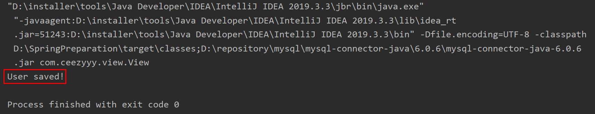 </div><br>


**:bulb:TIPS**

1. 使用加载配置文件利用反射来创建实体类对象，减少类之间的强耦合关系

   


### 2.5 工厂模式解耦 Pro


**LET'S GO MORE IN DEPTH**


**View.java**

```java
    public static void main(String[] args) {
//        UserService userService = new UserServiceImpl();
        for (int i = 0; i < 10; i++) {
            UserService userService = (UserService) BeanFactory.getBean("UserServiceImpl");
            System.out.println(userService);
//            userService.save();
        }
    }
```


我们这样的写法存在一个问题：`bean` 是多例的


**:bulb:什么是单例和多例？**

**单例：**  只有一个共享的实例存在，所有对这个 `bean` 的请求都会返回这个唯一的实例。不管 `new` 多少次，只生成一个对象。

**多例：**  每次请求都会创建一个新的对象，类似于 `new`


**:bulb:为什么使用单例/多例？**


<div align="center"> 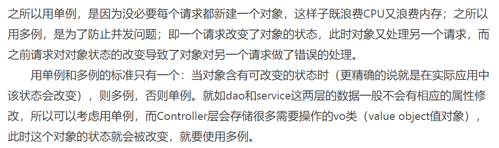 </div><br>

<div align="center"> 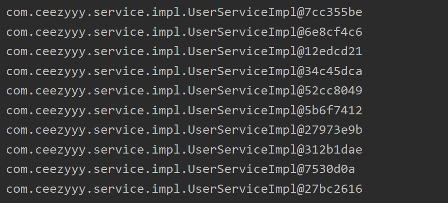 </div><br>


**工厂模式解耦 Pro**

下面进行升级，使得每次调用 `getBean` 所获得的对象都是单例的（`service` 和 `dao` 的属性没有频繁改变的需求，显然单例更合适，减少资源消耗）

 **BeanFactory.java**

```java
public class BeanFactory {

    private static Properties properties;
    // store id-object
    private static Map<String, Object> map = new HashMap<String, Object>();

    static {
        try {
            properties = new Properties();
            // load properties
            InputStream inputStream = BeanFactory.class.getClassLoader().getResourceAsStream("bean.properties");
            properties.load(inputStream);

            // get keys from properties
            Enumeration<Object> keys = properties.keys();
            while (keys.hasMoreElements()) {
                String id = String.valueOf(keys.nextElement());
                // get beanPath by key
                String beanPath = properties.getProperty(id);
                // create a object by reflection
                Object value = Class.forName(beanPath).newInstance();
                // put id-value into our map
                map.put(id, value);
            }
        } catch (IOException | ClassNotFoundException e) {
            e.printStackTrace();
        } catch (IllegalAccessException e) {
            e.printStackTrace();
        } catch (InstantiationException e) {
            e.printStackTrace();
        }
    }

    public static Object getBean(String beanName) {
        Object value = null;
        try {
            value = map.get(beanName);
        } catch (Exception e) {
            e.printStackTrace();
        }
        return value;
    }

}

```

**:bulb:注意：**

1. `map` 是我们用来存储 `id` 和 `bean` 的容器，这样可以确保 `bean` 是单例


这样我们获得的 `bean` 对象就是单例的

<div align="center">  </div><br>


## 3. IOC

### 3.1 什么是 IOC？

<div align="center">  </div><br>


`IOC` 是 `inverse of control` 的缩写，控制反转

<div align="center"> 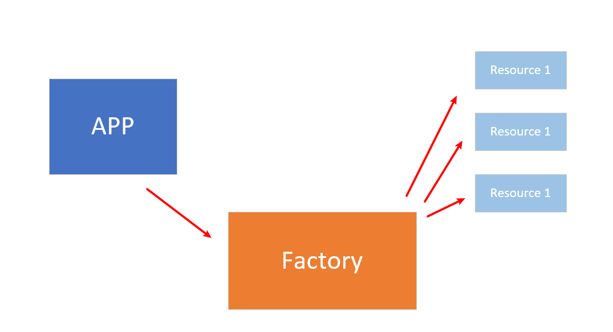 </div><br>

以前在 `new` 实体类的时候，选择权在我们自己手上，而现在选择权交给了工厂，由工厂帮我们决定新建的对象，称控制反转


### 3.2 Spring 中的 IOC


### 3.3 Spring 基于 XML 的 IOC 环境搭建

1. 引入 `maven` 坐标

2. 定义 `bean.xml` （此时我们不用自己创建 `beanFactory`，交给 `Spring` 帮我们实现）

   

   **bean.xml**

   ```xml
   <?xml version="1.0" encoding="UTF-8"?>
   <beans xmlns="http://www.springframework.org/schema/beans"
          xmlns:xsi="http://www.w3.org/2001/XMLSchema-instance"
          xsi:schemaLocation="http://www.springframework.org/schema/beans
           https://www.springframework.org/schema/beans/spring-beans.xsd">
   
       <bean id="UserServiceImpl" class="com.ceezyyy.service.impl.UserServiceImpl">
           <!-- collaborators and configuration for this bean go here -->
       </bean>
   
       <bean id="UserDaoImpl" class="com.ceezyyy.dao.impl.UserDaoImpl">
           <!-- collaborators and configuration for this bean go here -->
       </bean>
   
       <!-- more bean definitions go here -->
   
   </beans>
   ```

   

3. 利用 `ApplicationContext` 读取 `bean.xml` 中的内容，创建具体对象的事就交给 `Spring` 来完成

   

   **View.java**

   ```java
   public class View {
       public static void main(String[] args) {
           ApplicationContext applicationContext = new ClassPathXmlApplicationContext("bean.xml");
           UserService userServiceImpl = applicationContext.getBean("UserServiceImpl", UserServiceImpl.class);
           UserDao userDaoImpl = applicationContext.getBean("UserDaoImpl", UserDaoImpl.class);
   
           // result
           System.out.println(userServiceImpl);
           System.out.println(userDaoImpl);
       }
   }
   ```

   

   :heavy_check_mark:Succeeded!

   <div align="center"> 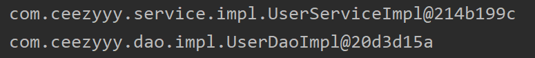 </div><br>


### 3.4 BeanFactory 接口与 ApplicationContext 的区别

<div align="center"> 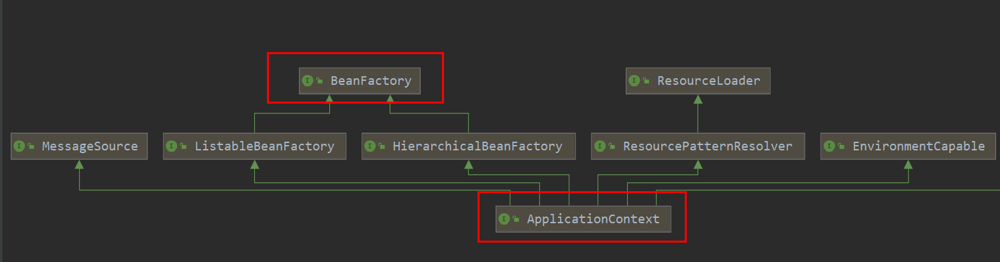 </div><br>

`BeanFactory`：延迟加载，适用于多例

`ApplicationContext`：立即加载，适用于单例


### 3.5 Spring 对 Bean 的管理细节

#### 3.5.1 创建 bean 的三种方式（XML 配置）

1. 指定 `id` 和 `class` 属性

   ```xml
   <bean id="UserServiceImpl" class="com.ceezyyy.service.impl.UserServiceImpl">
           <!-- collaborators and configuration for this bean go here -->
   </bean>
   ```

   `id`：唯一标识

   `class`：实现类全限定类名

   若没有指定方法，则是默认选择实现类的（默认）`constructor`，若修改该 `constructor`，则会报错：

   <div align="center">  </div><br>

   当指指定 `class`，`Spring bean` 会去找该全限定类名下的默认构造函数从而存入 `spring` 容器

   

2. 指定 `id` ，`factory-bean` 和 `factory-method`

   我们模拟一个临时工厂：

   **TempFactory.java**

   ```java
   public class TempFactory {
       public Object getBean() {
           return new UserServiceImpl();
       }
   }
   ```

   **这类方法的特征在于：**

   1. 我们无法直接获得其全限定类名以及了解其构造函数（许多类被封装在 `jar` 包中，我们无法直接访问或直接了解其体系结构）

   2. 已知该工厂类的全限定类名以及返回值是 `bean` 

   

   **bean.xml**

   ```xml
   <bean id="TempFactory" class="com.ceezyyy.factory.TempFactory"></bean>
   <bean id="UserServiceImpl" factory-bean="TempFactory" factory-method="getBean"></bean>
   ```

   

   第一行是用来"绑定"工厂 `TempFactory`

   第二行用来告诉 `spring` 工厂 `bean` 的位置（全限定类名）以及该调用哪个方法

   

3. 静态工厂方法

   **TempFactory.java**

   ```java
   public class TempFactory {
       public static Object getBean() {
           return new UserServiceImpl();
       }
   }
   ```

   **bean.xml**

   ```xml
   <bean id="UserServiceImpl" class="com.ceezyyy.factory.TempFactory" factory-method="getBean"></bean>
   ```

   

#### 3.5.2 bean 对象的作用范围

**`scope` 属性：**

`prototype`：多例

`singleton`：单例（默认）

`request`：web 应用中 `request` 范围

`session`：web 应用中 `session` 范围

<div align="center"> 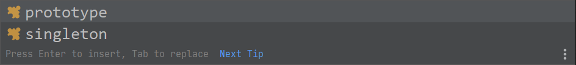 </div><br>


#### 3.5.3 bean 对象的生命周期

- **单例对象**

  出生：当创建容器时，对象出生

  活着：容器在，对象在

  死亡：容器销毁，对象死亡

- **多例对象**

  出生：使用时出生

  活着：对象在使用的过程中

  死亡：对象长时间不用，且没有别的对象引用时，由 Java 垃圾回收机制回收


## 4. 依赖注入 

### 4.1 什么是依赖注入？

依赖注入是 `IOC` 最为常见的一种技术


### 4.2 小明与救世主

举个例子，

小明是手机重度依赖者


他先买了一部 `XR`，摄像头坏了，于是他去买了 `11`，并且换了电话卡

这时他需要重新改造，因为他的生活已经被手机牢牢绑定了


可 `11` 用了不久又碎屏了，他买了 `11 pro` ，再一次地彻头彻尾改造自己

倒霉的他，新买的 `11 pro` 又因为功能故障无法使用。

他深深地意识到：**自己过于依赖手机，产生了极高的耦合度**，每一次换手机都是刻骨铭心的记忆


<div align="center">  </div><br>

这时，他将自己的选择权给了救世主，这就是 `IOC`，即**控制反转**（控制反转是一种思想，而 `spring` 中的 `IOC` 是容器）


那么将如何实现 **控制反转** ？

这就需要**依赖注入**


对于小明来说，他将 3 台手机的选择权交给救世主（也就是我们的 `spring` 容器），由其指定自己每天使用的手机（依赖注入）。

即小明只关心每天的手机使用，而不理会选哪台手机


参考文章：

[浅谈控制反转与依赖注入](https://zhuanlan.zhihu.com/p/33492169)


### 4.3 Demo

**UserServiceImpl.java**

```java
public class UserServiceImpl implements UserService {
    private String a;
    private Integer b;
    private Date c;
    private List<Integer> list;
    private Set<Integer> set;
    private Map<Integer, String> map;

    // getter and setter
```


**bean.xml**

```xml
<bean id="UserServiceImpl" class="com.ceezyyy.service.impl.UserServiceImpl">
        <property name="a" value="LBJ"></property>
        <property name="b" value="23"></property>
        <property name="c" ref="birthday"></property>
        <property name="list">
            <list>
                <value>1</value>
                <value>2</value>
                <value>3</value>
                <value>4</value>
            </list>
        </property>
        <property name="map">
            <map>
                <entry key="1" value="INDIA"></entry>
                <entry key="2" value="Pakistan"></entry>
                <entry key="3" value="USA"></entry>
                <entry key="4" value="USA"></entry>
            </map>
        </property>
        <property name="set">
            <set>
                <value>100</value>
                <value>200</value>
                <value>300</value>
                <value>400</value>
            </set>
        </property>
    </bean>

    <bean id="birthday" class="java.util.Date"></bean>
```


**:warning:注意：**

1. 对于基本类型和包装类型：`name-value` 即可实现依赖注入
2. 对于复杂类型：需要先定义 `<bean>` 对象，`name-ref` 即可实现依赖注入
3. 对于集合类型（容器）：
   1. 单列：`<collection>-value` 即可实现依赖注入
   2. 双列：`<collection>-entry` 即可实现依赖注入


:heavy_check_mark:Succeeded!

<div align="center"> 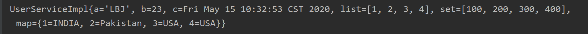 </div><br>


## 5. 注解

### 5.1 什么是注解？

**注释：**说明，给开发者看

**注解：**说明程序，给计算机看


### 5.2 注解有什么用？

1. 代码分析
2. 编译检查（例如 `@Override`）
3. 编写文档（生成 `Java doc` 文档）


### 5.3 JDK 内置注解

- `@SuppressWarnings("all")` 用于忽视所有警告（一般写在类）

```java
@SuppressWarnings("all")
public class UserServiceImpl implements UserService {
    private String a;
    private Integer b;
    private Date c;
    private List<Integer> list;
    private Set<Integer> set;
    private Map<Integer, String> map;

    // getter and setter
```


- `@Override` 用于检查是否重写父类方法

```java
@Override
public int hashCode() {
    return super.hashCode();
}
```


- `@Deprecated` 该方法已过时（但不影响使用）

```java
@Deprecated
public void setA(String a) {
    this.a = a;
}
```


## 6. 基于注解的 IOC 配置

**注解和 XML 配置是两种不同的方式，实现目的都是为了降低程序的耦合性**


### 6.1 注解的分类

1. 创建对象
2. 注入数据
3. 改变作用范围
4. 生命周期相关


### 6.2 创建对象

**UserServiceImpl.java**

```java
@Component(value = "UserServiceImpl")
public class UserServiceImpl implements UserService {
    private String a;
    private Integer b;
    private Date c;
    private List<Integer> list;
    private Set<Integer> set;
    private Map<Integer, String> map;
    
    // getter and setter
```

使用注解方式 `@Component(value = "UserServiceImpl")` 方式将该 `bean` 对象注入到 `Spring` 容器中（容器以 `key-value` 形式存储）

其中 `value` 是该对象标识，默认为类名首字母小写（相当于 `key-value` 中的 `key`，不要弄混淆了）


使用注解需要告知 `Spring`：

"我正在以注解方式开发！"


所以，我们在仍需配置 `bean.xml` 文件，其中 ` <context:component-scan base-package=""` 的作用是告诉 `Spring` 去扫描该全限定路径包名下的类，找到带有 `@Component` 注解标识的 `bean` 对象并注册到容器中


<div align="center"> 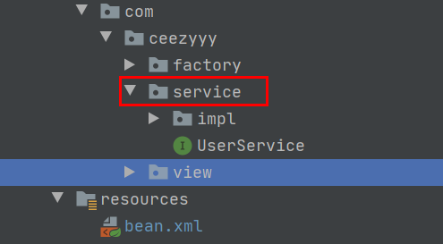 </div><br>

**bean.xml**

```xml
<?xml version="1.0" encoding="UTF-8"?>
<beans xmlns="http://www.springframework.org/schema/beans"
       xmlns:xsi="http://www.w3.org/2001/XMLSchema-instance"
       xmlns:context="http://www.springframework.org/schema/context"
       xsi:schemaLocation="
        http://www.springframework.org/schema/beans
        https://www.springframework.org/schema/beans/spring-beans.xsd
        http://www.springframework.org/schema/context
        https://www.springframework.org/schema/context/spring-context.xsd">

    <!-- this switches on the load-time weaving -->
    <context:component-scan base-package="com.ceezyyy.service"></context:component-scan>
    
</beans>
```


:heavy_check_mark:Succeeded!

<div align="center"> 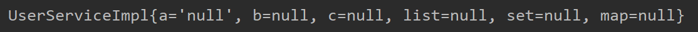 </div><br>

（等于 `null` 是因为我们还没有注入数据）


### 6.3 由 Component 的衍生注解

以下三个都用于创建对象，与 `Component` 有略微的区别：

- `@Controller`：用于表现层使用
- `@Service`：用于业务层使用
- `@Repository`：用于 `dao` 层使用


**UserServiceImpl.java**

```java
@Service("UserServiceImpl")
public class UserServiceImpl implements UserService {
    private String a;
    private Integer b;
    private Date c;
    private List<Integer> list;
    private Set<Integer> set;
    private Map<Integer, String> map;
    
    // getter and setter
```


**UserDaoImpl.java**

```java
@Repository("UserDaoImpl")
public class UserDaoImpl implements UserDao {

    @Override
   // method
}
```


:heavy_check_mark:Succeeded!

<div align="center"> 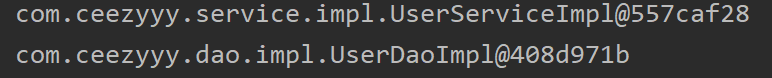 </div><br>


### 6.4 注入数据

让我们先看一个例子：

**View.java**

```java
public class View {
    public static void main(String[] args) {
        ApplicationContext applicationContext = new ClassPathXmlApplicationContext("bean.xml");
        UserService userService = applicationContext.getBean("UserServiceImpl", UserServiceImpl.class);
//        UserDao userDaoImpl = applicationContext.getBean("UserDaoImpl", UserDaoImpl.class);
        userService.save();
    }
}
```


**UserServiceImpl.java**

```java
@Service("UserServiceImpl")
public class UserServiceImpl implements UserService {
    private UserDao userDao;

    @Override
    public void save() {
        userDao.save();
    }
}
```


**UserDaoImpl.java**

```java
@Repository("UserDaoImpl")
public class UserDaoImpl implements UserDao {

    @Override
    public void save() {
        System.out.println("Saved!");
    }
}
```


显然地，在 `UserServiceImpl` 中， `userDao` 对象为 `null`

运行会报空指针异常


<div align="center"> 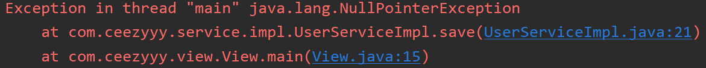 </div><br>


那如何注入数据呢？

使用 `@Resource` 指定要注入的数据（bean）对象

使用 `@Value` 指定要注入的包装类型 / 基本类型对象

此时的 `Spring IOC` 容器中：

<div align="center"> 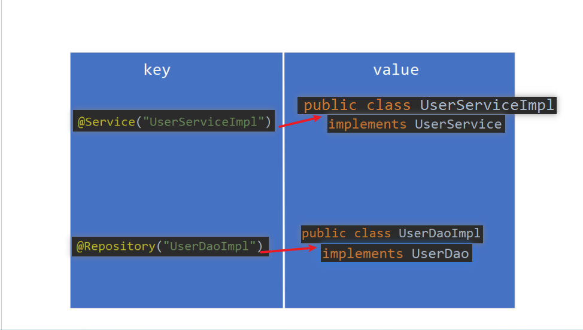 </div><br>

**UserServiceImpl.java**

```java
@Service("UserServiceImpl")
public class UserServiceImpl implements UserService {
    @Resource(name = "UserDaoImpl")
    private UserDao userDao;
    @Value("1")
    private int a;
    @Value("2")
    private double b;

    public void save() {
        userDao.save();
        System.out.println(a);
        System.out.println(b);
    }
}
```

从 `Spring IOC` 容器中获取 `UserDaoImpl` 注入到数据中

:heavy_check_mark:Succeeded!

<div align="center">  </div><br>

**:warning: 填坑**

使用 `@Resource` 注解需要先导入 `maven` 坐标

```xml
<dependency>
        <groupId>javax.annotation</groupId>
        <artifactId>javax.annotation-api</artifactId>
        <version>1.3.2</version>
</dependency>
```


### 6.5 改变作用范围


### 6.6 生命周期相关


## 7.  IOC Demo (XML)

<div align="center"> 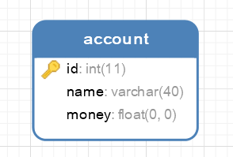 </div><br>


