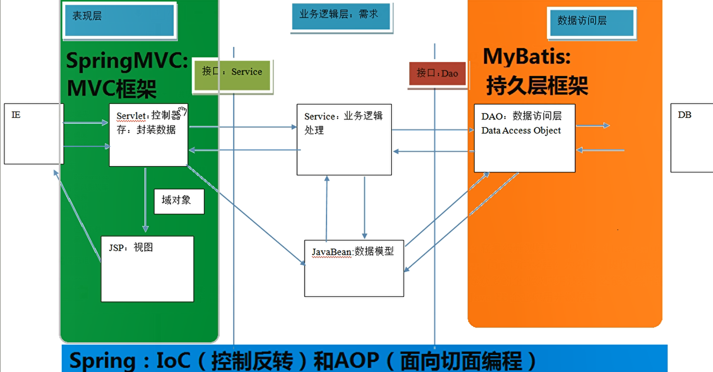

# Spring

## 目录

* [1. 什么是 Spring?](#1-----spring-)
  + [1.1 Spring 核心](#11-spring---)
  + [1.2 Spring 发展历程](#12-spring-----)
  + [1.3 Spring 优势](#13-spring---)
  + [1.4 Spring 体系结构](#14-spring-----)
* [2. 程序的耦合和解耦](#2---------)
  + [2.1 问题回顾](#21-----)
  + [2.2 工厂模式解耦](#22-------)
* [3. IOC](#3-ioc)
  + [3.1 什么是 IOC？](#31-----ioc-)
  + [3.2 Spring 中的 IOC](#32-spring----ioc)
  + [3.3 Spring 基于 XML 的 IOC 环境搭建](#33-spring----xml---ioc-----)
* [4. 依赖注入](#4-----)

## 1. 什么是 Spring?

### 1.1 Spring 核心

### 1.2 Spring 优势

### 1.3 Spring 体系结构

 

## 2. 程序的耦合和解耦

### 2.1 问题回顾

### 2.2 工厂模式解耦

## 3. IOC

### 3.1 什么是 IOC？

### 3.2 Spring 中的 IOC

### 3.3 Spring 基于 XML 的 IOC 环境搭建

## 4. 依赖注入

