# Spring

## 目录
* [1. 什么是 Spring?](#1-----spring-)
  + [1.1 Spring 核心](#11-spring---)
  + [1.2 Spring 优势](#12-spring---)
  + [1.3 Spring 体系结构](#13-spring-----)
* [2. 程序的耦合和解耦](#2---------)
  + [2.1 什么是耦合](#21------)
  + [2.2 什么是解耦](#22------)
  + [2.3 问题回顾](#23-----)
  + [2.4 工厂模式解耦](#24-------)
  + [2.5 工厂模式解耦 Pro](#25--------pro)
* [3. IOC](#3-ioc)
  + [3.1 什么是 IOC？](#31-----ioc-)
  + [3.2 Spring 中的 IOC](#32-spring----ioc)
  + [3.3 Spring 基于 XML 的 IOC 环境搭建](#33-spring----xml---ioc-----)
  + [3.4 BeanFactory 接口与 ApplicationContext 的区别](#34-beanfactory-----applicationcontext----)
  + [3.5 Spring 对 Bean 的管理细节](#35-spring---bean------)
    - [3.5.1 创建 bean 的三种方式（XML 配置）](#351----bean-------xml----)
    - [3.5.2 bean 对象的作用范围](#352-bean--------)
    - [3.5.3 bean 对象的生命周期](#353-bean--------)
* [4. 依赖注入](#4-----)
  + [4.1 什么是依赖注入？](#41---------)
  + [4.2 小明与救世主](#42-------)
  + [4.3 Demo](#43-demo)
* [5. 注解](#5---)
  + [5.1 什么是注解？](#51-------)
  + [5.2 注解有什么用？](#52--------)
  + [5.3 JDK 内置注解](#53-jdk-----)
* [6. 基于注解的 IOC 配置](#6-------ioc---)
  + [6.1 注解的分类](#61------)
  + [6.2 创建对象](#62-----)
  + [6.3 由 Component 的衍生注解](#63---component------)
  + [6.4 注入数据](#64-----)
  + [6.5 改变作用范围](#65-------)
  + [6.6 生命周期相关](#66-------)
* [7.  IOC Demo (XML)](#7--ioc-demo--xml-)
  + [7.1 项目需求](#71-----)
  + [7.2 项目结构](#72-----)
  + [7.3 项目分析](#73-----)
  + [7.4 填坑指南](#74-----)
* [8. IOC Demo (Annotation)](#8-ioc-demo--annotation-)
* [9. Spring 整合 Junit](#9-spring----junit)
  + [9.1 原理](#91---)
  + [9.2 实现](#92---)
* [10. AOP 前夕](#10-aop---)
  + [10.1 转帐事务](#101-----)
  + [10.2 Threadlocal 快速入门](#102-threadlocal-----)
    - [10.2.1 什么是 Threadlocal?](#1021-----threadlocal-)
    - [10.2.2 为什么要用 Threadlocal?](#1022-------threadlocal-)
    - [10.2.3 Threadlocal 与 Synchronized 区别](#1023-threadlocal---synchronized---)
  + [10.3 代理](#103---)
    - [10.3.1 代理模式](#1031-----)
    - [10.3.2 静态代理](#1032-----)
    - [10.3.3 基于接口的动态代理](#1033----------)
* [11. AOP](#11-aop)
  + [11.1 什么是 AOP？](#111-----aop-)
  + [11.2 为什么要有 AOP 思想？](#112-------aop----)
* [12. Spring 中的 AOP](#12-spring----aop)
  + [12.1 AOP 相关术语](#121-aop-----)
  + [12.2 Spring 基于 XML 的 AOP](#122-spring----xml---aop)
  + [12.3 pointcut 表达式](#123-pointcut----)
  + [12.4 四种通知类型](#124-------)
  + [12.5 通用化切入点表达式](#125----------)
  + [12.6 Spring 基于 annotation 的 AOP](#126-spring----annotation---aop)
* [12. Jdbc Template](#12-jdbc-template)
  + [12.1 Create Example](#121-create-example)
  + [12.2 Read all Example](#122-read-all-example)
  + [12.3 Read one Example](#123-read-one-example)
  + [12.4 Update Example](#124-update-example)
  + [12.5 Delete Example](#125-delete-example)
* [13. Spring 中事务控制](#13-spring------)
  + [13.1 为什么事务加在 service 层？](#131---------service---)
  + [13.2 基于 XML 声明式事务控制](#132----xml--------)
  + [13.3 基于注解声明式事务控制](#133------------)


## 1. 什么是 Spring?

Spring 框架是一个开源的 [J2EE](https://baike.baidu.com/item/J2EE/110838) 应用程序框架，针对bean的生命周期进行管理的轻量级容器


<div align="center">  </div><br>


### 1.1 Spring 核心

1. `IOC` 控制反转
2. `AOP` 面向切片

### 1.2 Spring 优势

1. 方便解耦，简化开发

   通过 Spring 提供的 `IoC` 容器，我们可以将对象之间的依赖关系交由 Spring 进行控制，避免硬编码所造成的过度程序耦合。有了 Spring，用户不必再为单实例模式类、属性文件解析等这些很底层的需求编写代码，可以更专注于上层的应用。

2. `AOP` 编程支持

   通过Spring提供的[AOP](https://baike.baidu.com/item/AOP)功能，方便进行面向切面的编程，许多不容易用传统OOP实现的功能可以通过AOP轻松应付。

3. 声明式事务支持

   在 Spring 中，我们可以从单调烦闷的事务管理代码中解脱出来，通过声明式方式灵活地进行事务的管理，提高开发效率和质量。

4. 方便程序测试

   Spring 对 `Junit4` 支持，可以通过注解方便的测试 Spring 程序。

5. 方便集成各种优秀框架

   Spring 不排斥各种优秀的开源框架，相反，Spring 可以降低各种框架的使用难度，Spring 提供了对各种优秀框架等的直接支持。

6. Java 源码经典学习范例

   Spring 的源码设计精妙、结构清晰、匠心独运，处处体现着大师对 [Java设计模式](https://baike.baidu.com/item/Java设计模式)灵活运用以及对 Java 技术的高深造诣。Spring 框架源码无疑是 Java 技术的最佳实践范例。如果想在短时间内迅速提高自己的 Java 技术水平和应用开发水平，学习和研究 Spring 源码将会使你收到意想不到的效果。


### 1.3 Spring 体系结构

 

<div align="center">  </div><br>


## 2. 程序的耦合和解耦

### 2.1 什么是耦合

耦合指的是程序之间的依赖关系，分为：

1. 类之间依赖
2. 函数方法依赖


### 2.2 什么是解耦

降低程序的耦合性，使得 **编译期不依赖，运行时才依赖**

方法：

1. 使用反射创建对象，避免使用 `new` 
2. 读取配置文件获取创建对象全限定类命


### 2.3 问题回顾

在之前我们保存用户信息都是这么做的：

**View.java**

```java
public class View {
    public static void main(String[] args) {
        UserService userService = new UserServiceImpl();
        userService.save();
    }
}
```


**UserService.java**

```java
public interface UserService {
    void save();
}
```


**UserServiceImpl.java**

```java
public class UserServiceImpl implements UserService {
    private UserDao userDao = new UserDaoImpl();

    public void save() {
        userDao.save();
    }
}
```


这样程序依赖很强，当我们移除了 `userDaoImpl.java` ，程序在编译期间就无法通过

 

### 2.4 工厂模式解耦

**预备知识：**

`Bean`：可重用组件

`Java Bean`：用 Java 编写的可重用组件（`Java Bean` 的范围要大于实体类）


**bean.properties**

```properties
UserDaoImpl=com.ceezyyy.dao.impl.UserDaoImpl
UserServiceImpl=com.ceezyyy.service.impl.UserServiceImpl
```

`bean` 配置文件：

`id`=`全限定类名`

根据 `id` 找到响应的类


**BeanFactory.java**

```java
public class BeanFactory {

    private static Properties properties;

    static {
        try {
            properties = new Properties();
            InputStream inputStream = BeanFactory.class.getClassLoader().getResourceAsStream("bean.properties");
            properties.load(inputStream);
        } catch (IOException e) {
            e.printStackTrace();
        }
    }

    // get bean
    public static Object getBean(String beanName) {
        Object bean = null;
        try {
            String beanPath = properties.getProperty(beanName);
            bean = Class.forName(beanPath).newInstance();
        } catch (InstantiationException e) {
            e.printStackTrace();
        } catch (IllegalAccessException e) {
            e.printStackTrace();
        } catch (ClassNotFoundException e) {
            e.printStackTrace();
        }
        return bean;
    }
}

```


**View.java**

```java
public class View {
    public static void main(String[] args) {
//        UserService userService = new UserServiceImpl();
        UserService userService = (UserService) BeanFactory.getBean("UserServiceImpl");
        userService.save();
    }
}

```


**UserServiceImpl.java**

```java
public class UserServiceImpl implements UserService {
//    private UserDao userDao = new UserDaoImpl();

    private UserDao userDao = (UserDao) BeanFactory.getBean("UserDaoImpl");
    public void save() {
        userDao.save();
    }
}

```


:heavy_check_mark:Succeeded!

<div align="center">  </div><br>


**:bulb:TIPS**

1. 使用加载配置文件利用反射来创建实体类对象，减少类之间的强耦合关系

   


### 2.5 工厂模式解耦 Pro


**LET'S GO MORE IN DEPTH**


**View.java**

```java
    public static void main(String[] args) {
//        UserService userService = new UserServiceImpl();
        for (int i = 0; i < 10; i++) {
            UserService userService = (UserService) BeanFactory.getBean("UserServiceImpl");
            System.out.println(userService);
//            userService.save();
        }
    }
```


我们这样的写法存在一个问题：`bean` 是多例的


**:bulb:什么是单例和多例？**

**单例：**  只有一个共享的实例存在，所有对这个 `bean` 的请求都会返回这个唯一的实例。不管 `new` 多少次，只生成一个对象。

**多例：**  每次请求都会创建一个新的对象，类似于 `new`


**:bulb:为什么使用单例/多例？**


<div align="center">  </div><br>

<div align="center">  </div><br>


**工厂模式解耦 Pro**

下面进行升级，使得每次调用 `getBean` 所获得的对象都是单例的（`service` 和 `dao` 的属性没有频繁改变的需求，显然单例更合适，减少资源消耗）

 **BeanFactory.java**

```java
public class BeanFactory {

    private static Properties properties;
    // store id-object
    private static Map<String, Object> map = new HashMap<String, Object>();

    static {
        try {
            properties = new Properties();
            // load properties
            InputStream inputStream = BeanFactory.class.getClassLoader().getResourceAsStream("bean.properties");
            properties.load(inputStream);

            // get keys from properties
            Enumeration<Object> keys = properties.keys();
            while (keys.hasMoreElements()) {
                String id = String.valueOf(keys.nextElement());
                // get beanPath by key
                String beanPath = properties.getProperty(id);
                // create a object by reflection
                Object value = Class.forName(beanPath).newInstance();
                // put id-value into our map
                map.put(id, value);
            }
        } catch (IOException | ClassNotFoundException e) {
            e.printStackTrace();
        } catch (IllegalAccessException e) {
            e.printStackTrace();
        } catch (InstantiationException e) {
            e.printStackTrace();
        }
    }

    public static Object getBean(String beanName) {
        Object value = null;
        try {
            value = map.get(beanName);
        } catch (Exception e) {
            e.printStackTrace();
        }
        return value;
    }

}

```

**:bulb:注意：**

1. `map` 是我们用来存储 `id` 和 `bean` 的容器，这样可以确保 `bean` 是单例


这样我们获得的 `bean` 对象就是单例的

<div align="center">  </div><br>


## 3. IOC

### 3.1 什么是 IOC？

<div align="center">  </div><br>


`IOC` 是 `inverse of control` 的缩写，控制反转

<div align="center">  </div><br>

以前在 `new` 实体类的时候，选择权在我们自己手上，而现在选择权交给了工厂，由工厂帮我们决定新建的对象，称控制反转


### 3.2 Spring 中的 IOC


### 3.3 Spring 基于 XML 的 IOC 环境搭建

1. 引入 `maven` 坐标

2. 定义 `bean.xml` （此时我们不用自己创建 `beanFactory`，交给 `Spring` 帮我们实现）

   

   **bean.xml**

   ```xml
   <?xml version="1.0" encoding="UTF-8"?>
   <beans xmlns="http://www.springframework.org/schema/beans"
          xmlns:xsi="http://www.w3.org/2001/XMLSchema-instance"
          xsi:schemaLocation="http://www.springframework.org/schema/beans
           https://www.springframework.org/schema/beans/spring-beans.xsd">
   
       <bean id="UserServiceImpl" class="com.ceezyyy.service.impl.UserServiceImpl">
           <!-- collaborators and configuration for this bean go here -->
       </bean>
   
       <bean id="UserDaoImpl" class="com.ceezyyy.dao.impl.UserDaoImpl">
           <!-- collaborators and configuration for this bean go here -->
       </bean>
   
       <!-- more bean definitions go here -->
   
   </beans>
   ```

   

3. 利用 `ApplicationContext` 读取 `bean.xml` 中的内容，创建具体对象的事就交给 `Spring` 来完成

   

   **View.java**

   ```java
   public class View {
       public static void main(String[] args) {
           ApplicationContext applicationContext = new ClassPathXmlApplicationContext("bean.xml");
           UserService userServiceImpl = applicationContext.getBean("UserServiceImpl", UserServiceImpl.class);
           UserDao userDaoImpl = applicationContext.getBean("UserDaoImpl", UserDaoImpl.class);
   
           // result
           System.out.println(userServiceImpl);
           System.out.println(userDaoImpl);
       }
   }
   ```

   

   :heavy_check_mark:Succeeded!

   <div align="center">  </div><br>


### 3.4 BeanFactory 接口与 ApplicationContext 的区别

<div align="center">  </div><br>

`BeanFactory`：延迟加载，适用于多例

`ApplicationContext`：立即加载，适用于单例


### 3.5 Spring 对 Bean 的管理细节

#### 3.5.1 创建 bean 的三种方式（XML 配置）

1. 指定 `id` 和 `class` 属性

   ```xml
   <bean id="UserServiceImpl" class="com.ceezyyy.service.impl.UserServiceImpl">
           <!-- collaborators and configuration for this bean go here -->
   </bean>
   ```

   `id`：唯一标识

   `class`：实现类全限定类名

   若没有指定方法，则是默认选择实现类的（默认）`constructor`，若修改该 `constructor`，则会报错：

   <div align="center">  </div><br>

   当指指定 `class`，`Spring bean` 会去找该全限定类名下的默认构造函数从而存入 `spring` 容器

   

2. 指定 `id` ，`factory-bean` 和 `factory-method`

   我们模拟一个临时工厂：

   **TempFactory.java**

   ```java
   public class TempFactory {
       public Object getBean() {
           return new UserServiceImpl();
       }
   }
   ```

   **这类方法的特征在于：**

   1. 我们无法直接获得其全限定类名以及了解其构造函数（许多类被封装在 `jar` 包中，我们无法直接访问或直接了解其体系结构）

   2. 已知该工厂类的全限定类名以及返回值是 `bean` 

   

   **bean.xml**

   ```xml
   <bean id="TempFactory" class="com.ceezyyy.factory.TempFactory"></bean>
   <bean id="UserServiceImpl" factory-bean="TempFactory" factory-method="getBean"></bean>
   ```

   

   第一行是用来"绑定"工厂 `TempFactory`

   第二行用来告诉 `spring` 工厂 `bean` 的位置（全限定类名）以及该调用哪个方法

   

3. 静态工厂方法

   **TempFactory.java**

   ```java
   public class TempFactory {
       public static Object getBean() {
           return new UserServiceImpl();
       }
   }
   ```

   **bean.xml**

   ```xml
   <bean id="UserServiceImpl" class="com.ceezyyy.factory.TempFactory" factory-method="getBean"></bean>
   ```

   

#### 3.5.2 bean 对象的作用范围

**`scope` 属性：**

`prototype`：多例

`singleton`：单例（默认）

`request`：web 应用中 `request` 范围

`session`：web 应用中 `session` 范围

<div align="center">  </div><br>


#### 3.5.3 bean 对象的生命周期

- **单例对象**

  出生：当创建容器时，对象出生

  活着：容器在，对象在

  死亡：容器销毁，对象死亡

- **多例对象**

  出生：使用时出生

  活着：对象在使用的过程中

  死亡：对象长时间不用，且没有别的对象引用时，由 Java 垃圾回收机制回收


## 4. 依赖注入 

### 4.1 什么是依赖注入？

依赖注入是 `IOC` 最为常见的一种技术


### 4.2 小明与救世主

举个例子，

小明是手机重度依赖者


他先买了一部 `XR`，摄像头坏了，于是他去买了 `11`，并且换了电话卡

这时他需要重新改造，因为他的生活已经被手机牢牢绑定了


可 `11` 用了不久又碎屏了，他买了 `11 pro` ，再一次地彻头彻尾改造自己

倒霉的他，新买的 `11 pro` 又因为功能故障无法使用。

他深深地意识到：**自己过于依赖手机，产生了极高的耦合度**，每一次换手机都是刻骨铭心的记忆


<div align="center">  </div><br>

这时，他将自己的选择权给了救世主，这就是 `IOC`，即**控制反转**（控制反转是一种思想，而 `spring` 中的 `IOC` 是容器）


那么将如何实现 **控制反转** ？

这就需要**依赖注入**


对于小明来说，他将 3 台手机的选择权交给救世主（也就是我们的 `spring` 容器），由其指定自己每天使用的手机（依赖注入）。

即小明只关心每天的手机使用，而不理会选哪台手机


参考文章：

[浅谈控制反转与依赖注入](https://zhuanlan.zhihu.com/p/33492169)


### 4.3 Demo

**UserServiceImpl.java**

```java
public class UserServiceImpl implements UserService {
    private String a;
    private Integer b;
    private Date c;
    private List<Integer> list;
    private Set<Integer> set;
    private Map<Integer, String> map;

    // getter and setter
```


**bean.xml**

```xml
<bean id="UserServiceImpl" class="com.ceezyyy.service.impl.UserServiceImpl">
        <property name="a" value="LBJ"></property>
        <property name="b" value="23"></property>
        <property name="c" ref="birthday"></property>
        <property name="list">
            <list>
                <value>1</value>
                <value>2</value>
                <value>3</value>
                <value>4</value>
            </list>
        </property>
        <property name="map">
            <map>
                <entry key="1" value="INDIA"></entry>
                <entry key="2" value="Pakistan"></entry>
                <entry key="3" value="USA"></entry>
                <entry key="4" value="USA"></entry>
            </map>
        </property>
        <property name="set">
            <set>
                <value>100</value>
                <value>200</value>
                <value>300</value>
                <value>400</value>
            </set>
        </property>
    </bean>

    <bean id="birthday" class="java.util.Date"></bean>
```


**:warning:注意：**

1. 对于基本类型和包装类型：`name-value` 即可实现依赖注入
2. 对于复杂类型：需要先定义 `<bean>` 对象，`name-ref` 即可实现依赖注入
3. 对于集合类型（容器）：
   1. 单列：`<collection>-value` 即可实现依赖注入
   2. 双列：`<collection>-entry` 即可实现依赖注入


:heavy_check_mark:Succeeded!

<div align="center">  </div><br>


## 5. 注解

### 5.1 什么是注解？

**注释：** 说明，给开发者看

**注解：** 说明程序，给计算机看


### 5.2 注解有什么用？

1. 代码分析
2. 编译检查（例如 `@Override`）
3. 编写文档（生成 `Java doc` 文档）


### 5.3 JDK 内置注解

- `@SuppressWarnings("all")` 用于忽视所有警告（一般写在类）

```java
@SuppressWarnings("all")
public class UserServiceImpl implements UserService {
    private String a;
    private Integer b;
    private Date c;
    private List<Integer> list;
    private Set<Integer> set;
    private Map<Integer, String> map;

    // getter and setter
```


- `@Override` 用于检查是否重写父类方法

```java
@Override
public int hashCode() {
    return super.hashCode();
}
```


- `@Deprecated` 该方法已过时（但不影响使用）

```java
@Deprecated
public void setA(String a) {
    this.a = a;
}
```


## 6. 基于注解的 IOC 配置

**注解和 XML 配置是两种不同的方式，实现目的都是为了降低程序的耦合性**


### 6.1 注解的分类

1. 创建对象
2. 注入数据
3. 改变作用范围
4. 生命周期相关


### 6.2 创建对象

**UserServiceImpl.java**

```java
@Component(value = "UserServiceImpl")
public class UserServiceImpl implements UserService {
    private String a;
    private Integer b;
    private Date c;
    private List<Integer> list;
    private Set<Integer> set;
    private Map<Integer, String> map;
    
    // getter and setter
```

使用注解方式 `@Component(value = "UserServiceImpl")` 方式将该 `bean` 对象注入到 `Spring` 容器中（容器以 `key-value` 形式存储）

其中 `value` 是该对象标识，默认为类名首字母小写（相当于 `key-value` 中的 `key`，不要弄混淆了）


使用注解需要告知 `Spring`：

"我正在以注解方式开发！"


所以，我们在仍需配置 `bean.xml` 文件，其中 ` <context:component-scan base-package=""` 的作用是告诉 `Spring` 去扫描该全限定路径包名下的类，找到带有 `@Component` 注解标识的 `bean` 对象并注册到容器中


<div align="center">  </div><br>

**bean.xml**

```xml
<?xml version="1.0" encoding="UTF-8"?>
<beans xmlns="http://www.springframework.org/schema/beans"
       xmlns:xsi="http://www.w3.org/2001/XMLSchema-instance"
       xmlns:context="http://www.springframework.org/schema/context"
       xsi:schemaLocation="
        http://www.springframework.org/schema/beans
        https://www.springframework.org/schema/beans/spring-beans.xsd
        http://www.springframework.org/schema/context
        https://www.springframework.org/schema/context/spring-context.xsd">

    <!-- this switches on the load-time weaving -->
    <context:component-scan base-package="com.ceezyyy.service"></context:component-scan>
    
</beans>
```


:heavy_check_mark:Succeeded!

<div align="center">  </div><br>

（等于 `null` 是因为我们还没有注入数据）


### 6.3 由 Component 的衍生注解

以下三个都用于创建对象，与 `Component` 有略微的区别：

- `@Controller`：用于表现层使用
- `@Service`：用于业务层使用
- `@Repository`：用于 `dao` 层使用


**UserServiceImpl.java**

```java
@Service("UserServiceImpl")
public class UserServiceImpl implements UserService {
    private String a;
    private Integer b;
    private Date c;
    private List<Integer> list;
    private Set<Integer> set;
    private Map<Integer, String> map;
    
    // getter and setter
```


**UserDaoImpl.java**

```java
@Repository("UserDaoImpl")
public class UserDaoImpl implements UserDao {

    @Override
   // method
}
```


:heavy_check_mark:Succeeded!

<div align="center">  </div><br>


### 6.4 注入数据

让我们先看一个例子：

**View.java**

```java
public class View {
    public static void main(String[] args) {
        ApplicationContext applicationContext = new ClassPathXmlApplicationContext("bean.xml");
        UserService userService = applicationContext.getBean("UserServiceImpl", UserServiceImpl.class);
//        UserDao userDaoImpl = applicationContext.getBean("UserDaoImpl", UserDaoImpl.class);
        userService.save();
    }
}
```


**UserServiceImpl.java**

```java
@Service("UserServiceImpl")
public class UserServiceImpl implements UserService {
    private UserDao userDao;

    @Override
    public void save() {
        userDao.save();
    }
}
```


**UserDaoImpl.java**

```java
@Repository("UserDaoImpl")
public class UserDaoImpl implements UserDao {

    @Override
    public void save() {
        System.out.println("Saved!");
    }
}
```


显然地，在 `UserServiceImpl` 中， `userDao` 对象为 `null`

运行会报空指针异常


<div align="center">  </div><br>


那如何注入数据呢？

使用 `@Resource` 指定要注入的数据（bean）对象

使用 `@Value` 指定要注入的包装类型 / 基本类型对象

此时的 `Spring IOC` 容器中：

<div align="center">  </div><br>

**UserServiceImpl.java**

```java
@Service("UserServiceImpl")
public class UserServiceImpl implements UserService {
    @Resource(name = "UserDaoImpl")
    private UserDao userDao;
    @Value("1")
    private int a;
    @Value("2")
    private double b;

    public void save() {
        userDao.save();
        System.out.println(a);
        System.out.println(b);
    }
}
```

从 `Spring IOC` 容器中获取 `UserDaoImpl` 注入到数据中

:heavy_check_mark:Succeeded!

<div align="center">  </div><br>

**:warning: 填坑**

使用 `@Resource` 注解需要先导入 `maven` 坐标

```xml
<dependency>
        <groupId>javax.annotation</groupId>
        <artifactId>javax.annotation-api</artifactId>
        <version>1.3.2</version>
</dependency>
```


### 6.5 改变作用范围


### 6.6 生命周期相关


## 7.  IOC Demo (XML)

### 7.1 项目需求

使用 `xml` 配置方式在 `Spring IOC` 中实现单表 `CRUD`

### 7.2 项目结构

<div align="center"> 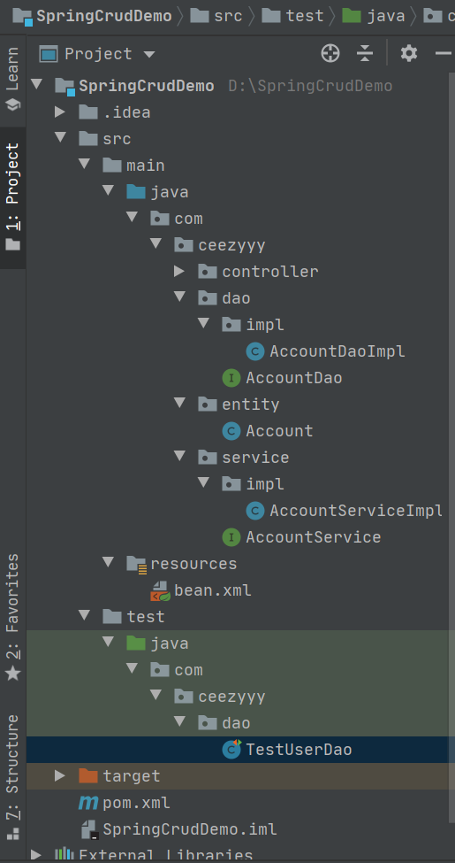 </div><br>


### 7.3 项目分析

1. 数据库相关

<div align="center">  </div><br>

2. `service` & `dao` & `entity`

   **Account.java**
   
   ```java
   public class Account {
       private Integer id;
       private String name;
       private Double money;
       
       // getter and setter
   }
   ```
   
   **AccountServiceImpl.java**
   
   ```java
   public class AccountServiceImpl implements AccountService {
       private AccountDao accountDao;
   
       public void setAccountDao(AccountDao accountDao) {
           this.accountDao = accountDao;
       }
       
       // override methods
   }
   ```
   
   **AccountDaoImpl.java**
   
   ```java
   public class AccountDaoImpl implements AccountDao {
       private JdbcTemplate jdbcTemplate;
       private String sql;
   
       public void setJdbcTemplate(JdbcTemplate jdbcTemplate) {
           this.jdbcTemplate = jdbcTemplate;
       }
       
       // override methods
   }
   ```

3. `bean` 注入 `Spring` 容器

   **bean.xml**

   ```xml
   <?xml version="1.0" encoding="UTF-8"?>
   <beans xmlns="http://www.springframework.org/schema/beans"
          xmlns:xsi="http://www.w3.org/2001/XMLSchema-instance"
          xsi:schemaLocation="http://www.springframework.org/schema/beans
           https://www.springframework.org/schema/beans/spring-beans.xsd">
   
       <!--userService-->
       <bean id="accountService" class="com.ceezyyy.service.impl.AccountServiceImpl">
           <property name="accountDao" ref="accountDao"></property>
       </bean>
   
       <!--userDao-->
       <bean id="accountDao" class="com.ceezyyy.dao.impl.AccountDaoImpl">
           <property name="jdbcTemplate" ref="jdbcTemplate"></property>
       </bean>
   
       <!--jdbc template-->
       <bean id="jdbcTemplate" class="org.springframework.jdbc.core.JdbcTemplate" scope="prototype">
           <property name="dataSource" ref="dataSource"></property>
       </bean>
   
       <!--datasource-->
       <bean id="dataSource" class="com.alibaba.druid.pool.DruidDataSource">
           <property name="driverClassName" value="com.mysql.cj.jdbc.Driver"/>
           <property name="url" value="jdbc:mysql://localhost:3306/spring?serverTimezone=UTC"/>
           <property name="username" value="root"/>
           <property name="password" value="727800"/>
       </bean>
   
   
   </beans>
   ```

   

4. 测试

   **TestAccountDao.java**

   ```java
   public class TestAccountDao {
       private ApplicationContext applicationContext;
       private AccountService accountService;
   
       @Before
       public void init() {
           /**
            * Description: initialization and get bean
            * @param: []
            * @return: void
            */
           applicationContext = new ClassPathXmlApplicationContext("bean.xml");
           accountService = applicationContext.getBean("accountService", AccountService.class);
       }
       
       // test methods
   }
   ```

5. :heavy_check_mark:Succeeded!

   

### 7.4 填坑指南

1. 注入 `bean` 对象时需要注意：

   <div align="center"> 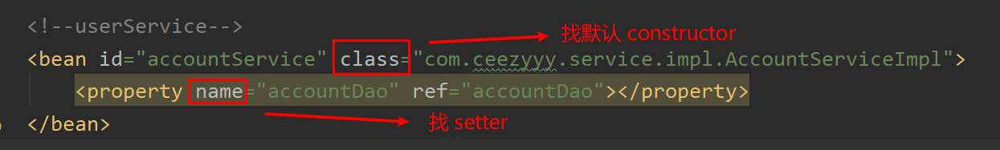 </div><br>

2. DataSource 配置

   ```xml
      <!--jdbc template-->
       <bean id="jdbcTemplate" class="org.springframework.jdbc.core.JdbcTemplate" scope="prototype">
           <property name="dataSource" ref="dataSource"></property>
       </bean>
   
       <!--datasource-->
       <bean id="dataSource" class="com.alibaba.druid.pool.DruidDataSource">
           <property name="driverClassName" value="com.mysql.cj.jdbc.Driver"/>
           <property name="url" value="jdbc:mysql://localhost:3306/spring?serverTimezone=UTC"/>
           <property name="username" value="root"/>
           <property name="password" value="727800"/>
       </bean>
   ```

   > 若不使用数据库连接池，程序频繁地向 **DB** 请求并获取数据显然不是一个明智的选择
   >
   > 这里我们选用阿里的 **Druid** 连接池

   1. `datasource` 配置属性可以翻阅 `documentation` 和 `Github` 查阅

      一定要准确，否则会 `error`

   2. 搜索某个类的全限定类名可以使用全局搜索

3. `Jdbc Template` 作用范围是多例（连接池中不可能只有单例）


## 8. IOC Demo (Annotation)


## 9. Spring 整合 Junit

### 9.1 原理

`Junit` 是单元测试框架，`Spring` 的存在并不会影响他的功能

但 `Spring` 集合其他优秀的框架是 `Spring` 的优势之一

<div align="center"> 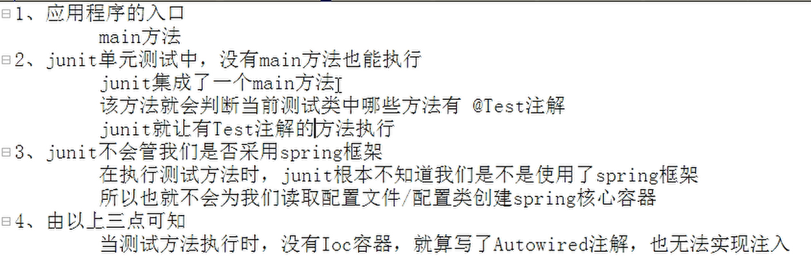 </div><br>

### 9.2 实现

**TestAccountDao.java**

```java
@RunWith(SpringJUnit4ClassRunner.class)
@ContextConfiguration(locations = {"classpath:bean.xml"})
public class TestAccountDao {
    @Autowired
    private AccountService accountService;
    
    // test methods
}
```


- `@RunWith(SpringJUnit4ClassRunner.class)` ：整合 `Spring` 和 `Junit` 的核心代码
- `@ContextConfiguration` ：说明当前的配置方式：注解 or `xml`，并给出路径
- `@Autowired`：自动装配（这里是唯一的 `accountService` 所以用该注解）


**好处：**

测试与开发分开，让测试人员更沉浸于测试

省去写 `ApplicationContext` 获取 `Spring` 容器的步骤


## 10. AOP 前夕

### 10.1 转帐事务

除了基本的单表 `CRUD` ，我们新增一个功能：

转帐

**AccountService.java**

```java
 // transfer
    boolean transfer(int from, int to, double amount);
```

**AccountServiceImpl.java**

```java
    public boolean transfer(int from, int to, double amount) {
        /**
         * Description: transfer amount from a to b
         * @param: [from, to, amount]
         * @return: boolean
         */
        // find account by id
        Account a = accountDao.findAccountById(from);
        Account b = accountDao.findAccountById(to);
        // check account
        if (a != null && b != null) {
            // money available
            if (a.getMoney() >= amount) {
                // transfer
                a.setMoney(a.getMoney() - amount);
                b.setMoney(b.getMoney() + amount);
                // update
                accountDao.updateAccount(a);
                accountDao.updateAccount(b);
                return true;
            }
        }
        return false;
    }
```


在普通情况下，测试成功

但如果程序异常中断呢？

比如，我们在更新 `b` 账户之前故意设置一个 `error` ：

<div align="center"> 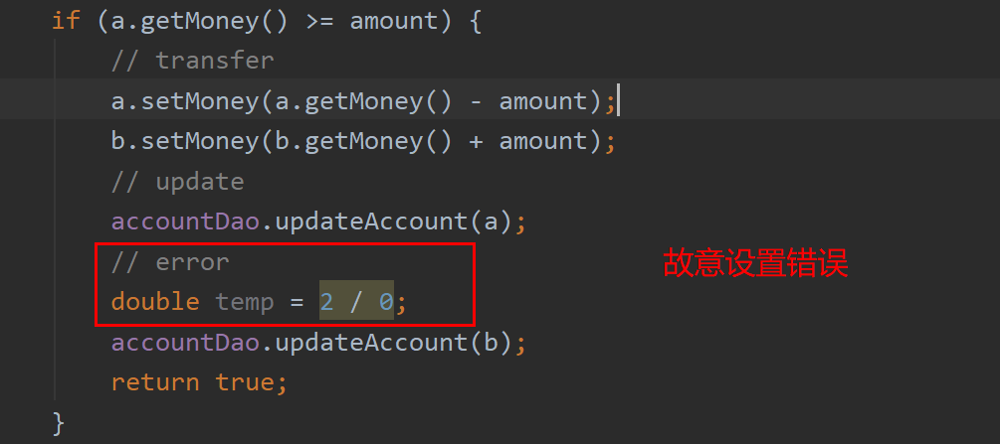 </div><br>

转账之前：

<div align="center"> 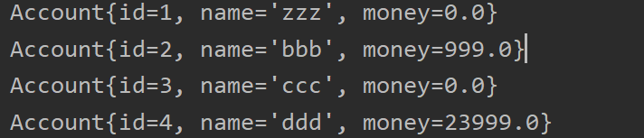 </div><br>

转账之后：

<div align="center"> 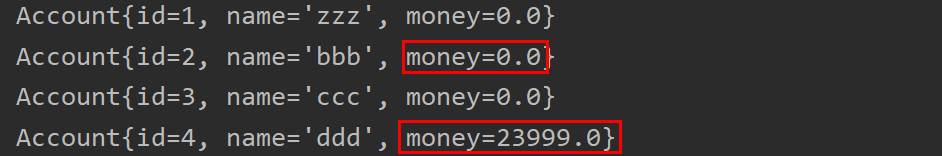 </div><br>

999 元不翼而飞，显然，这种情况在现实生活中一旦发生，后果不堪设想！

**那为什么会失败呢？**

<div align="center"> 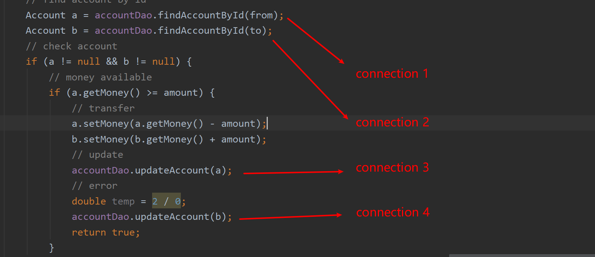 </div><br>

在 `transfer()` 方法中有 4 个 `connection`，每个 `connection` 成功就被 `commit`，所以会造成上述情况

我们要确保每个业务逻辑都使用同个 `connection`


**:warning:注意：**

测试的时候一定要多几组 `testcase` ！！！否则发现不了 `bug` （多刷 `LC`）


### 10.2 Threadlocal 快速入门

#### 10.2.1 什么是 Threadlocal?

<div align="center"> 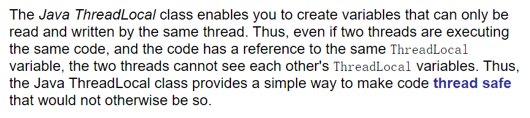 </div><br>

举个例子：

**Main.java**

```java
public class Main {

    public static void main(String[] args) {
        Demo demo = new Demo();
        // create threads
        for (int i = 0; i < 10; i++) {
            Thread thread = new Thread(new Runnable() {
                @Override
                public void run() {
                    // save and get
                    demo.setContent(Thread.currentThread().getName() + "'s data");
                    System.out.println();
                    System.out.println(Thread.currentThread().getName() + " gets data from " + demo.getContent());
                }
            });
            thread.start();
        }
    }
}
```

每个线程的任务是设置变量值，然后再请取出变量值

但是，Java 中线程是抢占式调度，并发访问变量时会出问题

<div align="center">  </div><br>


#### 10.2.2 为什么要用 Threadlocal?

`Threadlocal` 为并发时解决访问变量问题而生

目的是确保线程安全，互不影响


#### 10.2.3 Threadlocal 与 Synchronized 区别

|      | synchronized                             | Threadlocal                                                  |
| ---- | ---------------------------------------- | ------------------------------------------------------------ |
| 原理 | 时间换空间，提供一份变量，让线程排队访问 | 空见换时间，为每个线程提供了一份变量的副本，从而时间同时访问并互不干扰 |
| 侧重 | 多线程间访问资源同步                     | 多线程间每个线程数据互相隔离                                 |


### 10.3 代理

#### 10.3.1 代理模式


<div align="center"> 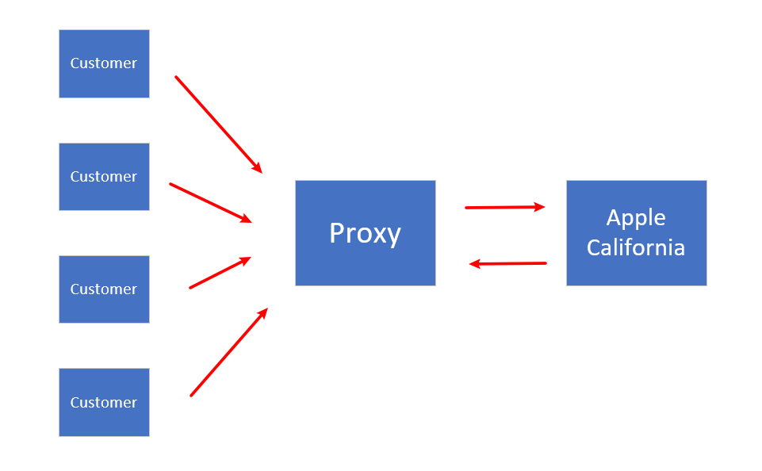 </div><br>

举个例子，`apple` 公司的总部在美国加利福尼亚，为了将自己的产品销售到全国各地，`apple` 下有许多代理，每个代理下也有二级代理，三级代理......


<div align="center"> 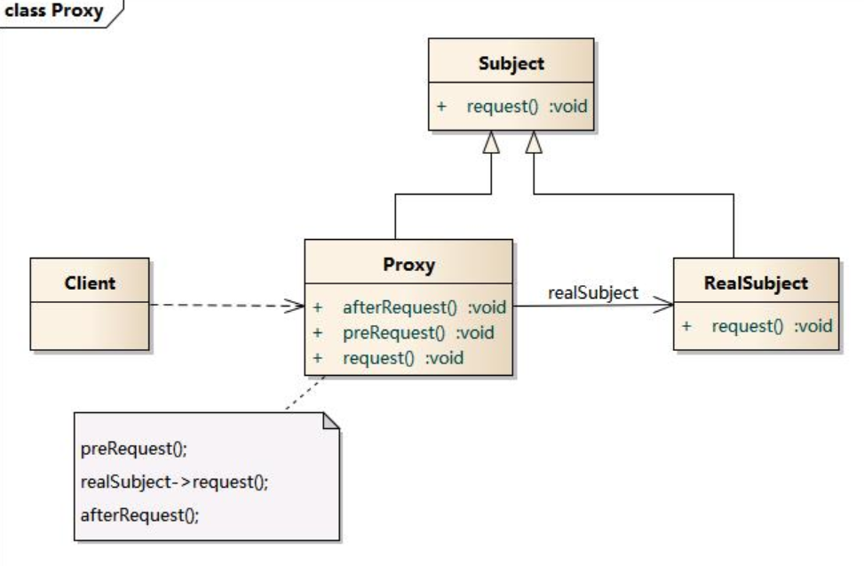 </div><br>

代理模式的好处：


#### 10.3.2 静态代理

话不多说，直接上代码

`Producer` 接口，定义了一套商家规范（必须提供售卖和售后服务）

**Producer.java**

```java
public interface Producer {
    void sell(double money);

    void afterSalesService();
}
```


`ProducerImpl` 生产者，遵循（实现）规范（接口）

**ProducerImpl.java**

```java
public class ProducerImpl implements Producer {

    public void sell(double money) {
        System.out.println("Things sold, get " + money + " usd");
    }

    public void afterSalesService() {
        System.out.println("Provide after-sales service");
    }
}
```


`Proxy` 代理商，在生产者的基础上对方法进行了增强（比如说提供售前推荐和售后线下指导）

**Proxy.java**

```java
public class Proxy {
    private Producer producer = new ProducerImpl();

    public void setProducer(Producer producer) {
        this.producer = producer;
    }

    public void doSomethingBefore() {
        System.out.println("Do something before");
    }

    public void sell(double money) {
        producer.sell(money);
    }

    public void afterSalesService() {
        producer.afterSalesService();
    }

    public void doSomethingAfter() {
        System.out.println("Do something after");
    }
}
```

`Client` 客户，直接与 `proxy` 打交道，不直接接触 `producer`

**ClientStatic.java**

```java
public class ClientStatic {
    private static Proxy proxy = new Proxy();

    public static void main(String[] args) {
        proxy.doSomethingBefore();
        proxy.sell(20000);
        proxy.doSomethingAfter();
    }
}
```


:heavy_check_mark:Succeeded!

<div align="center">  </div><br>

静态代理的**缺陷**：

- 违反了对扩展开发，对修改关闭的设计原则

  


#### 10.3.3 基于接口的动态代理

<div align="center">  </div><br>

**动态代理** 即 **动态** :heavy_plus_sign: **代理**

**Producer.java**

```java
public interface Producer {
    void sell(double money);

    void afterSalesService();
}
```

**ProducerImpl.java**

```java
public class ProducerImpl implements Producer {

    public void sell(double money) {
        System.out.println("Things sold, get " + money + " usd");
    }

    public void afterSalesService() {
        System.out.println("Provide after-sales service");
    }
}
```

**Client.java**

```java
public class Client {
    public static void main(String[] args) {
        // include producer
        final ProducerImpl producer = new ProducerImpl();
        // create proxyProducer
        Producer proxyProducer = (Producer) Proxy.newProxyInstance(producer.getClass().getClassLoader(), producer.getClass().getInterfaces(), new InvocationHandler() {
            // enhance method
            public Object invoke(Object o, Method method, Object[] objects) throws Throwable {
                if ("sell".equals(method.getName())) {
                    // get parameters
                    Double money = (Double) objects[0];
                    // With the Method instance in place,
                    // we can now call invoke() to execute the underlying method and get the returned object.
                    return method.invoke(producer, money * 0.8);
                }
                return method.invoke(producer, objects);
            }
        });
        proxyProducer.sell(10000);
        proxyProducer.afterSalesService();
    }
}
```


`newProxyInstance()` 源码：

<div align="center"> 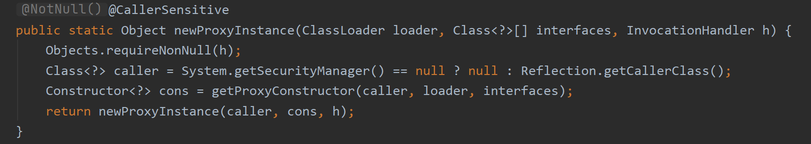 </div><br>

显然，要求提供的参数：你代理谁？遵循什么规范？是否方法增强？


- `loader`：类加载器对象，使用的是 `producer` 类加载器（`proxy` 只是搬运工）

- `interfaces`：遵循的规范（接口）

- `InvocationHandler`：

  源码：
  
<div align="center">  </div><br>

利用 `reflect` 调用方法


## 11. AOP

### 11.1 什么是 AOP？


面向切片编程

通过预编译以及运行期间动态代理实现程序功能的统一维护的一种技术

利用 `AOP` 可以对业务逻辑各个部分进行隔离，降低耦合度，提高程序可重用性


### 11.2 为什么要有 AOP 思想？

**主要功能**

- 日志记录
- 性能统计
- 安全控制
- 事务处理
- 异常处理


**主要意图**

将以上功能代码从业务逻辑中划分出来，对行为进行隔离，进而改变这些行为 的时候不影响业务逻辑的代码


## 12. Spring 中的 AOP

### 12.1 AOP 相关术语

<div align="center">  </div><br>

- `Join Points`：
- `Pointcut`：
- `Advice`：


<div align="center">  </div><br>

`Visualization` 是总是容易帮人理解的！

<div align="center"> 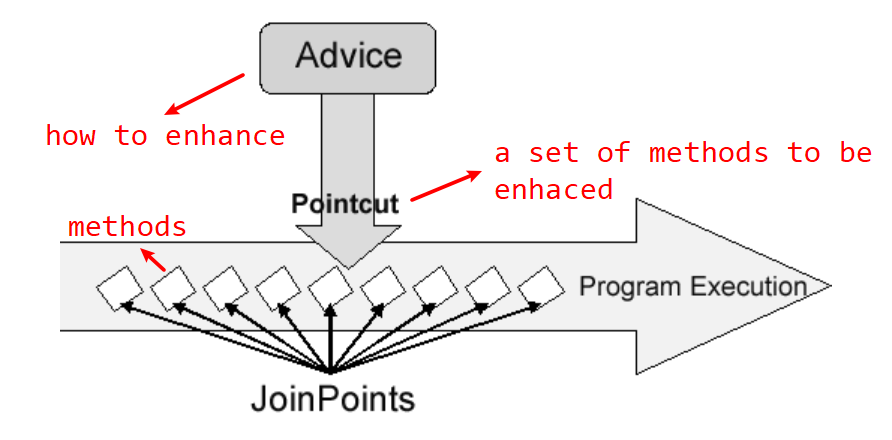 </div><br>


### 12.2 Spring 基于 XML 的 AOP

**项目结构**

<div align="center"> 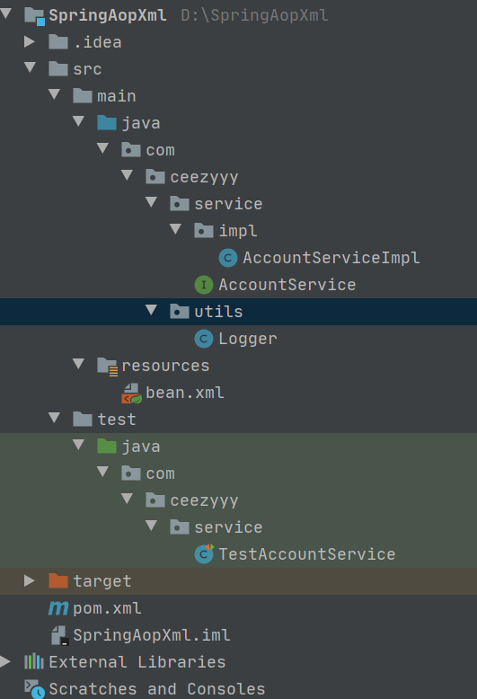 </div><br>

**测试 findAllAccounts 方法**

**AccountService.java**

```java
public interface AccountService {
    boolean saveAccount();

    void findAccountById(int id);

    void findAllAccounts();

}
```

**AccountServiceImpl.java**

```java
public class AccountServiceImpl implements AccountService {

    public AccountServiceImpl() {
    }

    public boolean saveAccount() {
        System.out.println("Account saved!");
        return true;
    }

    public void findAccountById(int id) {
        System.out.println("This is Account " + id);
    }

    public void findAllAccounts() {
        System.out.println("This is all accounts!");

    }
}
```

**bean.xml**

```xml
<?xml version="1.0" encoding="UTF-8"?>
<beans xmlns="http://www.springframework.org/schema/beans"
       xmlns:xsi="http://www.w3.org/2001/XMLSchema-instance"
       xmlns:aop="http://www.springframework.org/schema/aop"
       xsi:schemaLocation="http://www.springframework.org/schema/beans
        https://www.springframework.org/schema/beans/spring-beans.xsd
        http://www.springframework.org/schema/aop
        https://www.springframework.org/schema/aop/spring-aop.xsd">

    <!--accountService-->
    <bean id="accountService" class="com.ceezyyy.service.impl.AccountServiceImpl"></bean>

    <!--logger-->
    <bean id="logger" class="com.ceezyyy.utils.Logger"></bean>

    <aop:config>
        <aop:aspect id="loggerAdvice" ref="logger">
            <aop:before method="log"
                        pointcut="execution(public boolean com.ceezyyy.service.impl.AccountServiceImpl.saveAccount())"></aop:before>
        </aop:aspect>
    </aop:config>

</beans>
```


:heavy_check_mark:Succeeded!

<div align="center"> 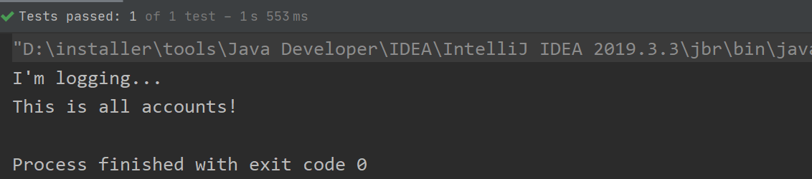 </div><br>


**测试 findAllAccounts 方法**

修改 `pointcut`：

```xml
<aop:config>
        <aop:aspect id="loggerAdvice" ref="logger">
            <aop:before method="log"
                        pointcut="execution(public boolean com.ceezyyy.service.impl.AccountServiceImpl.saveAccount())"></aop:before>
        </aop:aspect>
</aop:config>
```

:heavy_check_mark:Succeeded!


<div align="center"> 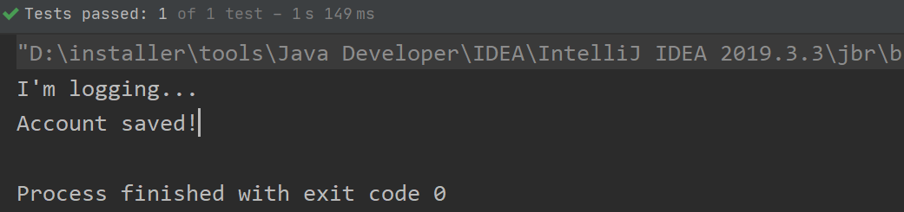 </div><br>

**测试 findAccoutById 方法**

修改 `pointcut`：

```xml
<aop:config>
        <aop:aspect id="loggerAdvice" ref="logger">
            <aop:before method="log"
                        pointcut="execution(public void com.ceezyyy.service.impl.AccountServiceImpl.findAccountById(..)) "></aop:before>
        </aop:aspect>
</aop:config>
```


:heavy_check_mark:Succeeded!


<div align="center">  </div><br>

### 12.3 pointcut 表达式

**常用写法**

<div align="center"> 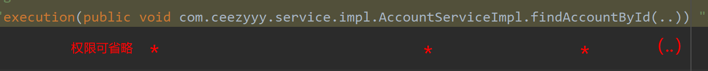 </div><br>

- 函数返回值：通配符 `*`
- 类名 / 方法名：通配符 `*` （例如 `service` 下所有类以及业务逻辑方法）
- 函数参数：`(..)` 可有可无参数

**bean.xml**

```xml
<aop:config>
        <aop:aspect id="loggerAdvice" ref="logger">
            <aop:before method="log"
                        pointcut="execution(* com.ceezyyy.service.impl.*.*(..)) "></aop:before>
        </aop:aspect>
</aop:config>
```

:heavy_check_mark:Succeeded!

<div align="center">  </div><br>


### 12.4 四种通知类型

**Logger.java**

```java
public class Logger {
    public void before() {
        System.out.println("Before logging...");
    }

    public void afterReturning() {
        System.out.println("After returning logging...");
    }

    public void afterThrowing() {
        System.out.println("After throwing logging...");
    }

    public void after() {
        System.out.println("After logging...");
    }
}
```

**bean.xml**

```xml
<aop:config>
        <aop:aspect id="loggerAdvice" ref="logger">
            <aop:before method="before"
                        pointcut="execution(* com.ceezyyy.service.impl.*.*(..))"></aop:before>

            <aop:after-returning method="afterReturning"
                                 pointcut="execution(* com.ceezyyy.service.impl.*.*(..))"></aop:after-returning>

            <aop:after-throwing method="afterThrowing"
                                pointcut="execution(* com.ceezyyy.service.impl.*.*(..))"></aop:after-throwing>

            <aop:after method="after" pointcut="execution(* com.ceezyyy.service.impl.*.*(..))"></aop:after>
        </aop:aspect>
</aop:config>
```


**正常情况**

:heavy_check_mark:Succeeded!

<div align="center"> 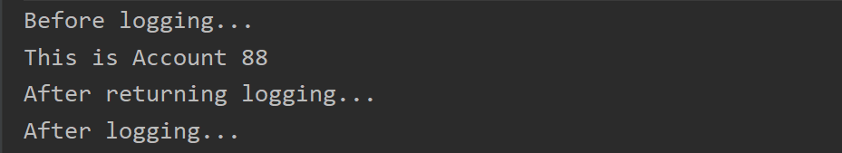 </div><br>


**异常情况**

在 `pointcut` 设置错误


<div align="center"> 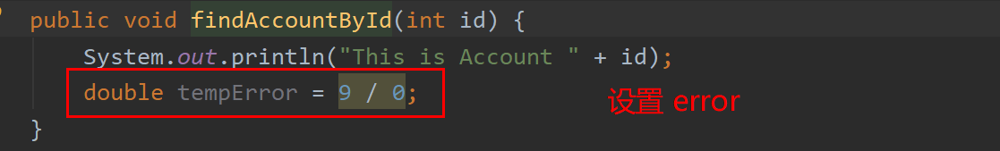 </div><br>

:heavy_check_mark:Succeeded!


<div align="center"> 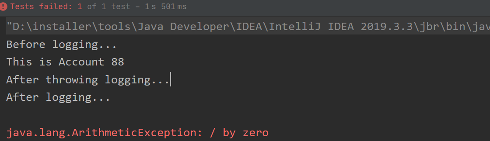 </div><br>

**:warning:注意**

- `after-returning` 是 `pointcut` 正常执行后才执行的，相当于在 `try` 中 
- `after-throwing` 是 `pointcut` 执行异常才执行的，相当于在 `catch` 中
- `after` 是无论 `pointcut` 是否执行与否都执行，相当于 `finally` 中


### 12.5 通用化切入点表达式

**bean.xml**

```xml
<aop:config>
        <aop:aspect id="loggerAdvice" ref="logger">
            <aop:pointcut id="pt1" expression="execution(* com.ceezyyy.service.impl.*.*(..))"/>
            <aop:before method="before"
                        pointcut-ref="pt1"></aop:before>

            <aop:after-returning method="afterReturning"
                                 pointcut-ref="pt1"></aop:after-returning>

            <aop:after-throwing method="afterThrowing"
                                pointcut-ref="pt1"></aop:after-throwing>

            <aop:after method="after" pointcut-ref="pt1"></aop:after>
        </aop:aspect>
</aop:config>
```


### 12.6 Spring 基于 annotation 的 AOP


## 12. Jdbc Template

### 12.1 Create Example

```java
public void createAccount(Account account) {
        try {
            sql = "insert into account(name, money) values (?,?)";
            jdbcTemplate.update(sql, account.getName(), account.getMoney());
        } catch (DataAccessException e) {
            e.printStackTrace();
        }
    }
```


### 12.2 Read all Example

```java
public List<Account> findAll() {
        List<Account> accounts = null;
        try {
            sql = "select id, name, money from account";
            accounts = jdbcTemplate.query(sql, new BeanPropertyRowMapper<Account>(Account.class));
        } catch (DataAccessException e) {
            e.printStackTrace();
        }
        return accounts;
    }
```


### 12.3 Read one Example

```java
public Account findAccountById(int id) {
        List<Account> accounts = null;
        try {
            sql = "select id, name, money from account where id = ?";
            accounts = jdbcTemplate.query(sql, new BeanPropertyRowMapper<Account>(Account.class), id);
        } catch (DataAccessException e) {
            e.printStackTrace();
        }
        return accounts == null ? null : accounts.get(0);
    }
```


### 12.4 Update Example

```java
public void updateAccount(Account account) {
        try {
            sql = "update account set name = ?, money = ? where id = ?";
            jdbcTemplate.update(sql, account.getName(), account.getMoney(), account.getId());
        } catch (DataAccessException e) {
            e.printStackTrace();
        }
    }
```


### 12.5 Delete Example

```java
public void deleteAccountById(int id) {
        try {
            sql = "delete from account where id = ?";
            jdbcTemplate.update(sql, id);
        } catch (DataAccessException e) {
            e.printStackTrace();
        }
    }
```


## 13. Spring 中事务控制

### 13.1 为什么事务加在 service 层？

<div align="center"> 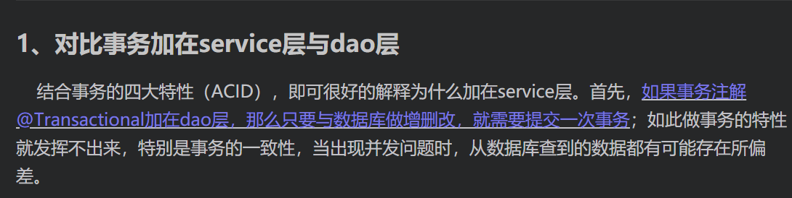 </div><br>

### 13.2 基于 XML 声明式事务控制

**pom.xml**

```xml
<!-- https://mvnrepository.com/artifact/org.springframework/spring-tx -->
<dependency>
    <groupId>org.springframework</groupId>
    <artifactId>spring-tx</artifactId>
    <version>5.2.2.RELEASE</version>
</dependency>
```

**bean.xml**

```xml
<beans xmlns="http://www.springframework.org/schema/beans"
       xmlns:xsi="http://www.w3.org/2001/XMLSchema-instance"
       xmlns:aop="http://www.springframework.org/schema/aop"
       xmlns:tx="http://www.springframework.org/schema/tx"
       xsi:schemaLocation="
        http://www.springframework.org/schema/beans
        https://www.springframework.org/schema/beans/spring-beans.xsd
        http://www.springframework.org/schema/tx
        https://www.springframework.org/schema/tx/spring-tx.xsd
        http://www.springframework.org/schema/aop
        https://www.springframework.org/schema/aop/spring-aop.xsd">

    <!--accountService-->
    <bean id="accountService" class="com.ceezyyy.service.impl.AccountServiceImpl">
        <property name="accountDao" ref="accountDao"></property>
    </bean>

    <!--accountDao-->
    <bean id="accountDao" class="com.ceezyyy.dao.impl.AccountDaoImpl">
        <property name="jdbcTemplate" ref="jdbcTemplate"></property>
    </bean>

    <!--jdbc template-->
    <bean id="jdbcTemplate" class="org.springframework.jdbc.core.JdbcTemplate">
        <property name="dataSource" ref="dataSource"></property>
    </bean>

    <!--dataSource-->
    <bean id="dataSource" class="org.springframework.jdbc.datasource.DriverManagerDataSource">
        <property name="driverClassName" value="com.mysql.cj.jdbc.Driver"></property>
        <property name="url" value="jdbc:mysql://localhost:3306/spring?serverTimezone=UTC"></property>
        <property name="username" value="root"></property>
        <property name="password" value="727800"></property>
    </bean>
    
    <!--transactionManager-->
    <bean id="txManager" class="org.springframework.jdbc.datasource.DataSourceTransactionManager">
        <property name="dataSource" ref="dataSource"/>
    </bean>

    <!-- the transactional advice (what 'happens'; see the <aop:advisor/> bean below) -->
    <tx:advice id="txAdvice" transaction-manager="txManager">
        <!-- the transactional semantics... -->
        <tx:attributes>
            <!-- all methods starting with 'get' are read-only -->
            <tx:method name="find*" read-only="true"/>
            <!-- other methods use the default transaction settings (see below) -->
            <tx:method name="*"/>
        </tx:attributes>
    </tx:advice>

    <!-- ensure that the above transactional advice runs for any execution
        of an operation defined by the  interface -->
    <aop:config>
        <aop:pointcut id="pt1" expression="execution(* com.ceezyyy.service.impl.*.*(..))"/>
        <aop:advisor advice-ref="txAdvice" pointcut-ref="pt1"/>
    </aop:config>

</beans>
```

**多看官方文档！**

**多看官方文档！**

**多看官方文档！**


<div align="center"> 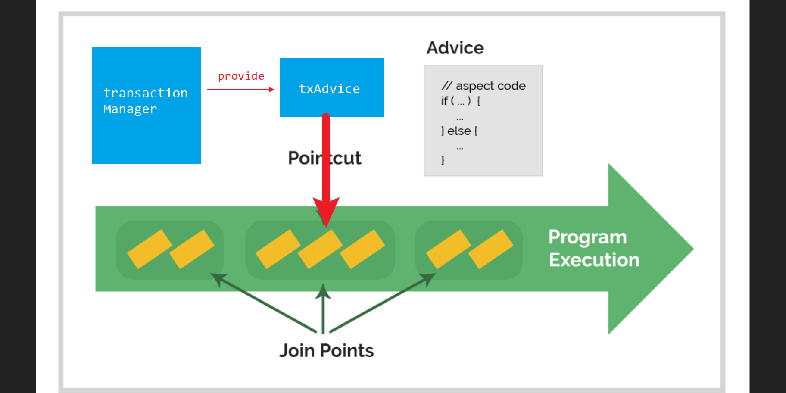 </div><br>

**测试前**

<div align="center"> 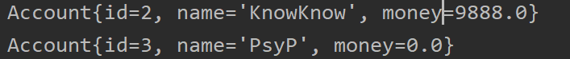 </div><br>

**TestAccountService.java**

```java
@Test
public void testTransfer() {
    boolean transfer = accountService.transferById(2, 3, 9888);
    System.out.println(transfer);
}
```

<div align="center"> 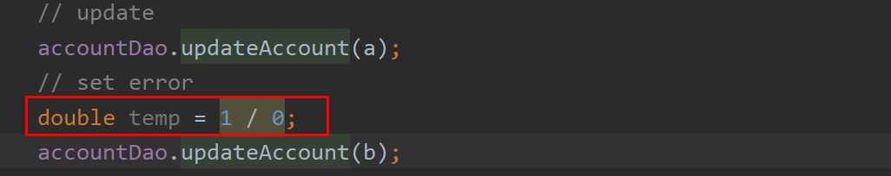 </div><br>


**测试后**

<div align="center"> 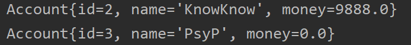 </div><br>

:heavy_check_mark:Succeeded!

### 13.3 基于注解声明式事务控制


