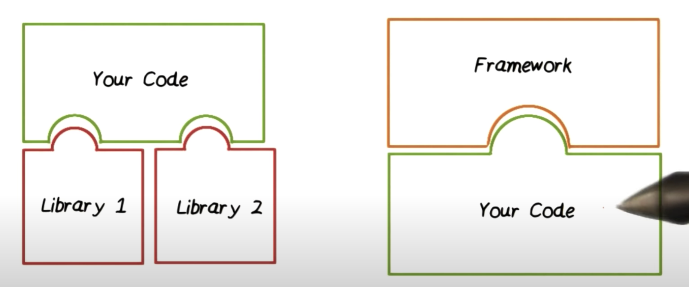

# Spring 核心思想

Table of Contents
-----------------

* [Brainstorming](#brainstorming)
* [1. IoC](#1-ioc)
   * [1.1 什么是 IoC?](#11-什么是-ioc)
   * [1.2 为什么要使用 IoC?](#12-为什么要使用-ioc)
   * [1.3 IoC 在 Spring 中如何实现?](#13-ioc-在-spring-中如何实现)
* [References](#references)

## Brainstorming

  
 

## 1. IoC

### 1.1 什么是 IoC?

`IoC` 即 Inversion of Control

> Hollywood Principle states, “Don’t Call Us, We’ll Call You.”

举个例子，

- 未使用 framework：大部分是自己的代码，但在某小部分地方需要引用到其他的库函数，只需 `import` 包，紧接着 `new` 对象，进行方法调用

- 使用 framework：framework 是程序的主体，我们写的代码只是作为其一部分，这时只需要将代码交给 framework 管理，让他在恰当的时候调用，以完成功能

  
 

### 1.2 IoC 在 Spring 中如何实现?

## References

- [What is Inversion of Control?](https://stackoverflow.com/questions/3058/what-is-inversion-of-control)
- [Inversion of Control](https://www.youtube.com/watch?v=vFzP2SaMyA0)

