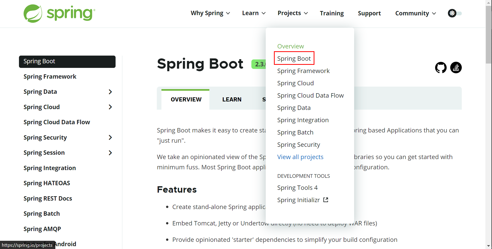
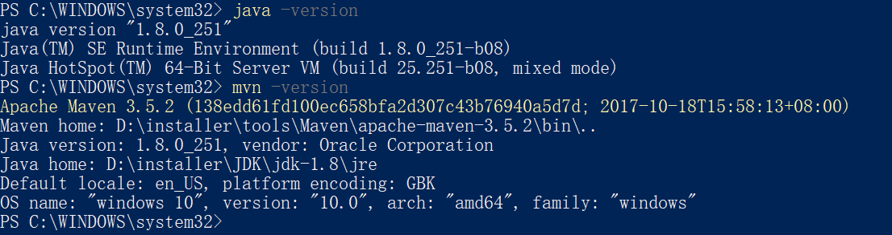
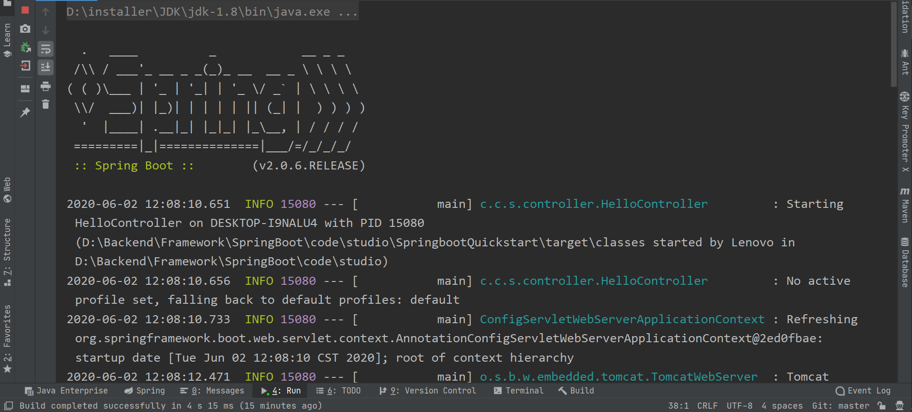
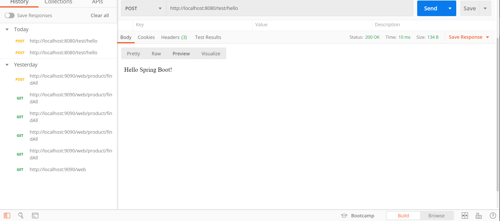

# SpringBoot

<div align="center">  </div><br>

## 目录

* [0. Springboot 2.0.6 Reference Guide](#0-springboot-206-reference-guide)
* [1. 了解 Springboot](#1----springboot)
  + [1.1 What is springboot?](#11-what-is-springboot-)
  + [1.2 Why we use springboot?](#12-why-we-use-springboot-)
* [2. Springboot Quickstart](#2-springboot-quickstart)


## 0. Springboot 2.0.6 Reference Guide

[Springboot 2.0.6 Reference Guide](https://docs.spring.io/spring-boot/docs/2.0.6.RELEASE/reference/html/)


## 1. 了解 Springboot

### 1.1 What is springboot?

Spring Boot makes it easy to create stand-alone, production-grade Spring based Applications that you can "just run".

We take an opinionated view of the Spring platform and third-party libraries so you can get started with minimum fuss. Most Spring Boot applications need minimal Spring configuration.


### 1.2 Why we use springboot?


<div align="center">  </div><br>
- Create stand-alone Spring applications
- Embed Tomcat, Jetty or Undertow directly (no need to deploy WAR files)
- Provide opinionated 'starter' dependencies to **simplify your build configuration**
- **Automatically configure Spring and 3rd party libraries** whenever possible
- Provide production-ready features such as metrics, health checks, and externalized configuration
- Absolutely no code generation and **no requirement for XML configuration**


## 2. Springboot Quickstart

1. 查看环境


<div align="center">  </div><br>

2. 创建 `maven` 工程

   **pom.xml**

   ```xml
   <?xml version="1.0" encoding="UTF-8"?>
   <project xmlns="http://maven.apache.org/POM/4.0.0"
            xmlns:xsi="http://www.w3.org/2001/XMLSchema-instance"
            xsi:schemaLocation="http://maven.apache.org/POM/4.0.0 http://maven.apache.org/xsd/maven-4.0.0.xsd">
       <modelVersion>4.0.0</modelVersion>
   
       <groupId>com.ceezyyy.springboot</groupId>
       <artifactId>SpringbootQuickstart</artifactId>
       <version>1.0-SNAPSHOT</version>
   
       <parent>
           <groupId>org.springframework.boot</groupId>
           <artifactId>spring-boot-starter-parent</artifactId>
           <version>2.0.6.RELEASE</version>
       </parent>
   
       <!-- Additional lines to be added here... -->
   
       <dependencies>
           <dependency>
               <groupId>org.springframework.boot</groupId>
               <artifactId>spring-boot-starter-web</artifactId>
           </dependency>
       </dependencies>
   
       <repositories>
           <repository>
               <id>aliyun-repos</id>
               <url>http://maven.aliyun.com/nexus/content/groups/public/</url>
               <snapshots>
                   <enabled>false</enabled>
               </snapshots>
           </repository>
       </repositories>
       <pluginRepositories>
           <pluginRepository>
               <id>aliyun-plugin</id>
               <url>http://maven.aliyun.com/nexus/content/groups/public/</url>
               <snapshots>
                   <enabled>false</enabled>
               </snapshots>
           </pluginRepository>
       </pluginRepositories>
   
   </project>
   ```

3. 编写 `Controller` 以及 `main` 函数

   **HelloController.java**

   ```java
   @RestController
   @RequestMapping("/test")
   @EnableAutoConfiguration
   public class HelloController {
   
       @RequestMapping("/hello")
       public String hello() {
           return "Hello Spring Boot!";
       }
   
       public static void main(String[] args) {
           SpringApplication.run(HelloController.class, args);
       }
   
   
   }
   ```

4. :heavy_check_mark:Build Succeeded!

   <div align="center">  </div><br>

   <div align="center">  </div><br>


  

