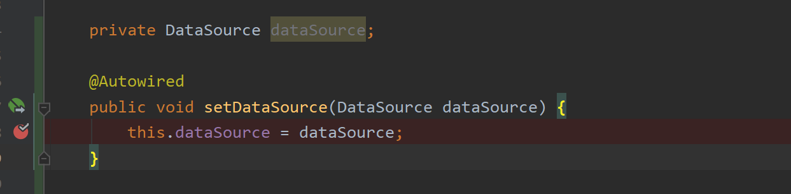
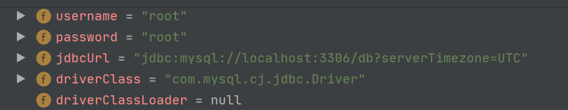
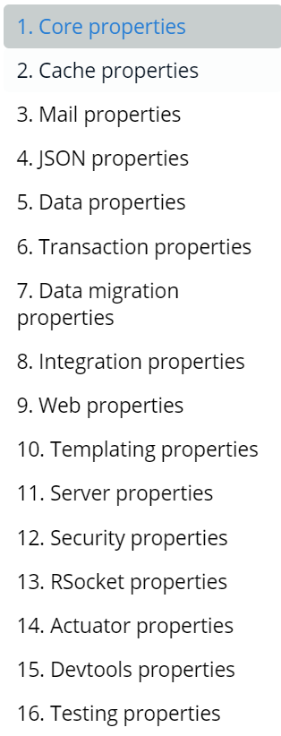
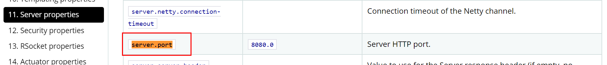
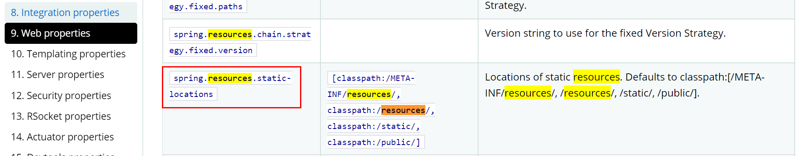
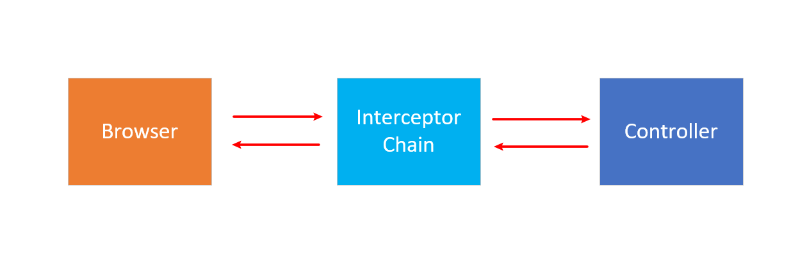
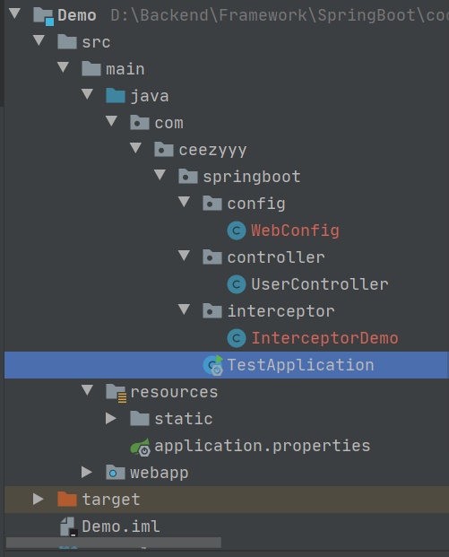
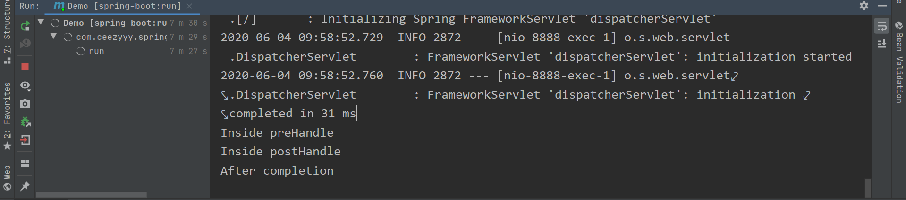
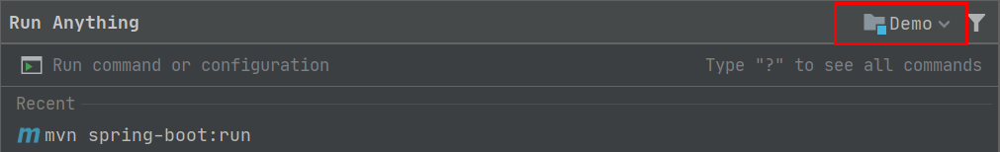

# SpringBoot

<div align="center">  </div><br>

## 目录

* [0. Reference Guide](#0-reference-guide)
* [1. 了解 Springboot](#1----springboot)
  + [1.1 What is springboot](#11-what-is-springboot)
  + [1.2 Why we use springboot](#12-why-we-use-springboot)
* [2. Springboot Quickstart](#2-springboot-quickstart)
* [3. Springboot Quickstart Pro](#3-springboot-quickstart-pro)
* [4. JavaConfig](#4-javaconfig)
  + [4.1 Annotation in Spring](#41-annotation-in-spring)
  + [4.2 DataSourceConfig](#42-datasourceconfig)
* [5. Properties With Spring Boot](#5-properties-with-spring-boot)
* [6. Springboot Demo](#6-springboot-demo)
  + [6.1 Springmvc](#61-springmvc)
    - [6.1.1 Server port](#611-server-port)
    - [6.1.2 Static resources](#612-static-resources)
    - [6.1.3 Interceptor](#613-interceptor)
  + [6.2 Datasource](#62-datasource)
  + [6.3 Mybatis](#63-mybatis)
  + [6.4 填坑指南](#64-----)


## 0. Reference Guide

[Springboot 2.0.6 Reference Guide](https://docs.spring.io/spring-boot/docs/2.0.6.RELEASE/reference/html/)

[Learn Spring Boot](https://www.baeldung.com/spring-boot)


## 1. 了解 Springboot

### 1.1 What is springboot

Spring Boot makes it easy to create stand-alone, production-grade Spring based Applications that you can "just run".

We take an opinionated view of the Spring platform and third-party libraries so you can get started with minimum fuss. Most Spring Boot applications need minimal Spring configuration.


### 1.2 Why we use springboot


<div align="center">  </div><br>
- Create stand-alone Spring applications
- Embed Tomcat, Jetty or Undertow directly (no need to deploy WAR files)
- Provide opinionated 'starter' dependencies to **simplify your build configuration**
- **Automatically configure Spring and 3rd party libraries** whenever possible
- Provide production-ready features such as metrics, health checks, and externalized configuration
- Absolutely no code generation and **no requirement for XML configuration**


## 2. Springboot Quickstart

先查看本地环境


<div align="center">  </div><br>

创建 `maven` 工程，编写 `pom.xml`，并更换镜像 

**pom.xml**

```xml
<?xml version="1.0" encoding="UTF-8"?>
<project xmlns="http://maven.apache.org/POM/4.0.0"
         xmlns:xsi="http://www.w3.org/2001/XMLSchema-instance"
         xsi:schemaLocation="http://maven.apache.org/POM/4.0.0 http://maven.apache.org/xsd/maven-4.0.0.xsd">
    <modelVersion>4.0.0</modelVersion>

    <groupId>com.ceezyyy.springboot</groupId>
    <artifactId>SpringbootQuickstart</artifactId>
    <version>1.0-SNAPSHOT</version>

    <parent>
        <groupId>org.springframework.boot</groupId>
        <artifactId>spring-boot-starter-parent</artifactId>
        <version>2.0.6.RELEASE</version>
    </parent>

    <!-- Additional lines to be added here... -->

    <dependencies>
        <dependency>
            <groupId>org.springframework.boot</groupId>
            <artifactId>spring-boot-starter-web</artifactId>
        </dependency>
    </dependencies>

    <repositories>
        <repository>
            <id>aliyun-repos</id>
            <url>http://maven.aliyun.com/nexus/content/groups/public/</url>
            <snapshots>
                <enabled>false</enabled>
            </snapshots>
        </repository>
    </repositories>
    <pluginRepositories>
        <pluginRepository>
            <id>aliyun-plugin</id>
            <url>http://maven.aliyun.com/nexus/content/groups/public/</url>
            <snapshots>
                <enabled>false</enabled>
            </snapshots>
        </pluginRepository>
    </pluginRepositories>

</project>
```

编写测试的 `controller`

**HelloController.java**

```java
@RestController
@RequestMapping("/test")
@EnableAutoConfiguration
public class HelloController {

    @RequestMapping("/hello")
    public String hello() {
        return "Hello Spring Boot!";
    }

    public static void main(String[] args) {
        SpringApplication.run(HelloController.class, args);
    }


}
```

:hammer: 启动项目

```bash
mvn spring-boot:run
```

<div align="center">  </div><br>

:heavy_check_mark:Build Succeeded!

<div align="center">  </div><br>

<div align="center">  </div><br>


## 3. Springboot Quickstart Pro

**目录结构**

<div align="center">  </div><br>


添加一个引导类

**TestApplication.java**

```java
@EnableAutoConfiguration
@ComponentScan
public class TestApplication {
    public static void main(String[] args) {
        SpringApplication.run(TestApplication.class, args);
    }

}
```

`@EnableAutoConfiguration`：开启 `springboot` 自动配置

`@ComponentScan`：开启包扫描（注入 `controller`，`service`，`dao` 到 `Spring IoC Container`）

甚至，可以更简单

**TestApplication.java**

```java
@SpringBootApplication
public class TestApplication {
    public static void main(String[] args) {
        SpringApplication.run(TestApplication.class, args);
    }

}
```


**HelloController.java**

```java
@RestController
@RequestMapping("/hello")
public class HelloController {

    @RequestMapping("/test")
    public String test() {
        return "Hello Spring Boot!";
    }

}
```


**UserController.java**

```java
@RestController
@RequestMapping("/user")
public class UserController {
    @RequestMapping("/test")
    public String test() {
        return "I'm UserController";
    }

}
```


:hammer: 启动项目

:heavy_check_mark: Build Succeeded!


<div align="center">  </div><br>


<div align="center">  </div><br>


## 4. JavaConfig

基于 `Java` 类的配置是从 `Spring 3.0` 后开始流行起来的，技术永远迭代，趋势还是向封装底层，更便于开发者敏捷开发

### 4.1 Annotation in Spring

特别棒的教程！强烈推荐食用！（大致浏览一下，遇到再回来查）

- [Core - Baeldung](https://www.baeldung.com/spring-core-annotations)
- [Bean - Baeldung](https://www.baeldung.com/spring-bean-annotations)
- [Web - Baeldung](https://www.baeldung.com/spring-mvc-annotations)
- [Spring Boot - Baeldung](https://www.baeldung.com/spring-boot-annotations)


### 4.2 DataSourceConfig

通过使用 `Java Config` 方式配 `dataSource`

取代 `xml` 配置，我们使用 `Java` 配置类


引入 `Druid starter`

**pom.xml**

```xml
        <dependency>
            <groupId>com.alibaba</groupId>
            <artifactId>druid-spring-boot-starter</artifactId>
            <version>1.1.10</version>
        </dependency>
```


**db.properties**

```properties
datasource.driverClassName=com.mysql.cj.jdbc.Driver
datasource.url=jdbc:mysql://localhost:3306/db?serverTimezone=UTC
datasource.username=root
datasource.password=root
```


**DataSourceConfig.java**

```java
@Configuration
@PropertySource("classpath:db.properties")
public class DataSourceConfig {

    /* DI */
    @Value("${datasource.driverClassName}")
    private String driverClassName;

    @Value("${datasource.url}")
    private String url;

    @Value("${datasource.username}")
    private String username;

    @Value("${datasource.password}")
    private String password;

    /* Inject datasource to Spring IoC container */
    @Bean
    public DataSource dataSource() {
        DruidDataSource druidDataSource = new DruidDataSource();
        druidDataSource.setDriverClassName(driverClassName);
        druidDataSource.setUrl(url);
        druidDataSource.setUsername(username);
        druidDataSource.setPassword(password);
        return druidDataSource;

    }
}
```

:hammer: 断点测试

<div align="center">  </div><br>


:heavy_check_mark: Build Succeeded!

<div align="center">  </div><br>


**:bulb:TIPS**

- 使用 `properties` 的好处：

  敏捷，迅速修改，缓解 "牵一发而动全身" 

- `debug` 模式要在主函数中进行调用，不要用 `mvn command`


## 5. Properties With Spring Boot


## 6. Springboot Demo

### 6.1 Springmvc

在 `spring boot` 中有一个 `application.properties` 文件，

Various properties can be specified inside your application.properties file, inside your application.yml file, or as command line switches. This appendix provides a list of common Spring Boot properties and references to the underlying classes that consume them.

里面预定义了许许多多的配置

https://docs.spring.io/spring-boot/docs/current/reference/html/appendix-application-properties.html

<div align="center">  </div><br>

#### 6.1.1 Server port

**server.port**


<div align="center">  </div><br>

#### 6.1.2 Static resources

**static resources**

<div align="center">  </div><br>

#### 6.1.3 Interceptor

<div align="center">  </div><br>


<div align="center">  </div><br>

Interceptors working with the *HandlerMapping* on the framework must implement the *HandlerInterceptor* interface.

This interface contains three main methods:

- *prehandle()* – called before the actual handler is executed, but the view is not generated yet
- *postHandle()* – called after the handler is executed
- *afterCompletion() –* called after the complete request has finished and view was generated

These three methods provide flexibility to do all kinds of pre- and post-processing.

And a quick note – the main difference between *HandlerInterceptor* and *HandlerInterceptorAdapter* is that in the first one we need to override all three methods: *preHandle()*, *postHandle()* and *afterCompletion()*, whereas in the second we may implement only required methods.


**InterceptorDemo.java**

```java
public class InterceptorDemo implements HandlerInterceptor {

    @Override
    public boolean preHandle(HttpServletRequest request, HttpServletResponse response, Object handler) throws Exception {
        System.out.println("Inside preHandle");
        return true;
    }

    @Override
    public void postHandle(HttpServletRequest request, HttpServletResponse response, Object handler, ModelAndView modelAndView) throws Exception {
        System.out.println("Inside postHandle");
    }

    @Override
    public void afterCompletion(HttpServletRequest request, HttpServletResponse response, Object handler, Exception ex) throws Exception {
        System.out.println("After completion");
    }
}
```


To add our interceptors into Spring configuration, we need to override *addInterceptors()* method inside *WebConfig* class that implements *WebMvcConfigurer:*

（这里采用 `JavaConfig` 的方式配置）

**WebConfig.java**

```java
@EnableWebMvc
@Configuration
public class WebConfig extends WebMvcConfigurerAdapter {

    /* Inject to spring ioc container */
    @Bean
    InterceptorDemo interceptorDemo() {
        return new InterceptorDemo();
    }

    @Override
    public void addInterceptors(InterceptorRegistry registry) {
        registry.addInterceptor(interceptorDemo());
    }
}
```

:hammer: Build project

:heavy_check_mark: Succeeded!

<div align="center">  </div><br>


**:bulb:HINTS**

[Quick Guide to the Spring @Enable Annotations](https://www.baeldung.com/spring-enable-annotations)


### 6.2 Datasource


### 6.3 Mybatis


### 6.4 填坑指南

使用 `mvn spring-boot:run` 命令要在当前项目的目录下，要不然 `Springboot` 找不到 `main` 入口


<div align="center">  </div><br>


