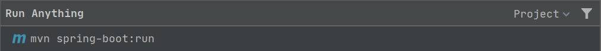
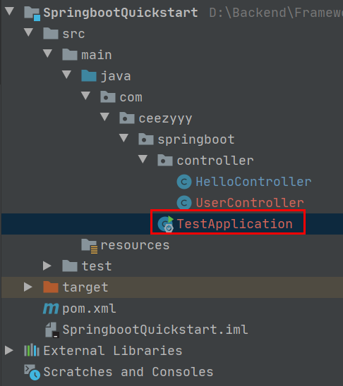
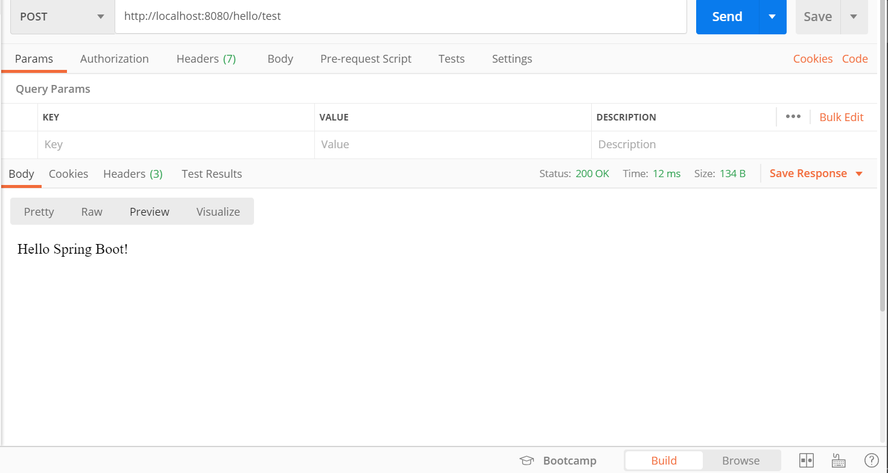
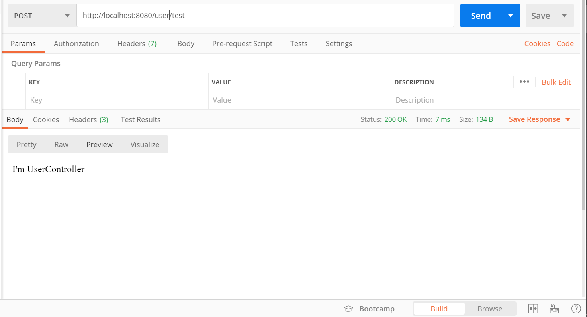

# SpringBoot

<div align="center">  </div><br>

## 目录

* [0. Springboot 2.0.6 Reference Guide](#0-springboot-206-reference-guide)
* [1. 了解 Springboot](#1----springboot)
  + [1.1 What is springboot](#11-what-is-springboot)
  + [1.2 Why we use springboot](#12-why-we-use-springboot)
* [2. Springboot Quickstart](#2-springboot-quickstart)
* [3. Springboot Quickstart Pro](#3-springboot-quickstart-pro)
* [4. Java-configuration](#4-java-configuration)
* [5. 属性注入](#5-----)
* [6. 自动配置原理](#6-------)
* [7. Springboot 整合](#7-springboot---)
* [8. Springboot Demo](#8-springboot-demo)


## 0. Springboot 2.0.6 Reference Guide

[Springboot 2.0.6 Reference Guide](https://docs.spring.io/spring-boot/docs/2.0.6.RELEASE/reference/html/)


## 1. 了解 Springboot

### 1.1 What is springboot

Spring Boot makes it easy to create stand-alone, production-grade Spring based Applications that you can "just run".

We take an opinionated view of the Spring platform and third-party libraries so you can get started with minimum fuss. Most Spring Boot applications need minimal Spring configuration.


### 1.2 Why we use springboot


<div align="center">  </div><br>
- Create stand-alone Spring applications
- Embed Tomcat, Jetty or Undertow directly (no need to deploy WAR files)
- Provide opinionated 'starter' dependencies to **simplify your build configuration**
- **Automatically configure Spring and 3rd party libraries** whenever possible
- Provide production-ready features such as metrics, health checks, and externalized configuration
- Absolutely no code generation and **no requirement for XML configuration**


## 2. Springboot Quickstart

先查看本地环境


<div align="center">  </div><br>

创建 `maven` 工程，编写 `pom.xml`，并更换镜像 

**pom.xml**

```xml
<?xml version="1.0" encoding="UTF-8"?>
<project xmlns="http://maven.apache.org/POM/4.0.0"
         xmlns:xsi="http://www.w3.org/2001/XMLSchema-instance"
         xsi:schemaLocation="http://maven.apache.org/POM/4.0.0 http://maven.apache.org/xsd/maven-4.0.0.xsd">
    <modelVersion>4.0.0</modelVersion>

    <groupId>com.ceezyyy.springboot</groupId>
    <artifactId>SpringbootQuickstart</artifactId>
    <version>1.0-SNAPSHOT</version>

    <parent>
        <groupId>org.springframework.boot</groupId>
        <artifactId>spring-boot-starter-parent</artifactId>
        <version>2.0.6.RELEASE</version>
    </parent>

    <!-- Additional lines to be added here... -->

    <dependencies>
        <dependency>
            <groupId>org.springframework.boot</groupId>
            <artifactId>spring-boot-starter-web</artifactId>
        </dependency>
    </dependencies>

    <repositories>
        <repository>
            <id>aliyun-repos</id>
            <url>http://maven.aliyun.com/nexus/content/groups/public/</url>
            <snapshots>
                <enabled>false</enabled>
            </snapshots>
        </repository>
    </repositories>
    <pluginRepositories>
        <pluginRepository>
            <id>aliyun-plugin</id>
            <url>http://maven.aliyun.com/nexus/content/groups/public/</url>
            <snapshots>
                <enabled>false</enabled>
            </snapshots>
        </pluginRepository>
    </pluginRepositories>

</project>
```

编写测试的 `controller`

**HelloController.java**

```java
@RestController
@RequestMapping("/test")
@EnableAutoConfiguration
public class HelloController {

    @RequestMapping("/hello")
    public String hello() {
        return "Hello Spring Boot!";
    }

    public static void main(String[] args) {
        SpringApplication.run(HelloController.class, args);
    }


}
```

:hammer: 启动项目

```bash
mvn spring-boot:run
```

<div align="center">  </div><br>

:heavy_check_mark:Build Succeeded!

<div align="center">  </div><br>

<div align="center">  </div><br>


## 3. Springboot Quickstart Pro

**目录结构**

<div align="center">  </div><br>


添加一个引导类

**TestApplication.java**

```java
@EnableAutoConfiguration
@ComponentScan
public class TestApplication {
    public static void main(String[] args) {
        SpringApplication.run(TestApplication.class, args);
    }

}
```

`@EnableAutoConfiguration`：开启 `springboot` 自动配置

`@ComponentScan`：开启包扫描（注入 `controller`，`service`，`dao` 到 `Spring IoC Container`）

甚至，可以更简单

**TestApplication.java**

```java
@SpringBootApplication
public class TestApplication {
    public static void main(String[] args) {
        SpringApplication.run(TestApplication.class, args);
    }

}
```


**HelloController.java**

```java
@RestController
@RequestMapping("/hello")
public class HelloController {

    @RequestMapping("/test")
    public String test() {
        return "Hello Spring Boot!";
    }

}
```


**UserController.java**

```java
@RestController
@RequestMapping("/user")
public class UserController {
    @RequestMapping("/test")
    public String test() {
        return "I'm UserController";
    }

}
```


:hammer: 启动项目

:heavy_check_mark: Build Succeeded!


<div align="center">  </div><br>


<div align="center">  </div><br>


## 4. Java-configuration


## 5. 属性注入


## 6. 自动配置原理


## 7. Springboot 整合


## 8. Springboot Demo