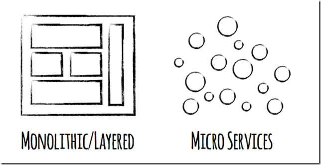
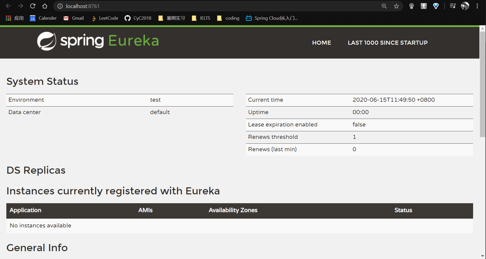
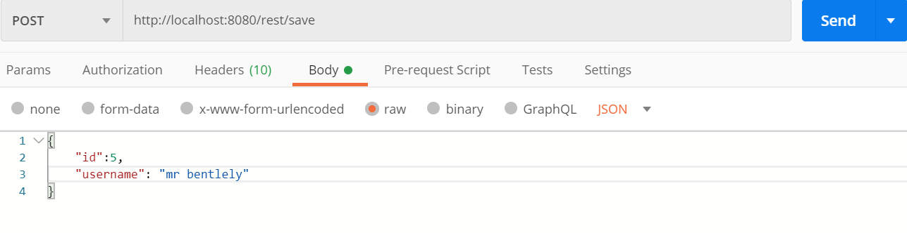
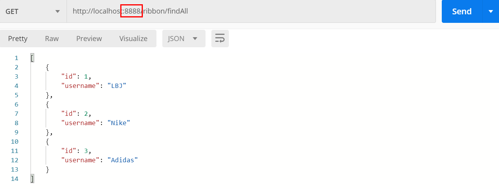

# Spring Cloud Quickstart

<div align="center">  </div><br>

## Category

* [0. References](#0-references)
* [1. 单体应用存在的问题](#1----------)
* [2. 分布式架构](#2------)
* [3. 什么是微服务](#3-------)
* [4. 服务治理 Eureka](#4------eureka)
  + [4.1 Eureka Server 注册中心](#41-eureka-server-----)
  + [4.2 Eureka Client: Provider](#42-eureka-client--provider)
    - [4.2.1 Quickstart](#421-quickstart)
  + [4.3 Eureka Client: Consumer](#43-eureka-client--consumer)
* [5. Rest Template](#5-rest-template)
  + [5.1 什么是 Rest Template?](#51-----rest-template-)
  + [5.2 Quickstart](#52-quickstart)
* [6. Ribbon 负载均衡](#6-ribbon-----)
  + [6.1 什么是 Ribbon?](#61-----ribbon-)
  + [6.2 Quickstart](#62-quickstart)
* [7. Feign](#7-feign)
  + [7.1 什么是 Feign?](#71-----feign-)
  + [7.2 Quickstart](#72-quickstart)


## 0. References

- [Spring Cloud从入门到实战 - bilibili](https://www.bilibili.com/video/BV1p4411K7pz)
- [Introduction to Spring Cloud Netflix – Eureka](https://www.baeldung.com/spring-cloud-netflix-eureka)

<div align="center">  </div><br>

<div align="center">  </div><br>


## 1. 单体应用存在的问题

- 随着开发越来越复杂，模块之间的耦合度也更高
- 当需要修改时，需要重新测试，重新部署
- 一个模块出现问题，容易导致整个系统崩溃
- 各个模块使用同一种技术框架开发，灵活性低


## 2. 分布式架构

将一个复杂问题拆分成若干个小问题，即将一个大型项目拆分成若干个微服务，分而治之
<div align="center">  </div><br>


## 3. 什么是微服务

<div align="center">  </div><br>

**优点**

- 独立开发，独立部署，互不影响
- 加入新需求时较方便，只需添加新的微服务
- 只需提供服务，接口供调用，而不关心是如何实现（可以使用不同语言框架）

**缺点**

- 如何将复杂的大项目拆分成不同的微服务
- 调用接口时需找到服务提供方，会造成沟通成本
- 多个微服务访问数据库时的一致性问题


## 4. 服务治理 Eureka

三大重要组件：

- 服务提供者（外卖商家）
- 服务消费者（消费者）
- 注册中心（外卖平台饿了么）

<div align="center">  </div><br>

两个概念：

- 服务注册：服务提供者将服务信息存入注册中心

- 服务发现：服务消费者到注册中心查询相关服务


### 4.1 Eureka Server 注册中心

创建父工程 `springcloudall`

**pom.xml**

```xml
<parent>
    <groupId>org.springframework.boot</groupId>
    <artifactId>spring-boot-starter-parent</artifactId>
    <version>2.0.6.RELEASE</version>
</parent>

<dependencies>
    <dependency>
        <groupId>org.springframework.boot</groupId>
        <artifactId>spring-boot-starter-web</artifactId>
    </dependency>
</dependencies>

<dependencyManagement>
    <dependencies>
        <dependency>
            <groupId>org.springframework.cloud</groupId>
            <artifactId>spring-cloud-dependencies</artifactId>
            <version>Finchley.SR2</version>
            <type>pom</type>
            <scope>import</scope>
        </dependency>
    </dependencies>
</dependencyManagement>
```

创建子工程 `eurekaserver`

**pom.xml**

```xml
<dependencies>
    <!-- https://mvnrepository.com/artifact/org.springframework.cloud/spring-cloud-starter-netflix-eureka-server -->
    <dependency>
        <groupId>org.springframework.cloud</groupId>
        <artifactId>spring-cloud-starter-netflix-eureka-server</artifactId>
        <version>2.0.2.RELEASE</version>
    </dependency>
</dependencies>
```

添加配置

**application.yml**

```yaml
server:
  port: 8761
eureka:
  client:
    registerWithEureka: false
    fetchRegistry: false
```

`port` 指定注册中心的端口号

`registerWithEureka` 为 `false` 是指不注册自己（作为 `server`）

编写启动类

**EurekaServerApplication.java**

```java
@SpringBootApplication
@EnableEurekaServer
public class EurekaServerApplication {
    public static void main(String[] args) {
        SpringApplication.run(EurekaServerApplication.class, args);
    }
}
```

:hammer: ​ BUILD 

:heavy_check_mark: SUCCEEDED!

<div align="center">  </div><br

### 4.2 Eureka Client: Provider

**pom.xml**

```xml
<dependency>
    <groupId>org.springframework.cloud</groupId>
    <artifactId>spring-cloud-starter-netflix-eureka-client</artifactId>
    <version>2.0.2.RELEASE</version>
</dependency>
```

**:warning:注意**

这里的依赖需要与 `server` 的依赖型号一样！

第一次的时候导入依赖没导入带 `starter` 的结果 `provider` 无法注册到 `server`（但又不报错）

**application.yml**

```yaml
spring:
  application:
    name: provider
server:
  port: 8010
eureka:
  client:
    instance:
      prefer-ip-address: true
    service-url:
      defaultZone: http://localhost:8761/eureka/
```

`provider` ：当前注册者的名字

`prefer-ip-address` ：显示注册者 `ip` 

`service-url` ：注册中心的 `url`

**ProviderApplication.java**

```java
@SpringBootApplication
public class ProviderApplication {

    public static void main(String[] args) {
        SpringApplication.run(ProviderApplication.class, args);
    }
}
```

:hammer: BUILD

:heavy_check_mark: SUCCEEDED!

<div align="center">  </div><br>

#### 4.2.1 Quickstart

现在模拟微服务的 `CRUD` 操作，使用 `RESTful` 风格接口

**User.java**

```java
@Data
@AllArgsConstructor
@NoArgsConstructor
public class User implements Serializable {
    private long id;
    private String username;
}
```


**UserMapper.java**

```java
public interface UserMapper {

    // create
    void saveOrUpdateUser(User user);

    // read one
    User findUserById(long id);

    // read all
    Collection<User> findAll();

    // update
    // delete
    void deleteUserById(long id);
}
```

**:warning:注意**

静态代码块与构造代码块不同的是，它只执行一次，用于对整个类进行初始化，通常是对类变量进行初始化处理。

一开始没有创建 `userMap` 对象，启动时报错：无法注入 `userMapper`

**UserMapperImpl.java**

```java
@Repository(value = "userMapper")
public class UserMapperImpl implements UserMapper {

    // data
    private static Map<Long, User> userMap;

    static {
        userMap = new HashMap<>();
        userMap.put(1L, new User(1L, "LBJ"));
        userMap.put(2L, new User(2L, "Nike"));
        userMap.put(3L, new User(3L, "Adidas"));
    }

    @Override
    public void saveOrUpdateUser(User user) {
        userMap.put(user.getId(), user);
    }

    @Override
    public User findUserById(long id) {
        return userMap.get(id);
    }

    @Override
    public Collection<User> findAll() {
        return userMap.values();
    }

    @Override
    public void deleteUserById(long id) {
        userMap.remove(id);
    }
}
```

**:warning:注意**

`controller` 中接受的 `id` 为 `long` 类型，若写成 `int` 类型是获取不到参数的

**UserController.java**

```java
@RestController
@RequestMapping("user")
public class UserController {

    private UserMapper userMapper;

    @Autowired
    public void setUserMapper(UserMapper userMapper) {
        this.userMapper = userMapper;
    }

    // save
    @PostMapping("save")
    public void saveUser(@RequestBody User user) {
        userMapper.saveOrUpdateUser(user);
    }

    // read one
    @GetMapping("findUserById/{id}")
    public User findUserById(@PathVariable long id) {
        User user = userMapper.findUserById(id);
        return user;
    }

    // read all
    @GetMapping("findAll")
    public Collection<User> findAll() {
        Collection<User> users = userMapper.findAll();
        return users;
    }

    // update
    @PutMapping("update")
    public void updateUser(@RequestBody User user) {
        userMapper.saveOrUpdateUser(user);
    }

    // delete
    @DeleteMapping("deleteUserById/{id}")
    public void deleteUserById(@PathVariable long id) {
        userMapper.deleteUserById(id);
    }

}
```

**ProviderApplication.java**

```java
@SpringBootApplication
public class ProviderApplication {

    public static void main(String[] args) {
        SpringApplication.run(ProviderApplication.class, args);
    }
}

```

:hammer: BUILD

:heavy_check_mark: SUCCEEDED!


### 4.3 Eureka Client: Consumer 

与 `provider` 类似，从业务角度划分


## 5. Rest Template

### 5.1 什么是 Rest Template?

`RestTemplate` 是 `Spring` 提供的基于 `rest` 的服务组件，底层是对 `http` 请求及响应进行了封装，提供了很多访问 `rest` 服务的方法，简化代码开发、

**目的：**

其他服务消费者通过 `Rest Template` 调用服务提供者提供的接口

**参考资料：**

[Spring RestTemplate详解](https://blog.csdn.net/u011523796/article/details/78483321)


### 5.2 Quickstart

作为服务消费者（模拟，但不用注册到 `eureka server`），调用服务提供者的服务（`Rest Template` 已是 `Spring` 组件，不需要添加额外依赖）

**准备环境：**

- 注册中心
- 服务提供者

<div align="center">  </div><br>

**User.java**

```java
@Data
@AllArgsConstructor
@NoArgsConstructor
public class User implements Serializable {
    private long id;
    private String username;
}
```

启动类要将 `restTemplate` 对象注入到 `IOC` 容器中，交给 `Spring` 管理

**RestTemplateApplication.java**

```java
@SpringBootApplication
public class RestTemplateApplication {

    public static void main(String[] args) {
        SpringApplication.run(RestTemplateApplication.class, args);
    }

    @Bean
    public RestTemplate restTemplate() {
        return new RestTemplate();
    }

}
```


**RestTemplateController.java**

```java
@RestController
@RequestMapping("rest")
public class RestTemplateController {

    private RestTemplate restTemplate;
    // the url of service provider
    private String url = "http://localhost:8010";

    @Autowired
    public void setRestTemplate(RestTemplate restTemplate) {
        this.restTemplate = restTemplate;
    }

    // create
    @PostMapping("save")
    public void saveUser(@RequestBody User user) {
        restTemplate.postForLocation(url + "/user/save", user);
    }

    // read one
    @GetMapping("findUserById/{id}")
    public User findUserById(@PathVariable(value = "id") long id) {
        User user = restTemplate.getForEntity(url + "/user/findUserById/{id}", User.class, id).getBody();
        return user;
    }

    // read all
    @GetMapping("findAll")
    public Collection<User> findAll() {
        Collection users = restTemplate.getForEntity(url + "/user/findAll", Collection.class).getBody();
        return users;
    }

    // update
    @PutMapping("update")
    public void update(@RequestBody User user) {
        restTemplate.put(url + "/user/update", user);
    }

    // delete
    @DeleteMapping("deleteUserById/{id}")
    public void deleteUserById(@PathVariable long id) {
        restTemplate.delete(url + "user/deleteUserById/{id}", id);
    }
    
}
```

插入 / 更新


<div align="center">  </div><br>

查询所有


<div align="center">  </div><br>

查询单个


<div align="center">  </div><br>

删除


<div align="center">  </div><br>

**总结**

使用 `rest template` 可以非常方便地调用服务提供者的接口，实现业务操作


## 6. Ribbon 负载均衡

### 6.1 什么是 Ribbon?

`Spring cloud ribbon` 是一个负载均衡解决方案，`Ribbon` 是 `netflix` 发布的负载均衡器，`Spring cloud ribbon` 是对其的二次封装

**是一个用于对 http 请求控制的负载均衡客户端**

需要在注册中心进行注册，根据负载均衡算法帮助服务消费者调用接口，需要结合 `eureka server` 结合使用

<div align="center">  </div><br>


### 6.2 Quickstart

**ribbon 需要注册，不提供服务，只提供负载均衡**

**准备环境**

<div align="center">  </div><br>

首先先启动注册中心，以及服务提供者（这里只有 2 个）

进行配置 `ribbon`

**pom.xml**

```xml
<dependencies>
    <!-- https://mvnrepository.com/artifact/org.springframework.cloud/spring-cloud-starter-netflix-eureka-client -->
    <dependency>
        <groupId>org.springframework.cloud</groupId>
        <artifactId>spring-cloud-starter-netflix-eureka-client</artifactId>
        <version>2.0.2.RELEASE</version>
    </dependency>
</dependencies>
```

需要注册到注册中心

**RibbonApplication.java**

```java
@SpringBootApplication
public class RibbonApplication {
    public static void main(String[] args) {
        SpringApplication.run(RibbonApplication.class, args);
    }

    // provide rest-template
    @Bean
    @LoadBalanced
    public RestTemplate restTemplate() {
        return new RestTemplate();
    }
}
```

调服务提供者接口时需要 `rest-template`

`@LocalBalanced` 声明负载均衡

<div align="center">  </div><br>

注册中心已有 3 个实例

**RibbonController.java**

```java
@RestController
@RequestMapping("ribbon")
public class RibbonController {

    private RestTemplate restTemplate;
    private String url = "http://provider/user";

    @Autowired
    public void setRestTemplate(RestTemplate restTemplate) {
        this.restTemplate = restTemplate;
    }

    @GetMapping("findAll")
    public Collection<User> findAll() {
        Collection collection = restTemplate.getForEntity(url + "/findAll", Collection.class).getBody();
        return collection;
    }

    // get current server port
    @GetMapping("port")
    public String getServerPort() {
        String port = restTemplate.getForEntity(url + "/port", String.class).getBody();
        return port;
    }
}
```

:hammer: Build

:heavy_check_mark: Succeeded!

<div align="center">  </div><br>


<div align="center">  </div><br>

<div align="center">  </div><br>

## 7. Feign

### 7.1 什么是 Feign?

[Spring Cloud OpenFeign](https://spring.io/projects/spring-cloud-openfeign) – a declarative REST client for Spring Boot apps.

[Feign](https://www.baeldung.com/intro-to-feign) makes writing web service clients easier with pluggable annotation support, which includes Feign annotations and JAX-RS annotations.

Also, [Spring Cloud](https://www.baeldung.com/spring-cloud-series) adds support for [Spring MVC annotations](https://www.baeldung.com/spring-mvc-annotations) and for using the same [*HttpMessageConverters*](https://www.baeldung.com/spring-httpmessageconverter-rest) as used in Spring Web.

And, a great thing about using Feign is that we don't have to write any code for calling the service, other than an interface definition.

**相比较于 ribbon + rest template 的开发，feign 更加简化**


### 7.2 Quickstart

**参考网址**

[Introduction to Spring Cloud OpenFeign - baeldung](https://www.baeldung.com/spring-cloud-openfeign)

**准备环境**

<div align="center">  </div><br>

<div align="center">  </div><br>


引入依赖

**pom.xml**

```xml
<dependency>
    <groupId>org.springframework.cloud</groupId>
    <artifactId>spring-cloud-starter-openfeign</artifactId>
    <version>2.0.2.RELEASE</version>
</dependency>

<!-- https://mvnrepository.com/artifact/org.springframework.cloud/spring-cloud-starter-netflix-eureka-client -->
<dependency>
    <groupId>org.springframework.cloud</groupId>
    <artifactId>spring-cloud-starter-netflix-eureka-client</artifactId>
    <version>2.0.2.RELEASE</version>
</dependency>
```

将 `feign` 注册到注册中心

**application.yml**

```yaml
spring:
  application:
    name: feign
server:
  port: 8050
eureka:
  client:
    instance:
      prefer-ip-address: true
    service-url:
      defaultZone: http://localhost:8761/eureka/
```

`feign` 客户端，声明式，指定 `provider`

就可以直接调用 `provider` 的 `restful` 接口

**IFeignClient.java**

```java
@FeignClient(name = "provider")
@RequestMapping("feign")
public interface IFeignClient {
    // read all
    @GetMapping("findAll")
    Collection<User> findAll();

    // read one
    @GetMapping("findUserById'{id}")
    User findUserById(@PathVariable long id);

}
```

启动类

开启 `feign clients` 扫描的注解

**FeignApplication.java**

```java
@SpringBootApplication
@EnableFeignClients
public class FeignApplication {

    public static void main(String[] args) {
        SpringApplication.run(FeignApplication.class, args);
    }
}
```

:hammer: Build

:heavy_check_mark: Succeeded!

<div align="center">  </div><br>

<div align="center">  </div><br>


