#  Spring MVC

## 目录

* [1. Wiki](#1-wiki)
  + [1.1 What is Spring mvc?](#11-what-is-spring-mvc-)
  + [1.2 Understanding the flow of Spring Web MVC](#12-understanding-the-flow-of-spring-web-mvc)
  + [1.3 Advantages of Spring MVC Framework](#13-advantages-of-spring-mvc-framework)
* [2. Quickstart](#2-quickstart)
  + [2.1 项目需求](#21-----)
  + [2.2 项目结构](#22-----)
  + [2.3 步骤](#23---)
  + [2.4 总结](#24---)
    - [2.4.1 组件化开发思想](#241--------)
    - [2.4.2 为什么要有 web.xml?](#242-------webxml-)
    - [2.4.3 为什么要有 spring-servlet.xml?](#243-------spring-servletxml-)
* [3. 请求参数的绑定](#3--------)
  + [3.1. Primitive / Wrapper Example](#31-primitive---wrapper-example)
  + [3.2 Java Bean Example](#32-java-bean-example)
    - [3.2.1 Example 1](#321-example-1)
    - [3.2.2 Example 2](#322-example-2)
    - [3.2.3 解决中文乱码问题](#323---------)
  + [3.3 Collection Example](#33-collection-example)
    - [3.3.1 List](#331-list)
    - [3.3.2 Map](#332-map)
  + [3.4 总结](#34---)
* [4. Restful 编程风格](#4-restful-----)
  + [4.1 什么是 Restful API？](#41-----restful-api-)
  + [4.2 Quickstart](#42-quickstart)
* [5. 常用注解](#5-----)
* [6. Model And View](#6-model-and-view)
  + [6.1 String](#61-string)
  + [6.2 Model](#62-model)
  + [6.3 ModelMap](#63-modelmap)
  + [6.4 ModelAndView](#64-modelandview)
  + [6.5 Serve Static Resources with Spring](#65-serve-static-resources-with-spring)
  + [6.6 Responsebody](#66-responsebody)
* [7. File Upload with Spring MVC](#7-file-upload-with-spring-mvc)
  + [7.1 Overview](#71-overview)
  + [7.2 What is multipart/form-data?](#72-what-is-multipart-form-data-)
  + [7.3 multipartResolver](#73-multipartresolver)
  + [7.4 Demo](#74-demo)


## 1. Wiki

### 1.1 What is Spring mvc?

A Spring MVC is a Java framework which is used to build web applications. It follows the Model-View-Controller design pattern. It implements all the basic features of a core spring framework like Inversion of Control, Dependency Injection.

A Spring MVC provides an elegant solution to use MVC in spring framework by the help of  **DispatcherServlet**. Here, **DispatcherServlet** is a class that receives the incoming request and maps it to the right resource such as controllers, models, and views.


<div align="center">  </div><br>


### 1.2 Understanding the flow of Spring Web MVC
<div align="center"> 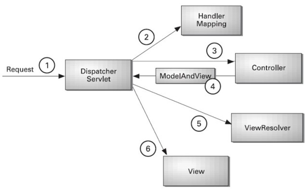 </div><br>

- As displayed in the figure, all the incoming request is intercepted by the DispatcherServlet that works as the front controller.
- The DispatcherServlet gets an entry of handler mapping from the XML file and forwards the request to the controller.
- The controller returns an object of ModelAndView.
- The DispatcherServlet checks the entry of view resolver in the XML file and invokes the specified view component.


### 1.3 Advantages of Spring MVC Framework

- **Separate roles** - The Spring MVC separates each role, where the model object, controller, command object, view resolver, DispatcherServlet, validator, etc. can be fulfilled by a specialized object.
- **Light-weight** - It uses light-weight servlet container to develop and deploy your application.
- **Powerful Configuration** - It provides a robust configuration for both framework and application classes that includes easy referencing across contexts, such as from web controllers to business objects and validators.
- **Rapid development** - The Spring MVC facilitates fast and parallel development.
- **Reusable business code** - Instead of creating new objects, it allows us to use the existing business objects.
- **Easy to test** - In Spring, generally we create JavaBeans classes that enable you to inject test data using the setter methods.
- **Flexible Mapping** - It provides the specific annotations that easily redirect the page.


## 2. Quickstart

### 2.1 项目需求

<div align="center">  </div><br>

<div align="center">  </div><br>


### 2.2 项目结构

<div align="center"> 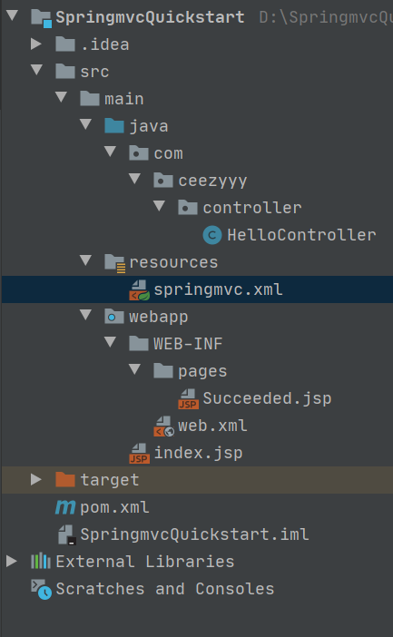 </div><br>

### 2.3 步骤

<div align="center">  </div><br>

- `pom.xml`：搭建环境（这里使用 `tomcat 7` 的 plugin 直接部署）
- `web.xml`：配置 `DispatcherServlet`
- `HandlerMapping & Controller`：编写 `controller` 函数方法
- `springmvc.xml`：编写 `ViewResolver`，以及开启 `mvc annotation`
- `view`：跳转成功的页面


**index.jsp**

```jsp
<%@ page contentType="text/html;charset=UTF-8" language="java" %>
<html>
<head>
    <title>Quickstart</title>
</head>
<body>
<h1>Quickstart</h1>
<a href="hello">Hello</a>
</body>
</html>
```

**pom.xml**

```xml
<?xml version="1.0" encoding="UTF-8"?>

<project xmlns="http://maven.apache.org/POM/4.0.0" xmlns:xsi="http://www.w3.org/2001/XMLSchema-instance"
         xsi:schemaLocation="http://maven.apache.org/POM/4.0.0 http://maven.apache.org/xsd/maven-4.0.0.xsd">
    <modelVersion>4.0.0</modelVersion>

    <groupId>com.ceezyyy</groupId>
    <artifactId>SpringmvcQuickstart</artifactId>
    <version>1.0-SNAPSHOT</version>
    <packaging>war</packaging>

    <name>SpringmvcQuickstart Maven Webapp</name>
    <!-- FIXME change it to the project's website -->
    <url>http://www.example.com</url>

    <properties>
        <project.build.sourceEncoding>UTF-8</project.build.sourceEncoding>
        <maven.compiler.source>1.7</maven.compiler.source>
        <maven.compiler.target>1.7</maven.compiler.target>
    </properties>
    <!-- https://mvnrepository.com/artifact/org.springframework/spring-core -->


    <dependencies>
        <dependency>
            <groupId>junit</groupId>
            <artifactId>junit</artifactId>
            <version>4.11</version>
            <scope>test</scope>
        </dependency>

        <!-- https://mvnrepository.com/artifact/org.springframework/spring-web -->
        <dependency>
            <groupId>org.springframework</groupId>
            <artifactId>spring-web</artifactId>
            <version>5.2.5.RELEASE</version>
        </dependency>

        <dependency>
            <groupId>org.springframework</groupId>
            <artifactId>spring-core</artifactId>
            <version>5.2.5.RELEASE</version>
        </dependency>

        <!-- https://mvnrepository.com/artifact/org.springframework/spring-webmvc -->
        <dependency>
            <groupId>org.springframework</groupId>
            <artifactId>spring-webmvc</artifactId>
            <version>5.1.5.RELEASE</version>
        </dependency>

    </dependencies>

    <build>
        <finalName>SpringmvcQuickstart</finalName>
        <pluginManagement><!-- lock down plugins versions to avoid using Maven defaults (may be moved to parent pom) -->
            <plugins>
                <plugin>
                    <groupId>org.apache.tomcat.maven</groupId>
                    <artifactId>tomcat7-maven-plugin</artifactId>
                    <version>2.2</version>
                    <configuration>
                        <port>9090</port>
                    </configuration>
                </plugin>


                <plugin>
                    <artifactId>maven-clean-plugin</artifactId>
                    <version>3.1.0</version>
                </plugin>
                <!-- see http://maven.apache.org/ref/current/maven-core/default-bindings.html#Plugin_bindings_for_war_packaging -->
                <plugin>
                    <artifactId>maven-resources-plugin</artifactId>
                    <version>3.0.2</version>
                </plugin>
                <plugin>
                    <artifactId>maven-compiler-plugin</artifactId>
                    <version>3.8.0</version>
                </plugin>
                <plugin>
                    <artifactId>maven-surefire-plugin</artifactId>
                    <version>2.22.1</version>
                </plugin>
                <plugin>
                    <artifactId>maven-war-plugin</artifactId>
                    <version>3.2.2</version>
                </plugin>
                <plugin>
                    <artifactId>maven-install-plugin</artifactId>
                    <version>2.5.2</version>
                </plugin>
                <plugin>
                    <artifactId>maven-deploy-plugin</artifactId>
                    <version>2.8.2</version>
                </plugin>
            </plugins>
        </pluginManagement>
    </build>
</project>

```

**web.xml**

```xml
<!DOCTYPE web-app PUBLIC
        "-//Sun Microsystems, Inc.//DTD Web Application 2.3//EN"
        "http://java.sun.com/dtd/web-app_2_3.dtd" >

<web-app>
    <display-name>Archetype Created Web Application</display-name>

    <servlet>
        <servlet-name>dispatcherServlet</servlet-name>
        <servlet-class>org.springframework.web.servlet.DispatcherServlet</servlet-class>
        <init-param>
            <param-name>contextConfigLocation</param-name>
            <param-value>classpath:springmvc.xml</param-value>
        </init-param>
        <load-on-startup>1</load-on-startup>
    </servlet>

    <servlet-mapping>
        <servlet-name>dispatcherServlet</servlet-name>
        <url-pattern>/</url-pattern>
    </servlet-mapping>
</web-app>
```

**HelloController.java**

```java
@Controller("HelloController")
public class HelloController {

    @RequestMapping(value = "/hello")
    public String hello() {
        System.out.println("Hello Spring mvc");
        return "Succeeded";
    }
}
```

**spring-servlet.xml**

```xml
<?xml version="1.0" encoding="UTF-8"?>
<beans xmlns="http://www.springframework.org/schema/beans"
       xmlns:xsi="http://www.w3.org/2001/XMLSchema-instance"
       xmlns:context="http://www.springframework.org/schema/context"
       xmlns:mvc="http://www.springframework.org/schema/mvc"
       xsi:schemaLocation="
        http://www.springframework.org/schema/beans
        http://www.springframework.org/schema/beans/spring-beans.xsd
        http://www.springframework.org/schema/context
        http://www.springframework.org/schema/context/spring-context.xsd
        http://www.springframework.org/schema/mvc
        http://www.springframework.org/schema/mvc/spring-mvc.xsd">

    <!-- Provide support for component scanning -->
    <context:component-scan base-package="com.ceezyyy.controller"/>

    <!--Provide support for conversion, formatting and validation -->
    <mvc:annotation-driven/>

    <bean id="internalResourceViewResolver" class="org.springframework.web.servlet.view.InternalResourceViewResolver">
        <property name="prefix" value="/WEB-INF/pages/"></property>
        <property name="suffix" value=".jsp"></property>
    </bean>

</beans>
```

**Succeeded.jsp**

```jsp
<%@ page contentType="text/html;charset=UTF-8" language="java" %>
<html>
<head>
    <title>Succeeded</title>
</head>
<body>
<h1>Congratulations! Succeeded!</h1>
</body>
</html>
```


### 2.4 总结

#### 2.4.1 组件化开发思想

- `DispatcherServlet`

  定义在 `web.xml` 中，角色相当于篮球场上的组织控卫，负责总体调度
  
  <div align="center">  </div><br>


- `HandlerMapping` 

  可以使用注解的方式定义在 `controller` 中，作用是将 `url` 的参数 `map` 到对应的 `controller` 业务逻辑（方法），并返回给 `Dispatcher`，`Dispatcher` 再（根据返回结果）找特定的 `controller`

  <div align="center">  </div><br>
  
  <div align="center"> 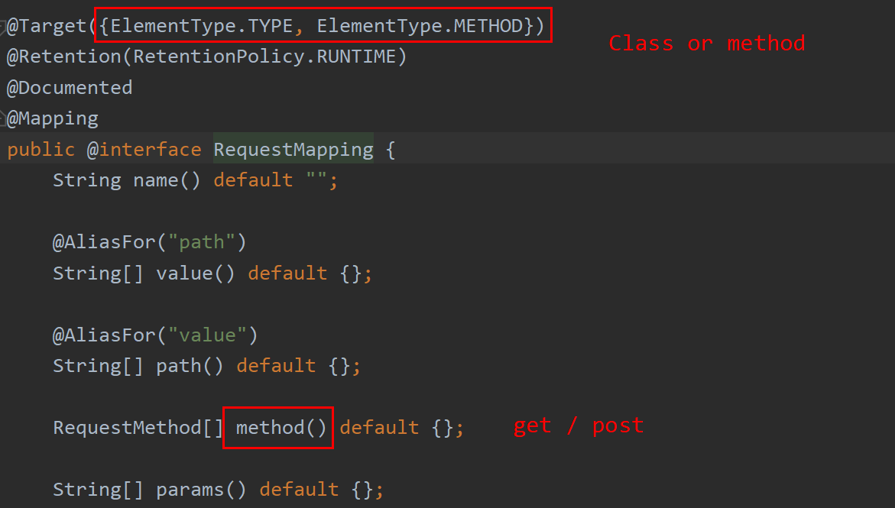 </div><br>


- `Controller`

  处理各种逻辑

- `ViewResolver`

  解析 `controller` 返回的 `view`，并返回给 `Dispatcher`，再转发到特定的 `page`

- `View`

  视图，呈现在浏览器中


#### 2.4.2 为什么要有 web.xml?

<div align="center"> 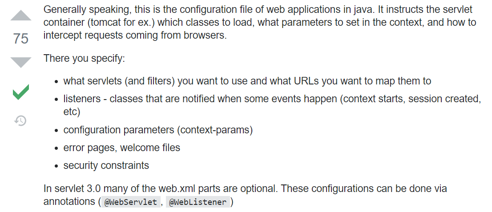 </div><br>

**需要加载 spring-servlet 配置文件！！！**


<div align="center"> 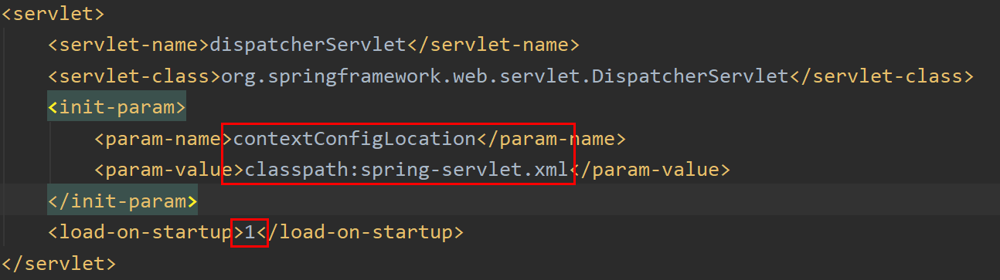 </div><br>


#### 2.4.3 为什么要有 spring-servlet.xml?

<div align="center"> 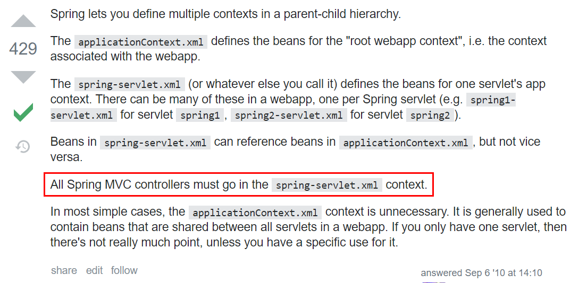 </div><br>

## 3. 请求参数的绑定

### 3.1. Primitive / Wrapper Example

<div align="center"> 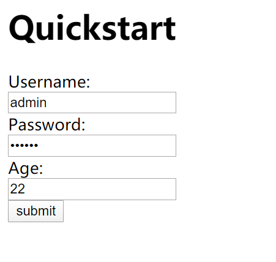 </div><br>

**index.jsp**

```html
<form action="hello" method="post">
    <label for="username">Username:</label><br>
    <input type="text" id="username" name="username"><br>
    <label for="password">Password:</label><br>
    <input type="password" id="password" name="password"><br>
    <label for="age">Age:</label><br>
    <input type="text" id="age" name="age"><br>
    <input type="submit" value="submit"><br>
</form>
```


**HelloController.java**

```java
@Controller("HelloController")
public class HelloController {

    @RequestMapping(value = "/hello", method = RequestMethod.POST)
    public void hello(String username, String password, Integer age) {
        System.out.println(username);
        System.out.println(password);
        System.out.println(age);
    }
}
```


:heavy_check_mark:Succeeded!

<div align="center"> 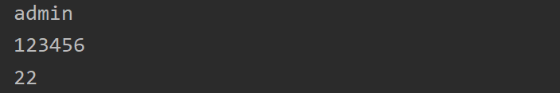 </div><br>

### 3.2 Java Bean Example

#### 3.2.1 Example 1


<div align="center"> 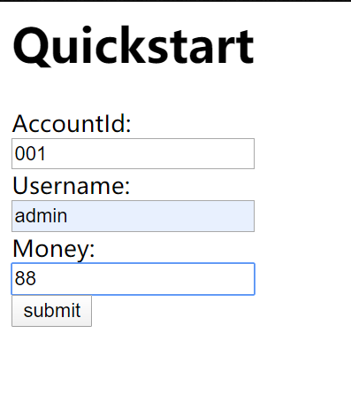 </div><br>

**index.jsp**

```html
<form action="hello" method="post">
    <label for="accountId">AccountId:</label><br>
    <input type="text" id="accountId" name="id"><br>
    <label for="username">Username:</label><br>
    <input type="text" id="username" name="username"><br>
    <label for="money">Money:</label><br>
    <input type="text" id="money" name="money"><br>
    <input type="submit" value="submit"><br>
</form>
```


**Account.java**

```java
public class Account {
    private Integer id;
    private String username;
    private Double money;
    
    // getter and setter
    // toString
}
```


**HelloController.java**

```java
@Controller("HelloController")
public class HelloController {

    @RequestMapping(value = "/hello", method = RequestMethod.POST)
    public void hello(Account account) {
        System.out.println(account.getId());
        System.out.println(account.getUsername());
        System.out.println(account.getMoney());
    }
}
```


:heavy_check_mark:Succeeded!

<div align="center"> 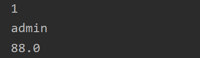 </div><br>

#### 3.2.2 Example 2

<div align="center"> 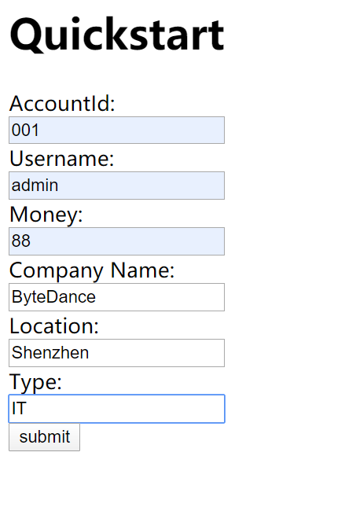 </div><br>
**index.jsp**

```html
<form action="hello" method="post">
    <label for="accountId">AccountId:</label><br>
    <input type="text" id="accountId" name="id"><br>

    <label for="username">Username:</label><br>
    <input type="text" id="username" name="username"><br>

    <label for="money">Money:</label><br>
    <input type="text" id="money" name="money"><br>

    <label for="companyName">Company Name:</label><br>
    <input type="text" id="companyName" name="Company.companyName"><br>

    <label for="location">Location:</label><br>
    <input type="text" id="location" name="Company.location"><br>

    <label for="type">Type:</label><br>
    <input type="text" id="type" name="Company.type"><br>

    <input type="submit" value="submit"><br>
</form>
```

**Account.java**

```java
public class Account {
    private Integer id;
    private String username;
    private Double money;

    private Company company;
    
    // getter and setter
    // override toString()
}
```


**Company.java**

```java
public class Company {
    private String companyName;
    private String location;
    private String type;
    
    // getter and setter
    // override toString()
}
```


**HelloController.java**

```java
@Controller("HelloController")
public class HelloController {

    @RequestMapping(value = "/hello", method = RequestMethod.POST)
    public void hello(Account account) {
        System.out.println(account.toString());
    }
}
```

:heavy_check_mark:Succeeded!

<div align="center"> 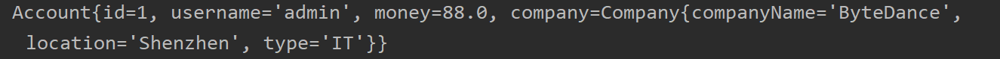 </div><br>

#### 3.2.3 解决中文乱码问题

在国内不可回避的一个问题

<div align="center"> 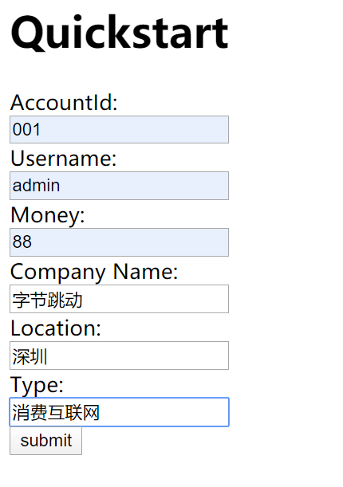 </div><br>

<div align="center"> 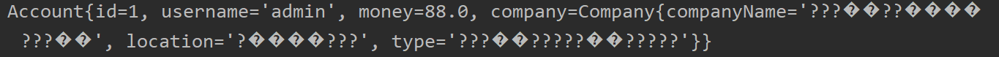 </div><br>

**设置 filter**

**web.xml**

```xml
 <filter>
        <filter-name>CharacterEncodingFilter</filter-name>
        <filter-class>org.springframework.web.filter.CharacterEncodingFilter</filter-class>

        <!-- 配置encoding，告诉我们指定的编码格式 -->
        <init-param>
            <param-name>encoding</param-name>
            <param-value>utf-8</param-value>
        </init-param>
        <init-param>
            <!--是否强制设置request的编码为encoding，默认false，不建议更改-->
            <param-name>forceRequestEncoding</param-name>
            <param-value>false</param-value>
        </init-param>
        <init-param>
            <!--是否强制设置response的编码为encoding，建议设置为true，下面有关于这个参数的解释-->
            <param-name>forceResponseEncoding</param-name>
            <param-value>true</param-value>
        </init-param>
    </filter>
    <filter-mapping>
        <filter-name>CharacterEncodingFilter</filter-name>
        <url-pattern>/*</url-pattern>
    </filter-mapping>
```


**解决控制台输出中文乱码**

```bash
-Dfile.encoding=GB2312
```

<div align="center"> 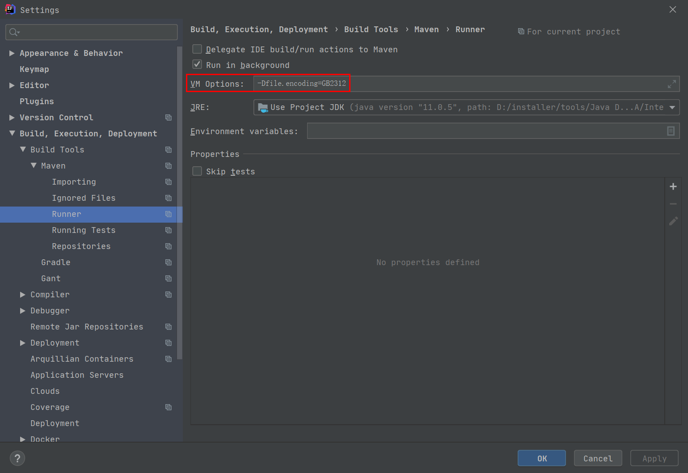 </div><br>

:heavy_check_mark:Succeeded!

<div align="center"> 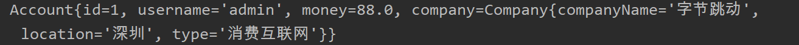 </div><br>


### 3.3 Collection Example

#### 3.3.1 List


<div align="center"> 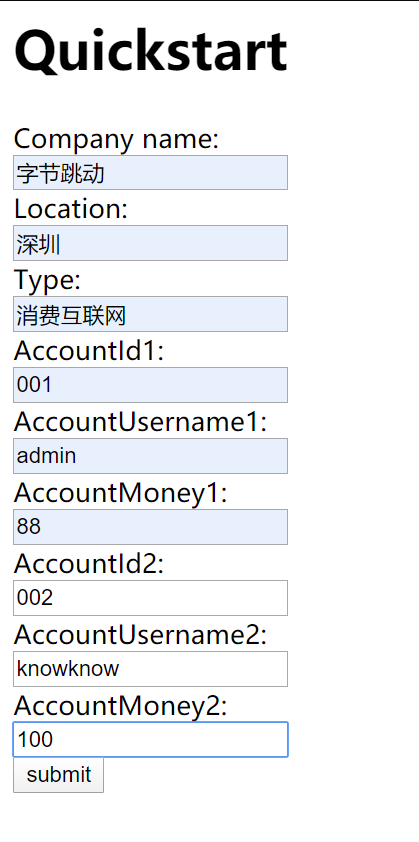 </div><br>


`Company` Java Bean 中含有一个 `accounts` 变量

类型为 `List` ，其数据类型为 `Account` Java Bean

**Company.java**

```java
public class Company {
    private String companyName;
    private String location;
    private String type;
    private List<Account> accounts;
    
    // getter and setter
    // override toString()
    
}    
```

**Account.java**

```java
public class Account {
    private Integer id;
    private String username;
    private Double money;
    
    // getter and setter
    // override toString()
}
```


**HelloController.java**

```java
@Controller("HelloController")
public class HelloController {

    @RequestMapping(value = "/hello", method = RequestMethod.POST)
    public void hello(Company company) {
        System.out.println(company);
    }
}
```


**index.jsp**

```html
<form action="hello" method="post">
    <label for="companyName">Company name:</label><br>
    <input type="text" id="companyName" name="companyName"><br>

    <label for="location">Location:</label><br>
    <input type="text" id="location" name="location"><br>

    <label for="type">Type:</label><br>
    <input type="text" id="type" name="type"><br>

    <label for="id">AccountId1:</label><br>
    <input type="text" id="id" name="accounts[0].id"><br>

    <label for="username">AccountUsername1:</label><br>
    <input type="text" id="username" name="accounts[0].username"><br>

    <label for="money">AccountMoney1:</label><br>
    <input type="text" id="money" name="accounts[0].money"><br>

    <label for="id2">AccountId2:</label><br>
    <input type="text" id="id2" name="accounts[1].id"><br>

    <label for="username2">AccountUsername2:</label><br>
    <input type="text" id="username2" name="accounts[1].username"><br>

    <label for="money2">AccountMoney2:</label><br>
    <input type="text" id="money2" name="accounts[1].money"><br>

    <input type="submit" value="submit"><br>
</form>
```


:heavy_check_mark:Succeeded!

<div align="center"> 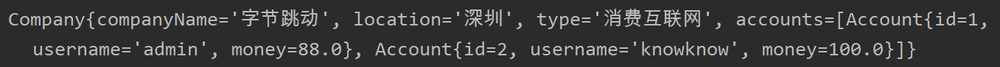 </div><br>


#### 3.3.2 Map


<div align="center"> 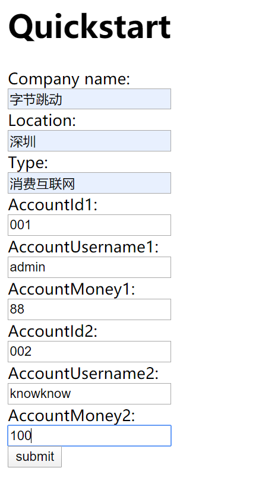 </div><br>

`Company` Java Bean 中含有一个 `accountMap` 变量

类型为 `Map`，其 `kv` 类型为 `<String, Account>` 

**Company.java**

```java
public class Company {
    private String companyName;
    private String location;
    private String type;
    private Map<String, Account> accountMap;
    
    // getter and setter
    // override toString()
    
}
```

**Account.java**

```java
public class Account {
    private Integer id;
    private String username;
    private Double money;
    
    // getter and setter
    // override toString()
    
}
```

**HelloController.java**

```java
@Controller("HelloController")
public class HelloController {

    @RequestMapping(value = "/hello", method = RequestMethod.POST)
    public void hello(Company company) {
        System.out.println(company);
    }
}
```

**index.jsp**

```html
<form action="hello" method="post">
    <label for="companyName">Company name:</label><br>
    <input type="text" id="companyName" name="companyName"><br>

    <label for="location">Location:</label><br>
    <input type="text" id="location" name="location"><br>

    <label for="type">Type:</label><br>
    <input type="text" id="type" name="type"><br>

    <label for="id">AccountId1:</label><br>
    <input type="text" id="id" name="accountMap['one'].id"><br>

    <label for="username">AccountUsername1:</label><br>
    <input type="text" id="username" name="accountMap['one'].username"><br>

    <label for="money">AccountMoney1:</label><br>
    <input type="text" id="money" name="accountMap['one'].money"><br>

    <label for="id2">AccountId2:</label><br>
    <input type="text" id="id2" name="accountMap['two'].id"><br>

    <label for="username2">AccountUsername2:</label><br>
    <input type="text" id="username2" name="accountMap['two'].username"><br>

    <label for="money2">AccountMoney2:</label><br>
    <input type="text" id="money2" name="accountMap['two'].money"><br>

    <input type="submit" value="submit"><br>
</form>
```


:heavy_check_mark:Succeeded!

<div align="center"> 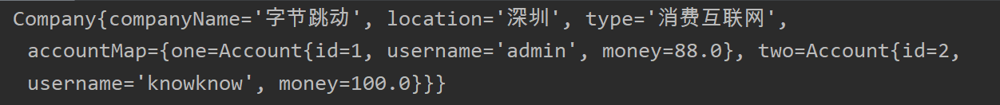 </div><br>

### 3.4 总结

- 参数类型是以 `key-value` 形式，（浏览器发来的请求参数都是 `string` 类型）

- 流程示意图

   <div align="center"> 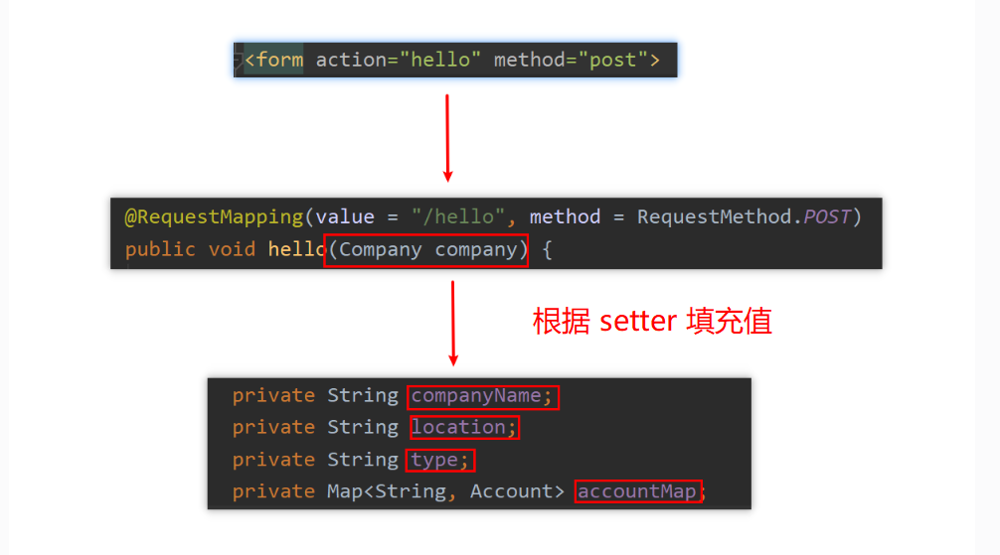 </div><br>

  

## 4. Restful 编程风格

### 4.1 什么是 Restful API？

​	`RESTFUL` 是一种网络应用程序的设计风格和开发方式，基于 `HTTP`，可以使用 `XML` 格式定义或 `JSON` 格式定义。`RESTFUL` 适用于移动互联网厂商作为业务使能接口的场景，实现第三方 `OTT` 调用移动网络资源的功能，动作类型为新增、变更、删除所调用资源。


### 4.2 Quickstart

假如你在一家精品咖啡店
<div align="center">  </div><br>

此时你需要点餐，你向前台发送：

```json
{
    "addOrder": {
        "orderName": "latte"
    }
}
```

前台收到了，并给你响应：

```json
{
    "orderId": "123456"
}
```

加入我们办了一张会员卡，需要查看卡内余额，我们会发送请求;

```json
{
    "queryBalance": {
        "cardId": "447031335"
    }
}
```

之后我们收到响应，即卡内的查询结果

```json
{
    "balance": "100"
}
```

当我们想取消订单，我们发送请求：

```json
{
    "deleteOrder": {
        "orderId": "123456"
    }
}
```


但随着生意的做大，服务前台面对杂乱无章的请求忙不过来，需要分门别类

如果你需要订单相关的操作，如创建订单，查询订单，更新订单，取消订单（`CRUD`）

```json
/orders
{
    "addOrder": {
        "orderName": "latte"
    }
}
```


我们需要在开头发送 `/oders`

让对方知道我们这个请求是发给 `orders` 相关资源的

同理，

我们要查询卡内余额

```json
/cards
{
    "queryBalance": {
        "cardId": "447031335"
    }
}
```

或是取消订单：

```json
/orders
{
    "deleteOrder": {
        "orderId": "123456"
    }
}
```


咖啡店主还想继续优化流程，

新增订单：

```json
POST /orders
{
    "orderName": "latte"
}
```

或者查询余额：

```json
GET /cards
{
    "cardId": "447031335"
}
```

更简洁写成一行：

```http
GET /cards /447031335
```

删除订单：

```http
DELETE /orders /123456
```

`http` 请求方法刚好对应上了我们的 `CRUD` 操作

| HTTP   | CRUD   |
| :----- | ------ |
| post   | create |
| get    | read   |
| put    | update |
| delete | delete |


## 5. 常用注解

**@RequestParam**

**作用**

获取请求参数

<div align="center">  </div><br>


**index.jsp**

```html
  <a href="test?username=root&password=123">Click me!</a>
```


**:warning:注意**

此方式为 `GET` request

**RequestParam 源码**

  <div align="center"> 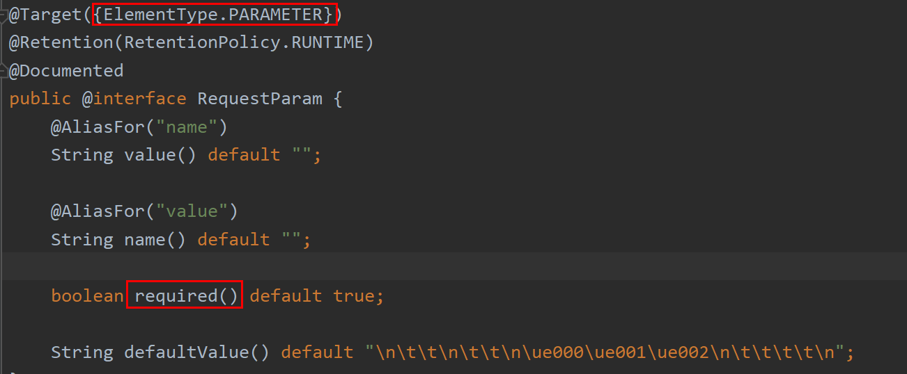 </div><br>


  **HelloController.java**

  ```java
    @RequestMapping(value = "test", method = RequestMethod.GET)
    public void test(@RequestParam(name = "username") String name, String password) {
        System.out.println(name);
        System.out.println(password);
    }
  ```

  

**@RequestBody**

**作用**

获得 `request body`

**HelloController.java**

```java
    @RequestMapping(value = "/test", method = {RequestMethod.POST, RequestMethod.GET})
    public void test(@RequestBody String json) {
        System.out.println(json);
    }
```

 <div align="center"> 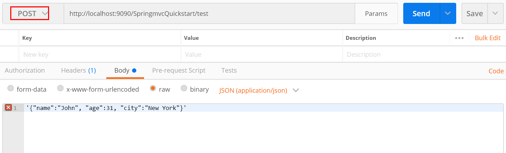 </div><br>

:heavy_check_mark:Succeeded!

<div align="center"> 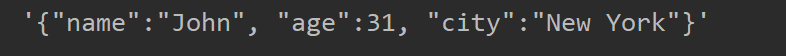 </div><br>


**HelloController.java**

```java
    @RequestMapping(value = "/test", method = {RequestMethod.POST, RequestMethod.GET})
    public void test(@RequestBody User user) {
        System.out.println(user);
    }
```


**User.java**

```java
public class User implements Serializable {
    private String name;
    private Integer age;
    private String city;
    
    // constructors
    // getter and setter
    // override toString()
    
}
```

<div align="center"> 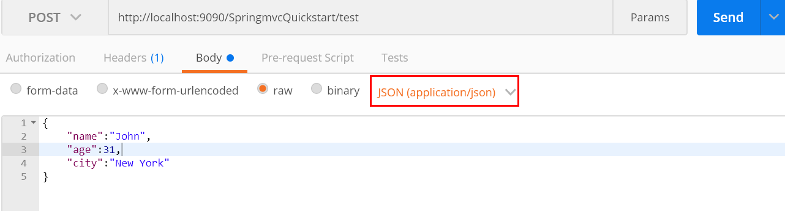 </div><br>

:heavy_check_mark:Succeeded!

<div align="center"> 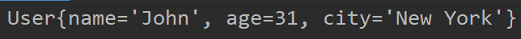 </div><br>

**:warning:填坑指南**

1. `post` 请求才有 `requestbody` （`get` 请求没有）
2. 从 `postman` 发送请求时带的请求体若为 `json` 格式，一定要正确！（中文符号，漏标点，多了双引号都是不允许的）
3. 将 `json` 格式的数据封装成 `Java Bean` 需要导入 `jackson` 相关坐标

<div align="center"> 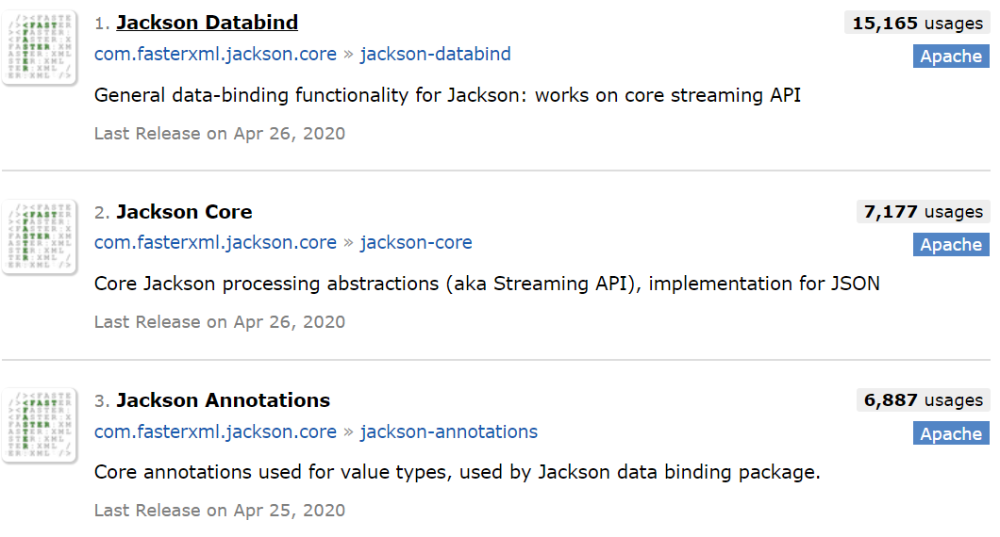 </div><br>


**@PathVariable**

**作用**

获取资源占位符的值

**HelloController.java**

```java
    @RequestMapping(value = "/test/{id}", method = {RequestMethod.GET, RequestMethod.POST})
    public void testVariable(@PathVariable(name = "id") String id) {
        System.out.println(id);
    }
```


**@PathVariable 源码**

  <div align="center"> 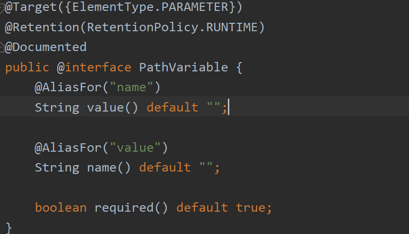 </div><br>

  <div align="center"> 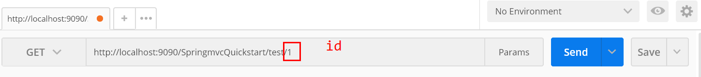 </div><br>

:heavy_check_mark:Succeeded!

<div align="center">  </div><br>


## 6. Model And View

### 6.1 String

其中一级目录是 `/user`

**HelloController.java**

```java
    @RequestMapping("/testString")
    public String testString(Model model) {
        System.out.println("test string");
        // simulate a model
        User user = new User("LBJ", 35, "Cleveland");
        model.addAttribute("user", user);
        return "Succeeded";
    }
```

其中`return` 语句实现跳转成功页面多亏了我们设置的 `viewResolver`

**spring-servlet.xml**

```xml
<bean id="internalResourceViewResolver" class="org.springframework.web.servlet.view.InternalResourceViewResolver">
        <property name="prefix" value="/WEB-INF/pages/"></property>
        <property name="suffix" value=".jsp"></property>
</bean>
```


**Succeeded.jsp**

```jsp
<%@ page contentType="text/html;charset=UTF-8" language="java" isELIgnored="false" %>
<html>
<head>
    <title>Succeeded</title>
</head>
<body>
<h1>Congratulations! Succeeded!</h1>
${user}
</body>
</html>
```

其中要写 `isELIgnored="false"`，开启支持 `EL` 表达式

:heavy_check_mark:Succeeded!

<div align="center"> 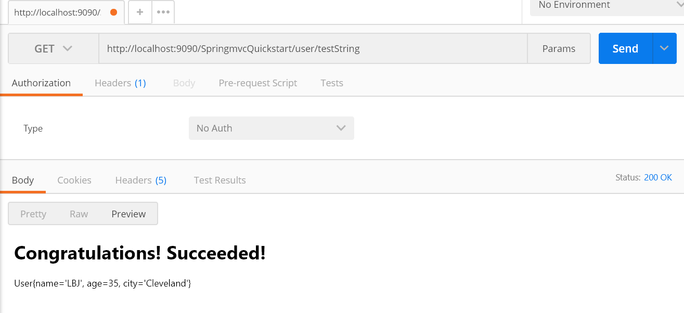 </div><br>

### 6.2 Model

Simply put, the model can supply attributes used for rendering views.

To provide a view with usable data, we simply add this data to its *Model* object. Additionally, maps with attributes can be merged with *Model* instances:

**HelloController.java**

```java
    @RequestMapping("/testModel")
    public String testModel(Model model) {
        Map<String, String> map = new HashMap<>();
        model.addAttribute("hello", "world");
        map.put("spring", "mvc");
        model.mergeAttributes(map);
        return "Succeeded";
    }
```

**Succeeded.jsp**

```html
<body>
<h1>Congratulations! Succeeded!</h1>
${hello}
${spring}
</body>
```

:heavy_check_mark:Succeeded!


<div align="center"> 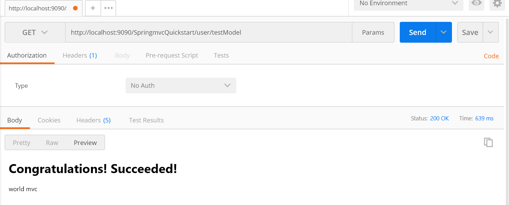 </div><br>


### 6.3 ModelMap

Just like the *Model* interface above, *ModelMap* is also used to pass values to render a view.

The advantage of *ModelMap* is it gives us the ability to pass a collection of values and treat these values as if they were within a *Map*:

**HelloController.java**

```java
    @RequestMapping("/testModelMap")
    public String testModelMap(ModelMap modelMap) {
        List<String> fruits = new ArrayList<>();
        fruits.add("apple");
        fruits.add("banana");
        fruits.add("watermelon");
        modelMap.addAttribute("fruits", fruits);
        return "Succeeded";
    }
```

**index.jsp**

```html
<body>
<h1>Congratulations! Succeeded!</h1>
${fruits}<br>
${fruits.get(0)}<br>
${fruits.get(1)}<br>
${fruits.get(2)}<br>
</body>
```


:heavy_check_mark:Succeeded!

<div align="center"> 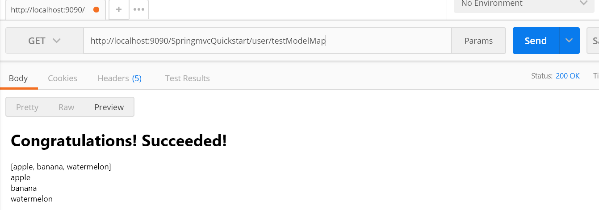 </div><br>


### 6.4 ModelAndView

The final interface to pass values to a view is the *ModelAndView*.

This interface allows us to pass all the information required by Spring MVC in one return

**HelloController.java**

```java
    @RequestMapping("/testModelAndView")
    public ModelAndView testModelAndView() {
        ModelAndView modelAndView = new ModelAndView("Succeeded");
        modelAndView.addObject("hello", "Model And View");
        return modelAndView;
    }
```

**Succeeded.jsp**

```html
<body>
<h1>Congratulations! Succeeded!</h1>
${hello}
</body>
```


:heavy_check_mark:Succeeded!


<div align="center"> 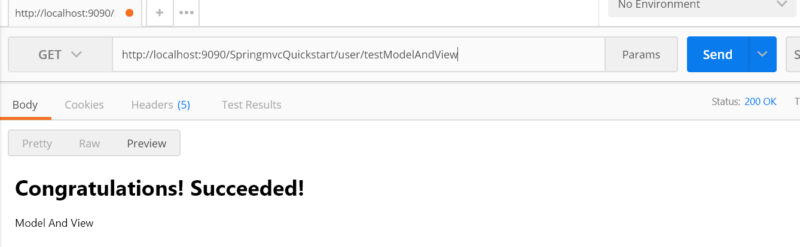 </div><br>

### 6.5 Serve Static Resources with Spring

引入 `jquery` 资源

<div align="center"> 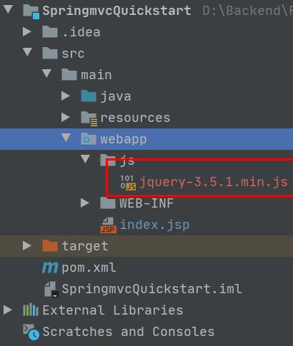 </div><br>

**index.jsp**

```javascript
    <script src="js/jquery-3.5.1.min.js"></script>
    <script>
        $(function () {
            $("#button").click(function () {
                alert("Hello")
            })
        })
    </script>
```

<div align="center">  </div><br>

当我们点击 `click me` 时并没有达到预期的效果，并没有 `alert` 弹窗

这是因为：

**web.xml**

```xml
    <servlet>
        <servlet-name>dispatcherServlet</servlet-name>
        <servlet-class>org.springframework.web.servlet.DispatcherServlet</servlet-class>
        <init-param>
            <param-name>contextConfigLocation</param-name>
            <param-value>classpath:spring-servlet.xml</param-value>
        </init-param>
        <load-on-startup>1</load-on-startup>
    </servlet>

    <servlet-mapping>
        <servlet-name>dispatcherServlet</servlet-name>
        <url-pattern>/</url-pattern>
    </servlet-mapping>
```

`dispatcherServlet` 是背后的始作俑者

1. `<url-pattern>/</url-pattern>` 这句中，`dispatcherServlet` 拦截了所有的路径，交给 `Spring` 容器管理
2. `Spring` 容器根据 `@RequestMapping` 来寻找相当于应的资源（方法）
3. 显然静态资源就被其拦截了


**解决方案**

If you need to go the old fashion way with XML-based configuration, you can make good use of the *mvc:resources* element to point to the location of resources with a specific public URL pattern.

For example – the following line will serve all requests for resources coming in with a public URL pattern like “*/resources/***” by searching in the “/*resources/*” directory under the root folder in our application.

```xml
<mvc:resources mapping="/resources/**" location="/resources/" />
```

**spring-servlet.xml**

```xml
 <mvc:resources mapping="/js/**" location="/js/"></mvc:resources>
```

- `location`：对应的资源位置（`webapp` 目录下）
- `mapping`：对应的请求 `URL`

<div align="center">  </div><br>

**:warning:填坑指南**

- `location` 不正确会提示

  <div align="center"> 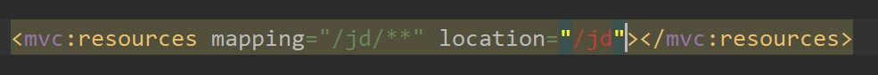 </div><br>

- `jquery` 根据元素 `id` 获取值一定要加 `#` ！

  <div align="center"> 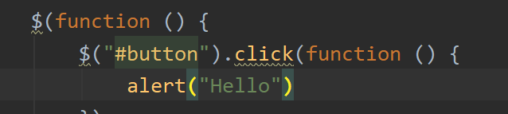 </div><br>

### 6.6 Responsebody

  <div align="center"> 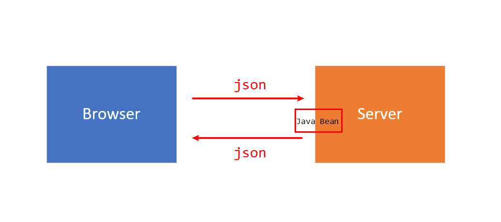 </div><br>

<div align="center">  </div><br>


**index.jsp**

```javascript
 <script>
        $(function () {
            $("button").click(function(){
                $.ajax({
                    url: "user/testAjax",
                    dataType: "json",
                    contentType:"application/json; charset=utf-8",
                    data: JSON.stringify({
                        "name":"LBJ",
                        "age":22,
                        "city":"LA"
                    }),
                    type: "POST",
                    // A function to be run when the request succeeds
                    success: function(data){
                        alert(data.name);
                        alert(data.age);
                        alert(data.city);
                    }
                });
            });
        })
</script>
```

**HelloController.java**

```java
    @RequestMapping(value = "/testAjax", method = RequestMethod.POST)
    public @ResponseBody User testAjax(@RequestBody User user) {
        System.out.println("testing ajax");
        // result
        System.out.println(user);

        // set user
        user.setName("Masiwei");
        user.setAge(22);
        user.setCity("Chengdu");

        return user;
    }
```


:heavy_check_mark:Succeeded!

<div align="center"> 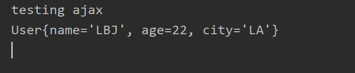 </div><br>

<div align="center"> 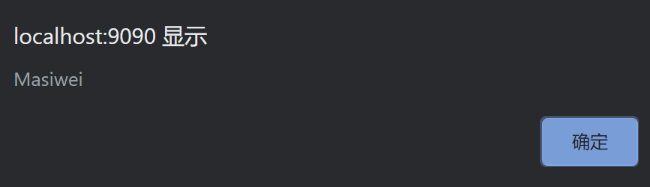 </div><br>

<div align="center"> 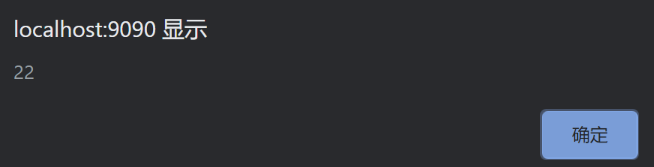 </div><br>

<div align="center"> 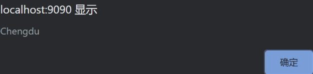 </div><br>

## 7. File Upload with Spring MVC

### 7.1 Overview

In this article, we focus on what Spring offers for **multipart (file upload) support** in web applications.

Spring allows us to enable this multipart support with pluggable *MultipartResolver* objects. The framework provides one *MultipartResolver* implementation for use with **Commons FileUpload** and another for use with **Servlet 3.0** multipart request parsing.

After configuring the *MultipartResolver* we'll see how to upload a single file and multiple files.

### 7.2 What is multipart/form-data?

<div align="center"> 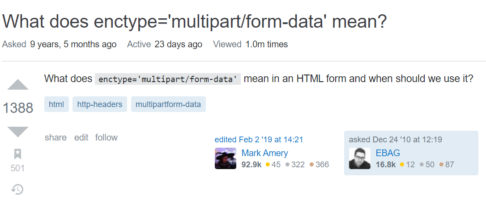 </div><br>

<div align="center"> 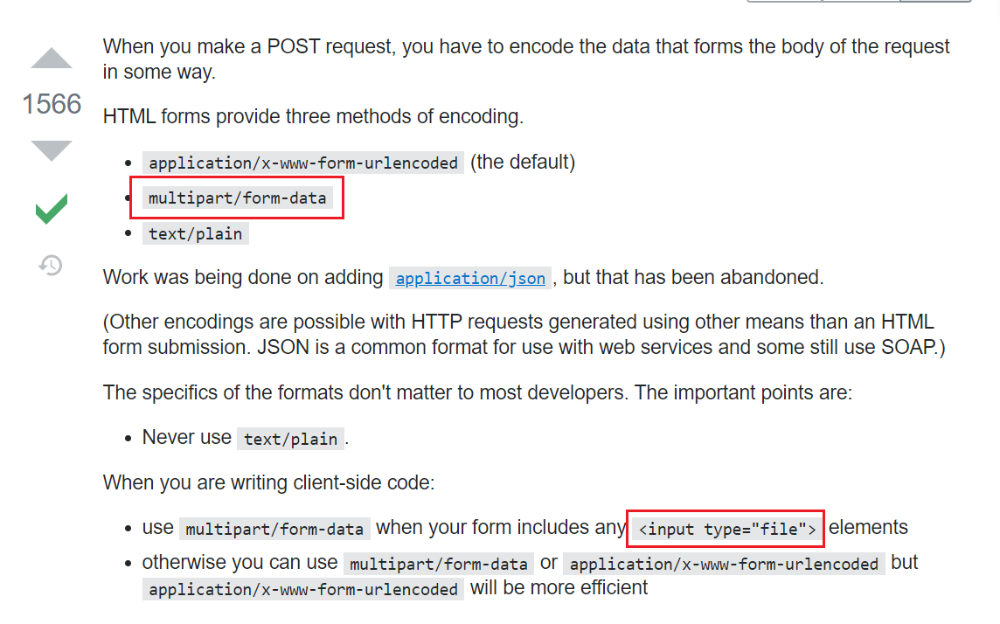 </div><br>

### 7.3 multipartResolver

<div align="center"> 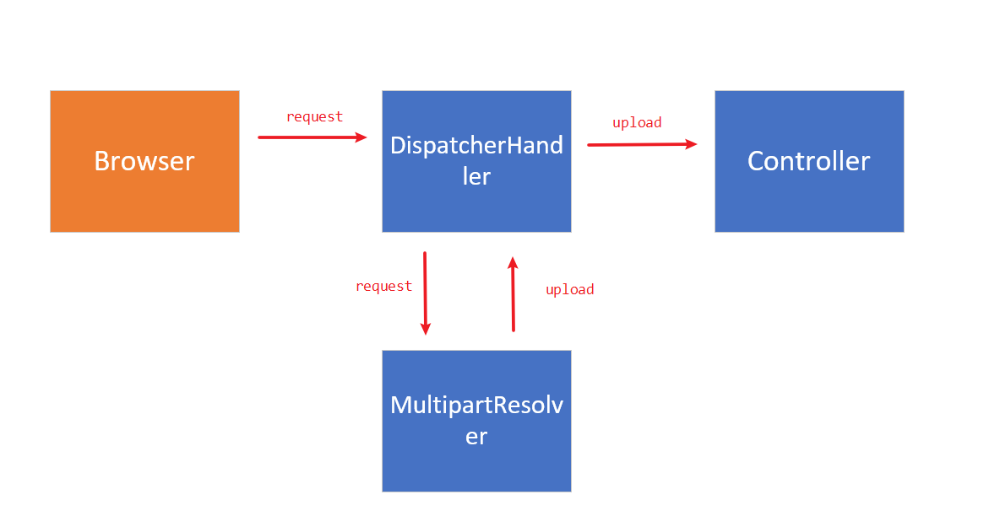 </div><br>


### 7.4 Demo


