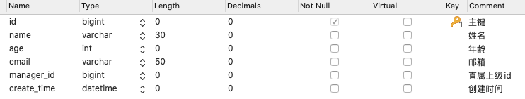

# MyBatis Plus

<div align="center">  </div><br>


Table of Contents
-----------------

* [前期准备](#前期准备)
* [1. 查询方法](#1-查询方法)
* [2. 自定义 sql](#2-自定义-sql)
* [3. 分页](#3-分页)
* [4. 更新 &amp; 删除](#4-更新--删除)
* [5. AR 模式 &amp; 主键策略](#5-ar-模式--主键策略)
* [6. 通用 service](#6-通用-service)
* [7. 逻辑删除](#7-逻辑删除)
* [8. 自动填充](#8-自动填充)
* [9. 乐观锁](#9-乐观锁)
* [10. 性能分析](#10-性能分析)
* [11. 多租户](#11-多租户)
* [12. 动态表](#12-动态表)
* [13. SQL 注入器](#13-sql-注入器)
* [参考链接](#参考链接)


## 前期准备

建表：

```sql
SHOW DATABASES;

CREATE DATABASE mp;

USE mp;

-- 创建用户表
CREATE TABLE user (
  id BIGINT(20) PRIMARY KEY NOT NULL COMMENT '主键',
  name VARCHAR(30) DEFAULT NULL COMMENT '姓名',
  age INT(11) DEFAULT NULL COMMENT '年龄',
  email VARCHAR(50) DEFAULT NULL COMMENT '邮箱',
  manager_id BIGINT(20) DEFAULT NULL COMMENT '直属上级id',
  create_time DATETIME DEFAULT NULL COMMENT '创建时间',
  CONSTRAINT manager_fk FOREIGN KEY (manager_id)
  REFERENCES user (id)
)  ENGINE=INNODB CHARSET=UTF8;

-- 初始化数据：
INSERT INTO user (id, name, age, email, manager_id
                  , create_time)
VALUES (1087982257332887553, '大boss', 40, 'boss@baomidou.com', NULL
        , '2019-01-11 14:20:20'),
	(1088248166370832385, '王天风', 25, 'wtf@baomidou.com', 1087982257332887553
   , '2019-02-05 11:12:22'),
	(1088250446457389058, '李艺伟', 28, 'lyw@baomidou.com', 1088248166370832385
   , '2019-02-14 08:31:16'),
	(1094590409767661570, '张雨琪', 31, 'zjq@baomidou.com', 1088248166370832385
   , '2019-01-14 09:15:15'),
	(1094592041087729666, '刘红雨', 32, 'lhm@baomidou.com', 1088248166370832385
   , '2019-01-14 09:48:16');
```

<div align="center">  </div><br>

引入依赖：

**pom.xml**

```xml
<dependencies>
  <dependency>
    <groupId>org.springframework.boot</groupId>
    <artifactId>spring-boot-starter-web</artifactId>
  </dependency>
  <!-- https://mvnrepository.com/artifact/com.baomidou/mybatis-plus-boot-starter -->
  <dependency>
    <groupId>com.baomidou</groupId>
    <artifactId>mybatis-plus-boot-starter</artifactId>
    <version>3.2.0</version>
  </dependency>
  <dependency>
    <groupId>com.baomidou</groupId>
    <artifactId>mybatis-plus-generator</artifactId>
    <version>3.2.0</version>
  </dependency>
  <!-- 模板引擎 -->
  <dependency>
    <groupId>org.apache.velocity</groupId>
    <artifactId>velocity-engine-core</artifactId>
    <version>2.0</version>
  </dependency>
  <dependency>
    <groupId>mysql</groupId>
    <artifactId>mysql-connector-java</artifactId>
    <scope>runtime</scope>
  </dependency>
  <dependency>
    <groupId>org.projectlombok</groupId>
    <artifactId>lombok</artifactId>
    <optional>true</optional>
  </dependency>
  <dependency>
    <groupId>org.springframework.boot</groupId>
    <artifactId>spring-boot-starter-test</artifactId>
    <scope>test</scope>
    <exclusions>
      <exclusion>
        <groupId>org.junit.vintage</groupId>
        <artifactId>junit-vintage-engine</artifactId>
      </exclusion>
    </exclusions>
  </dependency>
</dependencies>
```

配置文件：

**application.yml**

```yaml
#用来控制使用哪个配置文件deve/prod 开发环境/生产环境
spring:
  datasource:
    driver-class-name: com.mysql.cj.jdbc.Driver
    url: jdbc:mysql://localhost:3306/mp?useSSL=false&serverTimezone=GMT%2B8&allowMultiQueries=true&autoReconnect=true&characterEncoding=utf-8
    username: root
    password: yourpassword

#日志配置:trace,最低级别日志输出
logging:
  level:
    root: warn
    com.lf.mp.dao: trace

#mybatis-plus配置控制台打印完整带参数SQL语句
mybatis-plus:
  configuration:
    log-impl: org.apache.ibatis.logging.stdout.StdOutImpl
```

`mp` 代码生成器：

（改成适配自己项目，需配合官方文档及源码！耐心！）

**CodeGenerator.java**

```java
package com.ceezyyy.demo.util;

import com.baomidou.mybatisplus.annotation.IdType;
import com.baomidou.mybatisplus.core.exceptions.MybatisPlusException;
import com.baomidou.mybatisplus.core.toolkit.StringPool;
import com.baomidou.mybatisplus.core.toolkit.StringUtils;
import com.baomidou.mybatisplus.generator.AutoGenerator;
import com.baomidou.mybatisplus.generator.InjectionConfig;
import com.baomidou.mybatisplus.generator.config.*;
import com.baomidou.mybatisplus.generator.config.po.TableInfo;
import com.baomidou.mybatisplus.generator.config.rules.NamingStrategy;

import java.util.ArrayList;
import java.util.List;
import java.util.Scanner;

// 演示例子，执行 main 方法控制台输入模块表名回车自动生成对应项目目录中
public class CodeGenerator {

  /**
     * <p>
     * 读取控制台内容
     * </p>
     */
  public static String scanner(String tip) {
    Scanner scanner = new Scanner(System.in);
    StringBuilder help = new StringBuilder();
    help.append("请输入" + tip + "：");
    System.out.println(help.toString());
    if (scanner.hasNext()) {
      String ipt = scanner.next();
      if (StringUtils.isNotEmpty(ipt)) {
        return ipt;
      }
    }
    throw new MybatisPlusException("请输入正确的" + tip + "！");
  }

  public static void main(String[] args) {
    // 代码生成器
    AutoGenerator mpg = new AutoGenerator();

    // 全局配置
    GlobalConfig gc = new GlobalConfig();
    String projectPath = System.getProperty("user.dir");
    gc.setOutputDir(projectPath + "/src/main/java");
    gc.setAuthor("ceezyyy");
    gc.setOpen(false);
    // gc.setSwagger2(true); 实体属性 Swagger2 注解
    gc.setIdType(IdType.UUID);
    mpg.setGlobalConfig(gc);

    // 数据源配置
    DataSourceConfig dsc = new DataSourceConfig();
    dsc.setUrl("jdbc:mysql://localhost:3306/mp?useSSL=false&serverTimezone=GMT%2B8&allowMultiQueries=true&autoReconnect=true&characterEncoding=utf-8");
    // dsc.setSchemaName("public");
    dsc.setDriverName("com.mysql.cj.jdbc.Driver");
    dsc.setUsername("root");
    dsc.setPassword("727800Cy$");
    mpg.setDataSource(dsc);

    // 包配置
    PackageConfig pc = new PackageConfig();
    pc.setModuleName(scanner("模块名"));
    pc.setParent("com.ceezyyy");
    mpg.setPackageInfo(pc);

    // 自定义配置
    InjectionConfig cfg = new InjectionConfig() {
      @Override
      public void initMap() {
        // to do nothing
      }
    };

    // 如果模板引擎是 velocity
    String templatePath = "/templates/mapper.xml.vm";

    // 自定义输出配置
    List<FileOutConfig> focList = new ArrayList<>();
    // 自定义配置会被优先输出
    focList.add(new FileOutConfig(templatePath) {
      @Override
      public String outputFile(TableInfo tableInfo) {
        // 自定义输出文件名 ， 如果你 Entity 设置了前后缀、此处注意 xml 的名称会跟着发生变化！！
        return projectPath + "/src/main/resources/mapper/" + pc.getModuleName()
          + "/" + tableInfo.getEntityName() + "Mapper" + StringPool.DOT_XML;
      }
    });
    /*
        cfg.setFileCreate(new IFileCreate() {
            @Override
            public boolean isCreate(ConfigBuilder configBuilder, FileType fileType, String filePath) {
                // 判断自定义文件夹是否需要创建
                checkDir("调用默认方法创建的目录，自定义目录用");
                if (fileType == FileType.MAPPER) {
                    // 已经生成 mapper 文件判断存在，不想重新生成返回 false
                    return !new File(filePath).exists();
                }
                // 允许生成模板文件
                return true;
            }
        });
        */
    cfg.setFileOutConfigList(focList);
    mpg.setCfg(cfg);

    // 配置模板
    TemplateConfig templateConfig = new TemplateConfig();

    // 配置自定义输出模板
    //指定自定义模板路径，注意不要带上.ftl/.vm, 会根据使用的模板引擎自动识别
    // templateConfig.setEntity("templates/entity2.java");
    // templateConfig.setService();
    // templateConfig.setController();

    templateConfig.setXml(null);
    mpg.setTemplate(templateConfig);

    // 策略配置
    StrategyConfig strategy = new StrategyConfig();
    strategy.setNaming(NamingStrategy.underline_to_camel);
    strategy.setColumnNaming(NamingStrategy.underline_to_camel);
    //        strategy.setSuperEntityClass("你自己的父类实体,没有就不用设置!");
    strategy.setEntityLombokModel(true);
    strategy.setRestControllerStyle(true);
    // 公共父类
    //        strategy.setSuperControllerClass("你自己的父类控制器,没有就不用设置!");
    // 写于父类中的公共字段
    //        strategy.setSuperEntityColumns("id");
    strategy.setInclude(scanner("表名，多个英文逗号分割").split(","));
    strategy.setControllerMappingHyphenStyle(true);
    strategy.setTablePrefix(pc.getModuleName() + "_");
    mpg.setStrategy(strategy);
    //        mpg.setTemplateEngine(new FreemarkerTemplateEngine());
    mpg.execute();
  }

}
```


## 1. 查询方法

**BaseMapper.java**

```java
public interface BaseMapper<T> extends Mapper<T> {

    T selectById(Serializable id);

    List<T> selectBatchIds(@Param("coll") Collection<? extends Serializable> idList);

    List<T> selectByMap(@Param("cm") Map<String, Object> columnMap);

    T selectOne(@Param("ew") Wrapper<T> queryWrapper);

    Integer selectCount(@Param("ew") Wrapper<T> queryWrapper);

    List<T> selectList(@Param("ew") Wrapper<T> queryWrapper);

    List<Map<String, Object>> selectMaps(@Param("ew") Wrapper<T> queryWrapper);

    List<Object> selectObjs(@Param("ew") Wrapper<T> queryWrapper);

    IPage<T> selectPage(IPage<T> page, @Param("ew") Wrapper<T> queryWrapper);

    IPage<Map<String, Object>> selectMapsPage(IPage<T> page, @Param("ew") Wrapper<T> queryWrapper);
}
```

**selectById**

```java
@Test
public void testSelectById() {
    User user = userMapper.selectById(1087982257332887553L);
    System.out.println(user);
}
```


**selectBatchIds**

```java
@Test
public void testSelectBatchIds() {
    List<Long> idList = Arrays.asList(1088248166370832385L, 1094592041087729666L, 1094590409767661570L);
    userMapper.selectBatchIds(idList).forEach(System.out::println);
}
```


**selectByMap**

```java
@Test
public void testSelectByMap() {
    Map<String, Object> map = new HashMap<>();
    map.put("age", 32);
    userMapper.selectByMap(map).forEach(System.out::println);
}
```

⚠️注意：传入参数 `map` 中的 `key` 需与数据库中的列名一致

```sql
==>  Preparing: SELECT id,create_time,name,manager_id,email,age FROM user WHERE age = ? 
==> Parameters: 32(Integer)
<==    Columns: id, create_time, name, manager_id, email, age
<==        Row: 1094590409767661570, 2019-01-14 09:15:15, 张雨琪, 1088248166370832385, zjq@baomidou.com, 32
<==        Row: 1094592041087729666, 2019-01-14 09:48:16, 刘红雨, 1088248166370832385, lhm@baomidou.com, 32
<==      Total: 2
```


条件构造器

**AbstractWrapper**

```java
public abstract class AbstractWrapper<T, R, Children extends AbstractWrapper<T, R, Children>> extends Wrapper<T> implements Compare<Children, R>, Nested<Children, Children>, Join<Children>, Func<Children, R> {
}
```

**说明:**

- 以下出现的第一个入参`boolean condition`表示该条件**是否**加入最后生成的sql中
- 以下代码块内的多个方法均为从上往下补全个别`boolean`类型的入参,默认为`true`
- 以下出现的泛型`Param`均为`Wrapper`的子类实例(均具有`AbstractWrapper`的所有方法)
- 以下方法在入参中出现的`R`为泛型,在普通wrapper中是`String`,在LambdaWrapper中是**函数**(例:`Entity::getId`,`Entity`为实体类,`getId`为字段`id`的**getMethod**)
- 以下方法入参中的`R column`均表示数据库字段,当`R`具体类型为`String`时则为数据库字段名(**字段名是数据库关键字的自己用转义符包裹!**)!而不是实体类数据字段名!!!,另当`R`具体类型为`SFunction`时项目runtime不支持eclipse自家的编译器!!!
- 以下举例均为使用普通wrapper,入参为`Map`和`List`的均以`json`形式表现!
- 使用中如果入参的`Map`或者`List`为**空**,则不会加入最后生成的sql中!!!
- 有任何疑问就点开源码看,看不懂**函数**的[点击我学习新知识](https://www.jianshu.com/p/613a6118e2e0)

**SqlKeyword.java**

```java
public enum SqlKeyword implements ISqlSegment {
    AND("AND"),
    OR("OR"),
    IN("IN"),
    NOT("NOT"),
    LIKE("LIKE"),
    EQ("="),
    NE("<>"),
    GT(">"),
    GE(">="),
    LT("<"),
    LE("<="),
    IS_NULL("IS NULL"),
    IS_NOT_NULL("IS NOT NULL"),
    GROUP_BY("GROUP BY"),
    HAVING("HAVING"),
    ORDER_BY("ORDER BY"),
    EXISTS("EXISTS"),
    BETWEEN("BETWEEN"),
    ASC("ASC"),
    DESC("DESC");
```

学术有专攻，查询部分有 `QueryWrapper`

**QueryWrapper**

```java
public class QueryWrapper<T> extends AbstractWrapper<T, String, QueryWrapper<T>> implements Query<QueryWrapper<T>, T, String> {
}
```


**查询需求：** 名字中包含雨年并且龄大于等于20且小于等于40并且email不为空

```java
@Test
public void testSelectByWrapper() {
  QueryWrapper<User> queryWrapper = Wrappers.query();
  queryWrapper.like("name", "%雨%").between("age", 20, 40).isNotNull("email");
  userMapper.selectList(queryWrapper).forEach(System.out::println);
}
```

```sql
==>  Preparing: SELECT id,create_time,name,manager_id,email,age FROM user WHERE (name LIKE ? AND age BETWEEN ? AND ? AND email IS NOT NULL) 
==> Parameters: %%雨%%(String), 20(Integer), 40(Integer)
<==    Columns: id, create_time, name, manager_id, email, age
<==        Row: 1094590409767661570, 2019-01-14 09:15:15, 张雨琪, 1088248166370832385, zjq@baomidou.com, 32
<==        Row: 1094592041087729666, 2019-01-14 09:48:16, 刘红雨, 1088248166370832385, lhm@baomidou.com, 32
<==      Total: 2
```

⚠️注意：传入参数的 `key` 需与数据库中的列名一致


**查询需求：** 名字为王姓或者年龄大于等于25，按照年龄降序排列，年龄相同按照id升序排列

```java
@Test
public void testSelectByWrapper() {
  QueryWrapper<User> queryWrapper = Wrappers.query();
  queryWrapper
    .likeRight("name", "王")
    .or()
    .ge("age", 25)
    .orderByDesc("age")
    .orderByAsc("id");
  userMapper.selectList(queryWrapper).forEach(System.out::println);
}
```

```sql
==>  Preparing: SELECT id,create_time,name,manager_id,email,age FROM user WHERE (name LIKE ? OR age >= ?) ORDER BY age DESC , id ASC 
==> Parameters: 王%(String), 25(Integer)
<==    Columns: id, create_time, name, manager_id, email, age
<==        Row: 1087982257332887553, 2019-01-11 14:20:20, 大boss, null, boss@baomidou.com, 40
<==        Row: 1094590409767661570, 2019-01-14 09:15:15, 张雨琪, 1088248166370832385, zjq@baomidou.com, 32
<==        Row: 1094592041087729666, 2019-01-14 09:48:16, 刘红雨, 1088248166370832385, lhm@baomidou.com, 32
<==        Row: 1088250446457389058, 2019-02-14 08:31:16, 李艺伟, 1088248166370832385, lyw@baomidou.com, 28
<==        Row: 1088248166370832385, 2019-02-05 11:12:22, 王天风, 1087982257332887553, wtf@baomidou.com, 25
<==      Total: 5
```


**查询需求：** 创建日期为2019年2月14日并且直属上级为名字为王姓


**查询需求：** 名字为王姓并且（年龄小于40或邮箱不为空）

```java
@Test
public void testSelectByWrapper() {
    QueryWrapper<User> queryWrapper = Wrappers.query();
    queryWrapper
            .likeRight("name", "王")
            .and(i -> i.le("age", 40).or().isNotNull("email"));
    userMapper.selectList(queryWrapper).forEach(System.out::println);
}
```

```sql
==>  Preparing: SELECT id,create_time,name,manager_id,email,age FROM user WHERE (name LIKE ? AND ( (age <= ? OR email IS NOT NULL) )) 
==> Parameters: 王%(String), 40(Integer)
<==    Columns: id, create_time, name, manager_id, email, age
<==        Row: 1088248166370832385, 2019-02-05 11:12:22, 王天风, 1087982257332887553, wtf@baomidou.com, 25
<==      Total: 1
```


**查询需求：** 名字为王姓或者（年龄小于40并且年龄大于20并且邮箱不为空）

```java
@Test
public void testSelectByWrapper() {
    QueryWrapper<User> queryWrapper = Wrappers.query();
    queryWrapper
            .likeRight("name", "王")
            .or(i -> i.lt("age", 40).gt("age", 20).isNotNull("email"));
    userMapper.selectList(queryWrapper).forEach(System.out::println);
}
```

```java
==>  Preparing: SELECT id,create_time,name,manager_id,email,age FROM user WHERE (name LIKE ? OR ( (age < ? AND age > ? AND email IS NOT NULL) )) 
==> Parameters: 王%(String), 40(Integer), 20(Integer)
<==    Columns: id, create_time, name, manager_id, email, age
<==        Row: 1088248166370832385, 2019-02-05 11:12:22, 王天风, 1087982257332887553, wtf@baomidou.com, 25
<==        Row: 1088250446457389058, 2019-02-14 08:31:16, 李艺伟, 1088248166370832385, lyw@baomidou.com, 28
<==        Row: 1094590409767661570, 2019-01-14 09:15:15, 张雨琪, 1088248166370832385, zjq@baomidou.com, 32
<==        Row: 1094592041087729666, 2019-01-14 09:48:16, 刘红雨, 1088248166370832385, lhm@baomidou.com, 32
<==      Total: 4
```


**查询需求：**（年龄小于40或邮箱不为空）并且名字为王姓

```java
@Test
public void testSelectByWrapper() {
    QueryWrapper<User> queryWrapper = Wrappers.query();
    queryWrapper
            .likeRight("name", "王")
            .and(i -> i.lt("age", 40).or().isNotNull("email"));
    userMapper.selectList(queryWrapper).forEach(System.out::println);
}
```

```sql
==>  Preparing: SELECT id,create_time,name,manager_id,email,age FROM user WHERE (name LIKE ? AND ( (age < ? OR email IS NOT NULL) )) 
==> Parameters: 王%(String), 40(Integer)
<==    Columns: id, create_time, name, manager_id, email, age
<==        Row: 1088248166370832385, 2019-02-05 11:12:22, 王天风, 1087982257332887553, wtf@baomidou.com, 25
<==      Total: 1
```


**查询需求：** 年龄为30、31、34、35

```java
@Test
public void testSelectByWrapper() {
    QueryWrapper<User> queryWrapper = Wrappers.query();
    queryWrapper.in("age", 30, 31, 32, 34, 35);
    userMapper.selectList(queryWrapper).forEach(System.out::println);
}
```

```sql
==>  Preparing: SELECT id,create_time,name,manager_id,email,age FROM user WHERE (age IN (?,?,?,?,?)) 
==> Parameters: 30(Integer), 31(Integer), 32(Integer), 34(Integer), 35(Integer)
<==    Columns: id, create_time, name, manager_id, email, age
<==        Row: 1094590409767661570, 2019-01-14 09:15:15, 张雨琪, 1088248166370832385, zjq@baomidou.com, 32
<==        Row: 1094592041087729666, 2019-01-14 09:48:16, 刘红雨, 1088248166370832385, lhm@baomidou.com, 32
<==      Total: 2
```


**查询需求：** 查询名字中包含 “雨” 且年龄小于 40（只列出 `id` 和 `name`）

```java
@Test
public void testSelectByWrapper() {
    QueryWrapper<User> queryWrapper = Wrappers.query();
    queryWrapper
            .like("name", "雨")
            .lt("age", 40)
            .select("id", "name");
    userMapper.selectList(queryWrapper).forEach(System.out::println);
}
```

```sql
==>  Preparing: SELECT id,name FROM user WHERE (name LIKE ? AND age < ?) 
==> Parameters: %雨%(String), 40(Integer)
<==    Columns: id, name
<==        Row: 1094590409767661570, 张雨琪
<==        Row: 1094592041087729666, 刘红雨
<==      Total: 2
```


使用 `selectByMaps` 方法，过滤掉列名为 `null`

```java
@Test
public void testSelectMaps() {
    QueryWrapper<User> queryWrapper = Wrappers.query();
    queryWrapper
            .like("name", "雨")
            .lt("age", 40)
            .select("id", "name");
    userMapper.selectMaps(queryWrapper).forEach(System.out::println);
}
```

```sql
==>  Preparing: SELECT id,name FROM user WHERE (name LIKE ? AND age < ?) 
==> Parameters: %雨%(String), 40(Integer)
<==    Columns: id, name
<==        Row: 1094590409767661570, 张雨琪
<==        Row: 1094592041087729666, 刘红雨
<==      Total: 2
```


**查询需求：** 按照直属上级分组，查询每组的平均年龄、最大年龄、最小年龄。并且只取年龄总和小于500的组

```java
@Test
public void testSelectByWrapper() {
    QueryWrapper<User> queryWrapper = Wrappers.query();
    queryWrapper
            .select("avg(age) as avg_age", "max(age) as max_avg", "min(age) as min_avg")
            .groupBy("manager_id")
            .having("sum(age) < {0}", 500);
    userMapper.selectList(queryWrapper);
}
```

 ```sql
==>  Preparing: SELECT avg(age) as avg_age,max(age) as max_avg,min(age) as min_avg FROM user GROUP BY manager_id HAVING sum(age) < ? 
==> Parameters: 500(Integer)
<==    Columns: avg_age, max_avg, min_avg
<==        Row: 40.0000, 40, 40
<==        Row: 25.0000, 25, 25
<==        Row: 30.6667, 32, 28
<==      Total: 3
 ```

## 2. 自定义 sql 

暂略

## 3. 分页

`mp` 提供了 `PaginationInterceptor` 分页插件

**MybatisPlusConfig.java**

```java
@Configuration
@MapperScan("com.baomidou.cloud.service.*.mapper*")
public class MybatisPlusConfig {

    @Bean
    public PaginationInterceptor paginationInterceptor() {
        PaginationInterceptor paginationInterceptor = new PaginationInterceptor();
        // 设置请求的页面大于最大页后操作， true调回到首页，false 继续请求  默认false
        // paginationInterceptor.setOverflow(false);
        // 设置最大单页限制数量，默认 500 条，-1 不受限制
        // paginationInterceptor.setLimit(500);
        // 开启 count 的 join 优化,只针对部分 left join
        paginationInterceptor.setCountSqlParser(new JsqlParserCountOptimize(true));
        return paginationInterceptor;
    }
}
```

`BaseMapper` 提供了 2 个关于分页的方法：

**BaseMapper.java**

```java
/**
 * 根据 entity 条件，查询全部记录（并翻页）
 *
 * @param page         分页查询条件（可以为 RowBounds.DEFAULT）
 * @param queryWrapper 实体对象封装操作类（可以为 null）
 */
IPage<T> selectPage(IPage<T> page, @Param(Constants.WRAPPER) Wrapper<T> queryWrapper);

/**
 * 根据 Wrapper 条件，查询全部记录（并翻页）
 *
 * @param page         分页查询条件
 * @param queryWrapper 实体对象封装操作类
 */
IPage<Map<String, Object>> selectMapsPage(IPage<T> page, @Param(Constants.WRAPPER) Wrapper<T> queryWrapper);
```

可以看到两个方法传入的参数和返回值都为 `IPage<T>`

`IPage` 为 `mp` 为我们封装好的分页对象接口

**IPage.java**

```java
/**
 * 分页 Page 对象接口
 */
public interface IPage<T> extends Serializable {
}
```

其只有唯一的实现类：`Page`

**Page.java**

```java
/**
 * 简单分页模型
 */
public class Page<T> implements IPage<T> {
}
```


## 4. 更新 & 删除

## 5. AR 模式 & 主键策略

## 6. 通用 service

## 7. 逻辑删除

## 8. 自动填充

## 9. 乐观锁

## 10. 性能分析

## 11. 多租户

## 12. 动态表

## 13. SQL 注入器


## 总结

- 实践出真知
- 官网提供的例子 / 工具类要懂得如何改成适合自己项目
- `Long` 类型加 `L` 而不是 `l` （便于区分）
- `MySQL` 中 `between` 是闭区间（包括边界值）

## 参考链接

- [MyBatis-Plus](https://baomidou.com/)
- [MyBatis-Plus入门](https://www.imooc.com/learn/1130)
- [MyBatis-Plus进阶](https://www.imooc.com/learn/1171)
- [Consumer Interface in Java 8](https://www.youtube.com/watch?v=5uJ8jSf-c9g&t=14s)
