# Vue Quickstart

## Category
* [0. Hello World!](#0-hello-world-)
* [1. Vue basic](#1-vue-basic)
  + [1.1 data](#11-data)
  + [1.2 v-text](#12-v-text)
  + [1.3 v-html](#13-v-html)
  + [1.4 @click](#14--click)
  + [1.5 Counter demo](#15-counter-demo)
  + [1.6 v-show](#16-v-show)
  + [1.7 v-if](#17-v-if)
  + [1.8 Slideshow demo](#18-slideshow-demo)
  + [1.9 v-for](#19-v-for)
  + [1.10 v-model](#110-v-model)
* [2. Vue cli3](#2-vue-cli3)
  + [2.1 Installation](#21-installation)
  + [2.2 Quickstart](#22-quickstart)
* [3. axios](#3-axios)
  + [3.1 Installation](#31-installation)
  + [3.2 What is axios?](#32-what-is-axios-)
  + [3.3 axios quickstart](#33-axios-quickstart)
    - [3.3.1 get](#331-get)
    - [3.3.2 post](#332-post)
  + [3.4 填坑指南](#34-----)
    - [3.4.1 params](#341-params)
    - [3.4.2 body](#342-body)


## 0. Hello World!

```html
<body>
    <div id="app">
        <h1>{{message}}</h1>
    </div>
</body>
```

```javascript
var app = new Vue({
    el: "#app",
    data: {
        message: "Hello World!"
    }
})
```

<div align="center">  </div><br>


## 1. Vue basic

### 1.1 data

```html
<body>
    <div id="app">
        <h1>{{person.first_name}}</h1>
        <h2>{{city[1]}}</h2>
    </div>
</body>
```

```javascript
var app = new Vue({
    el: "#app",
    data: {
        message: "Hello World!",
        person: {
            first_name: "Yi",
            last_name: "Cai"
        },
        city: ["Beijing", "Shanghai"]
    }
})
```

<div align="center">  </div><br>

### 1.2 v-text

```html
<body>
    <div id="app">
        <h1 v-text="message">Shanghai</h1>
        <h1>{{message}} Shanghai</h1>
    </div>
</body>
```

```javascript
var app = new Vue({
    el: "#app",
    data: {
        message: "Hello World!"
    }
})
```
<div align="center">  </div><br>

**:bulb:Hint**

与插值表达式的区别：`v-text` 不能插入，`{{}}` 可以


### 1.3 v-html

```html
<body>
    <div id="app">
        <p v-text="message"></p>
        <p v-html="message"></p>
        <p>{{message}}</p>
    </div>
</body>
```

```javascript
var app = new Vue({
    el: "#app",
    data: {
        message: "<h1>Hello World</h1>"
    }
})
```

<div align="center"> 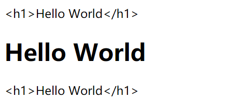 </div><br>

### 1.4 @click

`vue` 通过数据来改变 `dom` 属性

```html
<body>
    <div id="app">
        <h1>{{ num }}</h1>
        <button @click="plus_one">Click me</button>
    </div>
</body>
```

```javascript
var app = new Vue({
    el: "#app",
    data: {
        num: 1,
    },
    methods: {
        plus_one: function () {
            this.num++
        }
    }
})
```


### 1.5 Counter demo

实现一个简单的 `counter` ，其中下界是 0，上界是 10

```html
<body>
    <div id="app">
        <button @click="minus">minus</button>
        <input type="text" v-model="num">
        <button @click="plus">plus</button>
    </div>
</body>
```

注意，操作 `data` 要使用 `this` 

```javascript
var app = new Vue({
    el: "#app",
    data: {
        num: 2,
    },
    methods: {
        plus: function () {
            if (this.num < 10) {
                this.num++;
            } else {
                alert("Plus failed!");
            }
        },
        minus: function () {
            if (this.num > 0) {
                this.num--
            } else {
                alert("Minus failed")
            }
        }
    }
})
```
<div align="center"> 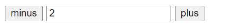 </div><br>


### 1.6 v-show

```html
<body>
    <div id="app">
        <button @click="changeToFalse">CHANGE</button>
        <h1 v-show="flag">Can u see me</h1>
    </div>
</body>
```

```javascript
var app = new Vue({
    el: "#app",
    data: {
        num: 2,
        flag: true,
    },
    methods: {
        changeToFalse: function () {
            this.flag = !this.flag
        }
    }
})
```


<div align="center">  </div><br>


### 1.7 v-if

与 `v-show` 类似

### 1.8 Slideshow demo

```html
<body>
    <div id="app">
        <br>
        <button @click="left" v-show="index > 0">LEFT</button>
        <button @click="right" v-show="index < images.length - 1">RIGHT</button>
    </div>
</body>
```

```javascript
var app = new Vue({
    el: "#app",
    data: {
        index: 1,
        images: [
            "./img/1.jpg",
            "./img/2.jpg",
            "./img/3.jpg"
        ],
    },
    methods: {
        left: function () {
            this.index--;
        },
        right: function () {
            this.index++;
        }
    }
})
```


<div align="center">  </div><br>

<div align="center">  </div><br>

<div align="center">  </div><br>

在 `v-show` 里面写 `js` 逻辑十分便捷！

### 1.9 v-for

```html
<body>
    <div id="app">
        <ul>
            <li v-for="car in cars">{{car}}</li>
        </ul>
    </div>
</body>
```

```javascript
var app = new Vue({
    el: "#app",
    data: {
        nums: [1, 2, 3, 4],
        cars: [
            "Bentley",
            "Lamborghini",
            "Benz",
            "BMW",
        ]
    },
    methods: {
    }
})
```

<div align="center">  </div><br>

### 1.10 v-model

```html
<body>
    <div id="app">
      <input type="text" v-model="message">
      <h2>{{message}}</h2>
    </div>
</body>
```

```javascript
var app = new Vue({
    el: "#app",
    data: {
        message: "Hello"
    },
    methods: {
    }
})
```

<div align="center">  </div><br>


## 2. Vue cli3

<div align="center"> 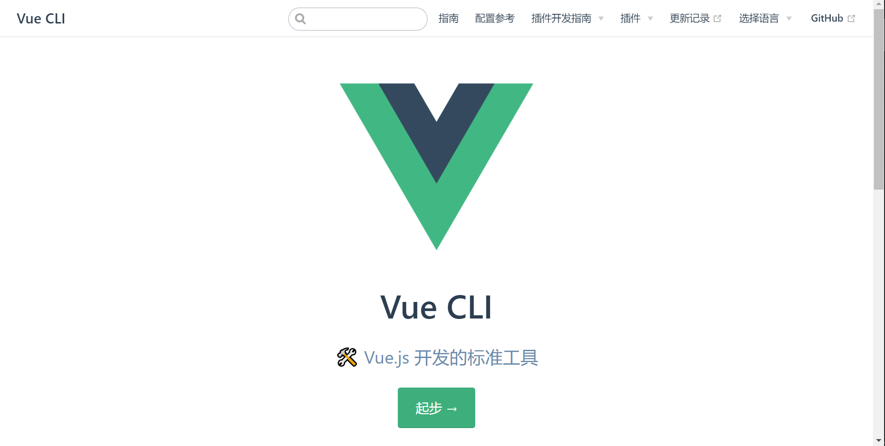 </div><br>


### 2.1 Installation

```bash
cnpm install -g @vue/cli
```
<div align="center">  </div><br>

<div align="center">  </div><br>

:hammer: Build

:heavy_check_mark: Succeeded!


<div align="center">  </div><br>


### 2.2 Quickstart

**项目目录**

<div align="center"> 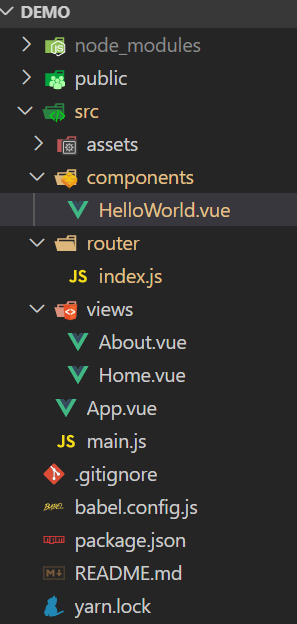 </div><br>

在 `components` 文件夹下创建一个组件 `HelloWorld`

```vue
<template>
  <div>
    <h1>Hello World</h1>
  </div>
</template>
```

在 `router` 文件夹下引入该组件

```javascript
import HelloWorld from "../components/HelloWorld.vue"
```


设置 `routes` 

```javascript
const routes = [
    {
        path: '/',
        name: 'HelloWorld',
        component: HelloWorld
    },
    {
        path: '/about',
        name: 'About',
        // route level code-splitting
        // this generates a separate chunk (about.[hash].js) for this route
        // which is lazy-loaded when the route is visited.
        component: () => import(/* webpackChunkName: "about" */ '../views/About.vue')
    }
]
```

:heavy_check_mark:Succeeded!

<div align="center"> 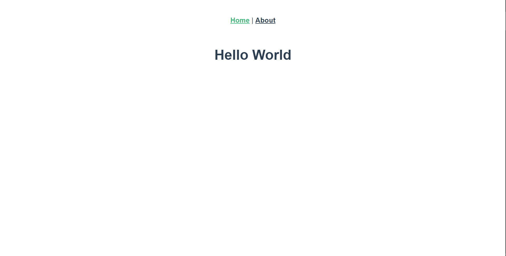 </div><br>

## 3. axios 

### 3.1 Installation

```bash
npm install axios
```

:heavy_check_mark: Installed

<div align="center"> 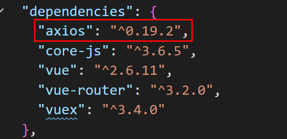 </div><br>

### 3.2 What is axios?

就像 `ajax` 基于 `jQuery` 一样，`axios` 和 `Vue` 也是一对


### 3.3 axios quickstart

#### 3.3.1 get 

```javascript
axios.get("http://localhost:9090/movie/getAll").then(res => {
    console.log(res)
})
    .catch(err => {
    console.log("timeout")
    console.log(err)
})
```
:heavy_check_mark: Succeeded!

可以获取后台的数据

<div align="center">  </div><br>

`catch` 用来捕捉错误信息


<div align="center"> 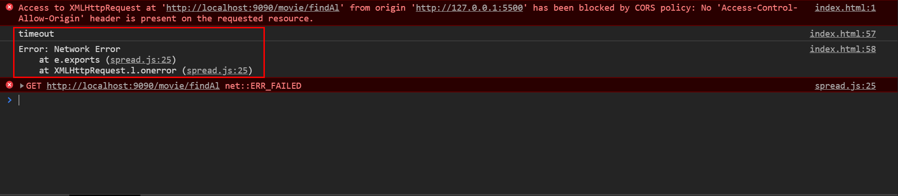 </div><br>

带参的 `get` 

```javascript
axios.get("http://localhost:9090/movie/get", {
    params: {
        id: 6
    }
})
    .then(res => {
    console.log(res)
})
    .catch(err => {
    console.log("timeout")
    console.log(err)
})
```

:heavy_check_mark: Succeeded!

<div align="center"> 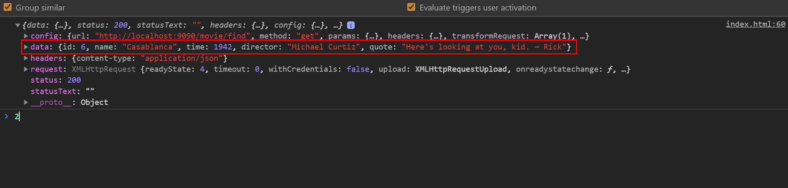 </div><br>


#### 3.3.2 post

无参的 `post` 请求与 `get` 类似

```javascript
axios.post("http://localhost:9090/movie/getAll")
    .then(res => {
    console.log(res)
})
    .catch(err => {
    console.log("timeout")
    console.log(err)
})
```

:heavy_check_mark: Succeeded!

<div align="center"> 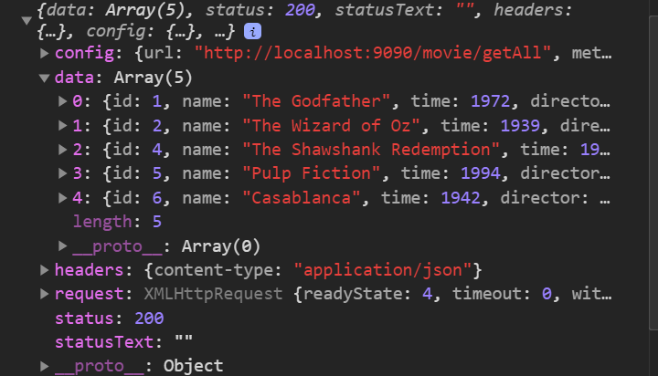 </div><br>

带参的 `post` 请求

```javascript
var data = { "id": 1 }

axios.post("http://localhost:9090/movie/get", data)
    .then(res => {
    console.log(res)
})
    .catch(err => {
    console.log("timeout")
    console.log(err)
})
```

**MovieController.java**

```java
@RequestMapping("get")
@CrossOrigin
public Movie getMovieById(@RequestBody Movie movie) {
    return movieService.getMovieById(movie.getId());
}
```

:heavy_check_mark: Succeeded!

<div align="center"> 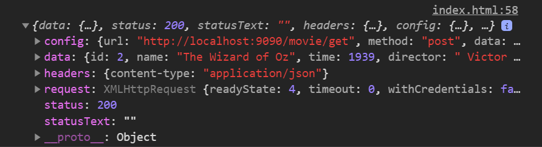 </div><br>

### 3.4 填坑指南

`post` 中两种方式：

- `params`
- `body`

#### 3.4.1 params

在 `postman` / `axios` 中，使用 `params` ，会自动将其自动拼接到 `url` 后

后台可用 `@requestParams` 接收

<div align="center">  </div><br>


#### 3.4.2 body

将前台传入的数据封装到 `Java bean` 中，为 `json` 格式


<div align="center"> 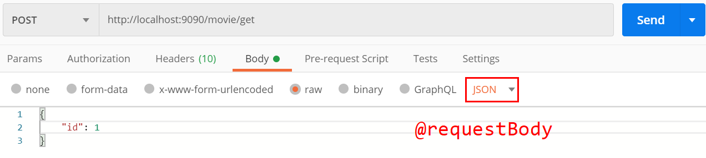 </div><br>

