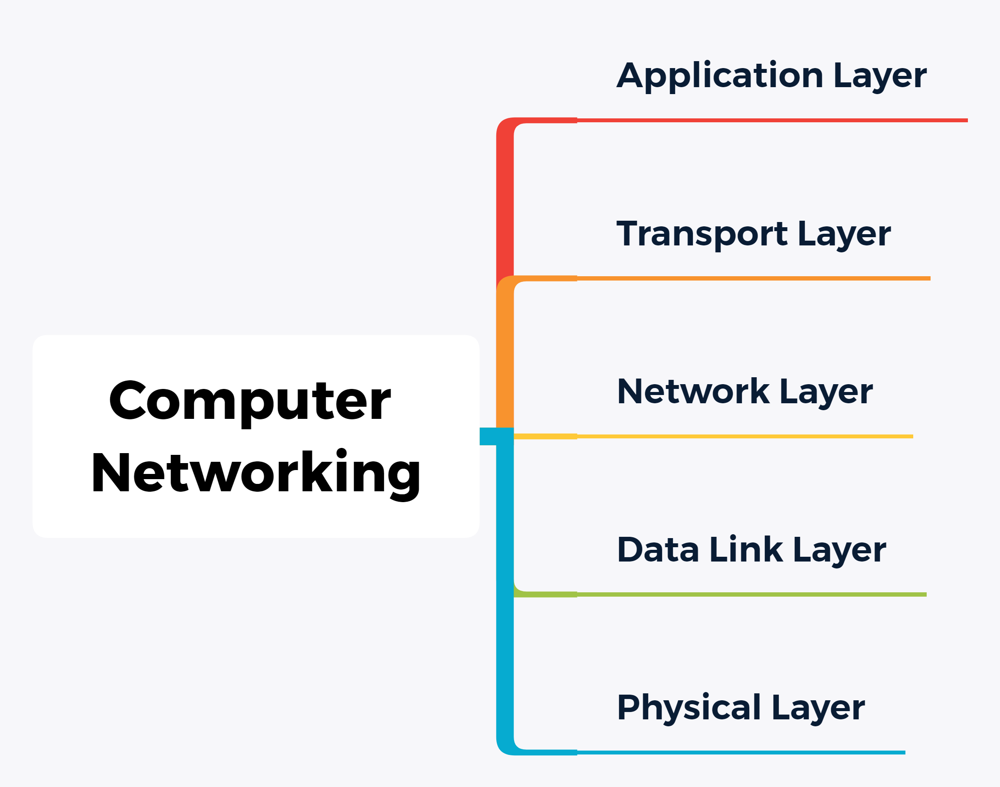

# Computer Networking

## Category

  
 

## Application Layer

### DNS

**什么是 DNS ?**

`DNS` 是域名系统

**DNS 有什么用 ?**

将（方便人们记忆的）主机名转化为（机器能识别的） `IP` 地址

比如，在现实生活中，每一个人都有独一无二的身份证号，来“标识”人。

但是我们在日常交往过程中，往往会直呼其名，即名字而不是身份证号。

网站同理，为了方便人们日常记忆和高效访问，每个网站都有自己独一无二的域名，其背后的则是独一无二的 `IP` 地址。

域名种类：

1. 根

2. 顶级域名

   `com` ：公司

   `edu`：教育机构（大学）

   `cn`：中国

   ......

3. 二级域名

4. 三级域名

   ......

  
 

百度的 `IP` 地址

