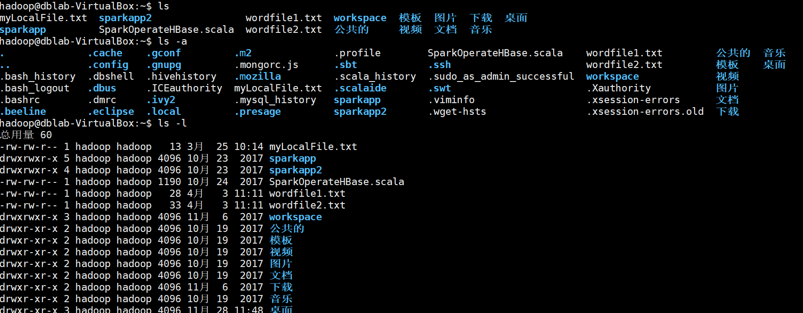

# Linux 常用命令

## 目录相关

列出文件列表

<div align="center">  </div><br>

列出所有文件

```bash
ls -a
```


列出文件详情

```bash
ls -l
```


进入目录

```bash
cd
```

查看当前目录

```bash
pwd
```


创建目录

```bash
mkdir
```

递归创建目录

``` bash
mkdir -p
```


## 浏览文件

查看文件所有内容

```bash
cat
```

翻页查看

```bash
more
```

倒数查看

```bash
tail
```


## 文件操作

（递归）删除

```bash
rm -f 
```

复制

```bash
cp
```

剪切

```bash
mv
```

创建空文件

```bash
touch
```


## 打包 / 解压缩

```bash
tar
```


## 查找

找文件路径

```bash
find
```

找文件内容

```bash
grep
```


## Vi 和 Vim

