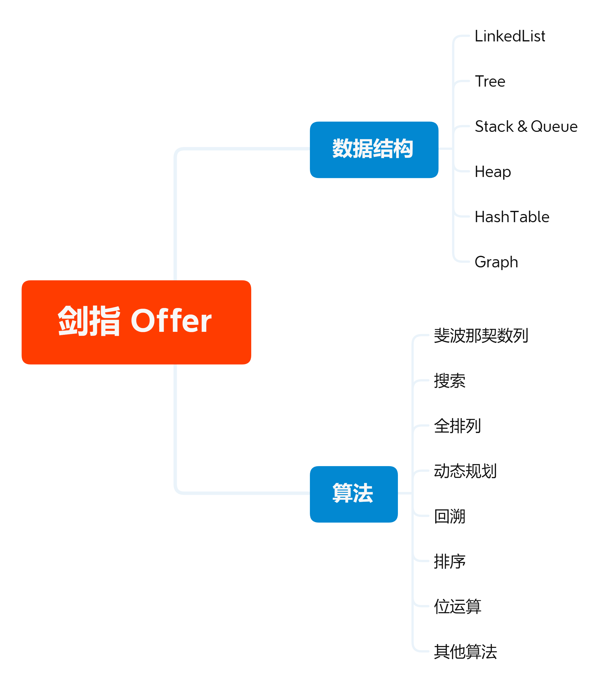

# 剑指 Offer

  
 

## 数据结构

- Array & String
  - [04. 二维数组中的查找](https://github.com/ceezyyy/backend-notes/blob/master/Interview/code/sword-to-offer/array/src/findNumberIn2DArray/findNumberIn2DArray.md)
  - [05. 替换空格](https://github.com/ceezyyy/backend-notes/blob/master/Interview/code/sword-to-offer/array/src/replaceSpace/replaceSpace.md)
- LinkedList
- Tree
- Stack & Queue
  - [30. 包含min函数的栈](https://github.com/ceezyyy/backend-notes/blob/master/Interview/code/sword-to-offer/stack%26queue/src/MinStack/MinStack.md)
- Heap
- HashTable
- Hashset
  - [03. 数组中重复的数字](https://github.com/ceezyyy/backend-notes/blob/master/Interview/code/sword-to-offer/hashset/src/findRepeatNumber/notes/03.%E6%95%B0%E7%BB%84%E4%B8%AD%E9%87%8D%E5%A4%8D%E7%9A%84%E6%95%B0%E5%AD%97.md)
- Graph

## 算法

- 斐波那契数列
  - [10- I. 斐波那契数列]()
- 搜索
- 全排列
- 动态规划
- 回溯
- 排序
- 位运算
- 滑动窗口