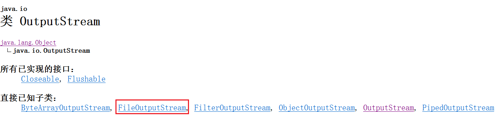

# I / O

## 概念

  
 

**内存 (memory)**

Random-access Memory

是与 CPU 直接交换数据的内部存储器，用于存储临时数据。

**硬盘 (hard disk)**

计算机上的非易失性存储器。

**字符**

字符包括英文，数字，符号，语言文字......

不同编码里，字符与字节的关系不同

**字节 (byte)**

  
 
一切皆为字节。

一个字节 = 8 bits

## 字节流

### 输出

  
 

  
 

### 输入

## 字符流

