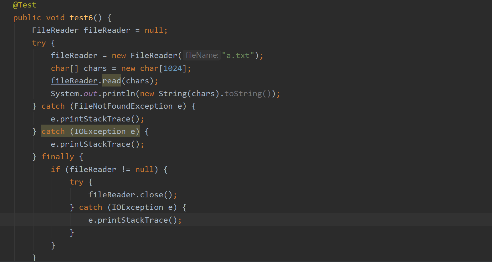
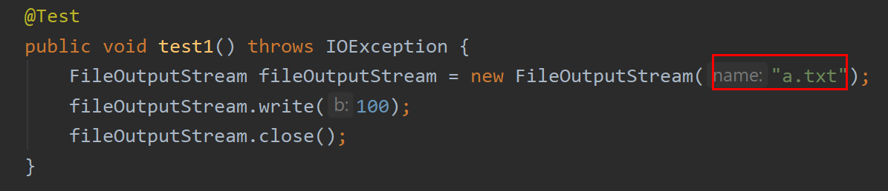
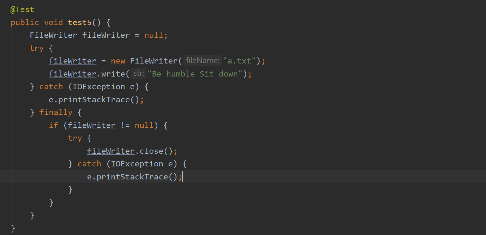

# I / O
## Category

  * [Category](#category)
  * [Concept](#concept)
  * [Mind map](#mind-map)
  * [Input](#input)
    + [FileInputStream](#fileinputstream)
    + [FileReader](#filereader)
  * [Output](#output)
    + [FileOutputStream](#fileoutputstream)
    + [FileWriter](#filewriter)

    
## Concept

  
 

**内存 (memory)**

Random-access Memory

是与 CPU 直接交换数据的内部存储器，用于存储临时数据。

**硬盘 (hard disk)**

计算机上的非易失性存储器。

**字符**

字符包括英文，数字，符号，语言文字......

不同编码里，字符与字节的关系不同

**字节 (byte)**

  
 
一切皆为字节。

一个字节 = 8 bits

## Mind map

 
  
 

## Input

### FileInputStream

   
  
 

**原理**

 
  
 

`fileInputStream`：输入流对象

`bytes` ：字节数组，用来存取字节输入流读取的数据

`length`：用来记录字节数组总长度

`len`：记录每次读取的有效字节长度（每次调用 `read()` 都会返回读取的有效字节长度），达到文件末尾返回 -1

 
  
 

### FileReader

 
  
 

## Output

### FileOutputStream

字节输出流

   
  
 

**原理**

 
  
 

（结合代码食用效果更佳）

1. 创建 `FileOutputStream` 对象
2. 根据构造方法中的目的地路径在硬盘中新建一个 `a.txt` 文件
3. 将对象指向 `a.txt` 文件
4. Java 程序 -> JVM -> OS -> OS 调用相关方法 -> 写进硬盘
5. 释放资源

**追加**

:warning:注意：

1. 相对路径是对于 `src` 目录下

   所以 `a.txt` 的存放位置是：

  
 

2. `\r\n` 代表换行

### FileWriter

  
 