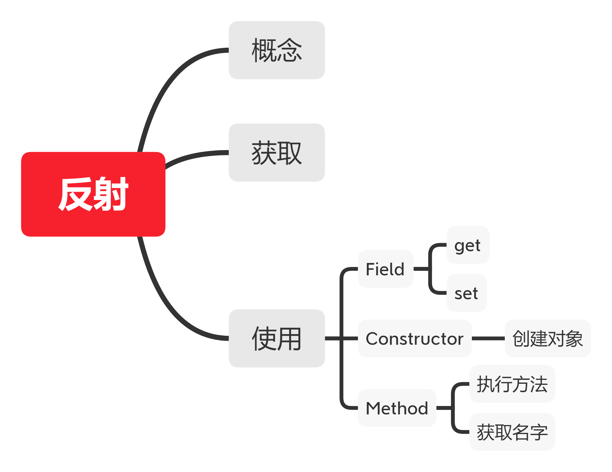
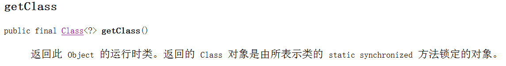
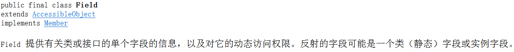
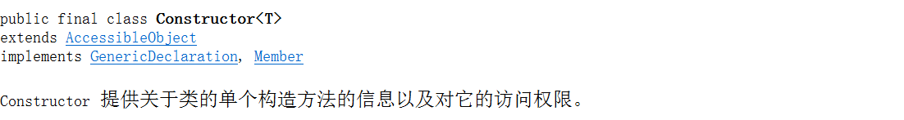

# 反射

> 框架设计的灵魂


## 目录





## 概念


**将类的各个组成部分封装成其他对象，这就是反射机制。**


## 获取

1. 通过 `Class`  类的 `forName()` 方法调用，返回 `Class`对象

   

   ```java
   Class cls1 = Class.forName("domain.Person");
   ```


2. 通过 类 的静态方法 `.class` 调用，返回`Class`对象

   ```java
   Class cls2 = Person.class;
   ```


3. 通过 `对象` 的 `getClass()`  方法调用，返回`Class`对象

   

```java
Person person = new Person();
Class cls3 = person.getClass();
```

**总结**

同一个字节码对象 (*.class) 在程序运行中只会生成一次，无论用哪一种方法获取，都是一样的。


## 使用

**Field**




**Constructor**




**Method**

