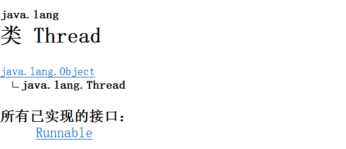
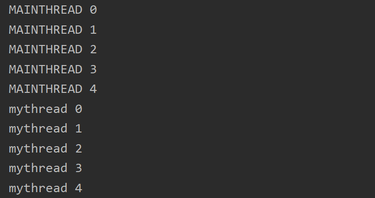

# 多线程

## 目录

* [1. 进程与线程](#1------)
  + [1.1 什么是进程？](#11-------)
  + [1.2 什么是线程？](#12-------)
  + [1.3 进程与线程的关系](#13---------)
  + [1.4 线程调度](#14-----)
* [2. 并发与并行](#2------)
  + [2.1 什么是并发？](#21-------)
  + [2.2 什么是并行？](#22-------)
  + [2.3 咖啡机的例子](#23-------)
* [3. 多线程原理](#3------)


## 1. 进程与线程

### 1.1 什么是进程？

一个在内存中运行的应用程序


### 1.2 什么是线程？

进程中的一个执行单元


### 1.3 进程与线程的关系

一个程序运行至少一个进程，一个进程中可以有多个线程


### 1.4 线程调度

- 分时调度
- 抢占式调度


## 2. 并发与并行

### 2.1 什么是并发？

​	当有多个线程在操作时，如果系统只有一个 `CPU` ，则它根本不可能真正同时进行一个以上的线程。它只能把 `CPU` 运行时间划分成若干个时间段，再将时间段分配给各个线程执行。在一个时间段的线程代码运行时，其它线程处于挂起状态


### 2.2 什么是并行？

​	当系统有一个以上 `CPU` 时，则线程的操作有可能非并发。当一个 `CPU` 执行一个线程时，另一个 `CPU` 可以执行另一个线程，两个线程互不抢占 `CPU` 资源，可以同时进行。


### 2.3 咖啡机的例子

**并发：**

有且仅有一个咖啡机，有一堆顾客想要吗买咖啡，他们分成了两条队伍，一会先让 A 队伍买咖啡，一会让 B 队伍买咖啡，轮流交替进行。每次只能一条队伍买咖啡。


<div align="center">  </div><br>

**并行：**

此时有两台咖啡机，两条队伍，每条队伍分别对应一个咖啡机，互不干扰，**同时执行**。


 

## 3. 多线程原理

<div align="center">  </div><br>

通过建立 `Thread` 的子类来定义线程：

**MyThread.java**

```java
public class MyThread extends Thread {
    @Override
    public void run() {
        for (int i = 0; i < 10; i++) {
            System.out.println("mythread " + i);
        }
    }
}
```


**主线程：**

每个 Java 应用程序都有一个执行 `Main` 函数的默认主线程

**Main.java**

```java
public class Main {

    public static void main(String[] args) {
        for (int i = 0; i < 10; i++) {
            System.out.println("MAINTHREAD " + i);
        }
        MyThread myThread = new MyThread();
        // start thread
        myThread.start();
    }
}
```

**:warning:注意**

不要调用 `Thread` 或 `Runnable` 对象的 `run` 方法，直接调用 `run` 方法只会在同一个线程中执行这个任务，而没有启动新的线程。实际上，应该调用 `Thread.start()` ，这样才会创建一个执行 `run` 方法的新线程


`JVM` 先调用 `main` 方法，开启主线程，当执行到 `myThread.start()` 时（此时已经打印完结果），才开启 `myThread` 线程


<div align="center">  </div><br>

运行结果如下：
<div align="center">  </div><br>

当我们在输出前先开启 `myThread` 线程：

**Main.java**

```java
public class Main {

    public static void main(String[] args) {
        MyThread myThread = new MyThread();
        // start thread
        myThread.start();
        for (int i = 0; i < 5; i++) {
            System.out.println("MAINTHREAD " + i);
        }
    }
}
```

此时是两条线程并发执行，Java 中采用抢占式调度，两条线程互相争夺 `CPU` 资源


<div align="center">  </div><br>


