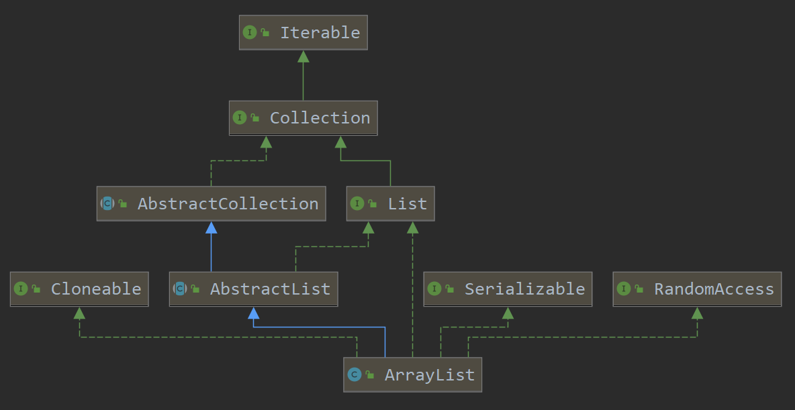

# ArrayList 源码分析

## 目录

* [1. ArrayList 初探](#1-arraylist---)
  + [1.1 Serializable](#11-serializable)
  + [1.2 Cloneable](#12-cloneable)
  + [1.3 RandomAccess](#13-randomaccess)
* [2. 构造方法](#2-----)


## 1. ArrayList 初探

<div align="center">  </div><br>


```java
public class ArrayList<E> extends AbstractList<E>
    implements List<E>, RandomAccess, Cloneable, java.io.Serializable
```

### 1.1 Serializable

```java
public interface Serializable {
}
```

序列化：将对象的数据写入到文件（写对象）

反序列化：将文件中对象的数据读取出来（读数据）

### 1.2 Cloneable

```java
public interface Cloneable {
}
```

### 1.3 RandomAccess

```java
public interface RandomAccess {
}
```

若该类实现了 `RandomAccess` 接口则推荐使用随机访问，反之，使用顺序访问


## 2. 构造方法

**无参构造**

```java
public ArrayList() {
    this.elementData = DEFAULTCAPACITY_EMPTY_ELEMENTDATA;
}
```

```java
/**
     * Shared empty array instance used for default sized empty instances. We
     * distinguish this from EMPTY_ELEMENTDATA to know how much to inflate when
     * first element is added.
     */
private static final Object[] DEFAULTCAPACITY_EMPTY_ELEMENTDATA = {};
```


**有参构造**

```java
public ArrayList(int initialCapacity) {
    if (initialCapacity > 0) {
        this.elementData = new Object[initialCapacity];
    } else if (initialCapacity == 0) {
        this.elementData = EMPTY_ELEMENTDATA;
    } else {
        throw new IllegalArgumentException("Illegal Capacity: "+
                                           initialCapacity);
    }
}
```

```java
/**
     * Shared empty array instance used for empty instances.
     */
private static final Object[] EMPTY_ELEMENTDATA = {};
```

